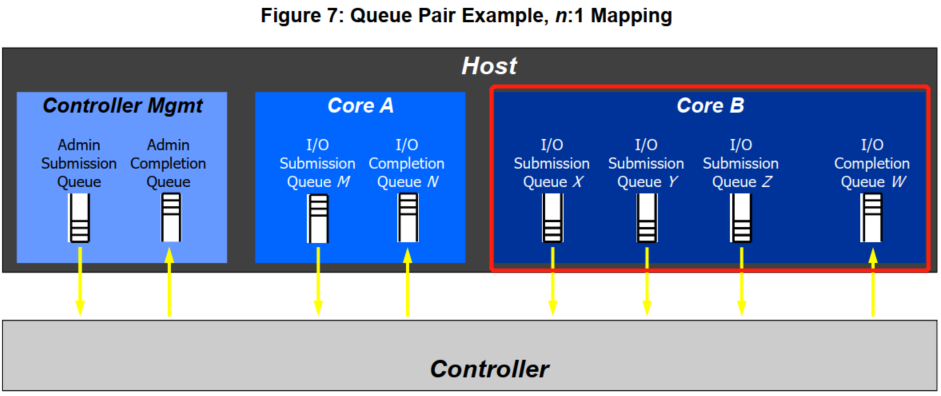
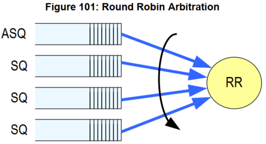
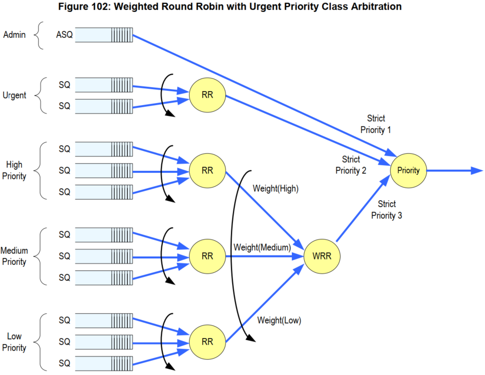
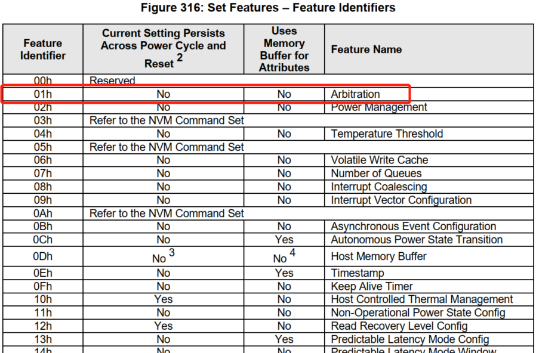
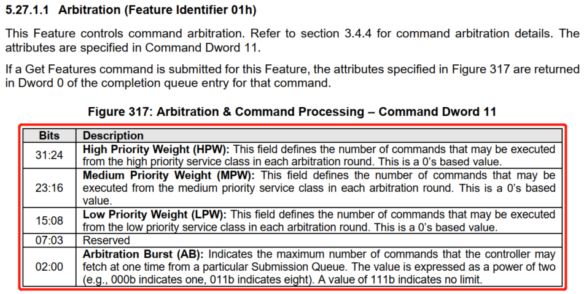
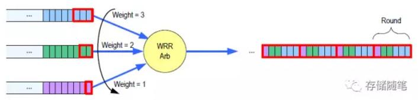
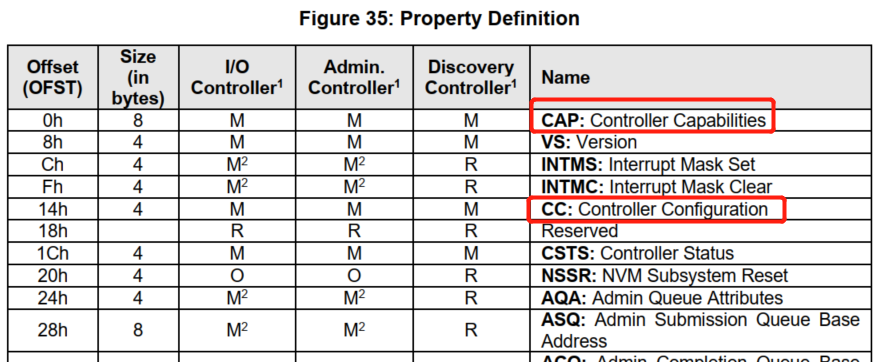
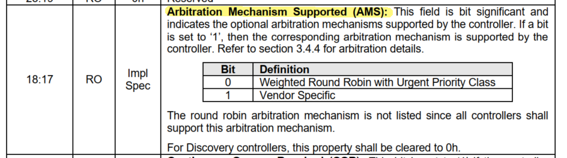

<!-- @import "[TOC]" {cmd="toc" depthFrom=1 depthTo=6 orderedList=false} -->

<!-- code_chunk_output -->

- [1. 循环仲裁](#1-循环仲裁)
- [2. 加权循环仲裁](#2-加权循环仲裁)

<!-- /code_chunk_output -->

在 NVMe Spec 中没有规定 Command 存入 SQ 队列的执行顺序,  Controller 可以一次取出多个 Command 进行批量处理. 一个 SQ 队列中的 Command 执行顺序是不固定, 同时在多个 SQ 队列之间的 Command 执行顺序也不固定, 这就涉及到了 NVMe Spec 定义的命令仲裁机制.

NVMe Spec 中主要定义了两种命令仲裁机制: **循环仲裁**(`Round Robin Arbitration`)和**加权循环仲裁**(`Weighted Round Robin Arbitration`)

* 对于循环仲裁, 所有主控必须支持.
* 对于加权循环仲裁, 主控可以选择性支持.
* 除了这两个仲裁机制以外, 主控设计人员还可以自行定义仲裁机制.

# 1. 循环仲裁

(Round Robin Arbitration)

当 NVMe 设备选择 RR 仲裁机制时, 所有 SQs(包括 Admin Command SQ 和 IO Command SQ)都会执行 RR 仲裁. 此时, 所有 SQs 的级别一样高, 按照顺序依次从所有 SQs 中分别取出一定数目的 Commands(如下图).

这里的"一定数目"用参数 Arbitration Burst 定义, 代表了一次从 SQ 中取 Commands 的数目. Arbitration Burst 的数值可以通过 Set feature 定义.

# 2. 加权循环仲裁

(Weighted Round Robin Arbitration)

加权循环仲裁(WRR)机制定义了 3 个绝对优先级和 3 个加权优先级.

* Admin Class: 只有 Admin SQ 具有这一最高优先级. 也就是说,  Admin Command 必须最先被执行.

* Urgent Class: 一人之下, 万人之上. 优先级仅次于 Admin Class. 被赋予 Urgent Class 优先级的 IO SQ 在 Admin SQ 中的命令执行后, 紧接着执行.

* WRR Class: 最低绝对优先级. 包含了三个加权优先级:  High,  Medium,  Low.

用户可以用个 set feature 命令控制加权优先级中每个优先级的权重, 也即每次执行 Command 的数目. 每个加权优先级内部执行 RR 仲裁机制.

前面的讲述中, 我们提到 Arbitration Burst 和加权优先级均可以通过 set feature 设定, NVMe Spec 的定义如下:

举个关于加权优先级的例子:

如上图,  HPW=3, MPW=2, LPM=1, 那么, 在命令执行时, 相应的 SQ 队列每次分别执行 3,2,1 个命令作为一个循环.

如何判断一个 NVMe 设备是否支持 Arbitration 机制呢?

可以查看该设备的 register. 与 Arbitration 相关的有两个 Register: Controller Capabilites 和 Controller Configuration, 如下图.

Controller Capabilites Register 的 `Bit[18:17]` 代表 NVMe 主控可选性支持的仲裁机制.

Controller Configuration Register 的 `Bit[13:11]` 代表了 NVMe 主控正在使用的仲裁机制.

