<!-- @import "[TOC]" {cmd="toc" depthFrom=1 depthTo=6 orderedList=false} -->

<!-- code_chunk_output -->

- [1. 数据流](#1-数据流)
  - [1.1. 主机写 SSD](#11-主机写-ssd)
  - [1.2. 主机读 SSD](#12-主机读-ssd)
- [2. 两种主机内存寻址方式](#2-两种主机内存寻址方式)
  - [2.1. PRP](#21-prp)
    - [解析示例](#解析示例)
  - [2.2. SGL](#22-sgl)

<!-- /code_chunk_output -->

# 1. 数据流

哲学经典三问: 我是谁? 我从哪里来? 我要去哪里?

这三个问题在 NVMe 的世界中:

* 数据, 从主机端来, 要到 SSD 去;
* 或者, 数据, 从 SSD 来, 要去主机端.

## 1.1. 主机写 SSD

**主机**如果想往 SSD 上**写入用户数据**, 需要告诉 SSD 写入什么数据, **写入多少数据**, 以及**数据源**在**内存中**的**什么位置**, 这些信息包含在主机向 SSD 发送的 **Write 命令**中.

Host 会先放数据放在 Host 内存中, **每笔用户数据**都通过 **LBA**(`Logical Block Address`)标记了**在内存中的位置**; Host 会下发 NVMe Write 命令通知 Controller 到 Host 中取数据, **NVMe Write 命令**包含了 **LBA**.

**Controller** 收到 NVMe Write 命令后, 通过 **PCIe Memory Read TLP** 去**主机的内存**数据所在位置**读取**数据, 接着 Host 返回的 **PCIe Completion 报文**(这不是 NVMe 的)中会携带数据给 Controller, 最后把这些数据**写入 NAND 闪存**中, 同时**生成 LBA 与闪存位置的映射关系**.

> LBA, 是 host 内存中的地址?

数据在主机内存和 SSD 中流动:

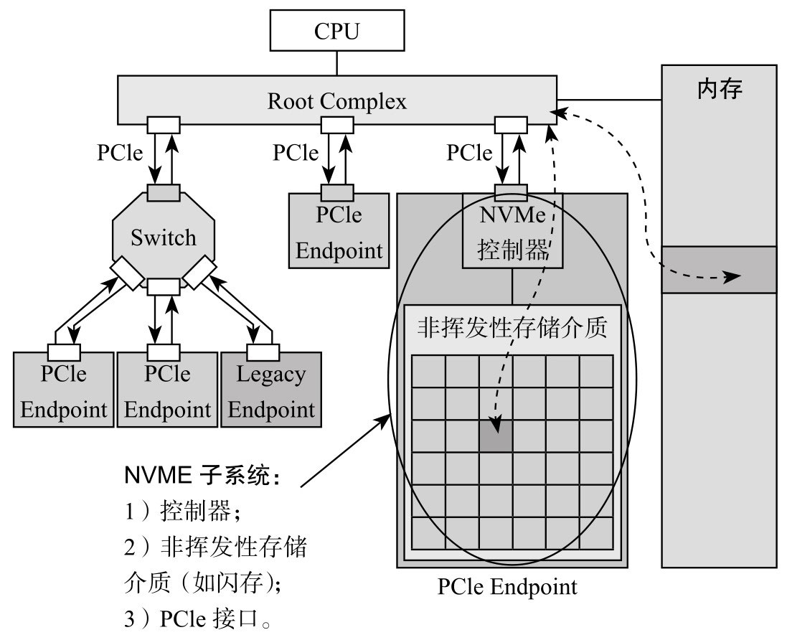

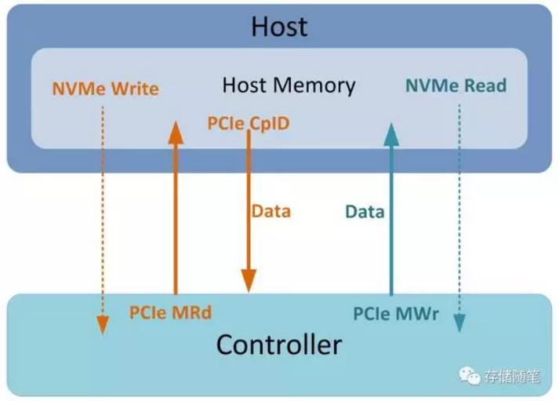

## 1.2. 主机读 SSD

**主机**如果想**读取** SSD 上的用户数据, 同样需要告诉 SSD 需要什么数据, 需要**多少数据**, 以及数据最后需要**放到主机内存**的**哪个位置**上去, 这些信息包含在主机向 SSD 发送的 **Read 命令**中.

Host 下发 NVMe Read 命令, Controller 根据 **LBA**, **查找映射表**(写入时生成的), 找到**对应 NAND 闪存物理位置**, 然后读取 NAND 闪存**获得数据**.

数据从闪存读上来以后, Controller 会通过 **PCIe Memory Write TLP** 把数据写入**主机指定的内存**中. 这样就完成了主机对 SSD 的读访问.

# 2. 两种主机内存寻址方式

在上面的描述中, 主机在与 SSD 的**数据传输**过程中, **主机**是**被动**的一方, **SSD** 是**主动**的一方.

* 主机**读**数据, 是 **SSD** 主动把数据**写**入主机的内存中;
* 主机**写**数据, 是 **SSD** 主动去主机的内存中**取**数据, 然后写入闪存.

正如快递小哥一样辛劳, SSD 不仅**送货上门**, 还**上门取件**.

* NVMe **Write** 时, **Controller** 怎么知道数据在 **Host 内存**的**具体位置**?
* NVMe **Read** 时, **Controller** 怎么知道要把数据**写**到 **Host 内存**中**哪个位置**?

主机有两种方式来告诉 Controller 数据在 Host 内存中的位置:

* 一是 **PRP**(`Physical Region Page`, **物理区域页**, 有人戏称其为"拼人品");
* 二是 **SGL**(`Scatter/Gather List`, **分散/聚集列表**, 有人戏称其为"死过来, 送过来").

## 2.1. PRP

> Physical Region Page, 记录的是 Host 内存中物理页的位置. 分页方式.

**NVMe** 把**主机端的内存**划分为一个一个**物理页**(Page), 页的**大小**可以是 **4KB**, **8KB**, **16KB**, ..., **128MB**. Host 可以通过配置 Controller 的 `CC.MPS` 设定**物理页的大小**, 范围是 `4KB~128MB`.

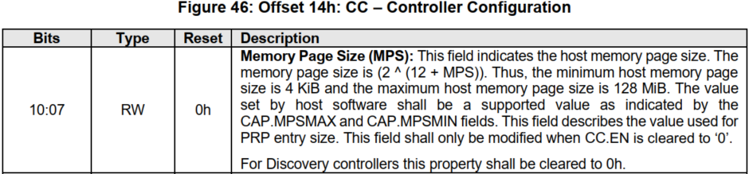

**物理页对应的地址**记录在 `PRP Entry` 中, PRP 条目(Entry)布局(Layout)如图所示:

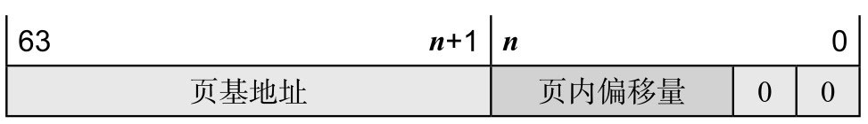

PRP Entry 本质就是一个 **64 位内存物理地址**, 分成两部分: **页起始地址**和**页内偏移**.

* Page Base Address: `Bit[63:n]` 记录**物理页**的**基地址**;
* Offset: `Bit[n:2]` 记录在**物理页中的偏移量**;
* 最后两比特是 0, 说明 PRP 表示的**物理地址**只能**四字节对齐**访问.

**n** 的取值由 `CC.MPS` 中定义的**物理页大小决定**. 比如, 物理页大小为 4KB, 那么, **n=11**, 也即 `Bit[11:2]` 代表 offset. 如果一个 Command 中包含两个 PRP, 那么第二个 PRP Entry 的 offset 为 0.

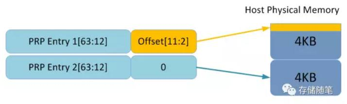

页内偏移可以是 0, 也可以是个非零的值, 如下图所示.

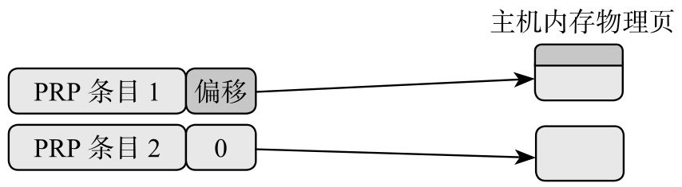

**每个 PRP Entry** 只能指向**一个物理页空间**. 而在**每个 NVMe 命令**中, 只定义了**两个 PRP Entry**.

NVMe 命令格式中的 PRP:

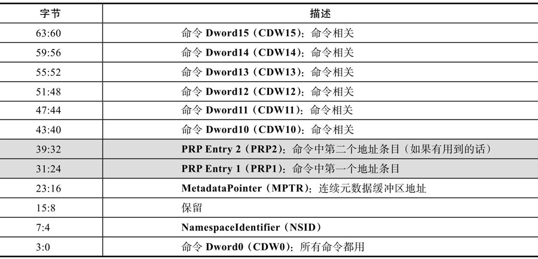

假设**物理页大小**为 **4KB**, 一个 Command 需要传输 12KB 数据. 此时, 两个 PRP Entry 可以最大指向 8KB 的空间, 不满足要求, 怎么办?

PRP1 和 PRP2 有可能指向**数据所在位置**, 也可能指向 **PRP 链表**. 类似 C 语言中的指针概念, PRP1 和 PRP2 可能是**指针**, 也可能是**指针的指针**, 还有可能是**指针的指针的指针**. 别管你包得有多严实, 根据不同的命令, SSD 总能一层一层地剥下包装, 找到**数据在内存的真正物理地址**.

PRP 链表布局(Layout)如图所示:

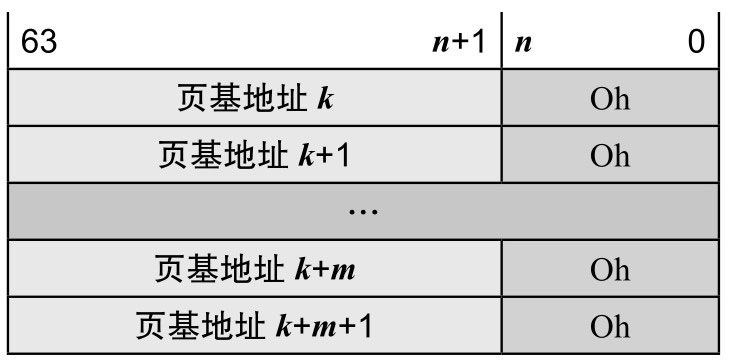

是的, 正如你所见, **PRP 链表**中的每个 PRP Entry 的**偏移量**都必须是 **0**, PRP 链表中的**每个 PRP Entry** 都是**描述一个物理页**. 它们**不允许有相同的物理页**.

下面是一个 PRP1 指向 PRP 链表的示例, 如图所示.

PRP 链表描述内存空间示例:

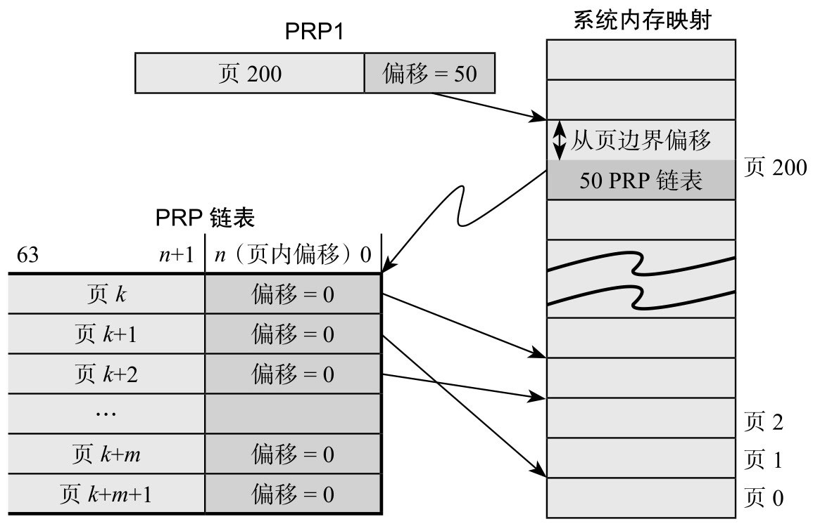

PRP1 指向一个 **PRP 链表**, PRP 链表位于 Page 200, 页内偏移 50 的位置. SSD 确定 PRP1 是个指向 PRP 链表的指针后, 就会去主机内存中(Page 200, Offset 50)把 **PRP 链表**取过来. 获得 PRP 链表后, 就获得数据的**真正物理地址**, SSD 然后就会向这些物理地址读取或者写入数据.

PRP Entry 2 不指向物理页, 而是指向由若干个 PRP 组成的 PRP list. 如果需要定义更大的空间, PRP list 的最后一个 PRP 还可以指向另外一个 PRP list, 依次类推, 比如下图

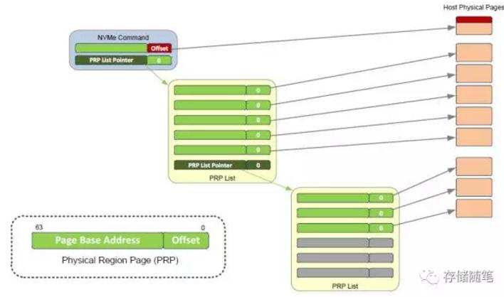

上图中每个 PRP list 包含 6 个 PRP. NVMe Command 传输数据时需要指向 9 个物理页, 最后是用了两个 PRP list 搞定了. 需要注意的是,  PRP list 中的 offset 必须为 0.

### 解析示例

解析了一个 "PRP list" PCIe trace.

**NVMe Read Command**, 从 NVMe 中读取数据到 Host 内存.

先看一下完整的 Trace:

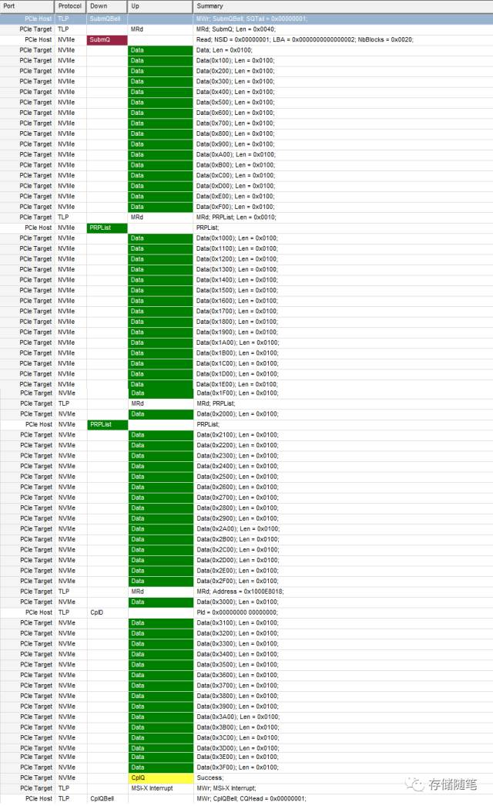

**第一步**, 我们先解析一个 **NVMe Read Command** 中的 **PRP Entry**:

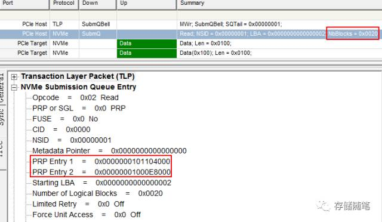

从图中, 我们可以了解到两个内容:

* Host 需要读取的**数据大小** = `0x20 * 512B` = `32 * 512B` = `16KB`;

* 数据要放在 **Host 内存中的位置**:

  * PRP1 = 0x0000000101104000;

  * PRP2 = 0x00000001000E8000;

**第二步**, 查看 PRP1 和 PRP2 分别对应的内容: **物理页**或 **PRP list**.

(1) PRP1 = 0x0000000101104000: 根据下图内容, 可以判断 **PRP1** 对应大小为 **4KB 的物理页**. 16(个) * 0x100(长度, 单位是字节) = 16 * 256 = 4096(字节) = 4KB

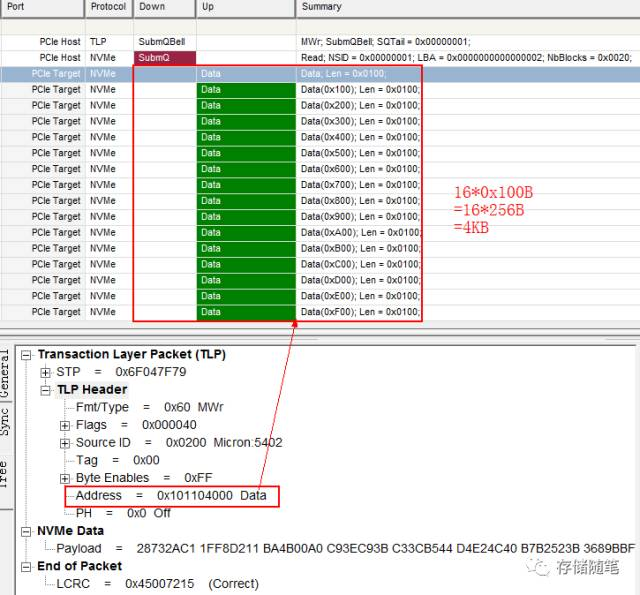

(2) PRP2 = 0x00000001000E8000, 查看 PCIe trace 发现, PRP2 对应 PRP list, 如下图

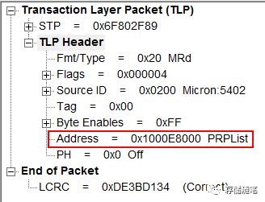

**第三步**, 查看 PRP2 list 包含的 PRP Entry.

查看 PCIe Trace, 发现:

Address = 0x1000E8000 的位置有两个 PRP, 我们暂且称之为 PRP3 和 PRP4

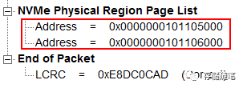

Address = 0x1000E8010 的位置有一个 PRP, 我们暂且称之为 PRP5

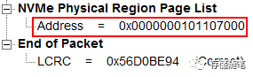

至此, 这个 NVMe Read 命令从 SSD 中获取的 data 在 Host 内存中的分布就比较明朗了, 画了示意图, 如下:

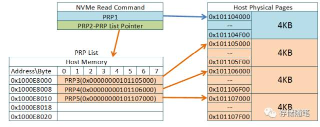

## 2.2. SGL

> Scatter Gather List, 是一种用于描述物理地址的数据结构. 分段方式

在 NVMe over PCIe 系统中:

* **Admin 命令**, 它**只用 PRP** 告诉 SSD **内存物理地址**;
* **I/O 命令**, 既可使用 PRP, 还可用 **SGL** 的方式来告诉 SSD 数据在**内存中**写入或者读取的**物理地址**;

其实, SGL 主要还是用在 NVMe over Fabric 系统中.

NVMe 命令格式中的 SGL:

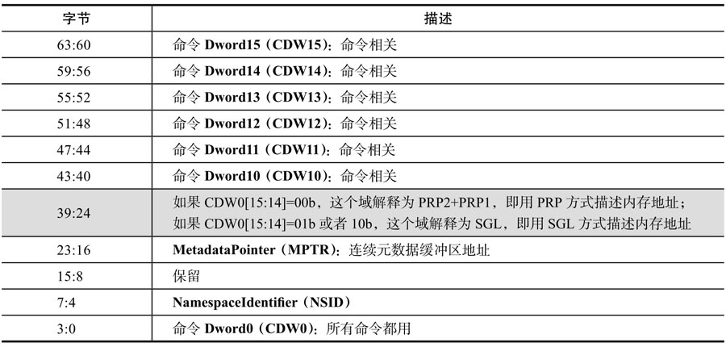

主机在命令中会告诉 SSD 采用何种方式. 具体来说, 如果**命令**当中 `DW0[15:14]` 是 **0**, 就是 PRP 的方式, 否则就是 SGL 的方式.

SGL 是什么? SGL 是一个**数据结构**, 用以**描述一段数据空间**, 这个空间可以是数据源所在的空间, 也可以是数据目标空间.

SGL(Scatter Gather List)首先是个 **List**, 是个**链表**, 由一个或者**多个 SGL 段**(Segment)组成, 而**每个 SGL 段**又由一个或者**多个 SGL 描述符**(Descriptor)组成.

其中, SGL Segment 要求 Qword 对齐. 另外, 倒数第二个 SGL Segment 中的最后一个 Discriptor 有一个特殊的名字, 叫做 SGL Last Segment Discriptor(SGL 末段描述符).

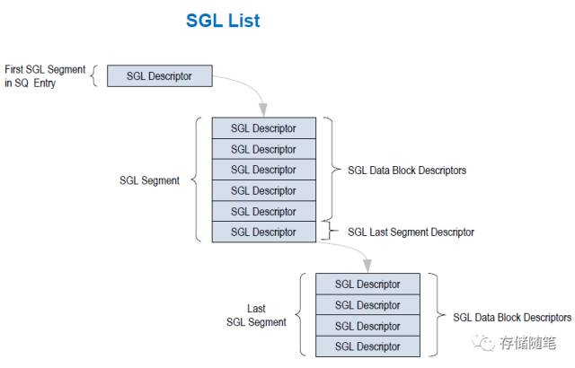

SGL 描述符是 SGL 最基本的单元, 它描述了**一段连续的物理内存空间**: **起始地址** + **空间大小**. **每个 SGL 描述符**大小是 **16** 字节. 其中:

* `Bit[3:0]` 代表 SGL Descriptor Sub Type, 在 NVMe over PCIe 中是保留的, 只用在 NVMe over Fabric;
* `Bit[7:4]` 代表 SGL Descriptor Type

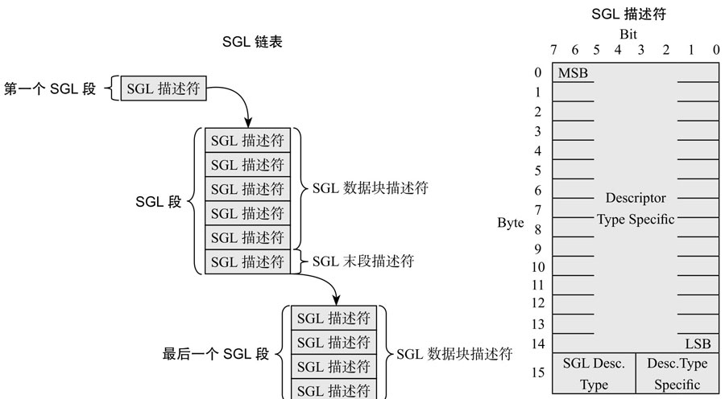

**SGL 描述符**描述**一块内存空间**, 可以用来放**用户数据**, 也可以用来放 **SGL 段**, 根据这段空间的不同用途, SGL 描述符也分**几种类型**, 如表所示.

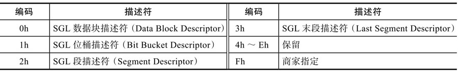

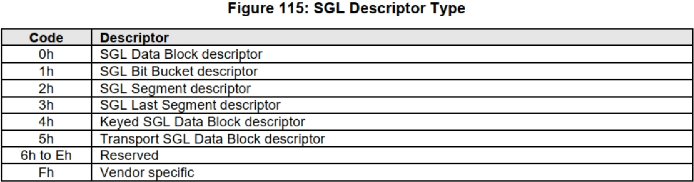

由表可知, 有 **4 种 SGL 描述符**:

* 一种是**数据块描述符**, 这个好理解, 就是描述的这段空间是用户数据空间.

* 一种是**段描述符**, SGL 不是由 SGL 段组成的链表吗? 既然是链表, 前面一个段就需要有个指针指向下一个段, 这个指针就是 SGL 段描述符, 它描述的是它下一个段所在的空间.

* 特别地, 对**链表**当中**倒数第二个段**, 它的 SGL 段描述符我们把它叫作 **SGL 末段描述符**. 它本质还是 SGL 段描述符, 描述的还是 SGL 段所在的空间. 为什么需要把倒数第二个 SGL 段描述符单独的定义成一种类型呢? 我认为是让 SSD 在解析 SGL 的时候, 碰到 SGL 末段描述符, 就知道**链表快到头了**, 后面只有一个段了.

* **SGL 位桶**(SGL Bit Bucket Descriptor). 它**只对主机读有用**, 用以**告诉 Controller**, 你往这个内存**写入的东西**我是**不要**的. 好吧, 你既然不要, 我也就不传了.

* Keyed SGL Data Block Descriptor: 这个描述类型代表了数据传输中带有密匙

看个 SGL Bit Bucket Descriptor 例子, SGL 读:

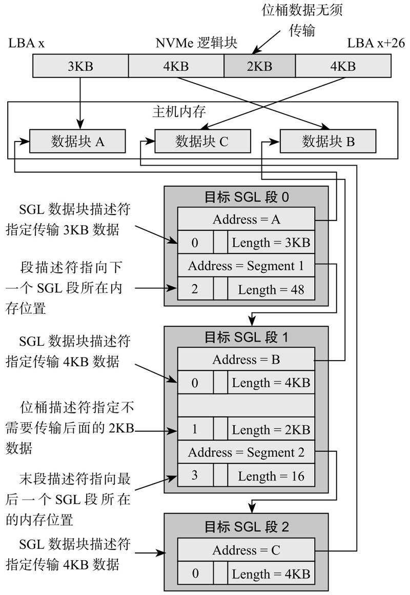

这个例子中, 假设主机需要从 SSD 中读取 13KB 的数据, 其中真正需要 Controller 写入 Host 内存只有 11KB 数据, 这 11KB 的数据需要放到 3 个大小不同的内存中, 也就是有 3 个 SGL 描述块, 对应的 Data Block Descriptor 分别是: 3KB、4KB 和 4KB.

无论是 PRP 还是 SGL, 本质都是描述内存中的一段数据空间, 这段数据空间在物理上可能是连续的, 也可能是不连续的. 主机在命令中设置好 PRP 或者 SGL, 告诉 SSD 数据源在内存的什么位置, 或者从闪存上读取的数据应该放到内存的什么位置.

大家也许跟我有个同样的疑问, 那就是, 既然有 PRP, 为什么还需要 SGL? 事实上, NVMe1.0 的时候的确只有 PRP, SGL 是 NVMe1.1 之后引入的. 那 SGL 和 PRP 本质的区别在哪? 下图道出了真相: **PRP** 描述的是**物理页**, 而 **SGL** 可以描述**任意大小的内存空间**.

PRP vs SGL:

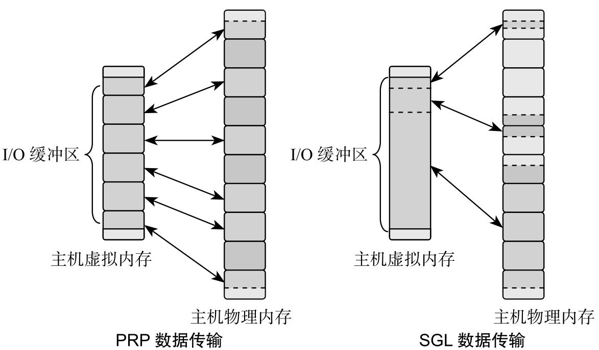

对 NVMe over PCIe(我们目前讲的都是 NVMe 跑在 PCIe 上), Admin 命令只支持 PRP, I/O 命令可以支持 PRP 或者 SGL; 对 NVMe over Fabrics, 所有命令只支持 SGL.

