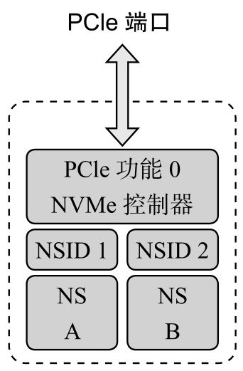
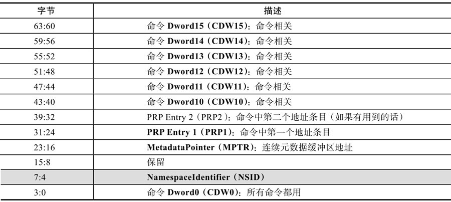
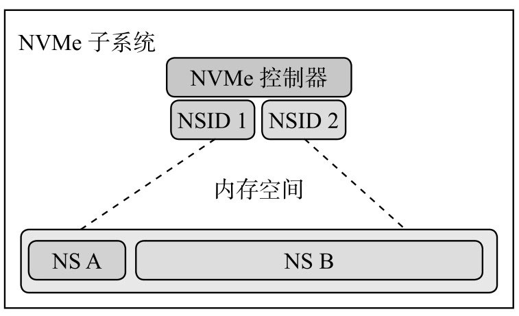
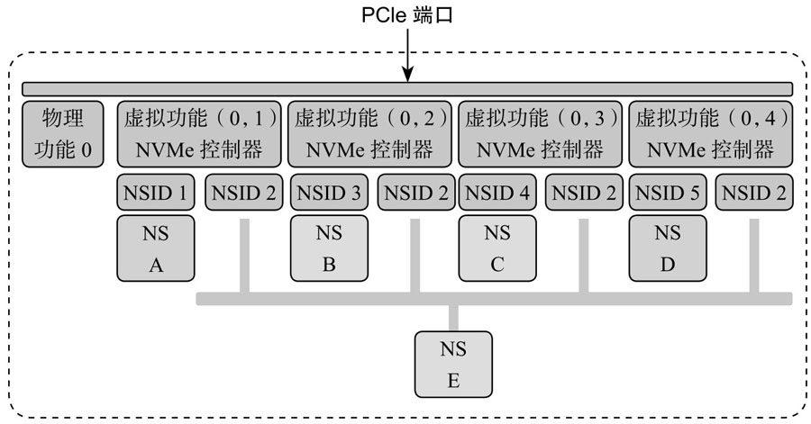
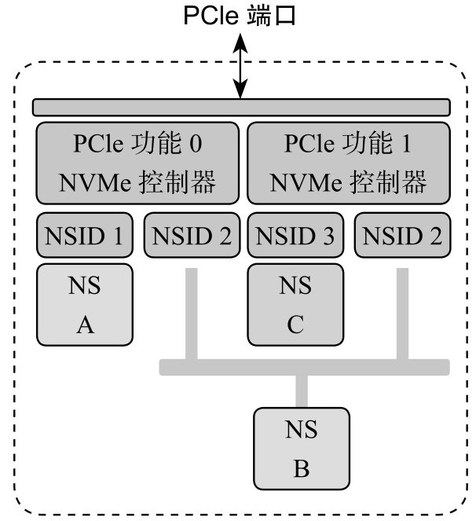
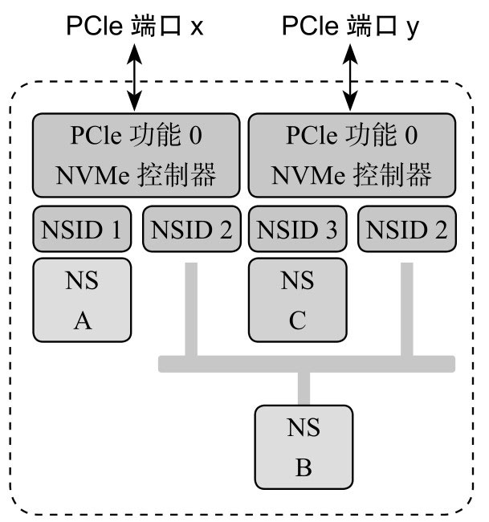
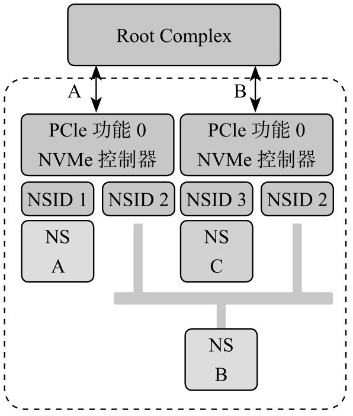
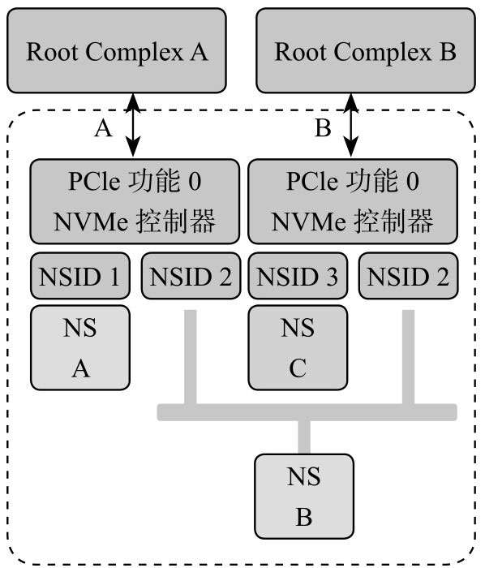
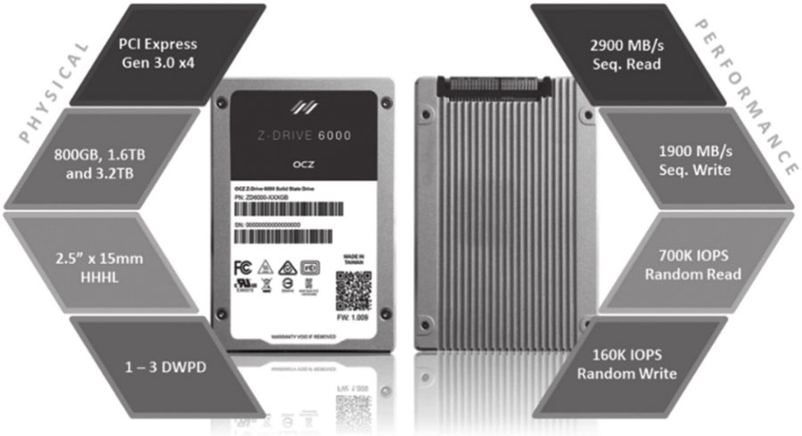
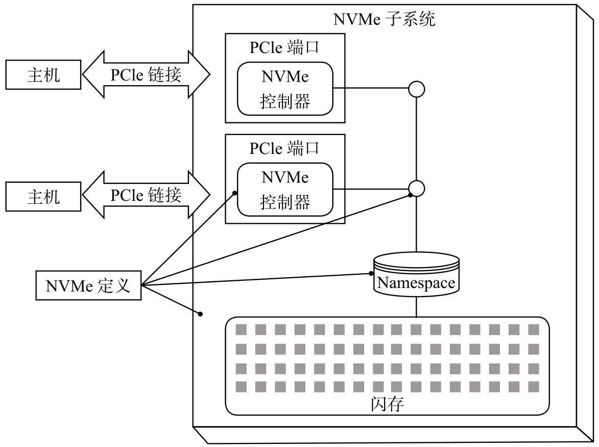

什么是 Namespace(以下简称 NS)?

一个 NVMe SSD 主要由 SSD 控制器、闪存空间和 PCIe 接口组成. 如果把闪存空间划分成若干个独立的逻辑空间, 每个空间逻辑块地址(LBA)范围是 0 到 N-1(N 是逻辑空间大小), 这样划分出来的每一个逻辑空间我们就叫作 NS. 对 SATA SSD 来说, 一个闪存空间只对应着一个逻辑空间, 与之不同的是, NVMe SSD 可以是一个闪存空间对应多个逻辑空间.

每个 NS 都有一个名称与 ID, 如同每个人都有名字和身份证号码, ID 是独一无二的, 系统就是通过 NS 的 ID 来区分不同的 NS.

如下图所示, 整个闪存空间划分成两个 NS, 名字分别是 NS A 和 NS B, 对应的 NS ID 分别是 1 和 2. 如果 NS A 大小是 M(以逻辑块大小为单位), NS B 大小是 N, 则它们的逻辑地址空间分别是 0 到 M-1 和 0 到 N-1. 主机读写 SSD, 都是要在命令中指定读写的是哪个 NS 中的逻辑块. 原因很简单, 如果不指定 NS, 对同一个 LBA 来说, 假设就是 LBA 0, SSD 根本就不知道去读或者写哪里, 因为有两个逻辑空间, 每个逻辑空间都有 LBA 0.

一个 NVMe 命令一共 64 字节, 其中 `Byte[7:4]` 指定了要访问的 NS, 如表所示.

NVMe 命令中 NS 域:

对每个 NS 来说, 都有一个 4KB 大小的数据结构来描述它. 该数据结构描述了该 NS 的大小, 整个空间已经写了多少, 每个 LBA 的大小, 端到端数据保护相关设置, 以及该 NS 是属于某个控制器还是几个控制器可以共享等.

NS 由主机创建和管理, 每个创建好的 NS, 从主机操作系统角度看来, 就是一个独立的磁盘, 用户可在每个 NS 做分区等操作.

下例中, 整个闪存空间划分成两个 NS, NS A 和 NS B, 操作系统看到两个完全独立的磁盘, 如图所示.

NVMe 子系统中有两个 NS:

每个 NS 是独立的, 逻辑块大小可以不同, 端到端数据保护配置也可以不同: 你可以让一个 NS 使用保镖, 另一个 NS 不使用保镖, 再一个 NS 半程使用保镖(见 6.6 节).

其实, NS 更多是应用在企业级, 可以根据客户不同需求创建不同特征的 NS, 也就是在一个 SSD 上创建出若干个不同功能特征的磁盘(NS)供不同客户使用.

NS 的另外一个重要使用场合是: SR-IOV.

什么是 SR-IOV? 英文全称为 `Single Root-IO Virtualization`, SR-IOV 技术允许在虚拟机之间高效共享 PCIe 设备, 并且它是在硬件中实现的, 可以获得能够与本机性能媲美的 IO 性能. 单个 IO 资源(单个 SSD)可由许多虚拟机共享. 共享的设备将提供专用的资源, 并且还使用共享的通用资源. 这样, 每个虚拟机都可访问唯一的资源.

如图所示, 该 SSD 作为 PCIe 的一个 Endpoint, 实现了一个物理功能(Physical Function, PF), 有 4 个虚拟功能(Virtual Function, VF)关联该 PF. 每个 VF, 都有自己独享的 NS, 还有公共的 NS(NS E). 此功能使得虚拟功能可以共享物理设备, 并在没有 CPU 和虚拟机管理程序软件开销的情况下执行 IO. 关于 SR-IOV 的更多知识, 这里就不展开了, 我们只需知道 NVMe 中的 NS 有用武之地就可以.

SR-IOV:

对一个 NVMe 子系统来说, 除了包含若干个 NS, 还可以有若干个 SSD 控制器. 注意, 这里不是说一个 SSD 控制器有多个 CPU, 而是说一个 SSD 有几个实现了 NVMe 功能的控制器.

如图所示, 一个 NVMe 子系统包含了两个控制器, 分别实现不同功能(也可以是相同功能). 整个闪存空间分成 3 个 NS, 其中 NS A 由控制器 0(左边)独享, NS C 由控制器 1(右边)独享, 而 NS B 是两者共享. 独享的意思是说只有与之关联的控制器才能访问该 NS, 别的控制器是不能对其进行访问的, 图 6-53 中控制器 0 是不能对 NS C 进行读写操作的, 同样, 控制器 1 也不能访问 NS A; 共享的意思是说, 该 NS(这里是 NS B)是可以被两个控制器共同访问的. 对共享 NS, 由于几个控制器都可以对它进行访问, 所以要求每个控制器对该 NS 的访问都是原子操作, 从而避免同步问题.

NVMe 子系统中有两个控制器:

事实上, 一个 NVMe 子系统, 除了可以有若干个 NS, 除了可以有若干个控制器, 还可以有若干个 PCIe 接口.

与前面的架构不一样, 下图的架构是每一个控制器都有自己的 PCIe 接口, 而不是两者共享一个. Dual Port, 双端口, 在 SATA SSD 上没有见过吧. 这两个接口往上有可能连着同一个主机, 也可能连着不同的主机. 现在能提供 Dual PCIe Port 的 SSD 接口只有 SFF-8639(关于这个接口, 可参看 www.ssdfans.com 站内文章《SFF-8639 接口来袭》), 也叫 U.2, 它支持标准的 NVMe 协议和 Dual-Port.

双控制器和双端口 NVMe 子系统:

下图是两个 PCIe 接口连着一个主机的情况.

双端口子系统连接主机:

为什么要这么玩?

我认为, 一方面, 主机访问 SSD, 可以双管齐下, 性能可能更好点. 不过对访问 NS B 来说, 同一时刻只能被一个控制器访问, 双管齐下又如何. 考虑到还可以同时操作 NS A 和 NS C, 性能或多或少会有所提升.

我觉得, 更重要的是, 这种双接口冗余设计可以提升系统可靠性. 假设 PCIe A 接口出现问题, 这个时候主机可以通过 PCIe B 无缝衔接, 继续对 NS B 进行访问. 当然了, NS A 是无法访问了.

如果主机突然死机怎么办? 在一些很苛刻的场景下是不允许主机宕机的. 但是, 是电脑总有死机的时候, 怎么办? 最直接有效的办法还是采用冗余容错策略: SSD 有两个控制器, 有两个 PCIe 接口, 那么我主机也弄个双主机, 一个主机挂了, 由另一个主机接管任务, 继续执行, 如图所示.

双端口双主机系统:

看一个双端口的真实产品. 2015 年, OCZ 发布了业界第一个具有双端口的 PCIe NVMe 的 `SSD:Z-Drive 6000` 系列(见下图).

物理上, 这些 SSD 都有两个 PCIe 端口, 但可以通过不同的固件, 实现单端口和双端口功能.

每个端口可以连接独立的主机, 主机端有两个独立的数据通道(Data Path)对闪存空间进行访问, 如果其中一个数据通道发生故障, OCZ 的主机热交换(Hot-swap)技术能让另外一个主机无缝低延时地接管任务. 有些应用, 比如银行金融系统、在线交易处理(OnLine Transaction Processing, OLTP)、在线分析处理(OnLine Analytical Processing, OLAP)、高性能计算(High Performance Computing, HPC)、大数据等, 对系统可靠性和实时性要求非常高, 这个时候, 带有双端口的 SSD 就能派上用场了, 如图所示.

双端口连接双主机系统:

带有双端口的这种 SSD, 主要是面向企业用户, 特别是上面提到的那些应用行业. 对我们普通用户来说, 我感觉就没有这个必要使用双端口了.

多 NS, 多控制器, 多 PCIe 接口, 给 NVMe SSD 开发者以及存储架构师带来很大的发挥空间. 给不同的 NS 配置不同的数据保护机制, 或者虚拟化, 或者使用冗余容错提高系统可靠性, 抑或别的设计, NVMe 提供了这些基础设施, 怎么玩就看你的想象力了.