<!-- @import "[TOC]" {cmd="toc" depthFrom=1 depthTo=6 orderedList=false} -->

<!-- code_chunk_output -->

- [硬盘接口/插槽类型](#硬盘接口插槽类型)
- [总线类型](#总线类型)
- [协议标准](#协议标准)
- [4 兼容问题](#4-兼容问题)

<!-- /code_chunk_output -->

**SSD** 拥有比**HDD**更快的读写速度但**SATA 总线标准**却**拖累了 SSD 性能**的发挥. 越来越多的笔记本都配备了**支持 PCI\-E 总线标准的 M.2 插槽**这就让**更高速的 NVMe SSD** 有了用武之地.

啥叫 PCI-E 3.0×4(标准名称为 PCIExpress Gen 3×4)?NVMe 又是什么?M.2 接口不是 SATA 总线吗?

# 硬盘接口/插槽类型

IDE/SATA/MSATA/eSATA/SATA-E/M.2 接口/插槽类型, 用于连接硬盘的插槽

- 早期的 IDE 接口, 全称 Integrated Drive Electronics 即"电子集成驱动器"俗称 PATA 并口, 是 2000 年以前主流的硬盘传输接口

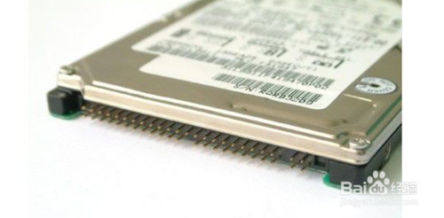

- 主流的硬盘接口是 SATA 接口, 区分 SATA2.0 和 3.0, 目前常见的固态硬盘, 就是 SATA 3.0, 5Gbps 的速度. 这已经是 SATA 瓶颈, 以后不会出现 SATA 3.1 的

机械: 厚, 内置碟片, 读写运行有声音

固态: 内置闪存颗粒, 没有碟片, 轻, 小

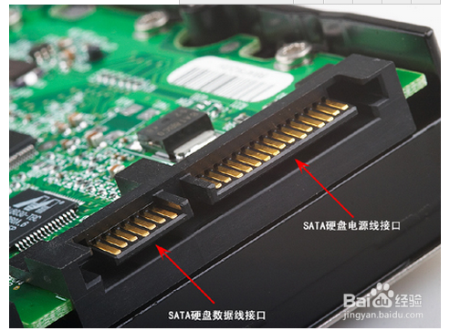

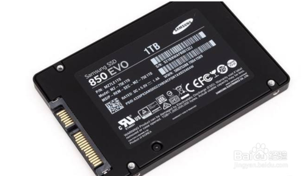

- mSATA 也就是 microSATA, 用于老式笔记本硬盘存储, 有点像 M.2, 外观上无法区分

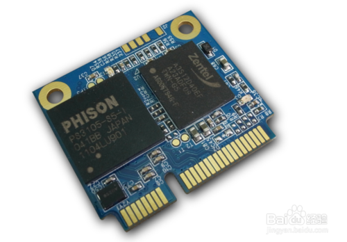

mSATA 接口是标准 SATA 的迷你版本通过 mini PCI-E 界面传输信号传输速度支持 1.5Gbps、3Gbps、6Gbps 三种模式.

- ESATA 这个接口目前只能在少部分的老式笔记本上能看到也是鸡肋的一种研发出来是为了替代 USB 2.0 的没想到直接被后面出来的 USb 3.0 干掉.

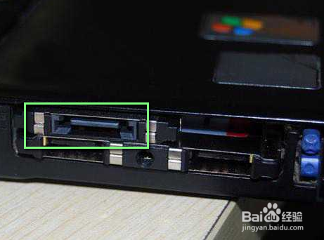

- 鸡肋的设置 SATA-E10Gbps 的速度. 家用消费级市场还未普及目前只在工业市场看到过.

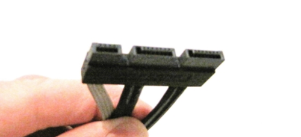

- `m.2` 是一种固态硬盘新接口是 Intel 推出的一种替代 MSATA 新的接口规范也就是我们以前经常提到的 NGFF 英文全称为: Next 转载自电脑百事网 Generation Form Factor. 可以将 m.2 理解为比**3.5 英寸**和**2.5 英寸**更小的**硬盘**和硬盘**插槽标准**.

需要注意的是, M.2 接口(SSD 上的金手指形状)和插槽(主板上)又被细分为 B key(又称 socket2)和 M key(socket3)两个模组, 二者由于金手指缺口和针脚数量不同而产生兼容问题.

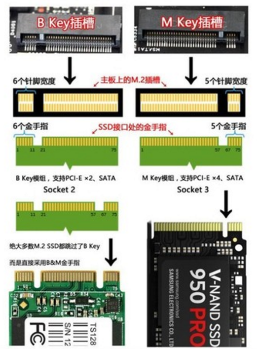

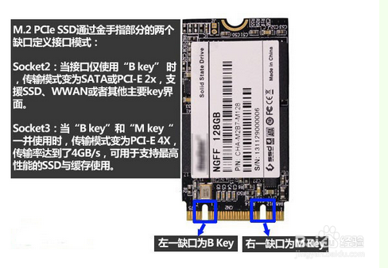

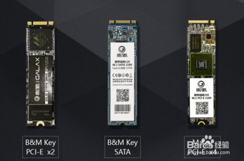

目前固态硬盘(SSD)常用的接口主要有 3 种:

1) SATA3 - 外形尺寸是 2.5 寸硬盘的标准尺寸与 2.5 寸机械硬盘可以互换.

2) mSATA - 接口尺寸与笔记本内置无线网卡相同不过 mSATA SSD 的外形尺寸比无线网卡更大.

3) M.2 - 初期称为 NGFF 接口是近两年新出的接口为专门为超小尺寸而设计的使用 PCI-E 通道体积更小速度更快.

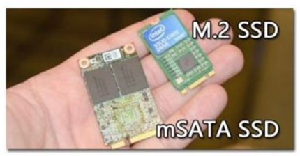

m.2 的 SSD 比较小, m.2 最早还用过 NGFF 名字, 它有很多长度版本, 最常见是 42/60/80mm 三种

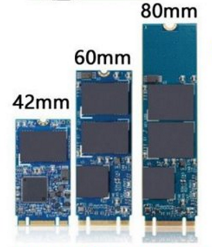

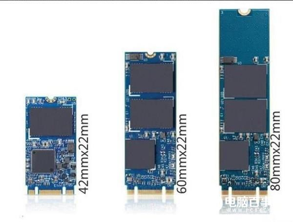

不仅仅是长度差异, 还存在通道, 协议, 兼容性等差异

M.2 接口固态硬盘又分为: SATA 和 PCI\-E 两种虽说长得一模一样但性能却是差之千里.

# 总线类型

`PCI-e`/`SATA`

M.2 SSD 通常会伴随一个名叫 PCI\-E 的参数, 这是啥?

M.2 固态硬盘还分通道目前 M.2 固态硬盘分 PCI\-E 与 SATA**两种通道**, 也就是总线类型两者在性能、价格等方面也存在明显区别.

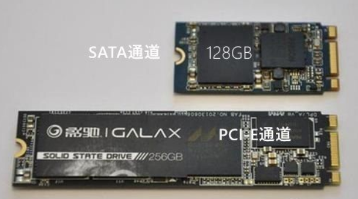

上图为 128GB 与 256GB M.2 固态硬盘外观对比

- 为什么同为 M.2 接口固态硬盘还会有 PCI\-E 和 SATA 之分?

这是因为两者所走的通道不同 M.2 有两种接口定义: Socket 2 和 Socket 3.

Socket 2 支持 SATA、PCI\-E X2 通道的 SSDSocket 3 专为高性能存储设计支持 PCI\-E X4. 由于走的路不一样性质也就截然不同了.

这两种总线标准直接决定了 M.2 SSD 的读写速度.

注: PCI\-E 3.0X4 完整叫法应该是 PCI Express Gen3X4

# 协议标准

`AHCI`/`NVMe`

使用**SATA**硬盘装系统时, 需要进入**BIOS 开启名叫 AHCI 的选项**. 这个 AHCI 就是**SATA 串口硬盘对应的协议标准(逻辑设备接口标准**), 可以视为是**SATA 的优化驱动**.

**NVme 是 AHCI 的进阶版**, 也是一种协议标准, 属于针对**PCI\-E 总线 SSD 定制的一种高速协议**(可以视为驱动程序)

注: 目前支持 NVMe 协议的 M.2 SSD 一定采用了 PCI\-E 3.0X4 总线标准, 但采用 PCI\-E 3.0X4 总线的 M.2 SSD 却并不一定支持 NVMe 协议

# 4 兼容问题

M.2 SSD 的兼容性, 就是针对前面的插槽/接口类型, 总线类型和协议标准展开的

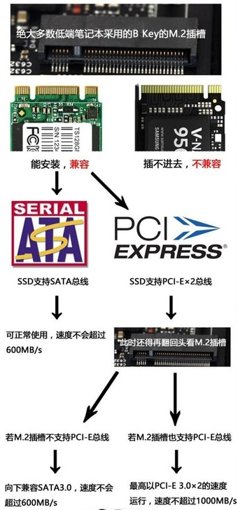

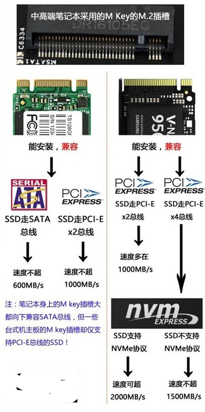