bilibili AV45562880

GPU 将电脑的数字信号转换成模拟信号让显示器显示出来

AMD 的全球首款 7nm 工艺的 Radeon VII 显卡.

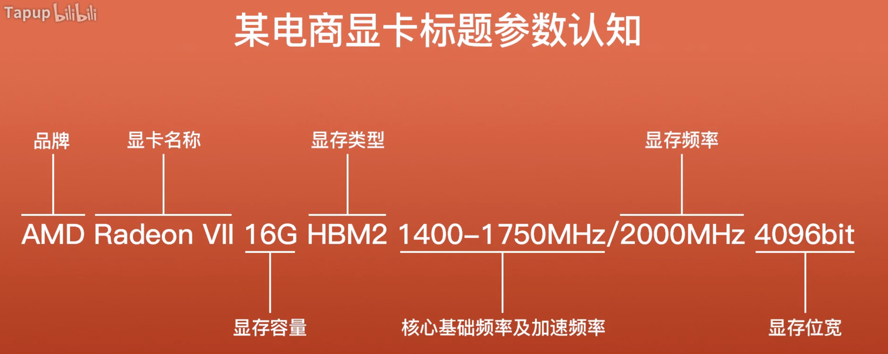

上图是某电商显卡标题参数认知. AMD 是品牌, Radeon VII 是显卡名称, 16GB 代表显存容量, HBM2 是显存类型, 1400\-1750MHz 是核心基础频率及核心加速频率, 2000MHz 代表显存频率, 4096bit 是显存位宽, 但是少了重要的流处理器和架构, 我们将其加上去列一个参数表整理一下

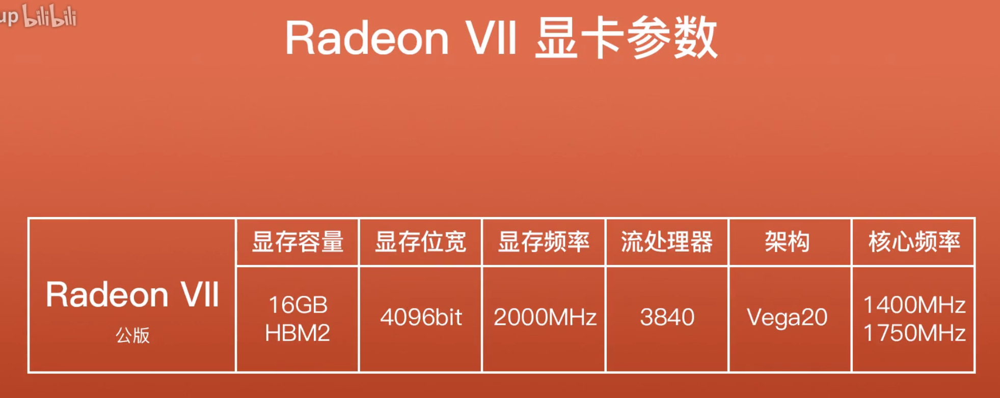

显卡参数分为: 显存、位宽、频率、流处理器、架构、核心频率

# 显存

也叫做帧缓存.

我们在显示器上看到的画面都是由一个一个像素点构成的, 每个像素点都有数据, 而这些数据都需要显存来进行存储传输, 将显存容量比作停车场, 能容纳 1000 辆车, 数据量大小表示多少辆车, 如果超过 1000 辆就会爆显存造成堵塞, 比如游戏, 游戏画面中的数据就是存放在显存中的, 越是精致复杂的 3D 画面, 数据量就越大.

# 2 显存位宽和显存频率

这影响着**显存数据**的**传输量**和**速度**, **位宽**相当于**一条公路的宽度**, 这条路能**并排行驶多少辆车**取决于**宽度**, 而**显存频率**就代表了**车的速度**, 频率越高则车速越快. 而这条公路上规定时间内通过多少车辆, 这个数据就是显存的带宽了, 显存带宽 = 显存位宽 ✖️ 显存频率 ➗ 8.

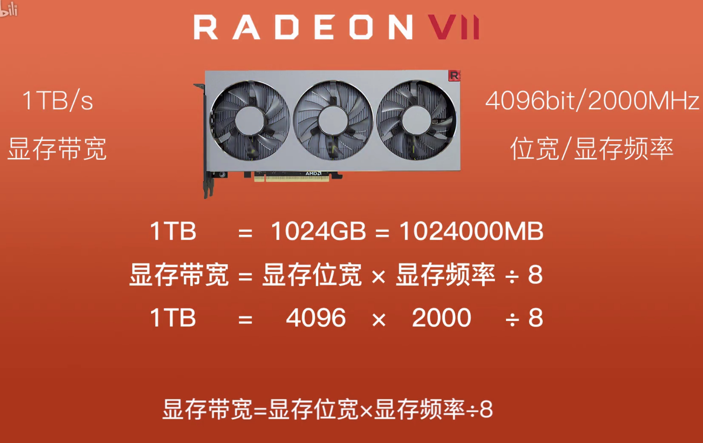

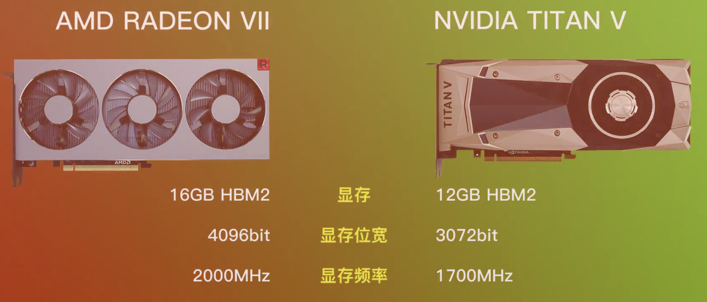

AMD 的 Vega 系列显卡和英伟达的 TITanV 显卡, 显卡采用的都是 HBM2 显存, 相对于新出的 GDDR6 显存来说两者各有各的优势, 显存结构不一样, HBM2 显存优势主要在于高位宽、低能耗以及面积占用小, 其成本也比较大, 而 GDDR 相对于上代的显存来说, 频率增高、位宽增大、容量增大.

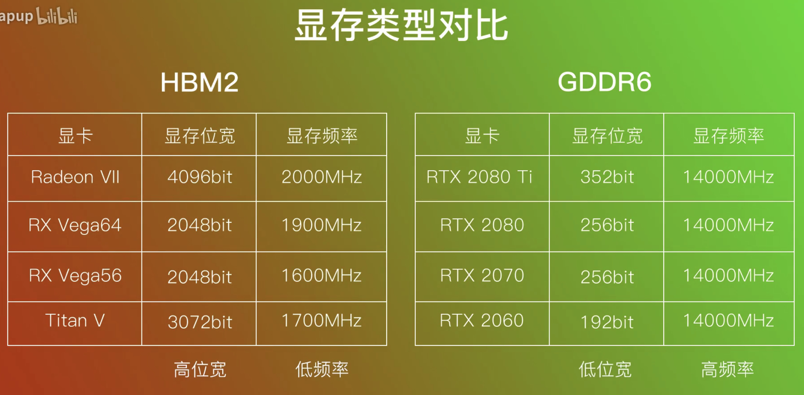

# 3 流处理器

显卡的核心部分, N 卡中称为 CUDA 核心. 流处理器的数量越多, 则显卡的画图能力就越强, 它的作用是直接将媒体的图形数据流映射到流处理器上进行处理, 也就是提供画面的东西.

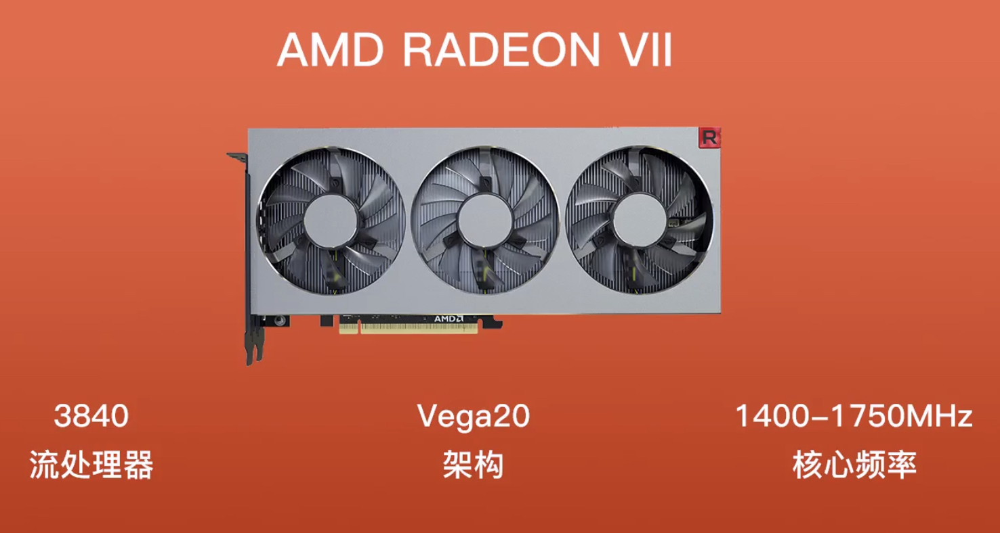

Radeon VII 显卡拥有 3840 颗流处理器, 好比**3840 台印刷机**为你工作, 机器越多, 同时所印刷的图片也就越多. 那么流处理器越多的显卡是不是就越好? 并不完全是, 在同架构显卡中, 流处理器的数量决定了显卡的性能等级, 而当流处理器数量一致时, 则用核心频率大小区分性能, 另外架构也影响了流处理器及整体显卡的性能.

# 4 架构

A 卡早期命名比较混乱, 这里列举近两代架构, 织女星和北极星架构, 每个架构有自己的核心代号, 代号后面的数字越高, 显卡级别也就越高; 代号相同时候, 使用流处理器数量来区分性能

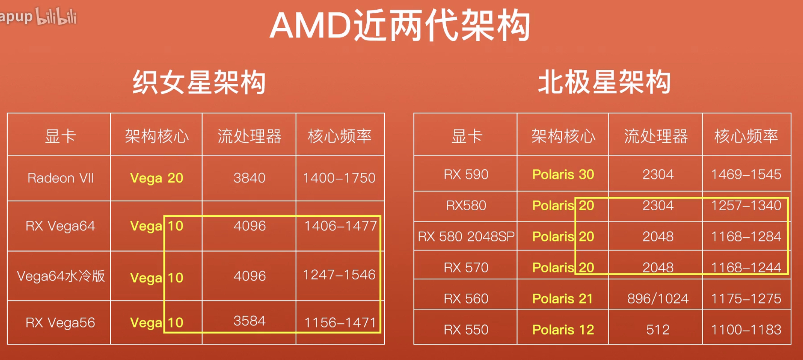

而 N 卡近三代是**图灵架构**、**帕斯卡**和**麦克斯架构**, **前三位代号数字越低**, 显卡级别**越高**; **代号相同**时, **后三位数字越高**, 性能**越强**; 架构越新越好.

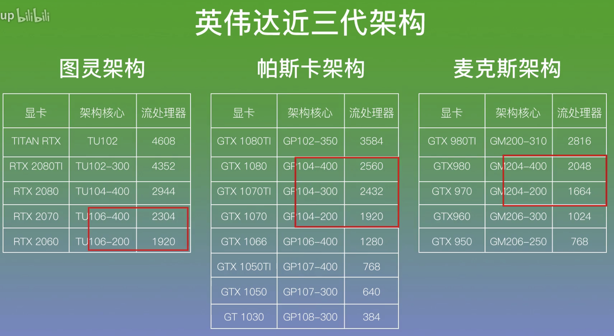

# 5 核心频率

1400MHz 核心基础频率好比能让印刷机每次印刷 1400 张画面, 频率越高也就意味着性能越高, 同时功耗也在增加

# 6 参数总结

参数可以分为两大类, 一是图形芯片(流处理器/架构/核心频率), 二是显存(显存容量/位宽/频率). 前者决定了显卡的图形运算能力、特效渲染等画面技术, 后者解决图形处理数据的传输量和速度, 选购时可以先看芯片再看显存

# 7 显卡故事

目前市场上两种显卡厂商, AMD 和 NVIDIA, 俗称 A 卡和 N 卡, 且有公版卡和非公版卡之分.

公版卡就是 AMD 和 NVIDIA 自主生产制造出售的显卡, 有着稳定的性能和良好的公版方案, 其最重要的显卡核心部分也只有这两家能制造; 非公版卡就是 AMD 和 NVIDIA 将自己的显卡核心卖给下游的各大板卡厂商贴牌组装生产成为自己的显卡, 于是就有了市面上很多的品牌显卡, 比如华硕、微星、技嘉、七彩虹等 这些显卡通常在用料、供电、散热、超频等方面比公版卡要好, 可玩性强的同时价格也高, 一般都是在高端系列显卡上体现出来.

## 7.1 A 卡

早期的 A 卡指的是 ATI, 后来被 AMD 收购成为了现在的样子, 其家族显卡有现在的 Radeon RX 及早期的 HD 多个系列, 下图是 AMD 常见的显卡家族表. 每个家族有多个系列, 系列下面又有多个产品型号,

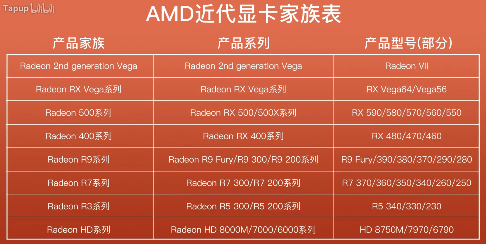

然后我们认识下产品型号的参数, 下图

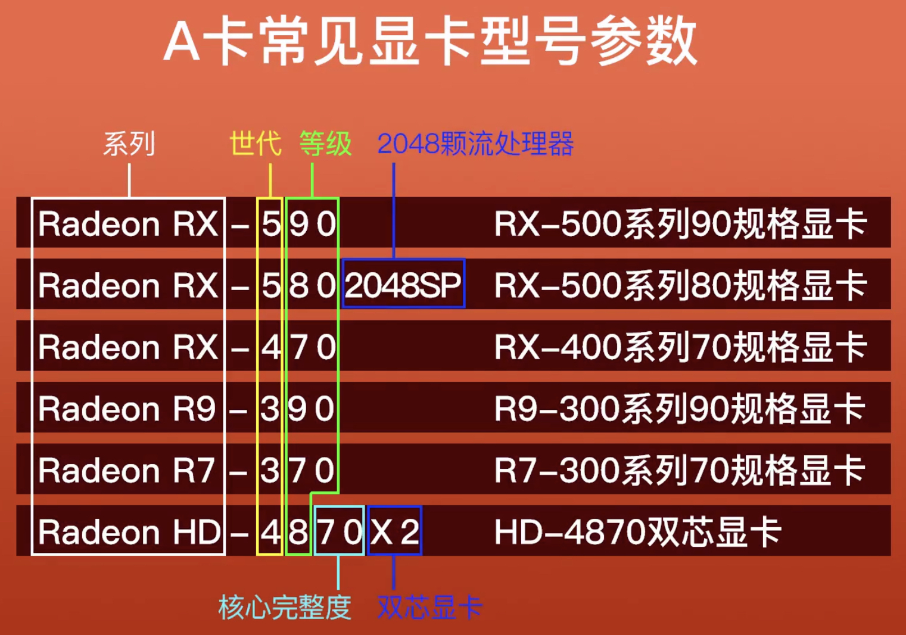

前缀代表系列, 中间数字的第一位代表世代, 后面两位代表等级, 最后两位代表核心完整度, X2 代表双芯显卡

下图是 A 卡常见显卡参数表

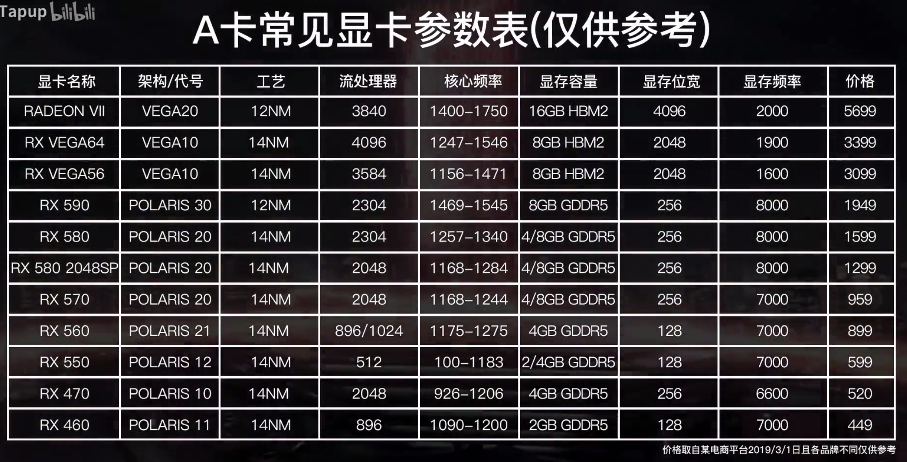

## 7.2 N 卡

新出的二十系显卡搭载了图灵架构, 引入了"实时光线追踪"技术, 提供接近真实的光线、阴影、反射等效果, 营造的画面逼真度远超过传统渲染技术, 不过目前支持的游戏很少.

显卡的命名和常见后缀解释

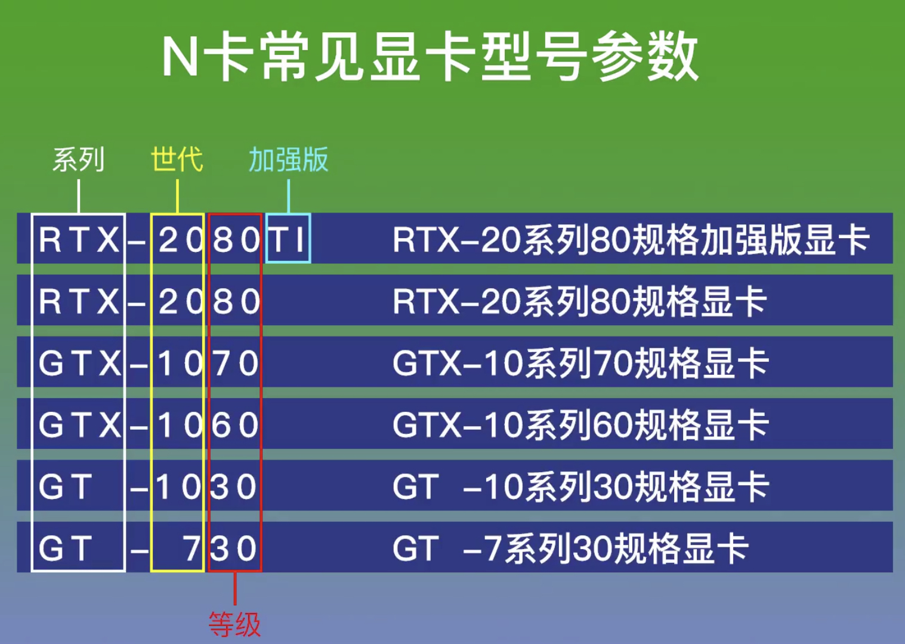

前缀的 RTX/GTX/GT 代表系列, 数字的第一位代表世代, 后两位代表等级, 后缀 TI 代表加强版,

下图是常见的 N 卡参数表

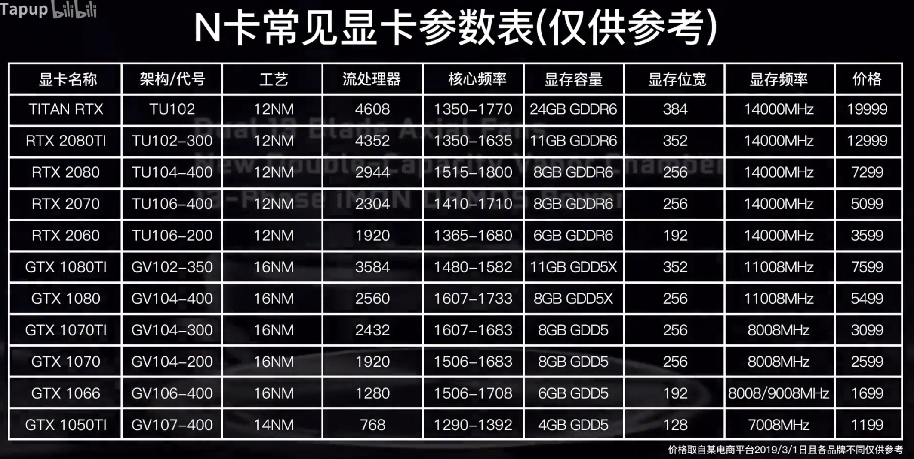

## 7.3 AMD 的双卡交火(AMD crossfire)和 N 卡的多卡互联(NVIDIA nvlink)

简单理解就是将两块以上的显卡插在主板上, 连接在一起共同运行来提升性能, 相当于融合, 但不是 1+1=2 的原则, 通常还得看其他硬件因素和驱动优化以及游戏支持问题, 好比低端 U 配高端显卡, 发挥不出双卡的性能就白白浪费电了.

A 卡的交火有两个方式, 一是通过 APU 核显和独显交火, 二是将两块相同型号的显卡插在主板上, 然后在显卡设置面板里开启交火功能即可, 需要能支持交火的显卡以及好的主板.

NVlink 多卡互联技术只能通过桥接器, 将两块相同型号的显卡接在一起, 需要额外购买, 且只有部分高端显卡和专业卡能支持这种技术

## 7.4 显卡的质量和接口

通常非公版卡在用料上都比公版要好, 无论是显卡的 PCB 板、电容元件、散热系统以及水冷, 只有良好的用料和供电系统以保证显卡的性能发挥以及稳定性, 而显卡的接口买的时候要看准是否支持自己的显示器, 有 DP、HDMI、DVI 常见主流接口, 其中 DP 能够支持高达 144Hz 的刷新率和高分辨率, 对 FPS 游戏玩家是很好的体验.

