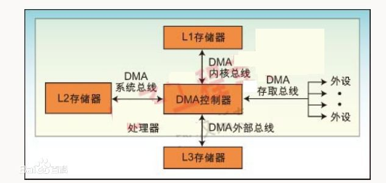

### 1. 概念

DMA(Direct Memory Access)控制器是一种在系统内部转移数据的独特外设可以将其视为一种能够通过一组专用总线将内部和外部存储器与每个具有 DMA 能力的外设连接起来的控制器. 它之所以属于外设是因为它是在处理器的编程控制下来执行传输的.

DMA 既可以指内存和外设直接存取数据这种内存访问的计算机技术又可以指实现该技术的硬件模块(对于通用计算机 PC 而言 DMA 控制逻辑由 CPU 和 DMA 控制接口逻辑芯片共同组成嵌入式系统的 DMA 控制器内建在处理器芯片内部一般称为 DMA 控制器 DMAC).

### 2. 结构

一般而言 DMA 控制器将包括一条地址总线、一条数据总线和控制寄存器. 高效率的 DMA 控制器将具有访问其所需要的任意资源的能力而无须处理器本身的介入它必须能产生中断. 最后它必须能在控制器内部计算出地址. [2]
一个处理器可以包含多个 DMA 控制器. 每个控制器有多个 DMA 通道以及多条直接与存储器站(memory bank)和外设连接的总线如图 1 所示. 在很多高性能处理器中集成了两种类型的 DMA 控制器. 第一类通常称为"系统 DMA 控制器"可以实现对任何资源(外设和存储器)的访问对于这种类型的控制器来说信号周期数是以系统时钟(SCLK)来计数的以 ADI 的 Blackfin 处理器为 例频率最高可达 133MHz. 第二类称为内部存储器 DMA 控制器(IMDMA)专门用于内部存储器所处位置之间的相互存取操作. 因为存取都发生在内部 (L1－L1、L1－L2 或者 L2－L2)周期数的计数则以内核时钟(CCLK)为基准来进行该时钟的速度可以超过 600MHz.

