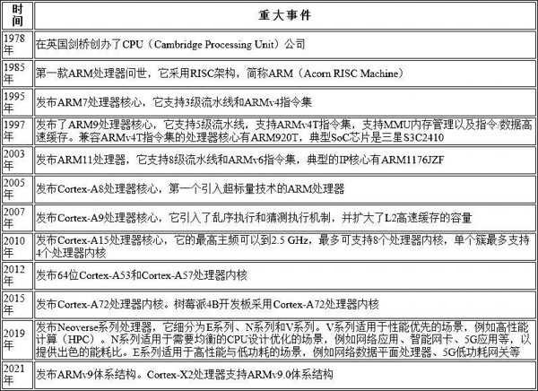
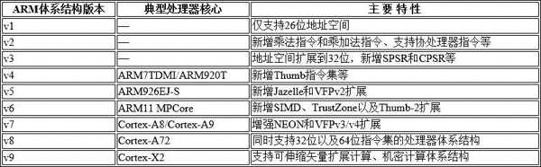

# 1. ARM 公司

ARM 公司主要向客户提供处理器 IP.

ARM 公司大事记:

ARM 体系结构是一种硬件规范, 主要是用来约定指令集, 芯片内部体系结构 (如内存管理, 高速缓存管理) 等. 以指令集为例, ARM 体系结构并没有约定每一条指令在硬件描述语言 (Verilog 或 VHDL) 中应该如何实现, 它只约定每一条指令的格式, 行为规范, 参数等.

为了降低客户基于 ARM 体系结构开发处理器的难度, ARM 公司通常在发布新版本的体系结构之后, 根据不同的应用需求开发出兼容体系结构的处理器 IP, 然后授权给客户. 客户获得处理器 IP 之后, 再用它来设计不同的 SoC 芯片. 以 ARMv8 体系结构为例, ARM 公司先后开发出 Cortex-A53,Cortex-A55,Cortex-A72,Cortex-A73 等多款处理器 IP.

## 1.1. 授权方式

ARM 公司一般有两种授权方式.

* 体系结构授权. 客户可以根据这个规范自行设计与之兼容的处理器.

* 处理器 IP 授权. ARM 公司根据某个版本的体系结构来设计处理器, 然后把处理器的设计方案授权给客户.

# 2. 体系结构版本

ARM 体系结构版本变化也很快. 在每一个版本的体系结构里, 指令集都有相应的变化

1. **ARMv1**: 1985 年发布, 是第一个 ARM 指令集版本, 定义了 32 位指令集架构及 26 位寻址空间. 仅在 ARM1 处理器上实现, 很快被 ARM2 取代. 有 16 个通用 32 位寄存器, 不支持硬件乘法, 无硬件浮点运算支持, 未用于任何商业产品.

2. **ARMv2**: 1986 年发布, 被 Acorn Computers 使用. 最初不具备 RISC 指令集, 后演变为 RISC 指令集从而可用于商业领域. 增加了乘法支持和协处理器通信接口, 还增加了两个状态寄存器, 寄存器总数达 27 个.

3. **ARMv3**: 在 20 世纪 80 年代末至 90 年代初发布. 实现了片上调试功能, 具备完整的 32 位寻址能力, 程序计数器为完整的 32 位, 标志位在单独的寄存器中. 新增了六种处理模式, 包括用户 32, supervisor 32,irq 32,fiq 32, abort 32 和 undefined 32, 还引入了当前和保存状态寄存器 CPSR/SPSR 以及读写它们的 MRS 和 MSR 指令, ARM6 和最初的 ARM7 以此为基础.

4. **ARMv4**: 在 1994 年左右推出. 增加了对半字和有符号半字 / 字节的支持, 引入了系统模式, 还包括 Thumb 指令集(v4T), 并向后兼容早期架构.

5. **ARMv5**: 大约在 1999 年发布. 改进了 ARM/Thumb 交互工作能力, 引入了 CLZ(Count Leading Zeros)指令, 增加了对结构化算术 DSP 乘累加指令的支持, 同样向后兼容早期架构.

6. **ARMv6**: 2001 年发布. 引入了 SIMD 指令, 多处理 v6 内存架构, 支持非对齐数据. 扩展内容包括 Thumb-2,TrustZone, 多核以及仅 Thumb 模式, 也保持了向后兼容性.

7. **ARMv7**: 2004 年发布. 针对不同应用场景推出了架构配置文件, 分为 ARMv7-A(应用),ARMv7-R(实时), ARMv7-M(微控制器). ARMv7-A 增加了 NEON 技术以增强多媒体处理能力; ARMv7-R 具有硬件除法功能, 适用于对可靠性和实时性要求高的场景; ARMv7-M 只支持 Thumb-2 指令集和硬件除法, 用于对成本和功耗敏感的微控制器领域.

8. **ARMv8**: 2011 年发布. 从这个版本开始支持 64 位, 即 AArch64, 同时为兼容 ARMv7 的应用也支持 32 位. 全面支持虚拟化, TrustZone 技术也得到大范围使用. 定义了两种执行状态 AArch64 和 AArch32, 有四个异常级别 EL0-EL3, 引入了更多安全特性, 如两种安全状态 Non-Secure state 和 Secure state.

9. **ARMv9**: 2021 年发布. 在 ARMv8 基础上进一步增强了性能, 安全性和 AI 处理能力等. 例如, 强化了对机器学习的支持, 提升了加密和安全相关功能, 以满足未来对智能设备, 云计算, 5G 等领域不断增长的需求.

# 3. 三种系列

ARM 体系结构又根据不同的应用场景分成如下 3 种系列.

* A 系列: 面向性能密集型系统的应用处理器内核.

* R 系列: 面向实时应用的高性能内核.

* M 系列: 面向各类嵌入式应用的微控制器内核.
