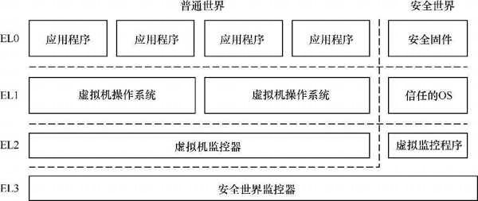

- [1. v8 架构](#1-v8-架构)
- [2. 处理器内核](#2-处理器内核)
- [3. 基本概念](#3-基本概念)
- [4. A64 指令集](#4-a64-指令集)
- [5. 执行状态](#5-执行状态)
- [6. 支持的数据宽度](#6-支持的数据宽度)

# 1. v8 架构

ARMv8 是 ARM 公司发布的第一代支持 64 位处理器的指令集和体系结构. 它在扩充 64 位寄存器的同时提供了对上一代体系结构指令集的兼容, 因此它提供了运行 32 位和 64 位应用程序的环境.

ARMv8 体系结构除了提高了处理能力, 还引入了很多吸引人的新特性.

* 具有超大物理地址 (physical address) 空间, 提供超过 4 GB 物理内存的访问.

* 具有 64 位宽的虚拟地址 (virtual address) 空间. 32 位宽的虚拟地址空间只能供 4 GB 大小的虚拟地址空间访问, 这极大地限制了桌面操作系统和服务器等的应用. 64 位宽的虚拟地址空间可以提供更大的访问空间.

* 提供 31 个 64 位宽的通用寄存器, 可以减少对栈的访问, 从而提高性能.

* 提供 16 KB 和 64 KB 的页面, 有助于降低 TLB 的未命中率(miss rate).

* 具有全新的异常处理模型, 有助于降低操作系统和虚拟化的实现复杂度.

* 具有全新的加载 - 获取指令(Load-Acquire Instruction), 存储 - 释放指令(Store-Release Instruction), 专门为 C++11,C11 以及 Java 内存模型设计.

ARMv8 体系结构一共有 8 个小版本, 分别是 ARMv8.0, ARMv8.1, ARMv8.2, ARMv8.3, ARMv8.4, ARMv8.5, ARMv8.6, ARMv8.7, 每个小版本都对体系结构进行小幅度升级和优化, 增加了一些新的特性.

# 2. 处理器内核

ARMv8 体系结构的处理器内核主要有 Cortex-A53,Cortex-A57,Cortex-A72,Cortex-A73,Cortex-A75,Cortex-A76,Cortex-A77,Cortex-A78,Cortex-A79,Cortex-A80,Cortex-A81,Cortex-A82 等.

Cortex-A53 是 ARM 公司发布的第一个基于 ARMv8-A 体系结构的处理器内核, 专门为低功耗设计的处理器. 主要用于移动设备, 智能家居, 工业控制等领域. 通常可以使用 1～4 个 Cortex-A53 处理器组成一个处理器簇或者和 Cortex-A57/Cortex-A72 等高性能处理器组成大 / 小核体系结构.

Cortex-A57: 采用 64 位 ARMv8 体系结构的处理器内核, 而且通过 AArch32 执行状态, 保持与 ARMv7 体系结构完全后向兼容. 除 ARMv8 体系结构的优势之外, Cortex-A57 还提高了单个时钟周期的性能, 比高性能的 Cortex-A15 高出了 20%～40%. 它还改进了二级高速缓存的设计和内存系统的其他组件, 极大地提高了性能.

Cortex-A72: 2015 年年初正式发布的基于 ARMv8 体系结构并在 Cortex-A57 处理器上做了大量优化和改进的一款处理器内核. 在相同的移动设备电池寿命限制下, Cortex-A72 相对于基于 Cortex-A15 的设备具有 3.5 倍的性能提升, 展现出了优异的整体功效.

# 3. 基本概念

ARM 处理器实现的是精简指令集体系结构. 在 ARMv8 体系结构中有如下一些基本概念和定义.

处理机(Processing Element, PE): 在 ARM 公司的官方技术手册中提到的一个概念, 把处理器处理事务的过程抽象为处理机.

* 执行状态(execution state): 处理器运行时的环境, 包括寄存器的位宽, 支持的指令集, 异常模型, 内存管理以及编程模型等. ARMv8 体系结构定义了两个执行状态.

  - AArch64: 64 位的执行状态.

    * 提供 31 个 64 位的通用寄存器.

    * 提供 64 位的程序计数 (Program Counter, PC) 指针寄存器, 栈指针 (Stack Pointer, SP) 寄存器以及异常链接寄存器(Exception Link Register, ELR).

    * 提供 A64 指令集.

    * 定义 ARMv8 异常模型, 支持 4 个异常等级, 即 EL0～EL3.

    * 提供 64 位的内存模型.

    * 定义一组处理器状态 (PSTATE) 用来保存 PE 的状态.

  - AArch32:32 位的执行状态.

    * 提供 13 个 32 位的通用寄存器, 再加上 PC 指针寄存器, SP 寄存器, 链接寄存器(Link Register, LR).

    * 支持两套指令集, 分别是 A32 和 T32(Thumb 指令集)指令集.

    * 支持 ARMv7-A 异常模型, 基于 PE 模式并映射到 ARMv8 的异常模型中.

    * 提供 32 位的虚拟内存访问机制.

    * 定义一组 PSTATE 用来保存 PE 的状态.

* ARMv8 指令集: ARMv8 体系结构根据不同的执行状态提供不同指令集的支持.

  - A64 指令集: 运行在 AArch64 状态下, 提供 64 位指令集支持.

  - A32 指令集: 运行在 AArch32 状态下, 提供 32 位指令集支持.

  - T32 指令集: 运行在 Arch32 状态下, 提供 16 位和 32 位指令集支持.

* 系统寄存器命名: 在 AArch64 状态下, 很多系统寄存器会根据不同的异常等级提供不同的变种寄存器. 系统寄存器的使用方法如下.

```
<register_name>_Elx  // 最后一个字母 x 可以表示 0,1,2,3
```

如 SP_EL0 表示在 EL0 下的 SP 寄存器, SP_EL1 表示在 EL1 下的 SP 寄存器.

# 4. A64 指令集

ARMv8 体系结构最大的改变是增加了一个新的 64 位的指令集. 它可以处理 64 位宽的寄存器和数据并且使用 64 位的指针来访问内存. 这个新的指令集称为 A64 指令集, 运行在 AArch64 状态下. ARMv8 兼容旧的 32 位指令集——A32 指令集, 它运行在 AArch32 状态下.

A64 指令集和 A32 指令集是不兼容的, 它们是两套完全不一样的指令集, 它们的指令编码是不一样的. 需要注意的是, **A64 指令集**的**指令宽度**是 **32** 位, 而**不是 64 位**.

# 5. 执行状态

ARMv8 处理器支持两种执行状态——AArch64 状态和 AArch32 状态. AArch64 状态是 ARMv8 新增的 64 位执行状态, 而 AArch32 是为了兼容 ARMv7 体系结构的 32 位执行状态. 当处理器运行在 AArch64 状态下时, 运行 A64 指令集; 而当运行在 AArch32 状态下时, 可以运行 A32 指令集或者 T32 指令集.

如下图. AArch64 状态的异常等级 (exception level) 确定了处理器当前运行的特权级别, 类似于 ARMv7 体系结构中的特权等级.



* EL0: 用户特权, 用于运行普通用户程序.

* EL1: 系统特权, 通常用于操作系统内核. 如果系统使能了虚拟化扩展, 运行虚拟机操作系统内核.

* EL2: 运行虚拟化扩展的虚拟机监控器(hypervisor).

* EL3: 运行安全世界中的安全监控器(secure monitor).

ARMv8 体系结构允许切换应用程序的运行模式. 如在一个运行 64 位操作系统的 ARMv8 处理器中, 我们可以同时运行 A64 指令集的应用程序和 A32 指令集的应用程序, 但是在一个运行 32 位操作系统的 ARMv8 处理器中就不能运行 A64 指令集的应用程序了. 当需要运行 A32 指令集的应用程序时, 需要通过一条管理员调用 (Supervisor Call, SVC) 指令切换到 EL1, 操作系统会做任务的切换并且返回 AArch32 的 EL0, 从而为这个应用程序准备好 AArch32 状态的运行环境.

# 6. 支持的数据宽度

ARMv8 支持如下几种**数据宽度**.

* 字节(byte): 8 位.

* 半字(halfword): 16 位.

* 字(word): 32 位.

* 双字(doubleword): 64 位.

* 四字(quadword): 128 位.
