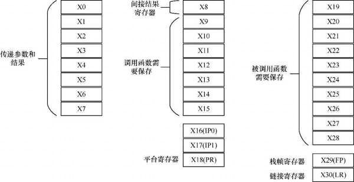
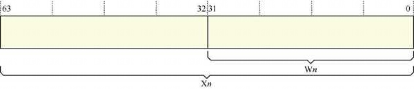
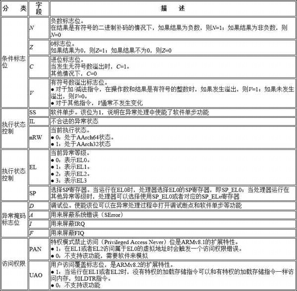
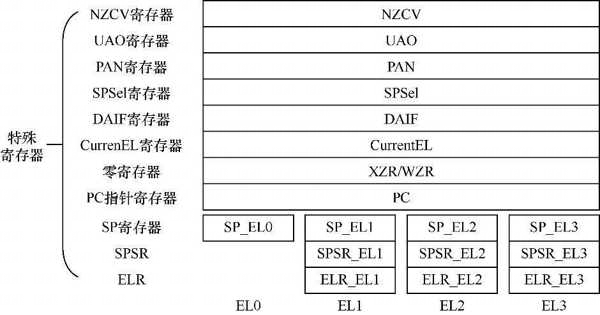
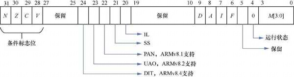
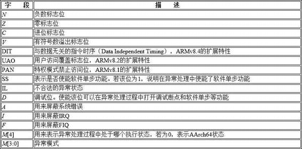

# 通用寄存器

AArch64 执行状态支持 31 个 64 位的通用寄存器, 分别是 X0～X30 寄存器, 而 AArch32 状态支持 16 个 32 位的通用寄存器.

除用于数据运算和存储之外, 通用寄存器还可以在函数调用过程中起到特殊作用, ARM64 体系结构的函数调用标准和规范对此有所约定, 如下图所示.



在 AArch64 状态下, 使用 X(如 X0,X30 等)表示 64 位通用寄存器. 另外, 还可以使用 W 来表示低 32 位的数据, 如 W0 表示 X0 寄存器的低 32 位数据, W1 表示 X1 寄存器的低 32 位数据. 如下图.



# 处理器状态

AArch64 体系结构使用 PSTATE 寄存器来表示当前处理器状态(processor state).



# 特殊寄存器

ARMv8 体系结构除支持 31 个通用寄存器之外, 还提供多个特殊的寄存器



1) 零寄存器

ARMv8 体系结构提供两个零寄存器(zero register), 这些寄存器的内容全是 0, 可以用作源寄存器, 也可以用作目标寄存器. WZR 是 32 位的零寄存器, XZR 是 64 位的零寄存器.

2) PC 指针寄存器

PC 指针寄存器通常用来指向当前运行指令的下一条指令的地址, 用于控制程序中指令的运行顺序, 但是编程人员不能通过指令来直接访问它.

3) SP 寄存器

ARMv8 体系结构支持 4 个异常等级, 每一个异常等级都有一个专门的 SP 寄存器 `SP_EL n` , 如处理器运行在 EL1 时选择 SP_EL1 寄存器作为 SP 寄存器.

* SP_EL0: EL0 下的 SP 寄存器.

* SP_EL1: EL1 下的 SP 寄存器.

* SP_EL2: EL2 下的 SP 寄存器.

* SP_EL3: EL3 下的 SP 寄存器.

当处理器运行在**比 EL0 高**的异常等级时, 处理器可以访问如下寄存器.

* 当前异常等级对应的 SP 寄存器 `SP_EL n` .

* **EL0** 对应的 SP 寄存器 `SP_EL0` 可以当作一个临时寄存器, 如 Linux 内核使用该寄存器存放进程中 task_struct 数据结构的指针.

当处理器运行在 EL0 时, 它只能访问 `SP_EL0`, 而不能访问其他高级的 SP 寄存器.

4) 备份程序状态寄存器

当我们运行一个异常处理程序时, 处理器的备份程序会保存到**备份程序状态寄存器** (Saved Program Status Register, SPSR) 里. 当异常将要发生时, 处理器会把 PSTATE 寄存器的值暂时保存到 SPSR 里; 当异常处理完成并返回时, 再把 SPSR 的值恢复到 PSTATE 寄存器. SPSR 的格式如下图所示.



SPSR 的重要字段如下表所示.



5) ELR

ELR 存放了异常返回地址.

6) CurrentEL 寄存器

该寄存器表示 PSTATE 寄存器中的 EL 字段, 其中保存了**当前异常等级**. 使用 MRS 指令可以读取当前异常等级.

* 0: 表示 EL0.

* 1: 表示 EL1.

* 2: 表示 EL2.

* 3: 表示 EL3.

7) DAIF 寄存器

该寄存器表示 PSTATE 寄存器中的 { D , A , I , F } 字段.

8) SPSel 寄存器

该寄存器表示 PSTATE 寄存器中的 SP 字段, 用于在 SP_EL0 和 `SP_EL n` 中选择 SP 寄存器.

9) PAN 寄存器

PAN 寄存器表示 PSTATE 寄存器中的 PAN(Privileged Access Never, 特权禁止访问)字段. 可以通过 MSR 和 MRS 指令来设置 PAN 寄存器. 当**内核态**拥有访问用户态内存或者执行用户态程序的能力时, 攻击者就可以利用漏洞轻松地执行用户的恶意程序. 为了修复这个漏洞, 在 ARMv8.1 中新增了 PAN 特性, **防止内核态恶意访问用户态内存**. 如果内核态需要访问用户态内存, 那么需要主动调用内核提供的接口, 例如 `copy_from_user()` 或者 `copy_to_user()` 函数.

PAN 寄存器的值如下.

* 0: 表示在内核态可以访问用户态内存.

* 1: 表示在内核态访问用户态内存会触发一个**访问权限异常**.

10. UAO 寄存器

该寄存器表示 PSTATE 寄存器中的 UAO(User Access Override, 用户访问覆盖)字段. 我们可以通过 MSR 和 MRS 指令设置 UAO 寄存器. UAO 为 1 表示在 EL1 和 EL2 执行这非特权指令 (例如 LDTR,STTR) 的效果与特权指令 (例如 LDR,STR) 是一样的.

11. NZCV 寄存器

该寄存器表示 PSTATE 寄存器中的 { N , Z , C , V } 字段.

# 系统寄存器

ARMv8 体系结构还定义了很多的系统寄存器, 通过访问和设置这些系统寄存器来完成对处理器不同的功能配置.

* 在 ARMv7 体系结构中, 我们需要通过访问 CP15 协处理器来间接访问这些系统寄存器;

* 而在 ARMv8 体系结构中没有协处理器, 可直接访问系统寄存器.

ARMv8 体系结构支持如下 7 类系统寄存器:

* 通用系统控制寄存器;

* 调试寄存器;

* 性能监控寄存器;

* 活动监控寄存器;

* 统计扩展寄存器;

* RAS 寄存器;

* 通用定时器寄存器.

系统寄存器支持不同的异常等级的访问, 通常系统寄存器会使用 "`Reg_EL n`" 的方式来表示.

* Reg_EL1: 处理器处于 EL1, EL2 以及 EL3 时可以访问该寄存器.

* Reg_EL2: 处理器处于 EL2 和 EL3 时可以访问该寄存器.

* 大部分系统寄存器不支持处理器处于 EL0 时访问, 但也有一些例外, 如 `CTR_EL0`.

程序可以通过 MSR 和 MRS 指令访问系统寄存器.

```
mrs X0, TTBR0_EL1    // 把 TTBR0_EL1 的值复制到 X0 寄存器
msr TTBR0_EL1, X0    // 把 X0 寄存器的值复制到 TTBR0_EL1
```

