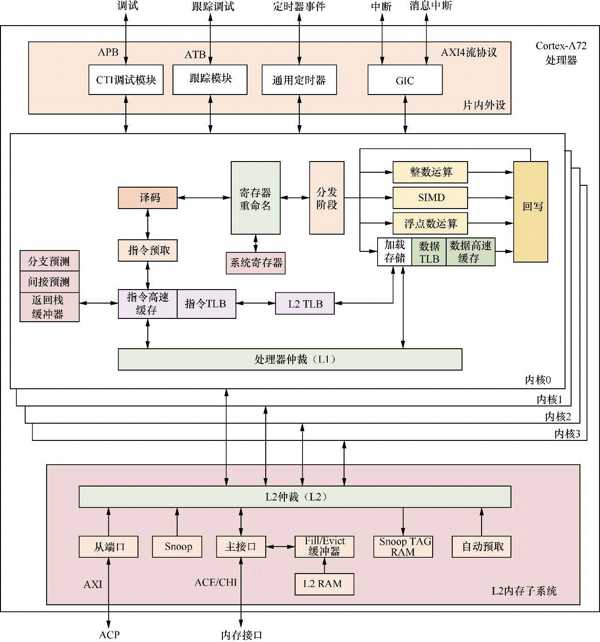

树莓派 4B 开发板, 内置了 4 个 Cortex-A72 处理器内核, 这里重点介绍 Cortex-A72 处理器内核.

Cortex-A72 是 2015 年发布的一个高性能处理器内核. 它最多可以支持 4 个内核, 内置 L1 和 L2 高速缓存, 如图

支持如下特性.

* 采用 ARMv8 体系结构规范来设计, 兼容 ARMv8.0 协议.

* 超标量处理器设计, 支持**乱序执行**的流水线.

* 基于分支目标缓冲区 (BTB) 和全局历史缓冲区 (GHB) 的动态**分支预测**, 返回栈缓冲器以及间接预测器.

* 支持 48 个表项的全相连**指令 TLB**, 可以支持 4 KB, 64 KB 以及 1 MB 大小的页面.

* 支持 32 个表项的全相连**数据 TLB**, 可以支持 4 KB, 64 KB 以及 1 MB 大小的页面.

* 每个处理器内核支持 4 路组相连的 L2 TLB.

* 48 KB 的 L1 指令高速缓存以及 32 KB 的 L1 数据高速缓存.

* 可配置大小的 L2 高速缓存, 可以配置为 512 KB,1 MB,2 MB 以及 4 MB 大小.

* 基于 AMBA4 总线协议的 ACE(AXI Coherency Extension)或者 CHI(Coherent Hub Interface).

* 支持 PMUv3 体系结构的性能监视单元.

* 支持多处理器调试的 CTI(Cross Trigger Interface).

* 支持 GIC(可选).

* 支持多电源域 (power domain) 的电源管理.

# 指令预取单元

**指令预取单元**用来从 **L1 指令高速缓存**中获取指令, 并在每个周期向**指令译码单元**最多发送 3 条指令. 它支持动态和静态分支预测.

指令预取单元包括如下功能.

* **L1 指令高速缓存**是一个 48 KB 大小, 3 路组相连的高速缓存, 每个缓存行的大小为 64 字节.

* 支持 48 个表项的全相连**指令 TLB**, 可以支持 4 KB, 64 KB 以及 1 MB 大小的页面.

* 带有分支目标缓冲器的 2 级动态预测器, 用于快速生成目标.

* 支持静态分支预测.

* 支持间接预测.

* 返回栈缓冲器.

# 指令译码单元

指令译码单元对以下指令集进行译码:

* A32 指令集;

* T32 指令集;

* A64 指令集.

指令译码单元会执行寄存器重命名, 通过消除写后写 (WAW) 和读后写 (WAR) 的冲突来实现乱序执行.

# 指令分派单元

指令分派单元控制译码后的指令何时被分派到执行管道以及返回的结果何时终止. 它包括以下部分:

* ARM 核心通用寄存器;

* SIMD 和浮点寄存器集;

* AArch32 CP15 和 AArch64 系统寄存器.

# 加载/存储单元

加载/存储单元 (LSU) 执行加载和存储指令, 包含 L1 数据存储系统. 另外, 它还处理来自 L2 内存子系统的一致性等服务请求. 加载 / 存储单元的特性如下.

* 具有 32 KB 的 L1 数据高速缓存, 两路组相连, 缓存行大小为 64 字节.

* 支持 32 个表项的全相连**数据 TLB**, 可以支持 4 KB,64 KB 以及 1 MB 大小的页面.

* 支持自动硬件预取器, 生成针对 L1 数据高速缓存和 L2 缓存的预取.

# L1 内存子系统

L1 内存子系统包括**指令内存系统**和**数据内存系统**.

L1 **指令内存系统**包括如下特性.

* 具有 48 KB 的**指令高速缓存**, 3 路组相连映射.

* 缓存行的大小为 64 字节.

* 支持物理索引物理标记(PIPT).

* 高速缓存行的替换算法为 LRU(Least Recently Used)算法.

L1 **数据内存系统**包括如下特性.

* 具有 32 KB 的**数据高速缓存**, 两路组相连映射.

* 缓存行的大小为 64 字节.

* 支持物理索引物理标记.

* 对于普通内存, 支持乱序发射, 预测以及非阻塞的加载请求访问; 对于设备内存, 支持非预测以及非阻塞的加载请求访问.

* 高速缓存行的替换算法为 LRU 算法.

* 支持硬件预取.

# MMU

MMU 用来实现虚拟地址到物理地址的转换. 在 AArch64 状态下支持长描述符的页表格式, 支持不同的页面粒度, 例如 **4 KB**, **16 KB** 以及 **64 KB** 页面.

MMU 包括以下部分:

* 48 表项的全相连的 L1 指令 TLB;

* 32 表项的全相连的 L1 数据 TLB;

* 4 路组相连的 L2 TLB;

TLB 不仅支持 8 位或者 16 位的 **ASID**, 还支持 **VMID**(用于虚拟化).

# L2 内存子系统

L2 内存子系统不仅负责处理每个处理器内核的 L1 指令和数据高速缓存未命中的情况, 还通过 ACE 或者 CHI 连接到内存系统. 其特性如下.

* 可配置 L2 高速缓存的大小, 大小可以是 512 KB,1 MB,2 MB,4 MB.

* 缓存行大小为 64 字节.

* 支持物理索引物理标记.

* 具有 16 路组相连高速缓存.

* 缓存一致性监听控制单元(Snoop Control Unit,SCU).

* 具有可配置的 128 位宽的 ACE 或者 CHI.

* 具有可选的 128 位宽的 ACP 接口.

* 支持硬件预取.
