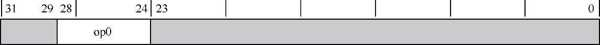
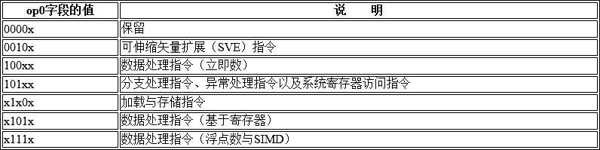
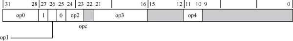
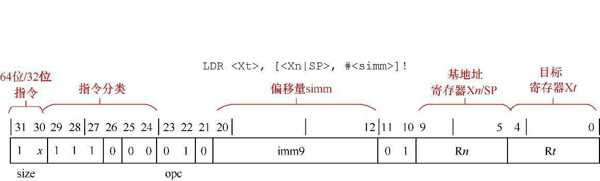

# 指令格式

A64 指令集中**每条指令的宽度**为 32 位, 其中第 24～28 位用来识别指令的分类, 如下图所示.

op0 字段的值见表:

表中, x 表示该位可以是 1 或者 0. 以加载与存储指令为例, 第 25 位必须为 0, 第 27 位为 1, 其他 3 位可以是 0 或者 1.

当根据 op0 字段确定了指令的分类之后, 还需要进一步确定指令的细分类别. 以加载与存储指令为例, 指令格式如图所示.

如上图, 加载与存储指令格式可以细分为 op0, op1, op2, op3 以及 op4 这几个字段. 这些字段不同的编码又可以对加载与存储指令继续细分, 如下表所示.

加载与存储指令的分类:

# 为什么指令宽度只有 32 位?

A64 指令集支持 **64** 位宽的**数据和地址寻址**, 为什么**指令的编码宽度**只有 **32** 位?

看似矛盾, 实则通过架构的巧妙设计实现了高效性和灵活性. 原因如下:

1. **指令编码** 与 **数据/地址宽度** 的解耦

* **指令编码宽度** (32 位) 与 **数据/地址宽度** (64 位) 是两种不同的概念:

  * **指令编码宽度**: 决定**单条指令的长度**和复杂度, 影响指令的**存储**, **解码效率**和**流水线设计**.

  * **数据/地址宽度**: 决定 CPU 处理的**数据范围**和**内存寻址空间**.

* **64 位数据/地址**的支持通过 **寄存器和地址生成逻辑** 实现, 而**非直接依赖指令编码的宽度**. 例如:

  * **寄存器扩展**: A64 使用 64 位的**通用寄存器**(如 `X0 - X30`), 可直接存储 64 位数据或地址.

  * **地址计算**: 64 位地址通过**基址寄存器** (`Xn`) 与**偏移量**的组合生成, 而**非**在指令中**直接编码 64 位地址**.

2. **32 位指令编码的优势**

* **指令密度与效率**:

  * **32 位固定长度指令**在 **代码密度** (占用内存少) 和 **解码效率** (硬件实现简单) 之间取得了平衡.

  * 若指令编码过长(如 64 位), 会显著增加代码体积, 降低指令缓存的利用率, 影响性能.

* **硬件复杂度控制**:

  * 固定长度的 32 位指令简化了解码逻辑, 便于流水线设计和超标量执行(如乱序执行, 多发射).

  * 可变长度指令 (如 x86) 需要复杂的状态机解码, 而固定长度指令 (如 ARM) 更适应高性能低功耗场景.

3. **64 位数据与地址的兼容性实现**

* **64 位数据的处理**:

  * A64 提供**专门的指令**操作 **64 位寄存器** (如 `ADD X0, X1, X2`), 通过指令的**操作码**(Opcode) 区分 **32** 位 (`Wn`) 和 **64** 位 (`Xn`) 操作.

* **64 位地址的生成**:

  * 地址通常由 **基址寄存器** + **偏移量** 计算得到, **偏移量**在指令中编码为**有限的位数**(如 12 位或 24 位).

  * 若需访问超出偏移范围的地址, 可通过**多步操作** (如 MOV + ADD) 或大地址模型 (如 PC 相对寻址) 实现.

4. ARM 架构的历史与设计哲学

* 延续性设计:

  * ARM 的 32 位指令集 (A32/AArch32) 已广泛应用, A64 保持了 32 位编码的兼容性, 便于工具链 (编译器, 调试器) 过渡.

* 极简主义:

  * ARM 架构强调 **精简指令集** (RISC), 避免冗余设计. 32 位指令足以覆盖大多数操作, 特殊需求通过少量扩展指令(如 SIMD, 加密指令) 实现.

5. 与其他架构的对比

* x86-64:

  * x86 使用可变长度指令(1-15 字节), 虽灵活但解码复杂, 功耗和面积开销较大.

* RISC-V:

  * RISC-V 的 64 位指令集 (RV64) 同样采用 32 位固定长度编码, 与 A64 的设计理念相似.

**总结**

A64 通过以下方式实现 **32 位指令编码**支持 **64 位数据/地址**:

* 寄存器扩展(64 位寄存器存储数据和地址).

* 地址生成逻辑(基址 + 偏移, 无需全 64 位地址编码).

* 专用指令区分 32/64 位操作.

* 固定长度指令的高效解码和流水线设计.

这种设计在性能, 功耗, 代码密度和硬件复杂度之间实现了最佳权衡, 是 RISC 架构的经典范例.

因为 A64 指令集基于寄存器加载和存储的体系结构设计, 所有的数据加载, 存储以及处理都是在通用寄存器中完成的. ARM64 一共有 31 个通用寄存器, 即 X0~X30, 因此在指令编码中使用 5 位宽, 这样一共可以索引 32(2^5 = 32) 个通用寄存器. 另外, 在下面的条件下, 我们还可以描述第 31 个寄存器.

* 当使用寄存器作为基地址时, 把 SP(栈指针) 寄存器当作第 31 个通用寄存器.

* 当用作源寄存器操作数时, 把 XZR 当作第 31 个通用寄存器.

前变基模式的 LDR 指令的编码如图所示.

* 第 0～4 位为 R t 字段, 它用来描述目标寄存器 Xt , 可以从 X0～X30 中选择.

* 第 5～9 位为 R n 字段, 它用来描述基地址寄存器 Xn , 可以从 X0～X30 中选择, 也可以选择 SP 寄存器作为第 31 个寄存器.

* 第 12～20 位为 imm9 字段, 用于偏移量 simm.

* 第 21～29 位用于指令分类.

* 第 30～31 位为 size 字段, 当 size 为 0b11 时表示 64 位宽数据, 当 size 为 0b10 时表示 32 位宽数据.
