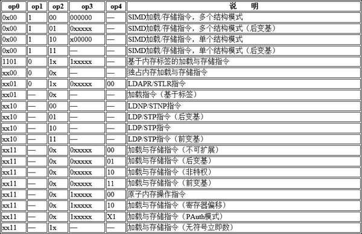
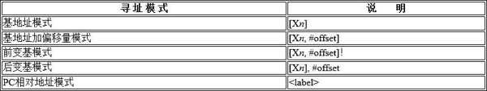
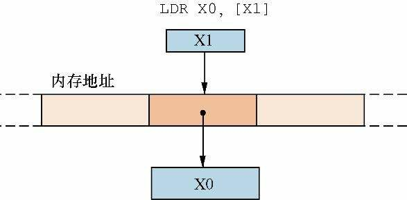

和早期的ARM体系结构一样，ARMv8体系结构也基于指令加载和存储的体系结构。 在这种体系结构下，所有的数据处理都需要在通用寄存器中完成，而不能直接在内存中完成。因此，首先把待处理数据从内存加载到通用寄存器，然后进行数据处理，最后把结果写入内存中。

加载与存储指令的格式如图所示.


如图所示, 加载与存储指令格式可以细分为 op0, op1, op2, op3 以及 op4 这几个字段. 这些字段不同的编码又可以对加载与存储指令继续细分, 如下表所示.

加载与存储指令的分类:



常见的内存加载指令是LDR指令，存储指令是STR指令。LDR和STR指令的基本格式如下。

```
LDR 目标寄存器, <存储器地址> //把存储器地址中的数据加载到目标寄存器中
STR 源寄存器, <存储器地址> //把源寄存器的数据存储到存储器中
```

在A64指令集中，加载和存储指令有多种寻址模式，如表所示。



# 基于基地址的寻址模式

基地址模式首先使用寄存器的值来表示一个地址，然后把这个内存地址的内容加载到通用寄存器中。基地址加偏移量模式是指在基地址的基础上再加上偏移量，从而计算内存地址，并且把这个内存地址的值加载到通用寄存器中。偏移量可以是正数，也可以是负数。

常见的指令格式如下。

## 基地址模式

以下指令以Xn 寄存器中的内容作为内存地址，加载此内存地址的内容到Xt 寄存器，如图所示。

```
LDR Xt, [Xn]
```



其机器码编码为 **32 位**，具体指令编码格式如下：

| 位域      | 31-24       | 23-21 | 20    | 19-12     | 11-5     | 4-0      |
|-----------|-------------|-------|-------|-----------|----------|----------|
| **字段**  | 操作码      | 类型  | 符号位 | 立即数偏移 | 基址寄存器 `Xn` | 目标寄存器 `Xt` |
| **值**    | `11111000`  | `010` | `1`   | `0`       | `Xn` 编号 | `Xt` 编号 |

* **操作码（31-24位）**
  - `11111000`（十六进制 `0xF8`）：标识这是一条 **LDR (Load Register)** 指令。

* **类型与符号位（23-20位）**
  - `0101`：
    - `010` 表示 **64 位加载**（`XS` 标志）。
    - `1` 表示 **符号扩展**（实际在 LDR 中固定为 1）。

* **立即数偏移（19-12位）**
  - `000000000000`：偏移量为 0（即 `[Xn]` 无偏移）。
  - 若需偏移，需按 **左移 3 位**（即 `imm12 * 8`）编码。

* **寄存器编号（11-0位）**
   - `Xn`（5 位）：基址寄存器编号（如 `X1` 对应 `00001`）。
   - `Xt`（5 位）：目标寄存器编号（如 `X0` 对应 `00000`）。

**示例：LDR X0, [X1] 的机器码**

* **寄存器编号**：
  - `Xn = X1` → 编号 `00001`（5 位）。
  - `Xt = X0` → 编号 `00000`（5 位）。

* **完整二进制编码**：

  ```
   11111000 01010000 00000000 00100000
  ```

* **十六进制表示**：
  - 分段转换：`F8 40 00 20` → **`0xF8400020`**。

* **各个 opx 数值**
  * op0(`[31:28]`): 1111
  * op1(`[26]`): 0
  * op2(`[24:23]`): 00
  * op3(`[21:16]`): 010000
  * op4(`[11:10]`): 00
  * 类别就是: **加载与存储指令(不可扩展)**

**通用公式**

对于 `LDR Xt, [Xn]`，机器码可通过以下方式计算：

```python
machine_code = 0xF8400000 | (Xn << 5) | Xt
```

- **示例**：
  - `LDR X2, [X3]`：`Xn=3 (00011)`, `Xt=2 (00010)` → `0xF8400062`.


**总结**

- **指令码**：`0xF86(Xn)(Xt)`，其中 `Xn` 和 `Xt` 为寄存器编号的十六进制值。

- **特点**：通过 **基址寄存器 + 零偏移** 实现内存访问，32 位编码高效支持 64 位操作。

- **扩展**：若需偏移（如 `LDR Xt, [Xn, #imm]`），需调整立即数字段（`imm12`）。

以下指令把Xt 寄存器中的内容存储到Xn 寄存器的内存地址中。

```
STR Xt, [Xn]
```

## 基地址加偏移量模式

以下指令把X n 寄存器中的内容加一个偏移量（offset必须是8的倍数）​，以相加的结果作为内存地址，加载此内存地址的内容到X t 寄存器，如图3.5所示。


## 基地址扩展模式

基地址扩展模式的命令如下。


# 变基模式


## 前变基模式

## 后变基模式

# PC 相对地址模式

# LDR 伪指令

