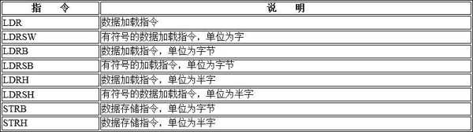
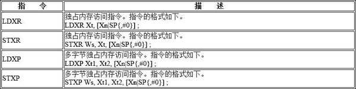
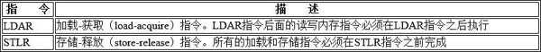
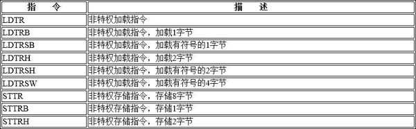

加载与存储指令有多种不同的变种.

# 不同位宽的加载与存储指令

LDR 和 STR 指令根据不同的数据位宽有多种变种, 如表所示.

# 不可扩展的加载和存储指令

LDR 指令中的基地址加偏移量模式为可扩展模式, 即偏移量按照数据大小来扩展并且是正数, 取值范围为 0～32 760.A64 指令集还支持一种不可扩展模式的加载和存储指令, 即偏移量只能按照字节来扩展, 还可以是正数或者负数, 取值范围为−256～255, 例如 LDUR 指令. 因此, 可扩展模式和不可扩展模式的区别在于是否按照数据大小来进行扩展, 扩大寻址范围.

LDUR 指令的格式如下.

# 多字节内存加载和存储指令

A32 指令集提供 LDM 和 STM 指令来实现多字节内存加载与存储, 而 A64 指令集不再提供 LDM 和 STM 指令, 而提供 LDP 和 STP 指令. LDP 和 STP 指令支持 3 种寻址模式.

## 基地址偏移量模式

## 前变基模式

## 后变基模式

# 独占内存访问指令

RMv8 体系结构提供独占内存访问 (exclusive memory access) 的指令. 在 A64 指令集中, LDXR 指令尝试在内存总线中申请一个独占访问的锁, 然后访问一个内存地址. STXR 指令会往刚才 LDXR 指令已经申请独占访问的内存地址中写入新内容. LDXR 和 STXR 指令通常组合使用来完成一些同步操作, 如 Linux 内核的自旋锁.

另外, ARMv7 和 ARMv8 还提供多字节独占内存访问指令, 即 LDXP 和 STXP 指令.

独占内存访问指令如下表所示.

# 隐含加载 - 获取 / 存储 - 释放内存屏障原语

ARMv8 体系结构还提供一组新的加载和存储指令, 其中包含了内存屏障原语, 如表所示.

# 非特权访问级别的加载和存储指令

ARMv8 体系结构中实现了一组非特权访问级别的加载和存储指令, 它适用于在 EL0 (非特权访问级别)进行的访问, 如表 3.8 所示.

当 PSTATE 寄存器中的 UAO 字段为 1 时, 在 EL1 和 EL2 执行这些非特权指令的效果和执行特权指令是一样的, 这个特性是在 ARMv8.2 的扩展特性中加入的.
