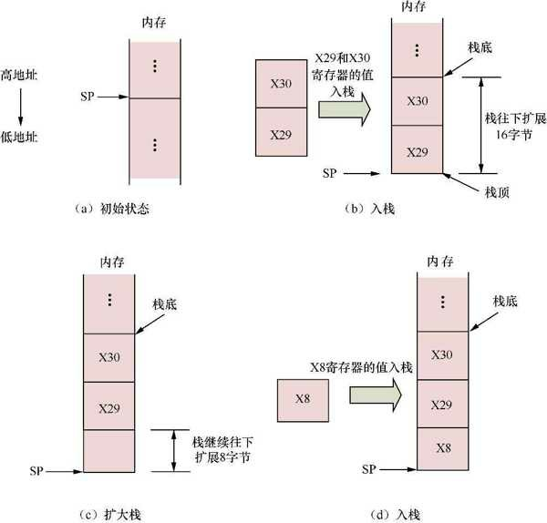
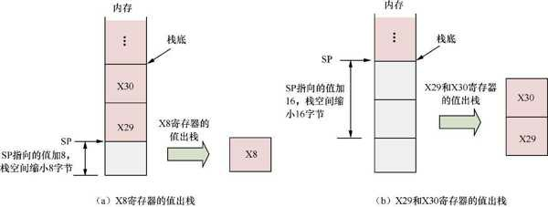

栈 (stack) 是一种后进先出的数据存储结构. 栈通常用来保存以下内容.

●临时存储的数据, 例如局部变量等.

●参数. 在函数调用过程中, 如果传递的参数少于或等于 8 个, 那么使用 X0~X7 通用寄存器来传递. 当参数多于 8 个时, 则需要使用栈来传递.

通常, 栈是一种从高地址往低地址扩展 (生长) 的数据存储结构. 栈的起始地址称为栈底, 栈从高地址往低地址延伸到某个点, 这个点称为栈顶. 栈需要一个指针来指向栈最新分配的地址, 即指向栈顶. 这个指针是栈指针(Stack Pointer,SP)​. 把数据往栈里存储称为入栈, 从栈中移除数据称为出栈. 当数据入栈时, SP 减小, 栈空间扩大; 当数据出栈时, SP 增大, 栈空间缩小.

栈在函数调用过程中起到非常重要的作用, 包括存储函数使用的局部变量, 传递参数等. 在函数调用过程中, 栈是逐步生成的. 为单个函数分配的栈空间, 即从该函数栈底 (高地址) 到栈顶 (低地址) 这段空间, 称为栈帧(stack frame)​.

A32 指令集提供了 PUSH 与 POP 指令来实现入栈和出栈操作, 不过, A64 指令集已经去掉了 PUSH 和 POP 指令. 我们需要使用本章介绍的加载与存储指令来实现入栈和出栈操作.

下面的代码片段使用加载与存储指令来实现入栈和出栈操作.

```assembly
1    .globalmain
2    main:
3        /* 栈往下扩展 16 字节 */
4        stp x29, x30, [sp, #-16]!
5
6        /* 把栈继续往下扩展 8 字节 */
7        add sp, sp, #-8
8
9        mov x8, #1
10
11       /*x8 保存到 SP 指向的位置上 */
12       str x8, [sp]
13
14       /* 释放刚才扩展的 8 字节的栈空间 */
15       add sp, sp, #8
16
17       /*main 函数返回 0*/
18       mov w0, 0
19
20       /* 恢复 x29 和 x30 寄存器的值, 使 SP 指向原位置 */
21       ldp x29, x30, [sp], #16
22       ret
```

上述 main 汇编函数演示了入栈和出栈的过程.

入栈:



在第 2 行中, 栈还没有申请空间, 如图 (a) 所示.

在第 4 行中, 这里使用前变基模式的 STP 指令, 首先 SP 寄存器的值减去 16, 相当于把栈空间往下扩展 16 字节, 然后把 X29 和 X30 寄存器的值压入栈, 其中 X29 寄存器的值保存到 SP 指向的地址中, X30 寄存器的值保存到 SP 指向的值加 8 对应的内存地址中, 如图 (b) 所示.

在第 7 行中, 把 SP 寄存器的值减去 8, 相当于把栈的空间继续往下扩展 8 字节, 如图 (c) 所示.

在第 12 行中, 把 X8 寄存器的值保存到 SP 指向的地址中, 如图 (d) 所示. 此时, 已经把 X29,X30 以及 X8 寄存器的值全部压入栈, 完成了入栈操作.

接下来是出栈操作了.

出栈:



在第 15 行中, 使 SP 指向的值加 8, 相当于把栈空间缩小, 也就是释放了刚才申请的 8 字节空间的栈, 这样把 X8 寄存器的值弹出栈, 如图 (a) 所示.

在第 21 行中, 使用 LDP 指令把 X29 和 X30 寄存器中的值弹出栈. 这是一条后变基模式的加载指令, 加载完成之后会修改 SP 指向的值, 让 SP 指向的值加上 16 从而释放栈空间, 如图 (b) 所示.
