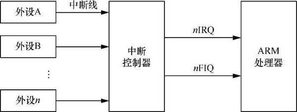

在 ARMv8 体系结构中, 异常和中断都属于异常处理.

# 异常类型

## 中断

在 ARM64 处理器中, 中断请求分成**普通中断请求** (`Interrupt Request`, IRQ) 和**快速中断请求** (`Fast Interrupt Request`, FIQ) 两种. 其中, FIQ 的优先级要高于 IRQ. 在**芯片内部**, 分别有连接到处理器内部的 IRQ 和 FIQ **两根中断线**. 通常系统级芯片内部会有一个**中断控制器**, 众多的外部设备的中断引脚会连接到中断控制器, 由中断控制器负责中断优先级调度, 然后发送中断信号给 ARM 处理器. 中断模型如图所示.

外设中发生了重要的事情之后, 需要通知处理器, 中断发生的时刻与当前正在执行的指令无关, 因此中断的发生时间点是异步的. 对于处理器来说, 不得不停止当前正在执行的指令来处理中断. 在 ARMv8 体系结构中, 中断属于**异步模式**的异常.

## 中止

中止主要有**指令中止** (instruction abort) 和**数据中止** (data abort) 两种. 它们通常是指**访问内存地址时发生了错误**(如缺页等)​, 处理器内部的 MMU 捕获这些错误并且报告给处理器.

**指令中止**是指当处理器尝试**执行某条指令**时发生了错误, 而**数据中止**是指使用加载或者存储指令读写外部存储单元时发生了错误.

## 复位

复位 (reset) 操作是**优先级最高**的一种异常处理. 复位操作通常用于让 CPU 复位引脚产生复位信号, 让 CPU 进入复位状态, 并重新启动.

## 系统调用

ARMv8 体系结构提供了 3 种软件产生的异常和 3 种系统调用.

系统调用允许软件主动地通过特殊指令请求更高异常等级的程序所提供的服务.

* **SVC** 指令: 允许**用户态**应用程序请求操作系统**内核**的服务.

* **HVC** 指令: 允许**客户操作系统** (guest OS) 请求**虚拟机监控器** (hypervisor) 的服务.

* **SMC** 指令: 允许**普通世界** (normal world) 中的程序请求**安全监控器** (secure monitor) 的服务.

# 异常等级

在操作系统里, 处理器运行模式通常分成两种: 一种是**特权模式**, 另一种是**非特权模式**. 操作系统内核运行在特权模式, 访问系统的所有资源; 而应用程序运行在非特权模式, 它不能访问系统的某些资源, 因为它权限不够.

除此之外, ARM64 处理器还支持虚拟化扩展以及安全模式的扩展. ARM64 处理器支持 **4 种特权模式**, 这些特权模式在 ARMv8 体系结构手册里称为**异常等级**(Exception Level, EL)​.

* EL0 为**非特权模式**, 用于运行**应用程序**.

* EL1 为**特权模式**, 用于运行**操作系统内核**.

* EL2 用于运行**虚拟化管理程序**.

* EL3 用于运行**安全世界的管理程序**.

# 同步异常和异步异常

在 ARMv8 体系结构里, 异常分成**同步异常**和**异步异常**两种.

同步异常是指处理器执行某条指令而直接导致的异常, 往往需要在异常处理函数里处理该异常之后, **处理器才能继续执行**. 例如, 当数据中止时, 我们知道发生数据异常的地址, 并且在异常处理函数中修改这个地址.

常见的同步异常如下.

* 尝试访问一个异常等级不恰当的寄存器.

* 尝试执行关闭或者没有定义 (undefined) 的指令.

* 使用没有对齐的 SP.

* 尝试执行与 PC 指针没有对齐的指令.

* 软件产生的异常, 如执行 SVC,HVC 或 SMC 指令.

* 地址翻译或者权限等导致的数据异常.

* 地址翻译或者权限等导致的指令异常.

* 调试导致的异常, 如断点异常, 观察点异常, 软件单步异常等.

而异步异常是指异常触发的原因与处理器当前正在执行的指令无关的异常, 中断属于异步异常的一种. 因此, 指令异常和数据异常称为同步异常, 而**中断**称为**异步异常**.

常见的异步异常包括**物理中断**和**虚拟中断**.

* 物理中断分为 3 种, 分别是 SError,IRQ,FIQ.

* 虚拟中断分为 3 种, 分别是 vSError,vIRQ,vFIQ.
