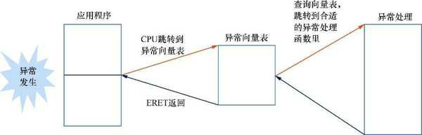
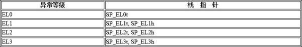
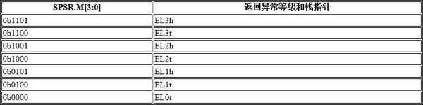

# 异常入口

当一个异常发生时, CPU 内核能感知异常发生, 而且会生成一个目标异常等级(target exception level)​.CPU 会自动做如下一些事情.

* 把 PSTATE 寄存器的值保存到对应目标异常等级的 SPSR_EL x 中.

* 把返回地址保存在对应目标异常等级的 ELR_EL x 中.

* 把 PSTATE 寄存器里的 D , A , I , F 标志位都设置为 1, 相当于把调试异常, SError,IRQ 以及 FIQ 都关闭.

* 对于同步异常, 要分析异常的原因, 并把具体原因写入 ESR_EL x .

* 切换 SP 寄存器为目标异常等级的 SP_El x 或者 SP_EL0 寄存器.

* 从异常发生现场的异常等级切换到对应目标异常等级, 然后跳转到异常向量表里.

上述是 ARMv8 处理器检测到异常发生后自动做的事情. 操作系统需要做的事情是从中断向量表开始, 根据异常发生的类型, 跳转到合适的异常向量表. 异常向量表的每个项都会保存一条跳转指令, 然后跳转到恰当的异常处理函数并处理异常.

# 异常返回

当操作系统的异常处理完成后, 执行一条 ERET 指令即可从异常返回. 这条指令会自动完成如下工作.

* 从 ELR_EL x 中恢复 PC 指针.

* 从 SPSR_EL x 中恢复 PSTATE 寄存器的状态.

中断处理过程是关闭中断的情况下进行的, 那中断处理完成后什么时候把中断打开呢?

当中断发生时, CPU 会把 PSTATE 寄存器的值保存到对应目标异常等级的 SPSR_EL x 中, 并且把 PSTATE 寄存器里的 D , A , I , F 标志位都设置为 1, 这相当于把本地 CPU 的中断关闭.

当中断处理完成后, 操作系统调用 ERET 指令返回中断现场, 并且会把 SPSR_EL x 恢复到 PSTATE 寄存器中, 这相当于把中断打开.

异常触发与返回的流程如图所示.

# 异常返回地址

以下两个寄存器存放了不同的返回地址.

* X30 寄存器(又称为 LR)​, 存放的是子函数的返回地址, 一般是用于完成函数调用的, 可以使用 RET 指令来返回父函数.

* ELR_EL x , 存放的异常返回的地址, 即发生异常那一瞬间的地址, 它可能是在用户空间中的地址, 也可能是在内核空间中的地址, 不管它在哪个空间, 执行 ERET 指令就可以返回异常现场.

既然 ELR_El x 保存了异常返回地址, 那么这个返回地址是指向发生异常时的指令还是下一条指令呢? 我们需要区分不同的情况.

对于异步异常(中断)​, 返回地址指向第一条还没执行或由于中断没有成功执行的指令.

对于不是系统调用的同步异常, 比如数据异常, 访问了没有映射的地址等, 返回的是触发同步异常的那条指令. 例如, 通过 LDR 指令访问一个地址, 这个地址没有建立地址映射. CPU 访问这个地址时触发了一个数据异常, 陷入内核态. 在内核态里, 操作系统把这个地址映射建立起来, 然后再返回异常现场. 此时, CPU 会继续执行这条 LDR 指令. 刚才因为地址没有映射而触发异常, 异常处理中修复了这个映射关系, 所以 LDR 可以访问这个地址.

系统调用返回的是系统调用指令 (例如 SVC 指令) 的下一条指令.

# 异常处理路由

异常处理路由指的是当异常发生时应该在哪个异常等级处理. 下面是异常处理路由的一些规则.

* 当异常发生时, 根据系统的配置, 例如 SCR_EL3 以及 HCR_EL2 里相应的字段, 异常可以在当前的异常等级里处理, 也可以陷入更高优先级的异常等级里并处理.

* EL0 不能用来处理异常, EL0 是最低权限的异常等级, 一般用来运行用户态程序.

* 在一些情况下, 同步异常可能会在当前异常等级里处理, 例如在内核 (EL1) 中发生缺页错误, 通常不会改变异常等级. 另一些情况下, 同步异常可能会导致陷入更高异常等级, 例如在开启了虚拟化时, 虚拟机访问尚未映射的客户物理地址 (Guest Physical Address,GPA) 会发生二阶段页表缺页错误, 此时会从 EL1 陷入 EL2, 由虚拟机监控器处理该异常.

* 对于中断, 我们可以路由到 EL1,EL2 甚至 EL3 并处理, 但是需要配置 HCR_EL2 以及 SCR_EL3 相关寄存器.

SCR_EL3 是安全世界中 EL3 的配置寄存器, 下面介绍其中与异常处理路由相关的几个字段.

NS 字段 (`Bit[0]`​) 的含义如下.

* 0 表示 EL0 和 EL1 都处于安全状态(secure state)​.

* 1 表示低于 EL3 的异常级别处于非安全状态, 因此来自这些异常级别的内存访问指令不能访问安全内存.

IRQ 字段 (`Bit[1]`​) 的含义如下.

* 0 表示来自低于 EL3 的异常级别的 IRQ 不会路由到 EL3.

* 1 表示来自低于 EL3 的异常级别的 IRQ 会路由到 EL3.

FIQ 字段 (`Bit[2]`​) 的含义如下.

* 0 表示来自低于 EL3 的异常级别的 FIQ 不会路由到 EL3.

* 1 表示来自低于 EL3 的异常级别的 FIQ 会路由到 EL3.

EA 字段 (`Bit[3]`​) 的含义如下.

* 0 表示来自低于 EL3 的异常级别的外部中止和 SError 中断不会路由到 EL3. 来自 EL3 的外部中止也不会路由到 EL3, 而来自 EL3 的 SError 中断会路由到 EL3.

* 1 表示来自低于 EL3 的异常级别的外部中止和 SError 中断会路由到 EL3.

RW 字段 (`Bit[10]`​) 的含义如下.

* 0 表示低于 EL3 的异常级别都在 AArch32 执行状态下.

* 1 表示低于 EL3 的异常级别都在 AArch64 执行状态下.

HCR_EL2 寄存器是虚拟管理程序配置寄存器. 下面介绍其中与异常处理路由相关的几个字段.

RW 字段 (`Bit[31]`​) 的含义如下.

* 0 表示低于 EL2 的异常级别都在 AArch32 执行状态下.

* 1 表示 EL1 在 AArch64 执行状态下, 而 EL0 则需要根据 PSTATE.nRW 字段来判断.

TGE 字段 (`Bit[27]​`) 的含义如下.

* 0 表示对 EL0 的执行没有影响.

* 1 表示如果系统实现了 EL2, 那么所有原本要路由到 EL1 的异常都将路由到 EL2. 如果系统没有实现 EL2, 那么对 EL0 的异常没有影响. TGE 字段主要用在虚拟化主机扩展 (Virtualization Host Extention,VHE) 中.

AMO 字段 (`Bit[5]`​) 的含义如下.

* 0 表示来自低于 EL2 的异常级别的 SError 中断不会路由到 EL2.

* 1 表示来自低于 EL2 的异常级别的 SError 中断会路由到 EL2.

* 当 TGE 字段为 1 并且实现了 EL2 时, 不管 AMO 字段的值是多少, 都会路由到 EL2.

IMO 字段 (`Bit[4]​`) 的含义如下.

* 0 表示来自低于 EL2 的异常级别的 IRQ 不会路由到 EL2.

* 1 表示来自低于 EL2 的异常级别的 IRQ 会路由到 EL2.

* 当 TGE 字段为 1 并且实现了 EL2 时, 不管 IMO 字段的值是多少, 都会路由到 EL2.

FMO 字段 (`Bit[3]`​) 的含义如下.

* 0 表示来自低于 EL2 的异常级别的 FIQ 不会路由到 EL2.

* 当 TGE 字段为 1 并且实现了 EL2 时, 不管 FMO 字段的值是多少, 都会路由到 EL2.

# 栈的选择

在 ARMv8 体系结构里, 每个异常等级都有对应的栈指针 (SP) 寄存器. 例如, EL0 有一个对应的栈指针寄存器 SP_EL0, 同理, EL1 也有一个对应的栈寄存器 SP_EL1. 当 CPU 运行在任何一个异常等级时, 它可以配置 SP 使用 SP_EL0 或者 SP_EL x .

我们可以通过 SPSel 寄存器来配置 SP.SPSel 寄存器中的 SP 字段设置为 0 表示在所有的 EL 中使用 SP_EL0 作为栈指针寄存器, 设置为 1 表示使用 SP_EL x 作为栈指针寄存器. 当配置 SP_EL0 作为栈指针时, 我们可以使用后缀 "t" 来标记. 例如, 如果在 EL1 里使用 SP_EL0 作为栈指针, 我们可以使用 "SP_EL1t" 来表示.

当配置 SP_EL x 作为栈指针时, 我们可以使用后缀 "h" 来标记. 例如, 如果在 EL1 里使用 SP_EL1 作为栈指针, 我们可以使用 "SP_EL1h" 来表示, 如表所示.

栈必须按 16 字节对齐, 否则在函数调用时会出现问题, 因为函数调用的过程会使用栈. 此外, 我们可以通过配置寄存器来让 CPU 自动检测栈指针是否对齐. 如果没有对齐, 则触发一个 SP 对齐错误(SP alignment fault)​.

当异常发生时, SP 应该指向哪里? 其实, 当异常发生时, CPU 会跳转到目标异常等级. 此时, CPU 会自动选择 SP_EL x . 注意, CPU 会自动根据目标异常等级选择栈指针, 例如, 如果 CPU 正在 EL0 中运行用户空间进程, 突然触发了一个中断, CPU 就会跳转到 EL1 来处理这个中断, 因此 CPU 会自动选择 SP_EL1 指向的栈空间.

操作系统负责分配和保证每个异常等级对应的栈空间是可用的. 以 BenOS 的实验代码为例, 在汇编代码准备跳转到 C 语言的 `main()` 函数之前, 我们需要分配栈的空间, 比如 4 KB 或者 8KB, 然后设置 SP, 跳转到 C 语言的 `main()` 函数.

# 异常处理的执行状态

如果异常发生并且要切换到高级别的异常等级(例如从 EL0 切换到 EL1)​, 那么跳转到 EL1 之后, CPU 运行在哪个执行状态下呢? 是 AArch64 执行状态还是 AArch32 执行状态呢?

HCR_EL2 寄存器中有一个 RW 域(`Bit[31]`​)​, 它记录了异常发生后 EL1 要处在哪个执行状态下.

* 1 表示在 AArch64 执行状态下.

* 0 表示在 AArch32 执行状态下.

其实, 当异常发生之后执行状态是可以发生改变的. 例如, 在一个 64 位的系统里, 内核在 AArch64 执行状态下. 如果一个 32 位的应用程序在运行时触发了一个中断, 那么它会陷入内核态里, 因此, 在 AArch64 执行状态下处理这个中断.

# 异常返回的执行状态

当异常处理结束之后, 调用 ERET 指令返回时要不要切换执行模式呢? 这里需要看 SPSR 的相关记录.

* `SPSR.M[3:0]` 字段记录了返回哪个异常等级, 如下表所示.

* `SPSR.M[4]` 字段记录了返回哪个执行状态.

  * 0: 表示 AArch64 执行状态.

  * 1: 表示 AArch32 执行状态.

