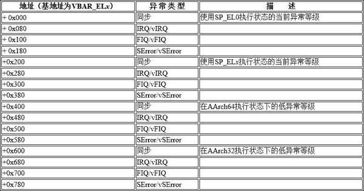

# ARMv8 异常向量表

当异常发生时, 处理器必须跳转和执行与异常相关的处理指令. 异常相关的处理指令通常存储在内存中, 这个存储位置称为异常向量. 在 ARM 体系结构中, 异常向量存储在一个表中, 称为异常向量表. 在 ARMv8 体系结构中, 每个异常级别都有自己的向量表, 即 EL3,EL2 和 EL1 各有一个异常向量表.

ARMv7 体系结构的异常向量表比较简单, 每个表项是 4 字节, 每个表项里存放了一条跳转指令. 但是 ARMv8 的异常向量表发生了变化, 每一个表项是 128 字节, 这样可以存放 32 条指令. 注意, ARMv8 指令集支持 64 位指令集, 但是每一条指令的位宽是 32 位, 而不是 64 位. ARMv8 体系结构的异常向量表如表 11.3 所示.



在表 11.3 中, 异常向量表存放的基地址可以通过向量基址寄存器 (Vector Base Address Register,VBAR) 来设置.

处理器在内核态 (EL1 异常等级) 中触发了 IRQ, 并且系统通过配置 SPSel 寄存器来使用 SP_EL x 寄存器作为栈指针, 处理器会跳转到 "VBAR_EL1 + 0x280" 地址处的异常向量中. 如果系统通过配置 SPSel 寄存器来使用 SP_EL0 寄存器作为栈指针, 那么处理器会跳转到 "VBAR_EL1 + 0x80" 地址处的异常向量中.

处理器在用户态 (EL0) 执行时触发了 IRQ, 假设用户态的执行状态为 AArch64 并且该异常会陷入 EL1 中, 那么处理器会跳转到 "VBAR_EL1 + 0x480" 地址处的异常向量中. 假设用户态的执行状态为 AArch32 并且该异常会陷入 EL1 中, 那么处理器会跳转到 "VBAR_EL1 + 0x680" 地址处的异常向量中.

# Linux 5.0 内核的异常向量表

Linux 5.0 内核中关于异常向量表的描述在 `arch/arm64/kernel/entry.S` 汇编文件中.

```assembly
/*
 * 异常向量表
 * Exception vectors.
 */
	.pushsection ".entry.text", "ax"

	.align	11
ENTRY(vectors)
    # EL1t 模式下的异常向量
	kernel_ventry	1, sync_invalid			// Synchronous EL1t
	kernel_ventry	1, irq_invalid			// IRQ EL1t
	kernel_ventry	1, fiq_invalid			// FIQ EL1t
	kernel_ventry	1, error_invalid		// Error EL1t
    # EL1h 模式下的异常向量
	kernel_ventry	1, sync				// Synchronous EL1h
	kernel_ventry	1, irq				// IRQ EL1h
	kernel_ventry	1, fiq_invalid			// FIQ EL1h
	kernel_ventry	1, error			// Error EL1h
    # 在 64 位 EL0 下的异常向量
	kernel_ventry	0, sync				// Synchronous 64-bit EL0
	kernel_ventry	0, irq				// IRQ 64-bit EL0
	kernel_ventry	0, fiq_invalid			// FIQ 64-bit EL0
	kernel_ventry	0, error			// Error 64-bit EL0

#ifdef CONFIG_COMPAT
    # 在 32 位 EL0 下的异常向量
	kernel_ventry	0, sync_compat, 32		// Synchronous 32-bit EL0
	kernel_ventry	0, irq_compat, 32		// IRQ 32-bit EL0
	kernel_ventry	0, fiq_invalid_compat, 32	// FIQ 32-bit EL0
	kernel_ventry	0, error_compat, 32		// Error 32-bit EL0
#else
	kernel_ventry	0, sync_invalid, 32		// Synchronous 32-bit EL0
	kernel_ventry	0, irq_invalid, 32		// IRQ 32-bit EL0
	kernel_ventry	0, fiq_invalid, 32		// FIQ 32-bit EL0
	kernel_ventry	0, error_invalid, 32		// Error 32-bit EL0
#endif
END(vectors)
```

上述异常向量表的定义和表 11.3 是一致的. 其中 align 是一条伪指令, align 11 表示按照 `2^11` 字节 (即 2048 字节) 来对齐.

kernel_ventry 是一个宏, 它实现在同一个文件中, 简化后的代码片段如下.

```assembly

	.macro kernel_ventry, el, label, regsize = 64
	.align 7
    sub	sp, sp, #S_FRAME_SIZE
    b	el\()\el\()_\label
    .endm
```

align 7 表示按照 `2^7` 字节 (即 128 字节) 来对齐.

sub 指令用于让 sp 减去一个 S_FRAME_SIZE, 其中 S_FRAME_SIZE 称为寄存器框架大小, 也就是 pt_regs 数据结构的大小.

```cpp
// arch/arm64/kernel/asm-offsets.c
  DEFINE(S_FRAME_SIZE,		sizeof(struct pt_regs));
```
