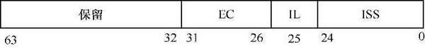
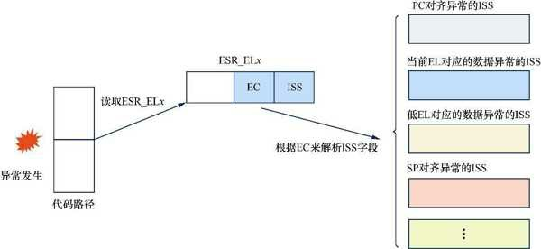
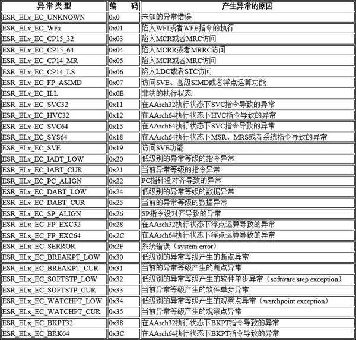
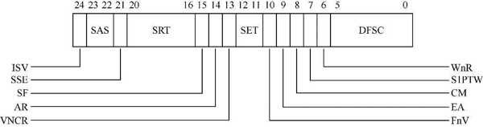
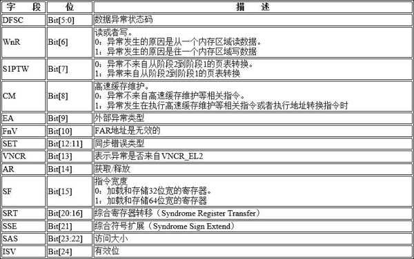
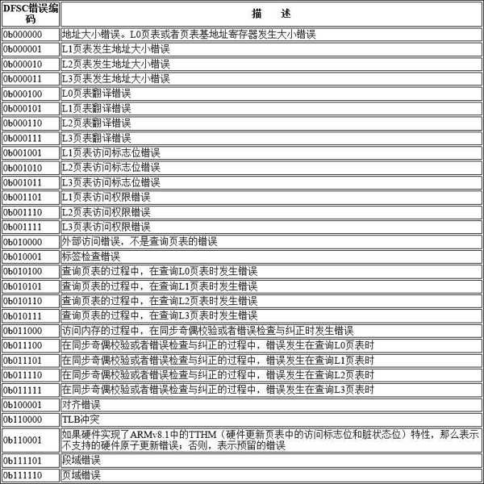

ARMv8 体系结构中有一个与访问失效相关的寄存器——异常综合信息寄存器(Exception Syndrome Register,ESR)​.

ESR_EL x 如图所示.

ESR_EL x 一共包含如下 4 个字段.

* Bit[63:32]​: 保留的位.

* Bit[31:26]​: 表示异常类(Exception Class,EC)​, 这个字段指示发生的异常的分类, 同时用来索引 ISS 字段(Bit[24:0]​)​.

* Bit[25]​: 表示同步异常的指令长度(Instruction Length,IL)​.

* Bit[24:0]​: 具体的异常指令综合 (Instruction Specific Syndrome,ISS) 编码信息. 这个异常指令编码依赖异常类型, 不同的异常类型有不同的编码格式.

当异常发生时, 软件通过读取 ESR_EL x 可以知道当前发生异常的类型, 然后再解析 ISS 字段. 不同的异常类型有不同的 ISS 编码, 需要根据异常类型解析 ISS 字段, 如图所示.

ESR_EL x 的查询过程:

# 异常类型

如表所示, ESR 支持几十种不同的异常类型.

# 数据异常

ESR 中的 ISS 字段根据异常类型有不同的编码方式.

对于数据异常, 例如上表中的 ESR_EL x _EC_DABT_LOW 与 ESR_EL x _EC_DABT_CUR,ISS 表的编码方式如图所示.

ISS 表中重要的字段如表.

其中, DFSC 字段包含了具体数据异常的状态, 如访问权限错误还是页表翻译错误等.

DFSC 错误编码如表所示.

