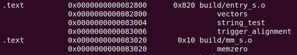

# 从 EL2 切换到 EL1

树莓派 4B 上电复位时, 运行在最高异常等级——EL3, 经过固件的初始化, 从 GPU 固件 (start4.elf) 跳转到 BenOS 入口地址 0x80000 时, 异常等级已经从 EL3 切换到 EL2 了. 那么在 BenOS 的启动汇编中, 我们需要把 EL2 切换到 EL1 里.

在从 EL2 切换到 EL1 的过程中, 我们需要了解几个相关的寄存器.

1. HCR_EL2

HCR_EL2 是虚拟化管理软件配置寄存器, 用来配置 EL2.HCR_EL2 中 RW 字段 (Bit[31]​) 用来控制低异常等级的执行状态.

RW 字段的含义如下.

* 0: 表示 EL0 和 EL1 都在 AArch32 执行状态下.

* 1: 表示 EL1 的执行状态为 AArch64, 而 EL0 的执行状态由 PSTATE.nRW 字段来确定.

2. SCTLR_EL1

SCTLR_EL1 是系统控制器寄存器. 其中, 如下的几个字段与本次异常等级切换相关.

*  EE 字段(Bit[25]​)​: 用来设置 EL1 下数据访问的大小端, 也包括 MMU 中遍历页表的访问(阶段 1)​.

  * 0: 小端.

  * 1: 大端.

*  EOE 字段(Bit[24]​)​: 用来设置 EL0 下数据访问的大小端.

  * 0: 小端.

  * 1: 大端.

*  M 字段(Bit[0]​) : 用来使能 MMU, 主要是阶段 1 的 MMU 映射.

3. SPSR_EL

SPSR_EL2 主要是用来保存发生异常时的 PSTATE 寄存器. 其中, SPSR.M[3:0]字段记录了返回哪个异常等级.

4. ELR_EL2

ELR_EL2 主要用来保存异常返回的地址.

下面是从 EL2 切换到 EL1 的汇编代码.

```assembly
1    #define HCR_RW          (1 << 31)
2
3    #define SCTLR_EE_LITTLE_ENDIAN          (0 << 25)
4    #define SCTLR_EOE_LITTLE_ENDIAN         (0 << 24)
5    #define SCTLR_MMU_DISABLED   (0 << 0)
6    #define SCTLR_VALUE_MMU_DISABLED (SCTLR_MMU_DISABLED | SCTLR_EE_LITTLE_ENDIAN |
     SCTLR_EOE_LITTLE_ENDIAN )
7
8    #define SPSR_MASK_ALL (7 << 6)
9
10   #define SPSR_EL1h (5 << 0)
11   #define SPSR_EL2h (9 << 0)
12
13   #define SPSR_EL1 (SPSR_MASK_ALL | SPSR_EL1h)
14   #define SPSR_EL2 (SPSR_MASK_ALL | SPSR_EL2h)
15
16   el2_entry:
17         bl print_el
18
19         /* EL1 的执行状态设置为 AArch64 */
20         ldr x0, =HCR_RW
21         msr hcr_el2, x0
22
23         ldr x0, =SCTLR_VALUE_MMU_DISABLED
24         msr sctlr_el1, x0
25
26         ldr x0, =SPSR_EL1
27         msr spsr_el2, x0
28
29         adr x0, el1_entry
30         msr elr_el2, x0
31
32         eret
```

在第 1～14 行中, 定义相关寄存器, 例如 HCR_EL2,SCTLR_EL1 等.

在第 16～32 行中, 从 EL2 切换到 EL1.

在第 17 行中, print_el 用来输出当前异常等级, 这里仅仅用于调试.

在第 20～21 行中, 设置 HCR_EL2 的 RW 字段为 1, 表明 EL1 在 AArch64 执行状态下. 如果不设置这个 RW 字段, 程序有可能在运行时出错.

在第 23～24 行中, 设置系统的大小端, 关闭 MMU.

在第 26～27 行中, 设置 SPSR_EL2. 其中, SPSR_EL1 宏包括两部分, SPSR_MASK_ALL 表示会关闭系统 DAIF(关闭调试, 系统错误, IRQ 和 FIQ)​,SPSR_EL1h 表示异常返回时的执行等级为 EL1h.

在第 29～30 行中, 设置 EL1 的入口地址 (el1_entry 函数) 到 ELR_EL2 中. 当从 EL2 切换到 EL1 时, CPU 会根据 ELR_EL2 记录的地址来跳转.

在第 32 行中, ERET 指令实现异常返回.

从 EL2 切换到 EL1 其实也实现了一次异常返回. 下面总结一下从 EL2 切换到 EL1 的过程.

(1) 设置 HCR_EL2, 重要的是设置 RW 字段, 表示 EL1 要在哪个执行状态下.

(2) 设置 SCTLR_EL1, 需要设置大小端并关闭 MMU.

(3) 设置 SPSR_EL2, 设置 M 字段为 EL1h, 需要关闭 PSTATE 寄存器中的 D , A , I , F .

(4) 设置异常返回 ELR_EL2, 让其返回 el1_entry 汇编函数.

(5) 执行 ERET 指令来实现异常返回.

#　指令不对齐的同步异常处理

在本案例中, 我们在 BenOS 里制造一个指令不对齐访问的同步异常, 然后在异常处理中输出异常的类型, 出错的地址以及 ESR 的值.

我们首先需要在汇编代码中创建异常向量表, 这部分内容可参考 Linux 内核的实现.

异常向量表项只有 128 字节, 我们也需要让它按 128 字节对齐. 每个表项只包含一条跳转指令以及跳转目的地. el1_sync_invalid 函数的定义如下.

```assembly
el1_sync_invalid:
     inv_entry 1, BAD_SYNC
el1_irq_invalid:
     inv_entry 1, BAD_IRQ
el1_fiq_invalid:
     inv_entry 1, BAD_FIQ
el1_error_invalid:
     inv_entry 1, BAD_ERROR
el0_sync_invalid:
     inv_entry 0, BAD_SYNC
el0_irq_invalid:
     inv_entry 0, BAD_IRQ
el0_fiq_invalid:
     inv_entry 0, BAD_FIQ
el0_error_invalid:
     inv_entry 0, BAD_ERROR
```

上述代码使用 inv_entry 宏来表示.

```cpp
#define BAD_SYNC        0
#define BAD_IRQ         1
#define BAD_FIQ         2
#define BAD_ERROR       3

/*
   处理无效的异常向量
 */
      .macro inv_entry el, reason
      mov x0, sp
      mov x1, #\reason
      mrs x2, esr_el1
      b bad_mode
      .endm
```

inv_entry 宏读取当前 SP 的值, 读取 ESR_EL1 的值, 然后跳转到 bad_mode()函数里. bad_mode()函数是 C 语言函数, 只用来输出当前异常发生的信息, 例如异常类型(EC)​,FAR_EL1 以及 ESR_EL1 的值.

```cpp
static const char * const bad_mode_handler[] = {
     "Sync Abort",
     "IRQ",
     "FIQ",
     "SError"
};

void bad_mode(struct pt_regs *regs, int reason, unsigned int esr)
{
     printk("Bad mode for %s handler detected, far:0x%x esr:0x%x\n",
             bad_mode_handler[reason], read_sysreg(far_el1),
             esr);
}
```

要触发一个同步异常, 最简单的办法是制造一次对齐访问异常.

```assembly
.global string_test
string_test:
     .string "t"

.global trigger_alignment
trigger_alignment:
     ldr x0, =0x80002
     ldr x1, [x0]
     ret
```

符号 string_test 用来定义一个字符串, 这个字符串只有一个 "t" 字符. 紧接着是 trigger_alignment 函数, 这样可以制造出指令不对齐的访问. 我们也可以查看 benos.map 文件.

如下图所示, string_test 的链接地址为 0x83004,trigger_alignment 函数的链接地址为 0x83006, 这个地址不是按 4 字节对齐的. 由于 A64 指令集中的指令都是 32 位指令, 它们必须是按 4 字节对齐的, 因此触发了一个指令不对齐的异常.



下面是运行结果.

```shell
rlk@master:lab01$ make run
qemu-system-aarch64 -machine raspi4 -nographic -kernel benos.bin
Booting at EL2
Booting at EL1
Welcome BenOS!

BenOS image layout:
  .text.boot: 0x00080000 - 0x000800d8 (   216 B)
      .text: 0x000800d8 - 0x000832e0 ( 12808 B)
      .rodata: 0x000832e0 - 0x00083566 (   646 B)
      .data: 0x00083566 - 0x000838c0 (   858 B)
      .bss: 0x00083970 - 0x000a3d80 (132112 B)

Bad mode for Sync Abort handler detected, far:0x0 esr:0x2000000
```
