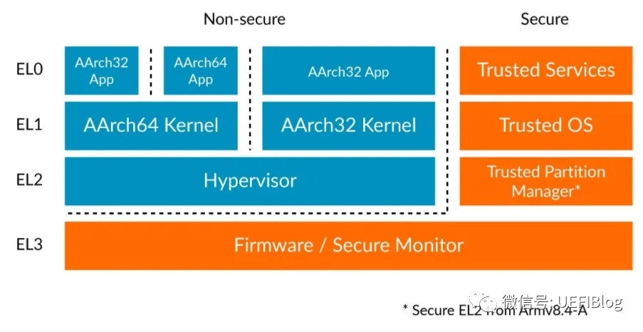
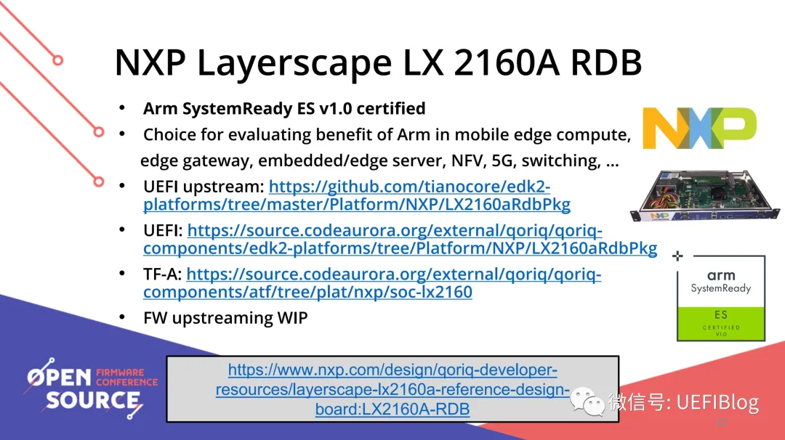
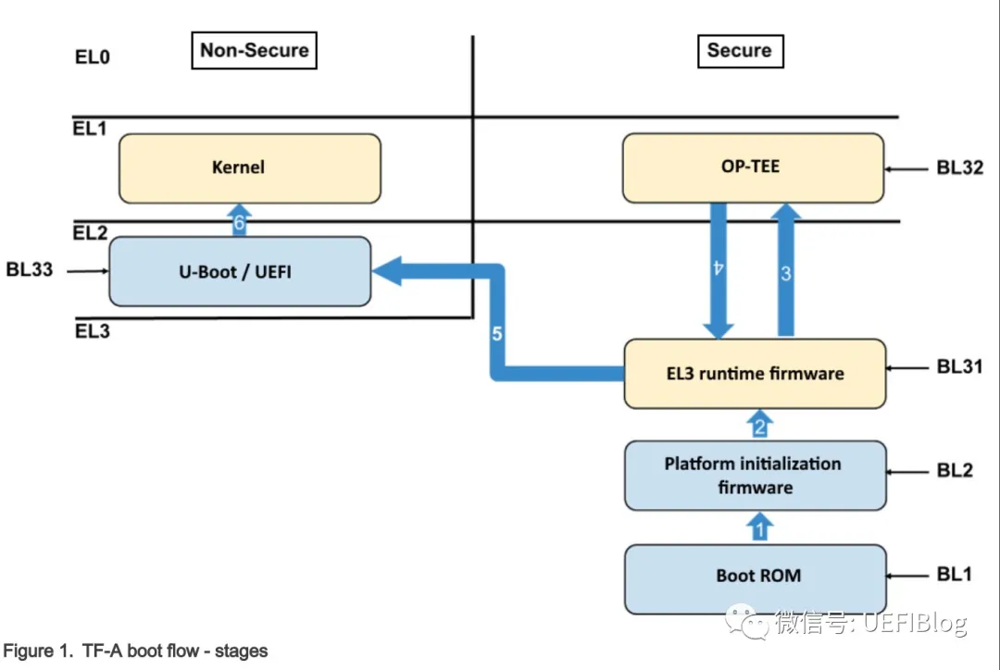

# ATF的由来

TF(Trusted Firmware)是ARM在Armv8引入的安全解决方案，为安全提供了整体解决方案。它包括启动和运行过程中的特权级划分，对Armv7中的TrustZone（TZ）进行了提高，补充了启动过程信任链的传导，细化了运行过程的特权级区间。TF实际有两种Profile，对ARM Profile A的CPU应用TF-A，对ARM Profile M的CPU应用TF-M。我们一般接触的都是TF-A，又因为这个概念是ARM提出的，有时候也缩写做ATF（ARM Trusted Firmware），所以本文对ATF和TF-A不再做特殊说明，ATF也是TF-A，对TF-M感兴趣的读者可以自行查询官网(https://www.trustedfirmware.org/)。

有些同学混淆了ATF和TZ的区别。实际上，TZ更多的是和Intel的SGX概念对应，是在CPU和内存中区隔出两个空间：Secure空间和Non-Secure空间。而ATF中有个Firmware概念，它实际上是Intel的Boot Guard、特权级和提高版的TZ的混合体。它在保有TZ的Secure空间和Non-Secure空间的同时，划分了EL0（Exception level 0）到EL3四个特权级：



其中EL0和EL1是ATF必须实现的，EL2和EL3是可选的。实际上，没有EL2和EL3，整个模型就基本退化成了ARMv7的TZ版本。从高EL转低EL通过ERET指令，从低EL转高EL通过exception，从而严格区分不同的特权级。其中EL0、EL1、EL2可以分成NS-ELx(None Secure ELx)和S-ELx（Secure ELx）两种，而EL3只有安全模式一种。

ATF带来最大的变化是信任链的建立（Trust Chain），整个启动过程包括从EL3到EL0的信任关系的打通，过程比较抽象。NXP的相关文档(https://www.nxp.com.cn/docs/en/user-guide/LSDKUG_Rev20.04_290520.pdf)比较充分和公开，它的源代码也是开源的(https://zhuanlan.zhihu.com/p/391101179#ref_3)。我们结合它的文档和源代码来理解一下。

# ATF启动流程

ARM开源了ATF的基本功能模块，大家可以在这里下载：

git clone  https://github.com/ARM-software/arm-trusted-firmware.git

里面已经包含了不少平台，但这些平台的基础代码有些是缺失的，尤其是和芯片部分和与UEFI联动部分。这里我推荐它的一个分支：NXP的2160A芯片的实现。

ARM推出了System Ready计划，效果相当不错，关于它我们今后再单独讲。2020年底，ARM在OSFC推出新的一批System Ready机型(https://zhuanlan.zhihu.com/p/391101179#ref_4)，NXP 2160A名列其中：



ATF代码下载可以用：

```
git clone https://source.codeaurora.org/external/qoriq/qoriq-components/atf -b LX2160_UEFI_ACPI_EAR3
```

UEFI代码下载可以用图片上的地址。我们可以把参考资料2和这些代码对照来看，加深理解。
支持ATF的ARM机器，启动过程如下



注意蓝色箭头上的数字，它是启动顺序。一切起源于在EL3的BL1。

## BL1：Trusted Boot ROM

启动最早的ROM，它可以类比Boot Guard的ACM，

什么是Boot Guard？电脑启动中的信任链条解析

不过它是在CPU的ROM里而不是和BIOS在一起，是一切的信任根。它的代码在这里：


ARM Trusted Firmware(ATF)是用于 ARM 架构设备的开源可信固件实现, 旨在为基于 ARM 的系统提供一个安全的执行环境.

# 基本概念

ARM 架构将系统分为普通世界 (Normal World) 和安全世界(Security World). 普通世界运行常规的操作系统和应用程序, 而安全世界则用于处理对安全性要求极高的任务. ARM Trusted Firmware 就运行在安全世界, 作为安全世界的初始软件层, 为系统提供安全基础服务和安全启动等关键功能.

# 主要功能

## 1. 安全启动

-**代码认证**: 在系统启动过程中, ATF 会对加载的各个组件 (如引导加载程序, 操作系统内核等) 进行严格的认证. 它会验证这些组件的数字签名, 确保其来源可靠且未被篡改. 只有通过认证的代码才能被执行, 从而防止恶意软件在系统启动阶段入侵.

-**启动流程控制**:ATF 负责管理安全启动的整个流程, 从最初的上电复位到最终将控制权交给普通世界的操作系统. 它会按照预定的顺序依次加载和验证各个启动组件, 保证系统启动的安全性和稳定性.

## 2. 安全监控模式管理

-**世界切换**: 安全监控模式是普通世界和安全世界之间的过渡层. ATF 管理着这种世界切换机制, 当普通世界的代码需要执行安全敏感操作 (如密钥管理, 加密解密等) 时, 会通过特定的指令请求进入安全世界. ATF 会处理这些请求, 确保安全地切换到安全世界, 并在操作完成后再安全地切换回普通世界.

-**上下文保存与恢复**: 在进行世界切换时, ATF 需要保存和恢复系统的上下文信息, 包括寄存器状态, 内存映射等. 这样可以保证在切换过程中不会丢失数据, 并且能够正确地恢复执行状态.

## 3. 可信操作系统支持

-**硬件初始化**: ATF 会对安全世界所需的硬件资源进行初始化, 如安全内存区域, 加密引擎等. 它会配置这些硬件的参数, 确保其正常工作, 并为可信操作系统提供一个稳定的硬件环境.

-**系统服务提供**: 为运行在安全世界的可信操作系统 (如 OP - TEE) 提供底层的系统服务, 如中断处理, 内存管理等. 这些服务使得可信操作系统能够高效地运行, 并且与普通世界进行安全交互.

# 软件架构

ARM Trusted Firmware 通常由多个阶段的固件组成, 常见的有 BL1,BL2,BL31 和 BL33 等:

-**BL1(Primary Bootloader)**: 这是启动过程中的第一个阶段, 通常存储在芯片的内部 ROM 中. BL1 负责进行基本的硬件初始化, 并加载和验证 BL2.

-**BL2(Secondary Bootloader)**:BL2 进一步完成硬件初始化工作, 并加载和验证 BL31 和 BL33. 它可以存储在外部存储设备 (如闪存) 中.

-**BL31(Trusted Execution Environment (TEE) Firmware)**:BL31 是 ATF 的核心部分, 运行在安全世界. 它负责管理安全监控模式, 处理世界切换请求, 并为可信操作系统提供支持.

-**BL33(Normal World Bootloader)**:BL33 是普通世界的引导加载程序, 如 U - Boot. 它在通过 ATF 的安全验证后被加载和执行, 最终启动普通世界的操作系统.

# 应用场景

-**移动设备**: 在智能手机, 平板电脑等移动设备中, ATF 用于保护用户的敏感信息, 如指纹识别数据, 支付信息等. 当用户进行指纹解锁或移动支付时, 相关的安全操作会在安全世界中执行, 由 ATF 提供安全保障.

-**物联网设备**: 物联网设备通常面临着各种安全威胁, ATF 可以增强设备的安全性, 防止设备被攻击和篡改. 例如, 智能家居设备, 工业物联网传感器等可以利用 ATF 来保护设备的通信和数据安全.

-**汽车电子**: 在汽车电子系统中, 如车载信息娱乐系统, 自动驾驶控制单元等, ATF 可以确保系统的安全性和可靠性. 它可以防止恶意软件对汽车系统的攻击, 保障行车安全.


# reference

https://zhuanlan.zhihu.com/p/391101179
