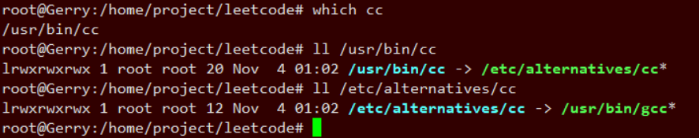

参考:

http://www.cnblogs.com/xj626852095/p/3648246.html

gcc 是 C 编译器; g\+\+是 C\+\+编译器; linux 下 cc 一般是一个符号连接, 指向 gcc; gcc 和 g\+\+都是 GUN(组织)的编译器. 而 CC 则一般是 makefile 里面的一个名字, 即宏定义, 因为 Linux/Unix 都是大小写敏感的系统.

cc 是 Unix 系统的 C Compiler, 而 gcc 则是 GNU Compiler Collection(GNU 编译器套装). gcc 原名为 Gun C 语言编译器(GNU C Compiler), 因为它原本只能处理 C 语言, 但 gcc 很快地扩展, 包含很多编译器(C、C\+\+、Objective-C、Ada、Fortran、Java). 因此, 它们是不一样的, 一个是古老的 C 编译器, 一个是 GNU 编译器集合, gcc 里面的 C 编译器比 cc 强大多了, 因此没必要用 cc.

下载不到 cc 的原因在于: cc 来自于昂贵的 Unix 系统, cc 是商业软件.

Linux 下的 cc 是 gcc 符号连接, 可以通过$ls –l /usr/bin/cc 来简单察看, 该变量是 make 程序的内建变量, 默认指向 gcc. cc 符号链接和变量存在的意义在于源码的移植性, 可以方便的用 gcc 来编译老的用 cc 编译的 Unix 软件, 甚至连 makefile 都不用改在, 而且也便于 Linux 程序在 Unix 下编译.

误区一: gcc 只能编译 C 代码, g\+\+只能编译 C\+\+代码.

两者都可以, 但请注意:

(1)后缀为.c 的, gcc 把它当作是 C 程序, 而 g\+\+当作是 c\+\+程序; 后缀为.cpp 的, 两者都会认为是 C\+\+程序, 注意, 虽然 C\+\+是 C 的超集, 但是两者对语法的要求是有区别的. C\+\+的语法规则更加严谨一些.

(2)编译阶段, g\+\+会调用 gcc, 对于 C\+\+代码, 两者是等价的, 但是因为 gcc 命令不能自动和 C\+\+程序使用的库联接, 所以通常用 g++来完成链接, 为了统一起见, 干脆编译/链接统统用 g\+\+了, 这就给人一种错觉, 好像 cpp 程序只能用 g\+\+似的.

误区二: gcc 不会定义__cplusplus 宏, 而 g\+\+会

实际上, 这个宏只是标志着编译器将会把代码按 C 还是 C\+\+语法来解释, 如上所述, 如果后缀为.c, 并且采用 gcc 编译器, 则该宏就是未定义的, 否则, 就是已定义.

误区三: 编译只能用 gcc, 链接只能用 g\+\+
严格来说, 这句话不算错误, 但是它混淆了概念, 应该这样说: 编译可以用 gcc/g\+\+, 而链接可以用 g\+\+或者 gcc -lstdc\+\+. 因为 gcc 命令不能自动和 C\+\+程序使用的库联接, 所以通常使用 g\+\+来完成联接. 但在编译阶段, g\+\+会自动调用 gcc, 二者等价.

C\+\+的编译器肯定可以编译 C 的代码, 注意除了 C\+\+对 C 的语法扩充之外, 编译和链接 C 和 C\+\+的标准库通常也不一样呢, 用 gcc 而非 g\+\+也编译了 C\+\+的程序就证明了这一点.

注: 符号链接是一种特殊类型的文件, 它的内容只是一个字符串. 它可能指向一个存在的文件也可能什么都不指向. 当您在命令行或程序里提到符号链接的时候, 您实际上进入了它指向的文件, 前提是这个文件是存在的.