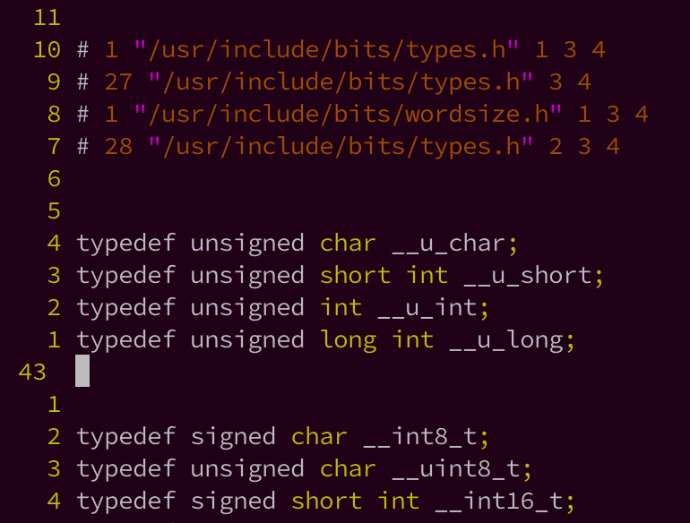

<!-- @import "[TOC]" {cmd="toc" depthFrom=1 depthTo=6 orderedList=false} -->

<!-- code_chunk_output -->

- [1. 整个过程示例](#1-整个过程示例)
- [2. 预处理: 转换成新 C 源码文件](#2-预处理-转换成新-c-源码文件)
  - [2.1. 头文件的作用](#21-头文件的作用)
  - [2.2. 不要头文件但手动声明](#22-不要头文件但手动声明)
- [3. 编译: 从预处理后的 C 源码生成汇编码](#3-编译-从预处理后的-c-源码生成汇编码)
- [4. 汇编: 从汇编代码生成机器码(目标文件)](#4-汇编-从汇编代码生成机器码目标文件)
- [5. 链接: 从目标文件和其他库的目标文件生成一个可执行文件](#5-链接-从目标文件和其他库的目标文件生成一个可执行文件)
  - [5.1. GNU binutils 工具包](#51-gnu-binutils-工具包)
  - [5.2. 链接相关知识](#52-链接相关知识)
    - [5.2.1. 什么是链接](#521-什么是链接)
    - [5.2.2. 了解链接的用处](#522-了解链接的用处)
    - [5.2.3. 运行时库 CRT](#523-运行时库-crt)
    - [5.2.4. 静态链接库: 标准库函数提供形式](#524-静态链接库-标准库函数提供形式)
      - [5.2.4.1. 静态库例子](#5241-静态库例子)
      - [5.2.4.2. 静态库的缺点](#5242-静态库的缺点)
    - [5.2.5. 动态链接库/共享库](#525-动态链接库共享库)
      - [5.2.5.1. 动态链接库的例子](#5251-动态链接库的例子)
      - [5.2.5.2. 动态库的好处](#5252-动态库的好处)
  - [5.3. 链接的过程](#53-链接的过程)
    - [5.3.1. 地址和空间分配](#531-地址和空间分配)
    - [5.3.2. 符号决议](#532-符号决议)
      - [5.3.2.1. 什么是符号](#5321-什么是符号)
      - [5.3.2.2. 符号引用的修正](#5322-符号引用的修正)
      - [5.3.2.3. 符号查找问题](#5323-符号查找问题)
- [6. 例子](#6-例子)
  - [6.1. 机器指令](#61-机器指令)
  - [6.2. C 语言转换成机器语言](#62-c-语言转换成机器语言)
  - [6.3. 汇编语言](#63-汇编语言)
  - [6.4. 汇编成机器语言](#64-汇编成机器语言)
  - [6.5. 链接成最终机器语言](#65-链接成最终机器语言)
- [7. 例子 2](#7-例子-2)
  - [7.1. C 代码](#71-c-代码)
  - [7.2. 预处理和编译](#72-预处理和编译)
  - [7.3. 汇编](#73-汇编)
  - [7.4. 链接](#74-链接)
- [8. 参考](#8-参考)

<!-- /code_chunk_output -->

# 1. 整个过程示例

详细的流程在经典的《Linkers and Loaders》和《深入理解计算机系统》中均有描述, 也有国产的诸如《程序员的自我修养——链接、装载与库》等大牛著作.

我的环境: Fedora 16 i686 kernel-3.6.11-4 gcc 4.6.3

在正式开始我们的描述前, 我们先来引出几个问题:

1. C 语言代码为什么要编译后才能执行?整个过程中编译器都做了什么?
2. C 代码中经常会包含头文件, 那头文件是什么?C 语言库又是什么?
3. 有人说 main 函数是 C 语言程序的入口, 是这样吗?难道就不能把其它函数当入口?
4. 不同的操作系统上编译好的程序可以直接拷贝过去运行吗?

我们就以最经典的 HelloWorld 程序为例开始吧.

我们先使用 vim 等文本编辑器写好代码, 接着在终端执行命令 `gcc HelloWorld.c -o HelloWorld` 输出了可执行文件 HelloWorld, 最后我们在终端执行 `./HelloWorld`, 顺利地显示了输出结果.

```
[root@lihaiwei cpptest]# vim HelloWorld.c
#include <stdio.h>

int main(void)
{
	printf("Hello World\n");
}
[root@lihaiwei cpptest]# gcc HelloWorld.c -o HelloWorld
[root@lihaiwei cpptest]# ./HelloWorld
Hello World
```

可是, 简单的命令背后经过了什么样的处理过程呢?gcc 真的就"直接"生成了最后的可执行文件了吗?

当然不是, 我们在**gcc 编译命令**行加上参数 `–verbose` 要求 gcc 输出完整的处理过程(命令行加上 `-v` 也行), 我们看到了一段较长的过程输出.

```
[root@lihaiwei cpptest]# gcc --verbose HelloWorld.c -o HelloWorld
Using built-in specs.
COLLECT_GCC=gcc
COLLECT_LTO_WRAPPER=/usr/libexec/gcc/x86_64-redhat-linux/4.8.5/lto-wrapper
Target: x86_64-redhat-linux
Configured with: ../configure --prefix=/usr --mandir=/usr/share/man --infodir=/usr/share/info --with-bugurl=http://bugzilla.redhat.com/bugzilla --enable-bootstrap --enable-shared --enable-threads=posix --enable-checking=release --with-system-zlib --enable-__cxa_atexit --disable-libunwind-exceptions --enable-gnu-unique-object --enable-linker-build-id --with-linker-hash-style=gnu --enable-languages=c,c++,objc,obj-c++,java,fortran,ada,go,lto --enable-plugin --enable-initfini-array --disable-libgcj --with-isl=/builddir/build/BUILD/gcc-4.8.5-20150702/obj-x86_64-redhat-linux/isl-install --with-cloog=/builddir/build/BUILD/gcc-4.8.5-20150702/obj-x86_64-redhat-linux/cloog-install --enable-gnu-indirect-function --with-tune=generic --with-arch_32=x86-64 --build=x86_64-redhat-linux
Thread model: posix
gcc version 4.8.5 20150623 (Red Hat 4.8.5-39) (GCC)
COLLECT_GCC_OPTIONS='-v' '-o' 'HelloWorld' '-mtune=generic' '-march=x86-64'
 /usr/libexec/gcc/x86_64-redhat-linux/4.8.5/cc1 -quiet -v HelloWorld.c -quiet -dumpbase HelloWorld.c -mtune=generic -march=x86-64 -auxbase HelloWorld -version -o /tmp/cc4vtoRP.s
GNU C (GCC) version 4.8.5 20150623 (Red Hat 4.8.5-39) (x86_64-redhat-linux)
	compiled by GNU C version 4.8.5 20150623 (Red Hat 4.8.5-39), GMP version 6.0.0, MPFR version 3.1.1, MPC version 1.0.1
GGC heuristics: --param ggc-min-expand=100 --param ggc-min-heapsize=131072
ignoring nonexistent directory "/usr/lib/gcc/x86_64-redhat-linux/4.8.5/include-fixed"
ignoring nonexistent directory "/usr/lib/gcc/x86_64-redhat-linux/4.8.5/../../../../x86_64-redhat-linux/include"
#include "..." search starts here:
#include <...> search starts here:
 /usr/lib/gcc/x86_64-redhat-linux/4.8.5/include
 /usr/local/include
 /usr/include
End of search list.
GNU C (GCC) version 4.8.5 20150623 (Red Hat 4.8.5-39) (x86_64-redhat-linux)
	compiled by GNU C version 4.8.5 20150623 (Red Hat 4.8.5-39), GMP version 6.0.0, MPFR version 3.1.1, MPC version 1.0.1
GGC heuristics: --param ggc-min-expand=100 --param ggc-min-heapsize=131072
Compiler executable checksum: edd9a53947039836c859e437e8c9af72
COLLECT_GCC_OPTIONS='-v' '-o' 'HelloWorld' '-mtune=generic' '-march=x86-64'
 as -v --64 -o /tmp/ccf99PWJ.o /tmp/cc4vtoRP.s
GNU assembler version 2.27 (x86_64-redhat-linux) using BFD version version 2.27-41.base.el7_7.1
COMPILER_PATH=/usr/libexec/gcc/x86_64-redhat-linux/4.8.5/:/usr/libexec/gcc/x86_64-redhat-linux/4.8.5/:/usr/libexec/gcc/x86_64-redhat-linux/:/usr/lib/gcc/x86_64-redhat-linux/4.8.5/:/usr/lib/gcc/x86_64-redhat-linux/
LIBRARY_PATH=/usr/lib/gcc/x86_64-redhat-linux/4.8.5/:/usr/lib/gcc/x86_64-redhat-linux/4.8.5/../../../../lib64/:/lib/../lib64/:/usr/lib/../lib64/:/usr/lib/gcc/x86_64-redhat-linux/4.8.5/../../../:/lib/:/usr/lib/
COLLECT_GCC_OPTIONS='-v' '-o' 'HelloWorld' '-mtune=generic' '-march=x86-64'
 /usr/libexec/gcc/x86_64-redhat-linux/4.8.5/collect2 --build-id --no-add-needed --eh-frame-hdr --hash-style=gnu -m elf_x86_64 -dynamic-linker /lib64/ld-linux-x86-64.so.2 -o HelloWorld /usr/lib/gcc/x86_64-redhat-linux/4.8.5/../../../../lib64/crt1.o /usr/lib/gcc/x86_64-redhat-linux/4.8.5/../../../../lib64/crti.o /usr/lib/gcc/x86_64-redhat-linux/4.8.5/crtbegin.o -L/usr/lib/gcc/x86_64-redhat-linux/4.8.5 -L/usr/lib/gcc/x86_64-redhat-linux/4.8.5/../../../../lib64 -L/lib/../lib64 -L/usr/lib/../lib64 -L/usr/lib/gcc/x86_64-redhat-linux/4.8.5/../../.. /tmp/ccf99PWJ.o -lgcc --as-needed -lgcc_s --no-as-needed -lc -lgcc --as-needed -lgcc_s --no-as-needed /usr/lib/gcc/x86_64-redhat-linux/4.8.5/crtend.o /usr/lib/gcc/x86_64-redhat-linux/4.8.5/../../../../lib64/crtn.o
```


可以自己试验然后试着分析整个流程.

一图胜千言, 我们先上一张图吧. 这是 gcc 编译过程的分解图.


gcc 处理 HelloWorld.c 的大致过程:

>预处理(Prepressing)—>编译(Compilation)—>汇编(Assembly)—>链接(Linking)

括号中我注明了各个过程中实际执行任务的程序名称: `预处理器 cpp`、`编译器 cc1`、`汇编器 as`以及最后的`链接器 ld`.

注: 整个过程除了使用 gcc 也可单独使用这几个工具, 详细见`Architecture/Assembly/[32 位]Linux 汇编入门`

# 2. 预处理: 转换成新 C 源码文件

`gcc -E HelloWorld.c -o HelloWorld.i`

`-E` 选项是"Preprocess only; do not compile, assemble or link", 即"**仅仅预处理**, **不编译、不汇编和不链接"**.

我们一步一步来看, 首先是预处理, 我们看看预处理阶段对代码进行了哪些处理.

我们在终端输入指令 `gcc -E HelloWorld.c -o HelloWorld.i`, 然后我们打开输出文件.



首先是大段大段的**变量和函数的声明**, 汗..我们的代码哪里去了?我们在 vim 的普通模式中按下 shift+g(大写 G)来到最后, 终于在几千行以后看到了我们可怜兮兮的几行代码.


前面几千行是什么呢?其实它就是 `/usr/include/stdio.h` 文件的所有内容, 预处理器把所有的`#include`**替换**为**实际文件的内容**了. 这个过程是**递归进行**的, 所以`stdio.h`里面的`#include`也**被实际内容所替换**了.

而且`HelloWorld.c`里面的**所有注释被预处理器全部删除**了. 就连`printf 语句`前的`Tab 缩进`也被**替换为一个空格**了, 显得代码都不美观了.

我直接给出预处理器处理的大致范围吧.

* 展开所有的**宏定义**并删除 `#define`
* 处理所有的**条件编译指令**, 例如 `#if #else #endif #ifndef ...`
* 把所有的 `#include` 替换为**头文件实际内容**, 递归进行
* 把所有的**注释** `//` 和 `/* */` 替换为**空格**
* 添加行号和文件名标识以供编译器使用
* 保留所有的 `#pragma` 指令, 因为编译器要使用
* ......

基本上就是这些了. 在这里我顺便插播一个小技巧, 在代码中有时候**宏定义比较复杂的时候**我们很**难判断其处理后的结构是否正确**. 这个时候我们呢就可以使用 gcc 的`-E 参数`输出处理结果来判断了.

## 2.1. 头文件的作用

前文中我们提到了**头文件！！！** 中放置的是**变量定义！！！** 和**函数声明！！！** 等等内容. 这些到底是什么东西呢?

其实在**比较早**的时候**调用函数并不需要声明**, 后来因为"笔误"之类的错误实在太多, 造成了链接期间的错误过多, **所有编译器**开始要求对**所有使用的变量或者函数**给出**声明**, 以支持编译器进行**参数检查**和**类型匹配**.

**头文件**包含的基本上就是**这些东西**和**一些预先的宏定义**来方便程序员编程.

## 2.2. 不要头文件但手动声明

其实对于我们的`HelloWorld.c`程序来说**不需要这个庞大的头文件**, 只需要在**main 函数前**声明 printf 函数, 不需要`#include<stdio.h>`即可通过编译.

```cpp
int printf(const char *format, ...);
```

```
# cat HelloWorld.c
int printf(const char *format, ...);
int main(void)
{
	printf("Hello World\n");
}

# gcc -v HelloWorld.c -o HelloWorld
Using built-in specs.
COLLECT_GCC=gcc
COLLECT_LTO_WRAPPER=/usr/libexec/gcc/x86_64-redhat-linux/4.8.5/lto-wrapper
Target: x86_64-redhat-linux
Configured with: ../configure --prefix=/usr --mandir=/usr/share/man --infodir=/usr/share/info --with-bugurl=http://bugzilla.redhat.com/bugzilla --enable-bootstrap --enable-shared --enable-threads=posix --enable-checking=release --with-system-zlib --enable-__cxa_atexit --disable-libunwind-exceptions --enable-gnu-unique-object --enable-linker-build-id --with-linker-hash-style=gnu --enable-languages=c,c++,objc,obj-c++,java,fortran,ada,go,lto --enable-plugin --enable-initfini-array --disable-libgcj --with-isl=/builddir/build/BUILD/gcc-4.8.5-20150702/obj-x86_64-redhat-linux/isl-install --with-cloog=/builddir/build/BUILD/gcc-4.8.5-20150702/obj-x86_64-redhat-linux/cloog-install --enable-gnu-indirect-function --with-tune=generic --with-arch_32=x86-64 --build=x86_64-redhat-linux
Thread model: posix
gcc version 4.8.5 20150623 (Red Hat 4.8.5-39) (GCC)
COLLECT_GCC_OPTIONS='-v' '-o' 'HelloWorld' '-mtune=generic' '-march=x86-64'
 /usr/libexec/gcc/x86_64-redhat-linux/4.8.5/cc1 -quiet -v HelloWorld.c -quiet -dumpbase HelloWorld.c -mtune=generic -march=x86-64 -auxbase HelloWorld -version -o /tmp/ccACFg1Y.s
GNU C (GCC) version 4.8.5 20150623 (Red Hat 4.8.5-39) (x86_64-redhat-linux)
	compiled by GNU C version 4.8.5 20150623 (Red Hat 4.8.5-39), GMP version 6.0.0, MPFR version 3.1.1, MPC version 1.0.1
GGC heuristics: --param ggc-min-expand=100 --param ggc-min-heapsize=131072
ignoring nonexistent directory "/usr/lib/gcc/x86_64-redhat-linux/4.8.5/include-fixed"
ignoring nonexistent directory "/usr/lib/gcc/x86_64-redhat-linux/4.8.5/../../../../x86_64-redhat-linux/include"
#include "..." search starts here:
#include <...> search starts here:
 /usr/lib/gcc/x86_64-redhat-linux/4.8.5/include
 /usr/local/include
 /usr/include
End of search list.
GNU C (GCC) version 4.8.5 20150623 (Red Hat 4.8.5-39) (x86_64-redhat-linux)
	compiled by GNU C version 4.8.5 20150623 (Red Hat 4.8.5-39), GMP version 6.0.0, MPFR version 3.1.1, MPC version 1.0.1
GGC heuristics: --param ggc-min-expand=100 --param ggc-min-heapsize=131072
Compiler executable checksum: edd9a53947039836c859e437e8c9af72
COLLECT_GCC_OPTIONS='-v' '-o' 'HelloWorld' '-mtune=generic' '-march=x86-64'
 as -v --64 -o /tmp/ccKBm26a.o /tmp/ccACFg1Y.s
GNU assembler version 2.27 (x86_64-redhat-linux) using BFD version version 2.27-41.base.el7_7.1
COMPILER_PATH=/usr/libexec/gcc/x86_64-redhat-linux/4.8.5/:/usr/libexec/gcc/x86_64-redhat-linux/4.8.5/:/usr/libexec/gcc/x86_64-redhat-linux/:/usr/lib/gcc/x86_64-redhat-linux/4.8.5/:/usr/lib/gcc/x86_64-redhat-linux/
LIBRARY_PATH=/usr/lib/gcc/x86_64-redhat-linux/4.8.5/:/usr/lib/gcc/x86_64-redhat-linux/4.8.5/../../../../lib64/:/lib/../lib64/:/usr/lib/../lib64/:/usr/lib/gcc/x86_64-redhat-linux/4.8.5/../../../:/lib/:/usr/lib/
COLLECT_GCC_OPTIONS='-v' '-o' 'HelloWorld' '-mtune=generic' '-march=x86-64'
 /usr/libexec/gcc/x86_64-redhat-linux/4.8.5/collect2 --build-id --no-add-needed --eh-frame-hdr --hash-style=gnu -m elf_x86_64 -dynamic-linker /lib64/ld-linux-x86-64.so.2 -o HelloWorld /usr/lib/gcc/x86_64-redhat-linux/4.8.5/../../../../lib64/crt1.o /usr/lib/gcc/x86_64-redhat-linux/4.8.5/../../../../lib64/crti.o /usr/lib/gcc/x86_64-redhat-linux/4.8.5/crtbegin.o -L/usr/lib/gcc/x86_64-redhat-linux/4.8.5 -L/usr/lib/gcc/x86_64-redhat-linux/4.8.5/../../../../lib64 -L/lib/../lib64 -L/usr/lib/../lib64 -L/usr/lib/gcc/x86_64-redhat-linux/4.8.5/../../.. /tmp/ccKBm26a.o -lgcc --as-needed -lgcc_s --no-as-needed -lc -lgcc --as-needed -lgcc_s --no-as-needed /usr/lib/gcc/x86_64-redhat-linux/4.8.5/crtend.o /usr/lib/gcc/x86_64-redhat-linux/4.8.5/../../../../lib64/crtn.o

# ./HelloWorld
Hello World
```

查看`gcc -E HelloWorld.c -o HelloWorld.i`

```
[root@lihaiwei cpptest]# cat HelloWorld.i
# 1 "HelloWorld.c"
# 1 "<built-in>"
# 1 "<command-line>"
# 1 "/usr/include/stdc-predef.h" 1 3 4
# 1 "<command-line>" 2
# 1 "HelloWorld.c"
int printf(const char *format, ...);
int main(void)
{
 printf("Hello World\n");
}
```

另外再补充一点, gcc 其实**并不要求**函数一定要在**被调用之前定义或者声明**(MSVC 不允许), 因为**gcc**在处理到**某个未知类型的函数**时, 会为其**创建一个隐式声明**, 并**假设**该**函数返回值类型为 int**.

但**gcc**此时**无法检查**传递给该函数的**实参类型！！！** 和**个数！！！** 是否正确, **不利于编译器为我们排除错误**(而且如果该**函数的返回值不是 int**的话也会**出错！！！**).

所以还是建议大家在函数调用前, 先对其定义或声明.

# 3. 编译: 从预处理后的 C 源码生成汇编码

从 `.c` C 源码生成:

`gcc -S HelloWorld.c -o HelloWorld.s`

从 `.i` 预处理后 C 源码生成:

`gcc -S HelloWorld.i -o HelloWorld.s`

`-S`选项是"Compile only; do not assemble or link", 即"**仅仅编译**, **不汇编和不链接"**.

接着看编译和汇编.

那么什么是编译?一句话描述: **编译**就是把**预处理之后的文件**进行一系列**词法分析**、**语法分析**、**语义分析**以及优化后生成的**相应汇编代码**文件.

这一部分我们不能展开说了, 一来我没有系统学习过编译原理的内容不敢信口开河, 二来这部分要是展开去说需要很厚很厚的一本书了, 细节大家就自己学习《编译原理》吧, 相关的资料自然就是经典的龙书、虎书和鲸书了.

`gcc`怎么**查看编译后的汇编代码**呢?命令是 `gcc -S HelloWorld.c -o HelloWorld.s`, 这样输出了汇编代码文件 HelloWorld.s, 其实输出的文件名可以随意, 我是习惯使然.

顺便说一句, 这里生成的**汇编**是`AT&T`风格的汇编代码, 如果大家更熟悉 Intel 风格, 可以在命令行加上参数 `-masm=intel` ,这样 gcc 就会生成**Intel 风格**的汇编代码了. 不过**gcc 的内联汇编**只支持`AT&T`风格, 大家还是找找资料学学 AT&T 风格吧.

# 4. 汇编: 从汇编代码生成机器码(目标文件)

从 `.c` C 源码生成:

`gcc -c HelloWorld.c -o HelloWorld.o`

从 `.s` 汇编代码生成:

`gcc -c HelloWorld.s -o HelloWorld.o`

`-c`选项是"Compile and assemble, but do not link", 即"**编译和汇编**, **不链接"**.

再下来是汇编步骤, 我们继续用一句话来描述: **汇编**就是**将编译后的汇编代码**翻译为**机器码**, 几乎**每一条汇编指令**对应**一句机器码**.

这里其实也没有什么好说的了, 命令行 `gcc -c HelloWorld.c -o HelloWorld.o` 可以让**编译器**只进行到**生成目标文件**这一步, 这样我们就能在目录下看到 HelloWorld.o 文件了.

Linux 下的**可执行文件**以及**目标文件**的**格式**叫作**ELF**(Executable Linkable Format). 其实 Windows 下的 PE(Portable Executable)也好, ELF 也罢, 都是`COFF(Common file format)`格式的**一种变种**, 甚至 Windows 下的目标文件就是以 COFF 格式去存储的. 不同的操作系统之间的可执行文件的格式通常是不一样的, 所以造成了编译好的 HelloWorld 没有办法直接复制执行, 而需要在相关平台上重新编译. 当然了, 不能运行的原因自然不是这一点点, 不同的操作系统接口(windows API 和 Linux 的 System Call)以及相关的类库不同也是原因之一.

由于本文的读者定位, 我们不能详细展开说了, 有相关需求的同学可以去看《Windows PE 权威指南》和《程序员的自我修养》去详细了解.

# 5. 链接: 从目标文件和其他库的目标文件生成一个可执行文件

从 `.c` C 源码生成:

`gcc HelloWorld.c -o HelloWorld`

从 `.o` 汇编代码生成:

`gcc HelloWorld.o -o HelloWorld`

我们接下来看最后的链接过程.

这一步是将**汇编**产生的**目标文件**和**所使用的库函数的目标文件**链接**生成一个可执行文件**的过程.

## 5.1. GNU binutils 工具包

我们先介绍`gnu binutils`工具包, 这是一整套的**二进制分析处理工具包**. 详细介绍请大家参考维基百科: http://zh.wikipedia.org/wiki/GNU_Binutils

我的 fedora 已经自带了这套工具包, 如果你的发行版没有, 请自行搜索安装方法.

```
yum install binutils
```

这套工具包含了足够多的工具, 我们甚至可以用来**研究 ELF 文件的格式**等内容. 不过本文只是抛砖引玉, 更多的使用方法和技巧还是需要大家自己去学习和研究.

包含诸多工具, 比如 `ld`、`as`、`objdump`等. 官网: https://www.gnu.org/software/binutils/ .

## 5.2. 链接相关知识

我想在这里稍微的扩展一下篇幅, 稍微详细的说一说链接, 一来这里造成的**错误通常难以理解和处理**, 二来使用**第三方库**在开发中越来越常见了, 想着大家可能更需要稍微了解一些细节了.

链接这个话题延伸之后完全可以跑到九霄云外去, 为了避免本文牵扯到过多的话题导致言之泛泛, 我们先设定本文涉及的范围.

我们今天**只讨论**链接进行的**大致步骤及其规则**、**静态链接库**与**动态链接库**的**创建**和**使用**这两大块的问题. 至于**可执行文件的加载**、**可执行文件的运行时储存器映像**之类的内容我们**暂时不讨论**.

### 5.2.1. 什么是链接

首先, 什么是链接?我们引用 CSAPP 的定义: `链接(linking)`是将各种**代码**和**数据**部分收集起来并**组合成为一个单一文件**的过程, 这个文件可被加载(或被拷贝)到存储器并执行.

需要强调的是, **链接**

- 可以执行于**编译时**(compile time), 也就是在**源代码**被翻译成**机器代码**时;
- 也可以执行于**加载时**, 也就是在程序被加载器(`loader`)加载到存储器并执行时;
- 甚至执行于**运行时**(run time), 由应用程序来执行.

### 5.2.2. 了解链接的用处

说了这么多, 了解链接有什么用呢?生命这么短暂, 我们干嘛要去学习一些根本用不到的东西. 当然有用了, 继续引用 CSAPP 的说法, 如下:

1. 理解链接器将帮助你构造大型程序.
2. 理解链接器将帮助你避免一些危险的编程错误.
3. 理解链接将帮助你理解语言的作用域是如何实现的.
4. 理解链接将帮助你理解其他重要的系统概念.
5. 理解链接将使你能够利用共享库.
6. ......

### 5.2.3. 运行时库 CRT

为了避免我们的描述过于枯燥, 我们还是以 C 语言为例吧.

想必大家通过我们在上篇中的描述, 已经知道**C 代码编译后的目标文件**了吧.

**目标文件！！！** 最终要和**标准库！！！** 进行**链接**生成**最后的可执行文件**. 那么, 标准库和我们生成的目标文件是什么关系呢?

其实, 任何一个程序, 它的背后都有**一套庞大的代码**在支撑着它, 以使得该程序能够正常运行. **这套代码**至少包括**入口函数**、以及其**所依赖的函数**构成的**函数集合**. 当然, 它还包含了各种**标准库函数的实现**.

这个"支撑模块"就叫做**运行时库**(`Runtime Library`). 而 C 语言的运行库, 即被称为`C 运行时库(CRT`).

`CRT`大致包括: **启动**与**退出**相关的**代码**(包括**入口函数**及入口函数所**依赖的其他函数**)、**标准库函数**(ANSI C 标准规定的函数实现)、`I/O`相关、**堆的封装实现**、**语言特殊功能的实现**以及**调试相关**.

其中**标准库函数的实现**占据了主要地位. 标准库函数大家想必很熟悉了, 而我们平时常用的 printf, scanf 函数就是标准库函数的成员. **C 语言标准库**在**不同的平台**上实现了**不同的版本**, 我们**只要依赖其接口定义**, 就能保证程序在不同平台上的一致行为.

**C 语言标准库**有**24**个, 囊括**标准输入输出**、**文件操作**、**字符串操作**、**数学函数**以及**日期**等等内容. 大家有兴趣的可以自行搜索.

### 5.2.4. 静态链接库: 标准库函数提供形式

既然 C 语言提供了**标准库函数**供我们使用, 那么以**什么形式提供**呢?**源代码**吗?当然**不是**了. 下面我们引入**静态链接库**的概念.

我们几乎**每一次写程序**都难免去**使用库函数**, 那么**每一次去编译！！！** 岂不是**太麻烦**了. 干嘛不把**标准库函数提前编译好！！！**, 需要的时候**直接链接！！！** 呢?我很负责任的说, 我们就是这么做的.

那么, **标准库**以**什么形式**存在呢?一个目标文件?我们知道, **链接的最小单位**就是**一个个目标文件**, 如果我们**只用**到一个**printf 函数**, 就需要和**整个库链接**的话岂不是**太浪费资源**了么?但是, 如果把**库函数**分别定义在彼此**独立的代码文件**里, 这样编译出来的可是**一大堆目标文件**, 有点混乱吧?

所以, **编辑器系统**提供了**一种机制**, 将**所有！！！的编译出来的目标文件**打包成**一个单独的文件！！！**, 叫做`静态库(static library)`.

当**链接器**和**静态库链接**的时候, **链接器**会从**这个打包的文件**中"**解压缩**"出**需要的！！！部分目标文件**进行**链接**. 这样就解决了**资源浪费**的问题.

Linux/Unix 系统下`ANSI C`的库名叫做`libc.a`, 另外**数学函数**单独在`libm.a`库里. **静态库**采用一种称为`存档(archive)`的**特殊文件格式**来**保存**. 其实就是**一个目标文件的集合**, **文件头**描述了**每个成员目标文件**的**位置**和**大小**.

#### 5.2.4.1. 静态库例子

光说不练是假把式, 我们自己做个静态库试试. 为了简单起见我们就做一个**只有两个函数**的私有库吧.

我们在`swap.c`里定义一个`swap 函数`, 在`add.c`里定义了一个`add 函数`. 最后还有含有它们声明的`calc.h`头文件.

```cpp
// swap.c
void swap(int *num1, int *num2)
{
    int tmp = *num1;
    *num1 = *num2;
    *num2 = tmp;
}
```

```cpp
// add.c
int add(int a, int b)
{
    return a + b;
}
```

```cpp
// calc.h
#ifndef CALC_H_
#define CALC_H_

#ifdef _cplusplus
extern "C"
{
#endif

void swap(int *, int *);
int add(int, int);

#ifdef _cplusplus
}
#endif

#endif // CALC_H_
```

我们分别编译它们得到了`swap.o`和`add.o`这两个目标文件, 最后使用**ar 命令**将其打包为一个静态库.

```
# gcc add.c -c -o add.o
# gcc swap.c -c -o swap.o
# ar rcs libcalc.a swap.o add.o
```

现在我们怎么使用这个静态库呢?我们写一个`test.c`使用这个库中的**swap 函数**吧.

```cpp
#include <stdio.h>
#include "calc.h"

int main(void)
{
	int a = 1, b=2;
	swap(&a, &b);
	printf("%d %d\n", a, b);
	return 0;
}
```

编译执行, 命令行执行`gcc test.c ./libcalc.a -o test`编译

```
[root@lihaiwei cpptest]# gcc test.c ./libcalc.a -o test
[root@lihaiwei cpptest]# ./test
2 1
[root@lihaiwei cpptest]# file libcalc.a
libcalc.a: current ar archive
```

可能你会问, 我们使用**C 语言标准库**的时候, **编译**并**不需要加什么库名**啊.

是的, 我们不需要. 因为**标准库已经是标准**了, 所以会**被默认链接**.

不过因为**数学函数库 libm.a 没有默认链接**, 所以我们**使用了数学函数的代码**在**编译**时需要在命令行指定 `-lm` 链接(`-l`是**指定链接库**, `m`是**去掉 lib 之后的库名**), 不过现在**好多 gcc**都**默认链接 libm.c 库**了, 比如我机子上的 gcc 4.6.3 会默认链接的.

#### 5.2.4.2. 静态库的缺点

正如我们所看到的, 静态链接库解决了一些问题, 但是它同时带来了另一些问题.

比如说

- **每一个**使用了**相同的 C 标准函数的程序**都需要和**相关目标文件进行链接**, **浪费磁盘空间**;
- 当一个程序有**多个副本执行**时, **相同的库代码**部分**被载入内存**, **浪费内存**;
- 当**库代码更新**之后, **使用这些库的函数**必须**全部重新编译**......

有更好的办法吗?当然有. 我们接下来引入**动态链接库/共享库**(`shared library`).

### 5.2.5. 动态链接库/共享库

**动态链接库/共享库**是一个**目标模块**, 在**运行时**可以加载到**任意的存储器地址**, 并**和一个正在运行的程序链接起来**. 这个过程就是**动态链接**(`dynamic linking`), 是由一个叫做**动态链接器**(`dynamic linker`)的程序完成的.

Unix/Linux 中**共享库**的后缀名通常是`.so`(微软那个估计大家很熟悉, 就是**DLL 文件**). 怎么建立一个动态链接库呢?

#### 5.2.5.1. 动态链接库的例子

我们还是以上面的代码为例, 我们先**删除**之前的**静态库**和**目标文件**.

首先是建立**动态链接库**, 我们执行`gcc swap.c add.c -shared -o libcalc.so` 就可以了, 就这么简单(微软那个有所区别, 我们在这里只为说明概念, 有兴趣的同学请自行搜索).

顺便说一下, 最好在 gcc 命令行加上一句`-fPIC`让其生成**与位置无关的代码**(`PIC`), 具体原因超出本文范围, 故不予讨论.

```
# gcc add.c swap.c -shared -o libcalc.so
```

如何使用呢?我们继续编译测试代码, 执行`gcc test.c -o test ./libcalc.so`即可. 运行后我们仍旧得到了预期的结果.

```
[root@lihaiwei cpptest]# gcc test.c -o test ./libcalc.so
[root@lihaiwei cpptest]# ./test
2 1
[root@lihaiwei cpptest]# file libcalc.so
libcalc.so: ELF 64-bit LSB shared object, x86-64, version 1 (SYSV), dynamically linked, BuildID[sha1]=93f2f40fa8fc439fca5b53ae1578f7d20b52d716, not stripped
```

这看起来也没啥不一样的啊. 其实不然, 我们用`ldd`命令(ldd 是我们在上篇中推荐的 GNU binutils 工具包的组成之一)检查**test 文件的依赖**.


我们看到这个文件能顺利运行需要依赖`libcalc.so`这个**动态库**, 我们还能看到**C 语言的标准库默认也是动态链接**的(在 gcc 编译的命令行加上 `-static` 可以要求**静态链接**).

#### 5.2.5.2. 动态库的好处

好处在哪?

第一, **库更新**之后, **只**需要**替换掉动态库文件**即可, **无需**编译所有依赖库**的**可执行文件**.

第二, 程序有**多个副本执行**时, **内存**中只需要**一份库代码**, 节省空间.

大家想想, C 语言标准库好多程序都在用, 但内存只有一份代码, 这样节省的空间很可观吧, 而且假如库代码发现 bug, 只需要更新 libc.so 即可, 所有程序即可使用新的代码, 岂不是很 Cool.

好了, 关于库我们就说到这里了, 再说下去就没法子结束了.

## 5.3. 链接的过程

我们来看看**链接过程**中具体做的事情.

链接的步骤大致包括了**地址和空间分配**(`Address and Storage Allocation`)、**符号决议**(`Symbol Resolution`)和**重定位**(`Relocation`)等主要步骤.

### 5.3.1. 地址和空间分配

首先是地址和空间分配, 我们之前提到的**目标文件**其实**全称**叫做**可重定位目标文件**(这只是一种翻译, 叫法很多...).

**目标文件的格式**已经无限度**接近可执行文件**了, Unix/Linux 下的**目标文件的格式**叫做**ELF**(`Executable and Linkable Format, 可执行连接格式`). 详细的讨论可执行文件的格式超出了本文范围, 我们只需要知道**可执行文件**中**代码**, **数据**, **符号**等内容分别**存储在不同的段**中就可以了, 这也和**保护模式下的内存分段**是有一定关系的, 但是这个又会扯远就不详谈了......

### 5.3.2. 符号决议

**地址和空间分配**以及**重定位**我们简单叙述一下就好, 但是**符号决议**这里我想稍微展开描述一下.

#### 5.3.2.1. 什么是符号

什么是**符号**(`symbol`)?简单说我们在**代码中**定义的**函数和变量**可以统称为**符号**. **符号名**(`symbol name`)就是**函数名和变量名**了.

#### 5.3.2.2. 符号引用的修正

**目标文件的拼合**其实也就是对**目标文件之间**相互的**符号引用的一个修正**.

我们知道一个 C 语言代码文件**只要所有的符号被声明过**就可以**通过编译**了, 可是对某符号的引用**怎么知道位置**呢?

比如我们调用了**printf 函数**, **编译**时留下了要**填入的函数地址**, 那么 printf 函数的**实际地址**在那呢?这个**空位什么时候修正**呢?

当然是**链接的时候**, 重定位那一步就是做这个的. 但是在**修改地址之前**需要做**符号决议**, 那什么是符号决议呢?

正如前文所说, **编译期间**留下了很多**需要重新定位的符号**, 所以**目标文件**中会有**一块区域专门保存符号表**. 那**链接器**如何知道**具体位置**呢?其实**链接器不知道**, 所以链接器会**搜索全部的待链接的目标文件**, 寻找这个**符号的位置**, 然后**修正每一个符号的地址**.

#### 5.3.2.3. 符号查找问题

这时候我们可以隆重介绍一个几乎所有人在编译程序的时候会遇见的问题——**符号查找问题**. 这个通常有**两种错误形式**, 即**找不到某符号**或者**符号重定义**.

首先是找不到符号, 比如, 当我们**声明！！！** 了一个**swap 函数！！！** 却**没有定义！！！** 它的时候, 我们调用这个函数的代码**可以通过编译！！！**, 但是在**链接期间！！！** 却会**遇到错误**. 形如`"test.c:(.text+0x29): undefined reference to 'swap'"`这样, 特别的, **MSVC 编译器**报错是找不到符号`_swap`.

咦?**那个下划线**哪里来的?这得从**C 语言**刚诞生说起. 当 C 语言**刚面世**的时候, 已经存在不少用**汇编语言写好的库**了, 因为**链接器**的**符号唯一规则！！！**, 假如该库中存在 main 函数, 我们就不能在 C 代码中出现 main 函数了, 因为会遭遇**符号重定义错误**, 倘若放弃这些库又是一大损失. 所以当时的**编译器**会对代码中的**符号**进行**修饰**(`name decoration`), **C 语言的代码**会在**符号前加下划线**, **fortran 语言**在符号**前后都加下划线**, 这样各个目标文件就不会同名了, 就解决了符号冲突的问题. 随着时间的流逝, 操作系统和编译器都被重写了好多遍了, 当前的这个问题已经可以无视了. 所以**新版的 gcc**一般不会再加下划线做符号修饰了(也可以在编译的命令行加上`-fleading-underscore/-fno-fleading-underscore`开**打开/关闭**这个**是否加下划线**). 而 MSVC 依旧保留了这个传统, 所以我们可以看到`_swap`这样的修饰.

顺便说一下, **符号冲突**是**很常见**的事情, 特别是在大型项目的开发中, 所以我们需要一个**约定良好的命名规则**. `C++`也引入了**命名空间**来帮助我们解决这些问题, 因为`C++`中存在函数重载这些东西, 所以`C++`的符号修饰更加复杂难懂(Linux 下有`c++filt`命令帮助我们翻译一个被`C++`编译器修饰过的符号).

说了这么多, 该到了我们编程中需要注意的一个大问题了. 即存在**同名符号**时链接器如何处理. 不是刚刚说了会报告**重名错误**吗?怎么又要研究这个?很可惜, 不仅仅这么简单.

在**编译**时, **编译器**会向**汇编器**输出**每个全局符号**, 分为**强**(`strong`)符号和**弱符号**(`weak`), 汇编器把这个信息**隐含的编码**在**可重定位目标文件的符号表**里. 其中

- **函数！！！** 和**已初始化！！！过的全局变量！！！** 是**强符号**,
- **未初始化**的**全局变量**是**弱符号**.

根据强弱符号的定义, GNU 链接器采用的规则如下:

1. **不允许多个强符号**
2. 如果有一个强符号和一个或多个弱符号, 则选择强符号
3. 如果有**多个弱符号**, 则**随机**选择一个

好了, 就三条, **第一条**会报**符号重名错误**的, 而后两条默认情况下甚至连警告都不会有. 关键就在这里, 默认甚至连警告都没有.

我们来个实验具体说一下:

```cpp
// link1.c
#include <stdio.h>

int n;

int main(void)
{
	printf("It is %d\n", n);
	return 0;
}
```

```cpp
// link2.c
int n = 5;
```

这两个文件编译运行会输出什么呢?聪明的你想必已经知道了吧?没错, 就是 5.

```
[root@lihaiwei cpptest]# gcc link2.c link1.c -o link
[root@lihaiwei cpptest]# ./link
It is 5
```

初始化过的 n 是强符号, 被优先选择了.

但是, 在**很复杂的项目代码**, 这样的错误很难发现, 特别是多线程的......不过当我们怀疑代码中的 bug 可能是因为此原因引起的时候, 我们可以在**gcc 命令**行加上`-fno-common`这个参数, 这样链接器在**遇到多重定义的符号**时, 都会**给出一条警告信息**, 而**无关强弱符号**. 如下所示:


```
[root@lihaiwei cpptest]# gcc link2.c link1.c -o link -fno-common
/tmp/ccv0QNhN.o:(.bss+0x0): multiple definition of `n'
/tmp/cchW8yWl.o:(.data+0x0): first defined here
collect2: error: ld returned 1 exit status
```

到此结束.

# 6. 例子

## 6.1. 机器指令

**一条机器指令**由相应的**二进制数标识**, 直接能**被机器识别**.

在汇编语言出现之前, 使用机器指令编写程序是直接将二进制数输入计算机中.

## 6.2. C 语言转换成机器语言

>C 语言中的 c=a+b 在机器语言中应该怎样表达?

这是一个很麻烦的过程, a、b 和 c 都是变量, 在机器语言中应该怎样表达?

**C**语言**不能**直接转换为**机器语言**, 要

- 先由 C 编译器译出相当的**assembly**,
- 然后再由**assembler**生成**机器指令**,
- 最终再由**链接器**将这些**变量的地址定下来**.

我们来看看**怎样转化机器指令**.

## 6.3. 汇编语言

用相应的**汇编语言**表达出来.

```
mov eax, [a]                ;  变量 a 的值放到 eax 寄存器中
add eax, [b]                ;  执行 a+b
mov [c], eax                ;  放到 c 中
```

在 x86 机器中, 如果**两个内存操作数**要进行加法运算, **不能直接相加**, 其中一方必须是寄存器, 至少要将一个操作数放入寄存器中.

这一表达已经是最简单形式了, 实际上当然不止这么简单, 还要配合程序的上下文结构.

如果其中一个**变量只是临时性**的(即**局部变量**), **C 编译器**可能会选择**不放入内存**中. 那么这些变量是**局部变量**还是**外部变量**呢?**编译器**首先要决定**变量的地址**.

```
mov eax, [ebp-4]                ;  变量 a 是局部变量
add eax, [ebp-8]                ;  执行 a+b, 变量 b 也是局部变量
mov [0x0000001c], eax          ;  放到 c 中, 变量 c 可能是外部变量
```

**变量 a 和 b**是在**stack**上.

在大多数的平台下, **变量 c**会放入到`.data`节, 可是在进行**链接之前**, **c 的地址**可能只是**一个偏移量**, 不是真正的地址, 链接器将负责用变量 c 的**真正地址**来代替这个偏移值.

## 6.4. 汇编成机器语言

```
objdump -S add.o
```

上面的汇编语言译成机器语言为

```
8b 45 fc                 ;  对应于  mov eax, [ebp-4]
03 45 f8                 ;  对应于  add eax, [ebp-8]
a3 1c 00 00 00           ;  对应于  mov [0x0000001c], eax
```

x86 机器是 CISC(复杂指令集计算)体系, **指令的长度**是**不固定**的, 比如上述**前两条指令**是**3 字节**, **最后一条指令**是**5 字节**.

> x86 机器指令长度**最短 1 字节**, **最长 15 字节**.

## 6.5. 链接成最终机器语言

最后, 假定`.data`节的**基地址**是`0x00408000`, 那么**变量 c 的地址**就是`0x00408000+0x1c=0x0040801c`, 经过**链接**后, 最后一条机器指令变成

```
a3 1c 80 40 00         ;  原始汇编表达形式:  mov [c], eax
```

指令同样采用`little-endian`存储序列, 从低到高依次存放`a3 1c 80 40 00`字节, 其中`1c 80 40 00`是地址值`0x0040801c`的`little-endian`字节序排列.

# 7. 例子 2

## 7.1. C 代码
add.c

```cpp
int c;

void fun(int a, int b)
{
	c = a + b;
}

void main(void)
{
	fun(1, 2);
}
```

## 7.2. 预处理和编译

```
gcc -S add.c -o add.s
```

```asm
	.file	"add.c"
	.comm	c,4,4
	.text
	.globl	fun
	.type	fun, @function
fun:
.LFB0:
	.cfi_startproc
	pushq	%rbp
	.cfi_def_cfa_offset 16
	.cfi_offset 6, -16
	movq	%rsp, %rbp
	.cfi_def_cfa_register 6
	movl	%edi, -4(%rbp)
	movl	%esi, -8(%rbp)
	movl	-8(%rbp), %eax
	movl	-4(%rbp), %edx
	addl	%edx, %eax
	movl	%eax, c(%rip)
	popq	%rbp
	.cfi_def_cfa 7, 8
	ret
	.cfi_endproc
.LFE0:
	.size	fun, .-fun
	.globl	main
	.type	main, @function
main:
.LFB1:
	.cfi_startproc
	pushq	%rbp
	.cfi_def_cfa_offset 16
	.cfi_offset 6, -16
	movq	%rsp, %rbp
	.cfi_def_cfa_register 6
	movl	$2, %esi
	movl	$1, %edi
	call	fun
	popq	%rbp
	.cfi_def_cfa 7, 8
	ret
	.cfi_endproc
.LFE1:
	.size	main, .-main
	.ident	"GCC: (GNU) 4.8.5 20150623 (Red Hat 4.8.5-39)"
	.section	.note.GNU-stack,"",@progbits
```

可以看到核心代码

```
	movl	%edi, -4(%rbp)    ; 参数赋值
	movl	%esi, -8(%rbp)    ; 参数赋值
	movl	-8(%rbp), %eax    ; 得到参数
	movl	-4(%rbp), %edx    ; 得到参数
	addl	%edx, %eax        ; a + b
	movl	%eax, c(%rip)     ; 将结果赋值给 c, 表明是内存单元(rip + c)
```

## 7.3. 汇编

汇编并反汇编

```
gcc -c add.s -o add.o
objdump -S add.o
```

查看反汇编结果

```
add.o:     file format elf64-x86-64


Disassembly of section .text:

0000000000000000 <fun>:
   0:	55                   	push   %rbp
   1:	48 89 e5             	mov    %rsp,%rbp
   4:	89 7d fc             	mov    %edi,-0x4(%rbp)
   7:	89 75 f8             	mov    %esi,-0x8(%rbp)
   a:	8b 45 f8             	mov    -0x8(%rbp),%eax
   d:	8b 55 fc             	mov    -0x4(%rbp),%edx
  10:	01 d0                	add    %edx,%eax
  12:	89 05 00 00 00 00    	mov    %eax,0x0(%rip)        # 18 <fun+0x18>
  18:	5d                   	pop    %rbp
  19:	c3                   	retq

000000000000001a <main>:
  1a:	55                   	push   %rbp
  1b:	48 89 e5             	mov    %rsp,%rbp
  1e:	be 02 00 00 00       	mov    $0x2,%esi
  23:	bf 01 00 00 00       	mov    $0x1,%edi
  28:	e8 00 00 00 00       	callq  2d <main+0x13>
  2d:	5d                   	pop    %rbp
  2e:	c3                   	retq
```

核心部分

```
   4:	89 7d fc             	mov    %edi,-0x4(%rbp)
   7:	89 75 f8             	mov    %esi,-0x8(%rbp)
   a:	8b 45 f8             	mov    -0x8(%rbp),%eax
   d:	8b 55 fc             	mov    -0x4(%rbp),%edx
  10:	01 d0                	add    %edx,%eax
  12:	89 05 00 00 00 00    	mov    %eax,0x0(%rip)        # 18 <fun+0x18>
```

注: 这里将相加结果赋值给内存操作数`rip + 0`

## 7.4. 链接

```
gcc add.o  -o add
objdump -S add
```

查看反汇编结果

```
add:     file format elf64-x86-64


Disassembly of section .init:

00000000004003a8 <_init>:
  4003a8:	48 83 ec 08          	sub    $0x8,%rsp
  4003ac:	48 8b 05 45 0c 20 00 	mov    0x200c45(%rip),%rax        # 600ff8 <__gmon_start__>
  4003b3:	48 85 c0             	test   %rax,%rax
  4003b6:	74 05                	je     4003bd <_init+0x15>
  4003b8:	e8 33 00 00 00       	callq  4003f0 <__gmon_start__@plt>
  4003bd:	48 83 c4 08          	add    $0x8,%rsp
  4003c1:	c3                   	retq

Disassembly of section .plt:

00000000004003d0 <.plt>:
  4003d0:	ff 35 32 0c 20 00    	pushq  0x200c32(%rip)        # 601008 <_GLOBAL_OFFSET_TABLE_+0x8>
  4003d6:	ff 25 34 0c 20 00    	jmpq   *0x200c34(%rip)        # 601010 <_GLOBAL_OFFSET_TABLE_+0x10>
  4003dc:	0f 1f 40 00          	nopl   0x0(%rax)

00000000004003e0 <__libc_start_main@plt>:
  4003e0:	ff 25 32 0c 20 00    	jmpq   *0x200c32(%rip)        # 601018 <__libc_start_main@GLIBC_2.2.5>
  4003e6:	68 00 00 00 00       	pushq  $0x0
  4003eb:	e9 e0 ff ff ff       	jmpq   4003d0 <.plt>

00000000004003f0 <__gmon_start__@plt>:
  4003f0:	ff 25 2a 0c 20 00    	jmpq   *0x200c2a(%rip)        # 601020 <__gmon_start__>
  4003f6:	68 01 00 00 00       	pushq  $0x1
  4003fb:	e9 d0 ff ff ff       	jmpq   4003d0 <.plt>

Disassembly of section .text:

0000000000400400 <_start>:
  400400:	31 ed                	xor    %ebp,%ebp
  400402:	49 89 d1             	mov    %rdx,%r9
  400405:	5e                   	pop    %rsi
  400406:	48 89 e2             	mov    %rsp,%rdx
  400409:	48 83 e4 f0          	and    $0xfffffffffffffff0,%rsp
  40040d:	50                   	push   %rax
  40040e:	54                   	push   %rsp
  40040f:	49 c7 c0 90 05 40 00 	mov    $0x400590,%r8
  400416:	48 c7 c1 20 05 40 00 	mov    $0x400520,%rcx
  40041d:	48 c7 c7 07 05 40 00 	mov    $0x400507,%rdi
  400424:	e8 b7 ff ff ff       	callq  4003e0 <__libc_start_main@plt>
  400429:	f4                   	hlt
  40042a:	66 0f 1f 44 00 00    	nopw   0x0(%rax,%rax,1)

0000000000400430 <deregister_tm_clones>:
  400430:	b8 37 10 60 00       	mov    $0x601037,%eax
  400435:	55                   	push   %rbp
  400436:	48 2d 30 10 60 00    	sub    $0x601030,%rax
  40043c:	48 83 f8 0e          	cmp    $0xe,%rax
  400440:	48 89 e5             	mov    %rsp,%rbp
  400443:	77 02                	ja     400447 <deregister_tm_clones+0x17>
  400445:	5d                   	pop    %rbp
  400446:	c3                   	retq
  400447:	b8 00 00 00 00       	mov    $0x0,%eax
  40044c:	48 85 c0             	test   %rax,%rax
  40044f:	74 f4                	je     400445 <deregister_tm_clones+0x15>
  400451:	5d                   	pop    %rbp
  400452:	bf 30 10 60 00       	mov    $0x601030,%edi
  400457:	ff e0                	jmpq   *%rax
  400459:	0f 1f 80 00 00 00 00 	nopl   0x0(%rax)

0000000000400460 <register_tm_clones>:
  400460:	b8 30 10 60 00       	mov    $0x601030,%eax
  400465:	55                   	push   %rbp
  400466:	48 2d 30 10 60 00    	sub    $0x601030,%rax
  40046c:	48 c1 f8 03          	sar    $0x3,%rax
  400470:	48 89 e5             	mov    %rsp,%rbp
  400473:	48 89 c2             	mov    %rax,%rdx
  400476:	48 c1 ea 3f          	shr    $0x3f,%rdx
  40047a:	48 01 d0             	add    %rdx,%rax
  40047d:	48 d1 f8             	sar    %rax
  400480:	75 02                	jne    400484 <register_tm_clones+0x24>
  400482:	5d                   	pop    %rbp
  400483:	c3                   	retq
  400484:	ba 00 00 00 00       	mov    $0x0,%edx
  400489:	48 85 d2             	test   %rdx,%rdx
  40048c:	74 f4                	je     400482 <register_tm_clones+0x22>
  40048e:	5d                   	pop    %rbp
  40048f:	48 89 c6             	mov    %rax,%rsi
  400492:	bf 30 10 60 00       	mov    $0x601030,%edi
  400497:	ff e2                	jmpq   *%rdx
  400499:	0f 1f 80 00 00 00 00 	nopl   0x0(%rax)

00000000004004a0 <__do_global_dtors_aux>:
  4004a0:	80 3d 85 0b 20 00 00 	cmpb   $0x0,0x200b85(%rip)        # 60102c <_edata>
  4004a7:	75 11                	jne    4004ba <__do_global_dtors_aux+0x1a>
  4004a9:	55                   	push   %rbp
  4004aa:	48 89 e5             	mov    %rsp,%rbp
  4004ad:	e8 7e ff ff ff       	callq  400430 <deregister_tm_clones>
  4004b2:	5d                   	pop    %rbp
  4004b3:	c6 05 72 0b 20 00 01 	movb   $0x1,0x200b72(%rip)        # 60102c <_edata>
  4004ba:	f3 c3                	repz retq
  4004bc:	0f 1f 40 00          	nopl   0x0(%rax)

00000000004004c0 <frame_dummy>:
  4004c0:	48 83 3d 58 09 20 00 	cmpq   $0x0,0x200958(%rip)        # 600e20 <__JCR_END__>
  4004c7:	00
  4004c8:	74 1e                	je     4004e8 <frame_dummy+0x28>
  4004ca:	b8 00 00 00 00       	mov    $0x0,%eax
  4004cf:	48 85 c0             	test   %rax,%rax
  4004d2:	74 14                	je     4004e8 <frame_dummy+0x28>
  4004d4:	55                   	push   %rbp
  4004d5:	bf 20 0e 60 00       	mov    $0x600e20,%edi
  4004da:	48 89 e5             	mov    %rsp,%rbp
  4004dd:	ff d0                	callq  *%rax
  4004df:	5d                   	pop    %rbp
  4004e0:	e9 7b ff ff ff       	jmpq   400460 <register_tm_clones>
  4004e5:	0f 1f 00             	nopl   (%rax)
  4004e8:	e9 73 ff ff ff       	jmpq   400460 <register_tm_clones>

00000000004004ed <fun>:
  4004ed:	55                   	push   %rbp
  4004ee:	48 89 e5             	mov    %rsp,%rbp
  4004f1:	89 7d fc             	mov    %edi,-0x4(%rbp)
  4004f4:	89 75 f8             	mov    %esi,-0x8(%rbp)
  4004f7:	8b 45 f8             	mov    -0x8(%rbp),%eax
  4004fa:	8b 55 fc             	mov    -0x4(%rbp),%edx
  4004fd:	01 d0                	add    %edx,%eax
  4004ff:	89 05 2b 0b 20 00    	mov    %eax,0x200b2b(%rip)        # 601030 <__TMC_END__>
  400505:	5d                   	pop    %rbp
  400506:	c3                   	retq

0000000000400507 <main>:
  400507:	55                   	push   %rbp
  400508:	48 89 e5             	mov    %rsp,%rbp
  40050b:	be 02 00 00 00       	mov    $0x2,%esi
  400510:	bf 01 00 00 00       	mov    $0x1,%edi
  400515:	e8 d3 ff ff ff       	callq  4004ed <fun>
  40051a:	5d                   	pop    %rbp
  40051b:	c3                   	retq
  40051c:	0f 1f 40 00          	nopl   0x0(%rax)

0000000000400520 <__libc_csu_init>:
  400520:	41 57                	push   %r15
  400522:	41 89 ff             	mov    %edi,%r15d
  400525:	41 56                	push   %r14
  400527:	49 89 f6             	mov    %rsi,%r14
  40052a:	41 55                	push   %r13
  40052c:	49 89 d5             	mov    %rdx,%r13
  40052f:	41 54                	push   %r12
  400531:	4c 8d 25 d8 08 20 00 	lea    0x2008d8(%rip),%r12        # 600e10 <__frame_dummy_init_array_entry>
  400538:	55                   	push   %rbp
  400539:	48 8d 2d d8 08 20 00 	lea    0x2008d8(%rip),%rbp        # 600e18 <__init_array_end>
  400540:	53                   	push   %rbx
  400541:	4c 29 e5             	sub    %r12,%rbp
  400544:	31 db                	xor    %ebx,%ebx
  400546:	48 c1 fd 03          	sar    $0x3,%rbp
  40054a:	48 83 ec 08          	sub    $0x8,%rsp
  40054e:	e8 55 fe ff ff       	callq  4003a8 <_init>
  400553:	48 85 ed             	test   %rbp,%rbp
  400556:	74 1e                	je     400576 <__libc_csu_init+0x56>
  400558:	0f 1f 84 00 00 00 00 	nopl   0x0(%rax,%rax,1)
  40055f:	00
  400560:	4c 89 ea             	mov    %r13,%rdx
  400563:	4c 89 f6             	mov    %r14,%rsi
  400566:	44 89 ff             	mov    %r15d,%edi
  400569:	41 ff 14 dc          	callq  *(%r12,%rbx,8)
  40056d:	48 83 c3 01          	add    $0x1,%rbx
  400571:	48 39 eb             	cmp    %rbp,%rbx
  400574:	75 ea                	jne    400560 <__libc_csu_init+0x40>
  400576:	48 83 c4 08          	add    $0x8,%rsp
  40057a:	5b                   	pop    %rbx
  40057b:	5d                   	pop    %rbp
  40057c:	41 5c                	pop    %r12
  40057e:	41 5d                	pop    %r13
  400580:	41 5e                	pop    %r14
  400582:	41 5f                	pop    %r15
  400584:	c3                   	retq
  400585:	90                   	nop
  400586:	66 2e 0f 1f 84 00 00 	nopw   %cs:0x0(%rax,%rax,1)
  40058d:	00 00 00

0000000000400590 <__libc_csu_fini>:
  400590:	f3 c3                	repz retq

Disassembly of section .fini:

0000000000400594 <_fini>:
  400594:	48 83 ec 08          	sub    $0x8,%rsp
  400598:	48 83 c4 08          	add    $0x8,%rsp
  40059c:	c3                   	retq
```

核心代码

```
  4004f1:	89 7d fc             	mov    %edi,-0x4(%rbp)
  4004f4:	89 75 f8             	mov    %esi,-0x8(%rbp)
  4004f7:	8b 45 f8             	mov    -0x8(%rbp),%eax
  4004fa:	8b 55 fc             	mov    -0x4(%rbp),%edx
  4004fd:	01 d0                	add    %edx,%eax
  4004ff:	89 05 2b 0b 20 00    	mov    %eax,400505(%rip)        # 601030 <__TMC_END__>
  400505:	5d                   	pop    %rbp
```

这里`rip`是`400505`(即`下一条指令地址`), 加上`400505`是`601030`, 通过查看符号信息

```
# nm add
000000000060102c B __bss_start
0000000000601030 B c
000000000060102c b completed.6355
0000000000601028 D __data_start
0000000000601028 W data_start
0000000000400430 t deregister_tm_clones
00000000004004a0 t __do_global_dtors_aux
0000000000600e18 t __do_global_dtors_aux_fini_array_entry
00000000004005a8 R __dso_handle
0000000000600e28 d _DYNAMIC
000000000060102c D _edata
0000000000601038 B _end
0000000000400594 T _fini
00000000004004c0 t frame_dummy
0000000000600e10 t __frame_dummy_init_array_entry
0000000000400700 r __FRAME_END__
00000000004004ed T fun
0000000000601000 d _GLOBAL_OFFSET_TABLE_
                 w __gmon_start__
00000000004005b0 r __GNU_EH_FRAME_HDR
00000000004003a8 T _init
0000000000600e18 t __init_array_end
0000000000600e10 t __init_array_start
00000000004005a0 R _IO_stdin_used
0000000000600e20 d __JCR_END__
0000000000600e20 d __JCR_LIST__
0000000000400590 T __libc_csu_fini
0000000000400520 T __libc_csu_init
                 U __libc_start_main@@GLIBC_2.2.5
0000000000400507 T main
0000000000400460 t register_tm_clones
0000000000400400 T _start
0000000000601030 D __TMC_END__
```

或者通过`readelf`, 当然通过`objdump -D add`也能看到

# 8. 参考

http://www.0xffffff.org/2013/04/05/16-complier-and-linker-1/