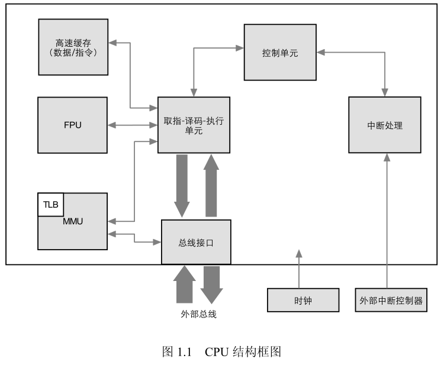
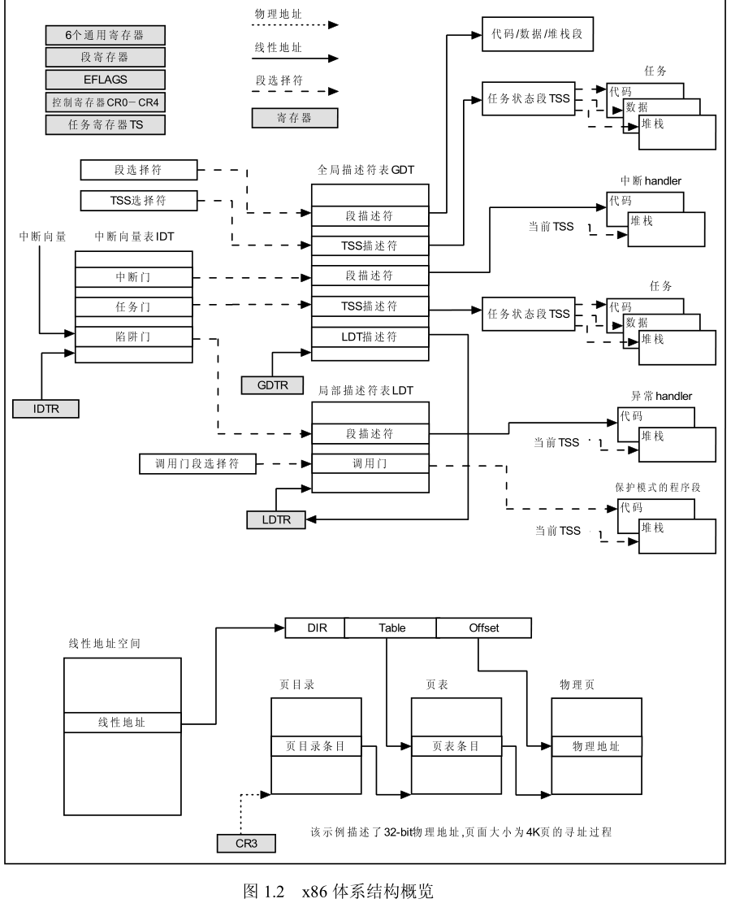
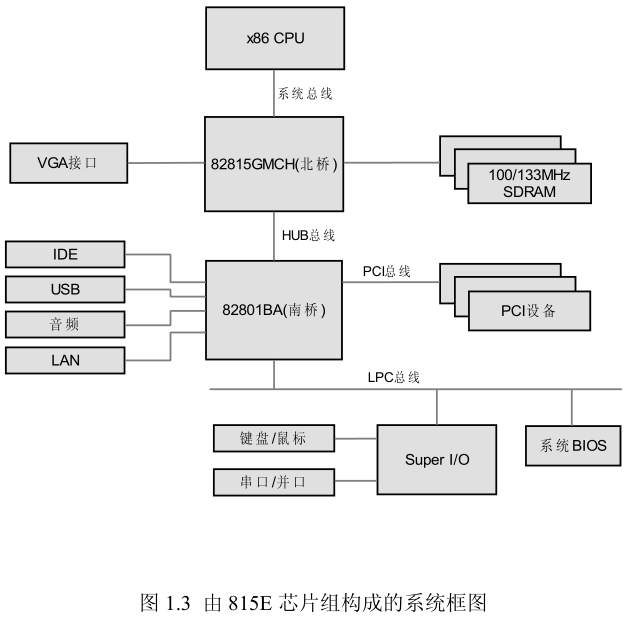
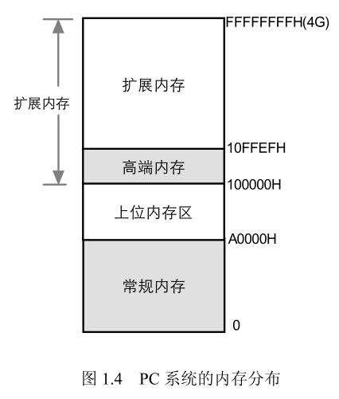
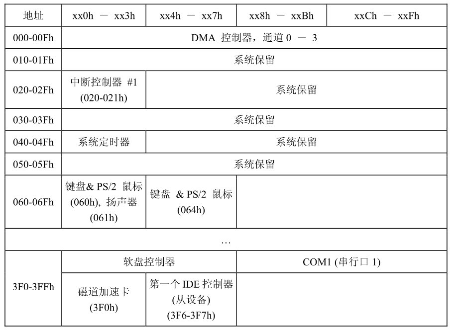
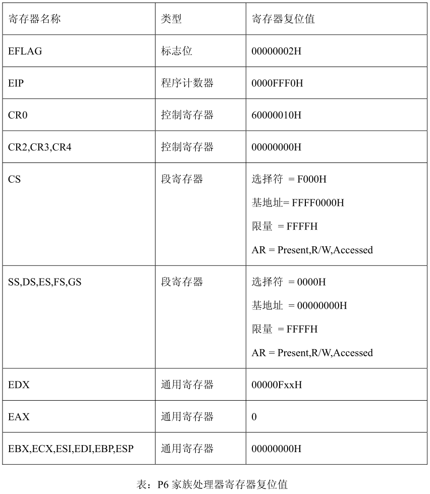

Bochs不仅模拟了x86 CPU, 还包括一整套PC系统的各种部件. 因此对Bochs研究之前, 需要分析x86体系结构和PC系统. 

1.1 x86 CPU结构

1.1.1 冯诺依曼结构与CISC指令集

在系统结构上, 计算机主要可以分为冯·诺伊曼结构和哈佛结构. 冯·诺伊曼结构, 也称普林斯顿结构, 是一种将程序指令存储器和数据存储器合并在一起的存储器结构. 程序指令存储地址和数据存储地址指向同一个存储器的不同物理位置, 因此程序指令和数据的宽度相同, Intel 公司x86就是使用了这个结构. 当然还有其他的, 如 MIPS 公司的 MIPS 处理器. 

哈佛结构是一种将程序指令存储和数据存储分开的存储器结构. 中央处理器首先到程序指令存储器中读取程序指令内容, 解码后得到数据地址, 再到相应的数据存储器中读取数据, 并进行下一步的操作(通常是执行). 程序指令存储和数据存储分开, 可以使指令和数据有不同的数据宽度. 哈佛结构的微处理器通常具有较高的执行效率. 其程序指令和数据指令分开组织和存储的, 执行时可以预先读取下一条指令. 使用哈佛结构的中央处理器和微控制器有 Motorola 公司的 MC68 系列和 ARM 公司的 ARM9、ARM11 等. 

从指令集上, 计算机可以分为复杂指令集计算机(CISC)和精简指令集计算机(RISC). 

1.1.2 CPU结构

从物理结构上看, x86 CPU结构比较复杂的, 概括的说包括**运算器**, **控制器**以及**辅助设备如 MMU, FPU以及高速缓存**等, 这也是一个处理器的基本结构, 如下图所示. 其核心单元是**取指-译码-执行单元**, 所有的IA-32指令都在这个单元内执行; 控制单元起**调度作用, 控制着执行单元的节拍**; 外部中断信号可以使执行单元发生转移, 处理中断; FPU辅助执行单元处理**浮点指令**, MMU用来管理虚拟存储器、物理存储器的控制线路、实现虚拟地址, 另外, 为了提高执行效率, CPU增加了**指令高速缓存和数据高速缓**存来减少总线访问的次数, 毕竟总线访问会占用大量的时间. 

从逻辑层面, 所有CPU操作都是围绕寄存器进行的. X86-32的主要寄存器包括一组通用寄存器、段寄存器、控制寄存器、CPU状态FFLAGS以及程序指针PC. 虚拟机的实现的主要工作就是维护这些寄存器的值, 即通过IA-32的指令去修改的更新它们. 

1.1.3 CPU工作模式

x86 CPU共有三种不同的工作模式加上一个准模式, 即实模式、保护模式、系统管理模式和虚拟86模式. 

**实模式**是 x86 CPU 复位后首先进入的模式, 实模式下的 32bit 处理器按照 16bit 8086 处理器的方式执行指令, 通过段寄存器(是段的基地址)左移 4 位加上偏移量进行寻址. 

**保护模式**下段地址寄存器中内容不再像实模式那样是段的基地址, 而只是描述符表中的一个索引, 段的真正信息(基地址、限长、访问权限等)放在描述符表中, 当访问一个数据时CPU会从描述符表中取出段的描述信息来检查访问是否合法, 不合法就异常, 合法便允许访问. 每次访问都要读出描述信息再检查是一个费时的过程, 为提高内存访问速度, Intel在CPU中为**每个段寄存器**配置了一个**高速缓冲器来**存放**段的描述符信息**. 

1.2 x86体系结构概述

x86体系结构目前已经具备很成熟的分段分页机制和存储保护机制, 下面摘自Intel IA-32体系结构设计手册的图概述**32位**x86系统的主要架构: 

上半部分描绘了**x86体系结构**的**主要寄存器和系统数据结构**的关系. 保护模式下, **内存**存在3中类型的表, 它们是全局描述符表(GDT), 中断描述符表(IDT)和局部描述符表(LDT). 其中GDT和IDT各只有一个, 而LDT则有多个, 分别对应不同的进程. **寄存器GDTR和 IDTR 指向 GDT 和 IDT, LDTR 则指向当前进程的 LDT**. 选择符和描述符是两个用的最多的数据结构, 保护模式下的段寄存器存放着各个**段选择符**. 中断门、陷阱门、调用门等各种门也是选择符, 它们存在于 IDT 和 LDT 中. 

下半部分则是以 4K 页面大小作为例子, 给出了 32 位线性地址到 32 位物理地址的映射过程. X86 为二级页表结构, 需要经过页目录和页表两次查找再加上偏移量得到物理地址. CR3 寄存器存放着页目录的基地址. 当发生进程切换时, 改变 CR3 的值就相当于切换了整个 32 位线性空间. 

1.3 PC系统

1.3.1 PC系统概述

PC系统框架而言都是基于Intel 南-北桥结构的. 下图描述了基于Intel 815E芯片组的系统架构: 

815E芯片组由北桥芯片82815(GMCH)和南桥芯片82801BA(ICH2)组成, GMCH
为图形和内存控制中心的简称, 它作为CPU、存储器和外设交换的主要通路, 它拥有和CPU的接口(64 位系统总线)、SDRAM 接口和 ICH2(输入/输出控制中心)的 Hub 接口. 82815
GMCH 除了提供 AGP 扩展功能外, 内部还集成了显卡功能. 除了显示功能, 其他绝大多数
的外设功能由 82801BA 提供, PC/104 需要用到的功能包括 PCI 总线, IDE 接口, LAN, 音频和 USB, 传统外设诸如键盘、鼠标、串/并口由挂接在 LPC 总线(一种 ISA 总线的换代版本)的 Super I/O 芯片连接. 

1.3.2 总线拓扑

PC是一个完整的计算机系统, 有各种各样的总线, 如处理器本地总线、AGP总线、PCI总线、ISA总线以及USB总线等. 在进行PC虚拟的时候, 必须理清其中的关系, 包括物理关系和逻辑关系(主要是逻辑关系). 

处理器本地总线连接CPU和北桥芯片, 南桥芯片实际上和北桥协同工作的, 可以作为一个整体(芯片组)来看待. 芯片组里包含了丰富的功能, 如PCI主桥, 显示控制器, IDE控制器等, 实际上这些都是连接在处理器总线上. 因此, 这些设备的寄存器分布在CPU的IO和存储器空间范围内. 

1.3.3 存储器与I/O编址

1.3.3.1 存储器编址

从80386DX开始, Intel处理器就可以寻址4GB的存储器地址空间, 这4GB的空间被分为四个基本区域(有些区域被进一步细分): 

1) **常规内存**: 系统内存的第一个640 KB就是著名的常规内存. 它是标准DOS程序、DOS驱动程序、常驻内存程序等可用的区域, 它们统统都被放在00000h~9FFFFh之间. 

2) **上位内存区**(Upper Memory Area, UMA): 系统内存的第一个1M内存顶端的384KB(1024KB - 640KB)就是UMA, 它紧随在常规内存之后. 也就是说, 第一个1MB内存被分为640KB常规内存和384KB的UMA. 这个区域是系统保留区域, 用户程序不能使用它. 它一部分被系统设备(CGA、VGA 等)使用, 另外一部分被用做 ROM 投影和 Drivers. UMA 使用内存区域 A0000H~FFFFFH. 

3) **高端内存区**(High Memory Area): 系统内存第2个1M内存的第一个64KB区域, 被称为HMA. 从技术上讲, 它属于扩展内存的第一个64KB, 但它和其他扩展内存区域所不同的是, 它可以在实模式下被直接访问, 其它的则不然. 所以在DOS时代, 后期的DOS版本允许用户通过配置将DOS本身放置在HMA, 从而让用户可以有更多的常规内存可以使用. HMA占据地址100000H~10FFEFH. 

4) **扩展内存**(Extended Memory): 从HMA结束的位置到系统物理内存的最大值之间的区域都属于扩展内存. 当一个OS运行在保护模式下时, 它可以被访问, 而在实模式下, 则无法被访问(除非特殊方法). 地址范围是10FFF0H~Last address of system memeory(maximum of 4G-1M). 从技术上, HMA也属于扩展内存. 

16 位的 PC 时代, 常规内存是焦点, 而当前, 扩展空间则被 PC 系统大量的使用, 绝大多数物理内存都映射在这个空间, 此外, 一些设备如 BIOS ROM 也被映射到 4GB 的最顶端, 显示缓冲区和 PCI 内存区也在这一地址段内. 

从 CPU 发出的地址信号送到北桥芯片(GMCH), 北桥芯片根据预先的配置(一部分由软件配置由 BIOS 完成)进行译码, 译码后的地址送到对应的物理设备中. 这些设备可以是BIOS ROM, SDRAM, 或者 PCI 的存储空间. 

1.3.3.2 I/O 编址

常规设备的 IO 地址在制定 PC 标志的时候就已经确定下来, 以后一直沿用下去. 下表列出了部分设备的 IO 地址作为示例. X86 处理器用 IN/OUT 指令进行 I/O 访问. 

1.3.4 关于系统的启动与引导

1.3.4.1 系统复位

系统上电或 RESET 管脚, 处理器会执行硬件初始化(常被称为硬件初始化)和一个可选的内建自检(BIST). 硬件复位使 CPU 的内部寄存器到可知状态且处理器进入实模式, 同时, 禁用内部高速缓存、TLB以及分支目标缓冲(BTB). 若系统是多处理器系统, BSP(主处理器)唤醒其它的AP, 让其执行自我配置代码. 当所有的处理器都初始化并配置和同步好,  BSP 开始初始化操作系统. 本文中不对多处理器系统做深入讨论. 

下表中列出了 IA-32 的 P6 家族处理器复位后部分寄存器的值: 

1.3.4.2 关于第一条指令

处理器硬件复位后, 取的第一条指令的地址是 FFFFFFF0H, 即物理地址的最高地址往下16个字节, 这个位置正好是 BIOS EPROM所在的位置. FFFFFFF0H 是一个 1M 字节以外的地址, 是通过以下方式得到的: CS寄存器由两部分组成, 可见的段选择符和不可见的基地址.  在实模式下, 基地址是应该由 16 位段选择符左移 4 位得到 20 位的基地址. 但是, 在硬件复位时, 段选择符是 F000H 而不可见的部分是FFFF0000H. 取指令的地址应该是 CS 的基地址部分加上 EIP 寄存器的值, 即 FFFF0000H + FFFF0H = FFFFFFF0H. 

为了能保证 BIOS EPROM 中的指令代码执行完, 代码中是不能含有远转跳或远调用, 因为这些都会导致 CS 的基地址被重新加载, 加载规则是 CS 段选择符×16(落在低端 1M), 这个范围不在当前 BIOS 代码范围. 当然, 一旦 BIOS 程序执行完并从磁盘读入引导代码到内存, 就会正常的通过该调用转跳到 1MB 低端内存中去执行. 