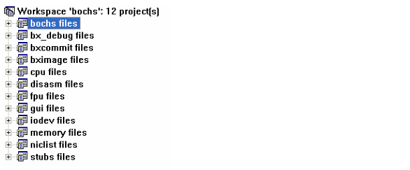
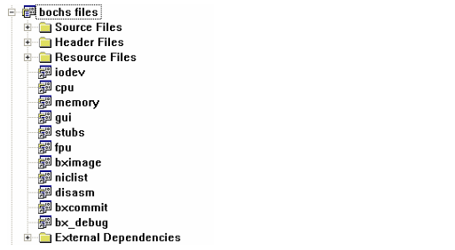
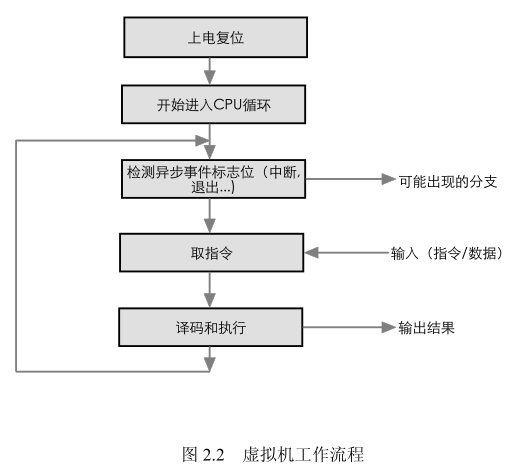

1. 开源Bochs介绍

Bochs是一个用C++写的高移植性的开源IA-32架构的PC模拟器. 它模拟了Intel x86 CPU, 常见IO设备以及一个BIOS. 当前,  Bochs可以编译为模拟386, 486, Pentium, Pentium Pro或AMD64 CPU, 包括可选的MMX, SSESSE和3DNow!指令集. Bochs可以运行的操作系统包括Linux, DOS, Windows. 

Bochs 可以使用不同的模式编译, 有些还在开发之中. 典型的应用就是提供了完整的x86 PC 模拟器, 包括 x86 CPU、硬件设备以及存储器. 

访问 Bochs 的网站 http://bochs.sourceforge.net 得到最新版本. 

2. 版本2.2.1源码组织
 
Bochs 有众多源码版本, 每个版本又有对应不同编译器的工程. 以下以 2.2.1 for VC++版本(Windows 平台编译)做介绍. 

Bochs v2.2.1 总共有 300 多个源文件(.h 和.cpp)约 200,000 行代码, 根目录下是 VC 工程文件(.dsp 和.dsw) 和一些全局头文件如 Bochs.h 和主函数 main 所在的 main.cpp. 

根目录下有以下文件夹: 

- Bios  系统 BIOS 代码
- Bx_debug  Bochs 调试器的代码
- Cpu  模拟 x86 CPU
- Dasm  反汇编, 用于 bochs 调试版本中
- Docs-html  Html 格式的部分文档
- Doc  部分文档
- Font  VGA 字体点阵
- Fpu  浮点处理器
- Gui  图形界面, 和 OS 相关
- Instrument  辅助插件
- Iodev  IO 设备
- Memory  模拟存储器源代码
- Misc  一些其它的部件源代码

用 VC6.0 打开 bochs.dsw 工作区文件, 可以看到工作区的结构: 



整个 Bochs 工作区包括 12 个工程, 其中有些工程编译产生 Bochs 辅助工具, 如 bximage 编译产生 bximage.exe, 该工具用来创建一个虚拟的硬盘. Bochs.exe 是由 bochs 工程编译生成的, 它依赖于其它几个工程, 依赖关系如下: 



因此, 在对 bochs 工程进行编译之前, 先要编译 iodev, cpu, memory 等工程, 生成相应的 lib
供使用. 

3. 工程类结构

Bochs 的绝大多数代码都是C++写出, 因此具有很好的封装性, 可读性也较强. 所有的类继承于 logfunctions 的类, 该类完成了简单的日志功能, 方便调试时输出相关信息. 所有的类中, 三个主要类构成了 Bochs 的基石, 它们是

- BX_CPU_C － 描述 CPU
- BX_MEM_C － 描述储存器
- IO device 的一系列派生类
 
而描述 PC 系统板的类 bx_pc_system_c 将它们连接起来形成一台完整的 PC. 

在 Bochs 中引入了绝大多数的标准 PC 外设, 为了统一外设的接口, Bochs 为每一类设备定义了一个桩(stub)类, stub 中的虚函数提供统一接口, 如存储器读写、I/O 读写等. 这些虚函数的最终实现是由具体设备中的函数完成的. 


4. 主体框架结构分析

4.1 Bochs工程中的重要类

(1) VM控制台界面类

class BOCHSAPI bx_gui_c : public logfunctions

从 bx_gui_c 派生出: 

-  bx_win32_gui_c
-  bx_svga_gui_c
-  bx_term_gui_c
-  bx_sdl_gui_c
-  bx_wx_gui_c
-  bx_rfb_gui_c
-  bx_nogui_gui_c
-  bx_macintosh_gui_c
-  bx_beos_gui_c
-  bx_amigaos_gui_c
-  bx_carbon_gui_c
-  bx_x_gui_c

config.h 中进行配置, 选择一个控制台界面

#define BX_WITH_X11 0  
#define BX_WITH_BEOS 0  
#define BX_WITH_WIN32 1  
#define BX_WITH_MACOS 0  
#define BX_WITH_CARBON 0  
#define BX_WITH_NOGUI 0  
#define BX_WITH_TERM 0  
#define BX_WITH_RFB 0  
#define BX_WITH_AMIGAOS 0  
#define BX_WITH_SDL 0  
#define BX_WITH_SVGA 0  
#define BX_WITH_WX 0  


(2) CPU 模拟

类 BX_CPU_C 用来描述 CPU  
class BOCHSAPI BX_CPU_C : public logfunctions

类 bxInstruction_c 定义一条指令, 无基类

(3 ) Memory 模拟

类 BX_MEM_C  
```
class BOCHSAPI BX_MEM_C : public logfunctions //memory/memory.h  
```

变量  

```
#if BX_PROVIDE_CPU_MEMORY==1  
    #if BX_SMP_PROCESSORS==1
        BOCHSAPI extern BX_MEM_C bx_mem; //外部全局变量
    #else
        BOCHSAPI extern BX_MEM_C *bx_mem_array[BX_ADDRESS_SPACES]; //对多处理器, 使用内存组

    #endif /* BX_SMP_PROCESSORS */
#endif /* BX_PROVIDE_CPU_MEMORY==1 */
```

全局变量 全局变量
```
BOCHSAPI BX_CPU_C bx_cpu;
BOCHSAPI BX_MEM_C bx_mem;
```

(4). I/O device 模拟

1. Class bx_devices_c : public logfunctions

2. Class bx_devmodel_c : public logfunctions // iodev/iodev.h

派生类列表: 
```
bx_busm_stub_c //bus mouse
bx_cmos_stub_c
bx_devmodel_c
bx_dma_stub_c
bx_floppy_stub_c
bx_hard_drive_stub_c
bx_keyb_stub_c
bx_ne2k_stub_c
bx_pci2isa_stub_c
bx_pci_ide_stub_c
bx_pci_stub_c
bx_pic_stub_c
bx_serial_stub_c
bx_speaker_stub_c
bx_usb_stub_c
bx_vga_stub_c
```

4.2 入口函数 main()及 Win32 Gui 初始化

Main.cpp 提供了宏定义用来选择编译器入口函数, 默认的为 main: 

入口函数选择 

```
#if defined(__WXMSW__) WinMain() //使用wxWidgets/win32
#if !defined(__WXMSW__) main()
```

Main 函数: 

```
int main (int argc, char *argv[])
{
    bx_startup_flags.argc = argc; //全局变量, 类型BOCHSAPI, 用于记录命令行参数
    bx_startup_flags.argv = argv;
    #if BX_WITH_SDL && defined(WIN32)
        // if SDL/win32, try to create a console window.
        RedirectIOToConsole ();
    #endif
        return bxmain ();
}
```

函数bxmain()  
...  
调用bx_init_siminterface(); //create the SIM object

```
{ ...
SIM = new bx_real_sim_c();
...}
类 bx_real_sim_c 定 义 在 gui/simuinterface.cpp 中 ,  从 bx_simulator_interface_c 派生(gui/simuinterface.h)
```

5. Bochs的工作方式
 
和实际 CPU 的原理一样, Bochs 虚拟机 CPU 的运行方式为: 取指 -> 执行 -> 输出结果. CPU 复位后进入实模式, EIP = 0x0000FFF0; CS 的 cache 内的 Base= 0xFFFF0000, 两种相加得到 CS:EIP=0xFFFFFFF0, 该位置是 BIOS ROM 所在位置.用户程序从该处开始运行. 进入CPU 循环后, 除了取指和执行工作外, 每次还要检测标志位, 如果没有复位或退出命令, CPU循环将会一直进行下去. 

Bochs虚拟机整个过程如下图所示:



