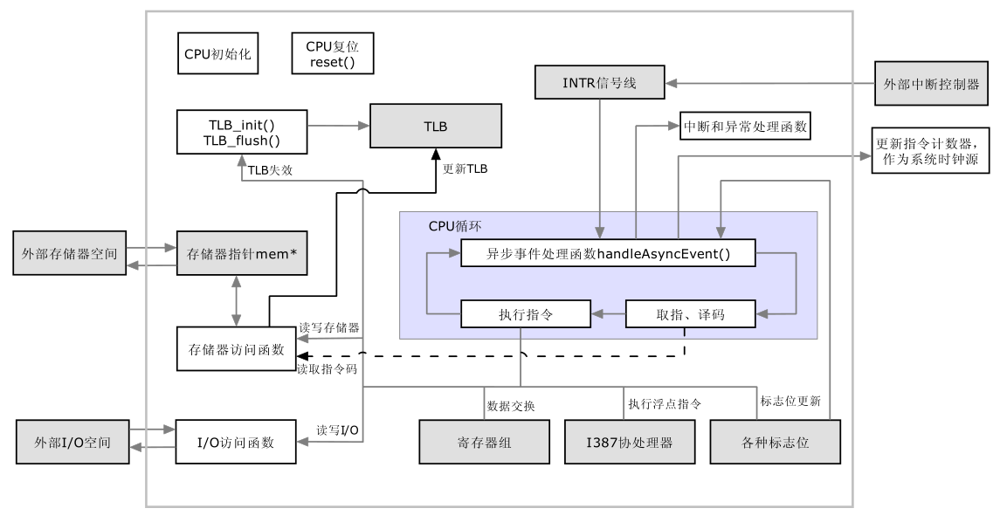

1 CPU类概述

1.1 CPU逻辑结构图

Bochs用BX_CPU_C来描述CPU, 经过阅读源码, 归纳CPU的逻辑结构如下: 

1.2 类 BX_CPU_C 成员归纳

Bochs 描述 CPU 的类名是 BX_CPU_C, 这个类也是 bochs 工程中最复杂的一个类, 其成员变量包括成员变量包括: 

1. 名称和 CPUID
2. 所有的 CPU 寄存器(通用寄存器, 段寄存器, 控制寄存器, 状态字 EFLAG 以及系统数据结构 GDTR 等), 
3. i387 协处理器
4. 指向存储器 mem 的指针
5. 中断标识 EXT 及中断信号线 INTR
6. 异常处理用到的变量(用于恢复执行, 如备份 EIP 使指令能够重新执行)
7. CPU 工作模式(实模式/保护模式)
8. 异步事件标志位
9. TLB, 1024 条目
10. 存放转换后地址的数据单元 address_xlation
11. 指令缓存 iCache
12. 辅助译码/执行的自定义数据
 
成员函数包括: 

1. CPU 初始化函数 init(),各种模式初始化函数 real_mode_int(),protected_mode_int()
2. 指令执行函数, 包括
 - 300 多个执行普通指令的函数
 - 将近 100 个执行浮点指令的函数
 - 50 多个 MMX 指令函数
 - 定义了一些 3Dnow 指令函数原型, 但没有实现
 - 一些 SSE 指令集函数
3. 取指及译码函数
 - 取指函数 fetchDecode()
 - 一系列指令译码函数, 如 Resolve16Mod0Rm0()等
 - 边界取指 boundaryFetch()
 - 取指准备 prefetch()已经其它
4. CPU 循环 cpu_loop()
5. 异步事件处理函数 handleAsyncEvent()
6. 存储器访问函数
 - 读写权限检查 write_virtual_checks, read_virtual_checks()等
 - 读写数据 read_RMW_virtual_byte, write_RMW_virtual_byte()等
7. TLB 相关, 如初始化 TLB 的函数 TLB_init(), TLB 刷新 TLB_flush()  
8. 中断相关, 置 CPU 中断 set_INTR()和中断处理函数 interrupt()  
9. 执行异常处理 exception()  
10. CPU 复位 reset()  
11. IO 访问函数 inp32(),outp32()等  
12. 任务切换 task_switch()  
13. 读写各寄存器的函数  
14. 管理 FPU,MMX 的函数  
15. 其它一些辅助函数  
16. 构造与析构  

