https://blog.csdn.net/wjlkoorey/article/details/52012976

本文主要从进程栈空间的层面复习一下C语言中函数调用的具体过程, 以加深对一些基础知识的理解. 

先看一个最简单的程序: 

```cpp
/*test.c*/
#include <stdio.h>


int foo1(int m,int n,int p)
{
        int x = m + n + p;
        return x;
}

int main(int argc,char** argv)
{
        int x,y,z,result;
        x=11;
        y=22;
        z=33;
        result = foo1(x,y,z);
        printf("result=%d\n",result);
        return 0;
}
```

主函数main里定义了4个局部变量, 然后调用同文件里的foo1()函数. 4个局部变量毫无疑问都在进程的栈空间上, 当进程运行起来后我们逐步了解一下main函数里是如何基于栈实现了对foo1()的调用过程, 而foo1()又是怎么返回到main函数里的. 为了便于观察的粒度更细致一些, 我们对test.c生成的汇编代码进行调试. 如下: 

```
.file "test.c"
        .text
.globl foo1
        .type foo1, @function
foo1:
        pushl %ebp
        movl %esp, %ebp
        subl $16, %esp
        movl 12(%ebp), %eax
        movl 8(%ebp), %edx
        leal (%edx,%eax), %eax
        addl 16(%ebp), %eax
        movl %eax, -4(%ebp)
        movl -4(%ebp), %eax
        leave
        ret
        .size foo1, .-foo1
        .section .rodata
.LC0:
        .string "result=%d\n"
        .text
.globl main
        .type main, @function
main:
        pushl %ebp
        movl %esp, %ebp
        andl $-16, %esp
        subl $32, %esp
        movl $11, 16(%esp)
        movl $22, 20(%esp)
        movl $33, 24(%esp)
        movl 24(%esp), %eax
        movl %eax, 8(%esp)
        movl 20(%esp), %eax
        movl %eax, 4(%esp)
        movl 16(%esp), %eax
        movl %eax, (%esp)
        call foo1
        movl %eax, 28(%esp)
        movl $.LC0, %eax
        movl 28(%esp), %edx
        movl %edx, 4(%esp)
        movl %eax, (%esp)
        call printf
        movl $0, %eax
        leave
        ret
        .size main, .-main
        .ident "GCC: (GNU) 4.4.4 20100726 (Red Hat 4.4.4-13)"
        .section .note.GNU-stack,"",@progbits
```

上面的汇编源代码和最终生成的可执行程序主体结构上已经非常类似了: 

```
[root@maple 1]# gcc -g -m32 -o test test.s

[root@maple 1]# objdump -D test > testbin

[root@maple 1]# vi testbin
 //... 省略部分不相关代码
 80483c0:       ff d0                           call   *%eax
 80483c2:       c9                              leave
 80483c3:       c3                              ret

080483c4:
 80483c4:       55                              push   %ebp
 80483c5:       89 e5                           mov    %esp,%ebp
 80483c7:       83 ec 10                        sub    $0x10,%esp
 80483ca:       8b 45 0c                        mov    0xc(%ebp),%eax
 80483cd:       8b 55 08                        mov    0x8(%ebp),%edx
 80483d0:       8d 04 02                        lea    (%edx,%eax,1),%eax
 80483d3:       03 45 10                        add    0x10(%ebp),%eax
 80483d6:       89 45 fc                        mov    %eax,-0x4(%ebp)
 80483d9:       8b 45 fc                        mov    -0x4(%ebp),%eax
 80483dc:       c9                              leave
 80483dd:       c3                              ret

080483de:
 80483de:       55                              push   %ebp
 80483df:       89 e5                           mov    %esp,%ebp
 80483e1:       83 e4 f0                        and    $0xfffffff0,%esp
 80483e4:       83 ec 20                        sub    $0x20,%esp
 80483e7:       c7 44 24 10 0b 00 00            movl   $0xb,0x10(%esp)
 80483ee:       00
 80483ef:       c7 44 24 14 16 00 00            movl   $0x16,0x14(%esp)
 80483f6:       00
 80483f7:       c7 44 24 18 21 00 00            movl   $0x21,0x18(%esp)
 80483fe:       00
 80483ff:       8b 44 24 18                     mov    0x18(%esp),%eax
 8048403:       89 44 24 08                     mov    %eax,0x8(%esp)
 8048407:       8b 44 24 14                     mov    0x14(%esp),%eax
 804840b:       89 44 24 04                     mov    %eax,0x4(%esp)
 804840f:       8b 44 24 10                     mov    0x10(%esp),%eax
 8048413:       89 04 24                        mov    %eax,(%esp)
 8048416:       e8 a9 ff ff ff                  call   80483c4
 804841b:       89 44 24 1c                     mov    %eax,0x1c(%esp)
 804841f:       b8 04 85 04 08                  mov    $0x8048504,%eax
 8048424:       8b 54 24 1c                     mov    0x1c(%esp),%edx
 8048428:       89 54 24 04                     mov    %edx,0x4(%esp)
 804842c:       89 04 24                        mov    %eax,(%esp)
 804842f:       e8 c0 fe ff ff                  call   80482f4
 8048434:       b8 00 00 00 00                  mov    $0x0,%eax
 8048439:       c9                              leave
 804843a:       c3                              ret
 804843b:       90                              nop
 804843c:       90                              nop
 //... 省略部分不相关代码
```

用GDB调试可执行程序test: 

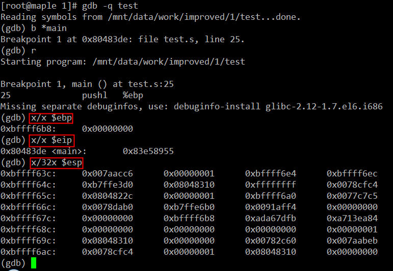

在main函数第一条指令执行前我们看一下进程test的栈空间布局. 因为我们最终的可执行程序是通过glibc库启动的, 在main的第一条指令运行前, 其实还有很多故事的, 这里就不展开了, 以后有时间再细究, 这里只要记住一点: main函数执行前, 其进程空间的栈里已经有了相当多的数据. 我的系统里此时栈顶指针esp的值是0xbffff63c, 栈基址指针ebp的值0xbffff6b8, 指令寄存器eip的值是0x80483de正好是下一条马上即将执行的指令, 即main函数内的第一条指令"push %ebp". 那么此时, test进程的栈空间布局大致如下: 

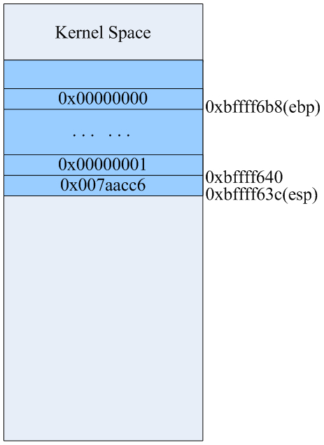

然后执行如下三条指令: 

```
25 pushl %ebp         //将原来ebp的值0xbffff6b8如栈, esp自动增长4字节
26 movl %esp, %ebp    //用ebp保存当前时刻esp的值
27 andl $-16, %esp    //内存地址对其, 可以忽略不计
```

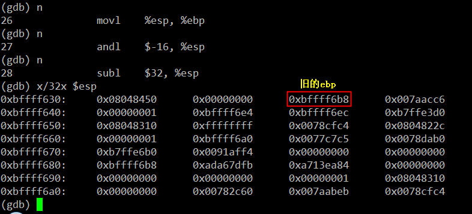

执行完上述三条指令后栈里的数据如上图所示, 从0xbffff630到0xbffff638的8字节是为了实现地址对齐的填充数据. 此时ebp的值0xbffff638, 该地址处存放的是ebp原来的值0xbffff6b8. 详细布局如下: 

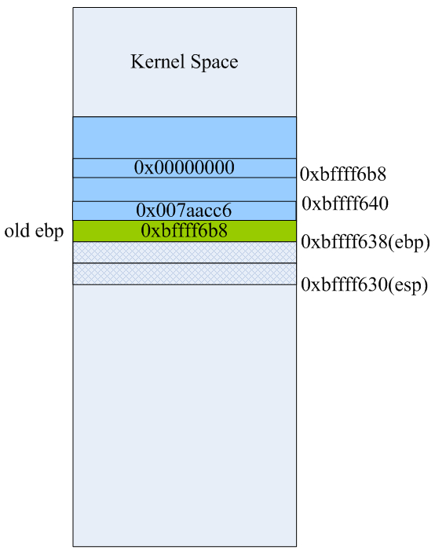

第28条指令"subl  $32,%esp"是在栈上为函数里的本地局部变量预留空间, 这里我们看到main主函数有4个int型的变量, 理论上说预留16字节空间就可以了, 但这里却预留了32字节. GCC编译器在生成汇编代码时, 已经考虑到函数调用时其输入参数在栈上的空间预留的问题, 这一点我们后面会看到. 当第28条指令执行完后栈空间里的数据和布局如下: 

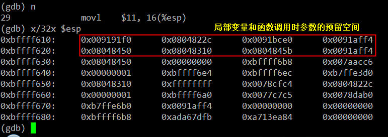

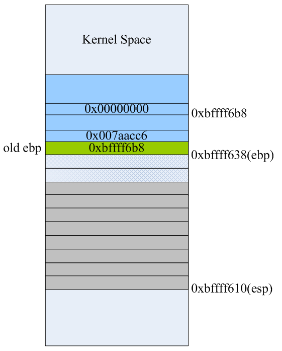

然后main函数里的变量x, y, z的值放到栈上, 就是接下来的三条指令: 

```
29 movl $11, 16(%esp)
30 movl $22, 20(%esp)
31 movl $33, 24(%esp)
```

这是三条寄存器间接寻址指令, 将立即数11, 22, 33分别放到esp寄存器所指向的地址0xbffff610向高位分别偏移16、20、24个字节处的内存单元里, 最后结果如下: 

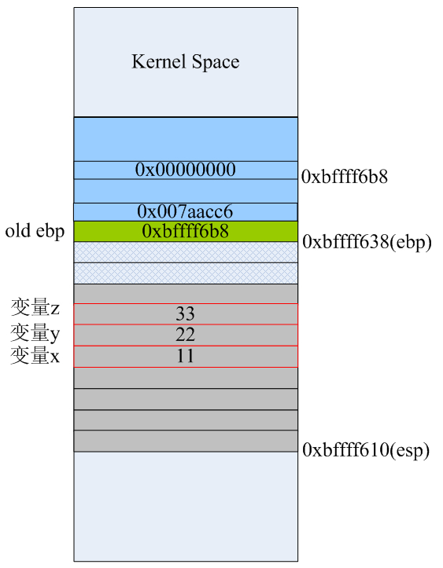

注意: 这三条指令并没有改变esp寄存器的值. 

接下来main函数里就要为了调用foo1函数而做准备了. 由于mov指令的两个操作数不能都是内存地址, 所以要将x, y和z的值传递给foo1函数, 则必须借助通用寄存器来完成, 这里我们看到eax承担了这样的任务: 

```
32 movl 24(%esp), %eax
33 movl %eax, 8(%esp)
34 movl 20(%esp), %eax
35 movl %eax, 4(%esp)
36 movl 16(%esp), %eax
37 movl %eax, (%esp)
```

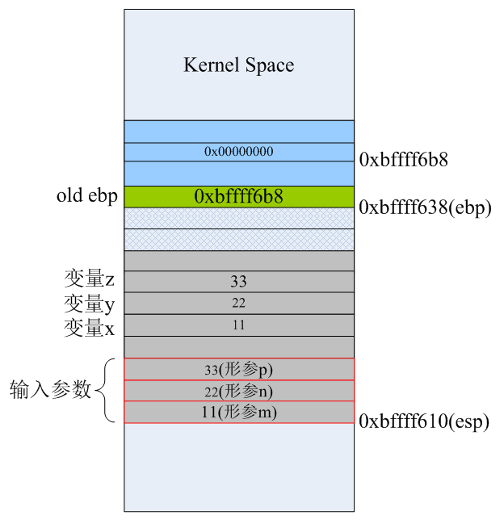

当foo1函数所需要的所有输入参数都已经按正确的顺序入栈后, 紧接着就需要调用call指令来执行foo1函数的代码了. 前面的博文说过, call指令执行时分两步: 首先会将call指令的下一条指令(movl  %eax,28(%esp))的地址(0x0804841b)压入栈, 然后跳转到函数foo1入口处开始执行. 当第38条指令"call foo1"执行完后, 栈空间布局如下: 

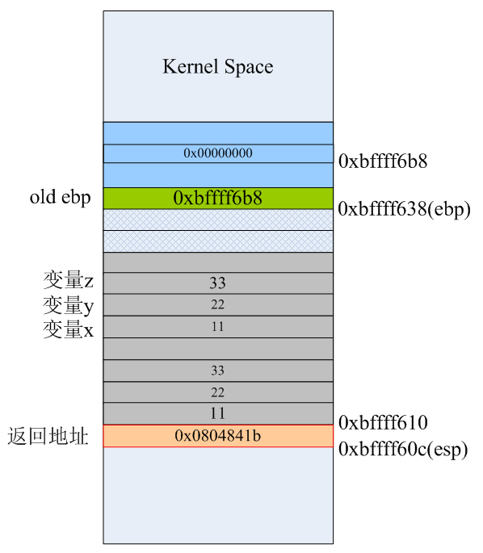

call指令自动将下一条要执行的指令的地址0x0804841b压入栈, 栈顶指针esp自动向低地址处"增长"4字节. 所以, 我们以前在C语言里所说的函数返回地址, 应该理解为: 当被调用函数执行完之后要返回到它的调用函数里下一条马上要执行的代码的地址. 为了便于观察, 我们把foo1函数最后生成指令再列出来: 

```
3 .globl foo1
4           .type foo1, @function
5 foo1:
6           pushl %ebp
7           movl %esp, %ebp
8           subl $16, %esp
9           movl 12(%ebp), %eax
10          movl 8(%ebp), %edx
11          leal (%edx,%eax), %eax
12          addl 16(%ebp), %eax
13          movl %eax, -4(%ebp)
14          movl -4(%ebp), %eax
15          leave
16          ret
17          .size foo1, .-foo1
```

进入到foo1函数里, 开始执行该函数里的指令. 当执行完第6、7、8条指令后, 栈里的数据如下. 这三条指令就是汇编层面函数的"序幕", 分别是保存ebp到栈, 让ebp指向当前栈顶, 然后为函数里的局部变量预留空间: 

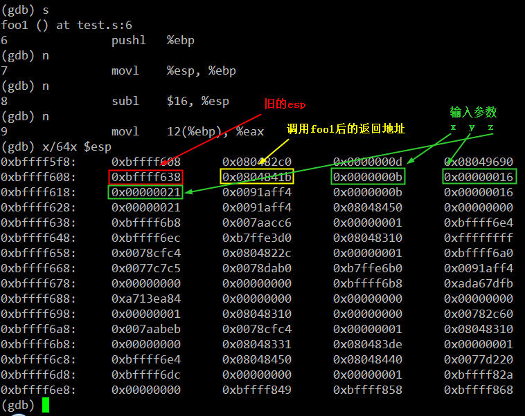

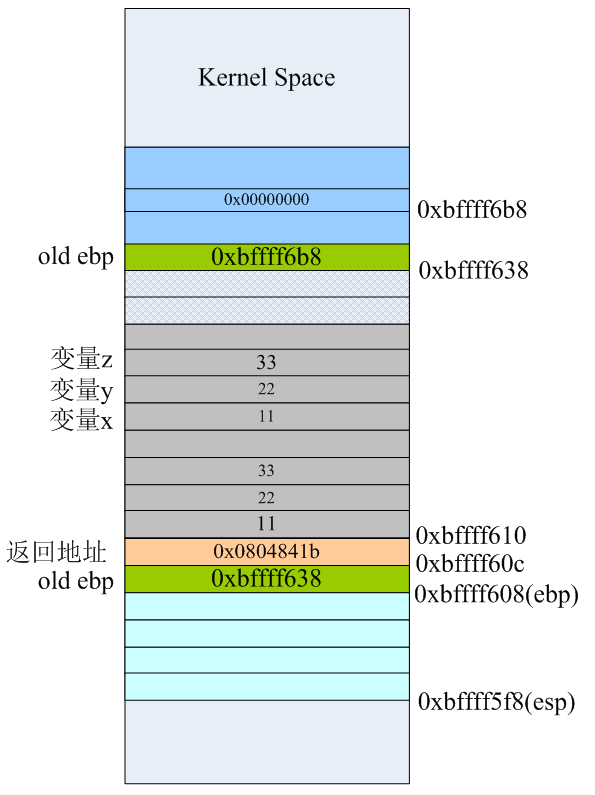

接下来第9和第10条指令, 也并没有改变栈上的任何数据, 而是将函数输入参数列表中的的x和y的值分别转载到eax和edx寄存器, 和main函数刚开始时做的事情一样. 此时eax=22、edx=11. 然后用了一条leaf指令完成x和y的加法运算, 并将运算结果存在eax里. 第12条指令"addl 16(%ebp), %eax"将第三个输入参数p的值, 这里是实参z的值为33, 同样用寄存器间接寻址模式累加到eax里. 此时eax=11+22+33=66就是我们最终要得计算结果. 

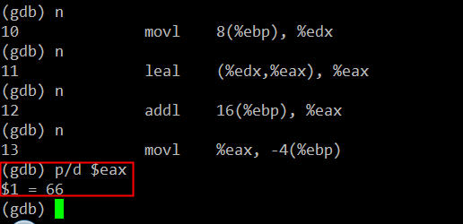

因为我们foo1()函数的C代码中, 最终计算结果是保存到foo1()里的局部变量x里, 最后用return语句将x的值通过eax寄存器返回到mian函数里, 所以我们看到接下来的第13、14条指令有些"多此一举". 这足以说明gcc人家还是相当严谨的, C源代码的函数里如果有给局部变量赋值的语句, 生成汇编代码时确实会在栈上为本地变量预留的空间里的正确位置为其赋值. 当然gcc还有不同级别的优化技术来提高程序的执行效率, 这个不属于本文所讨论的东西. 让我们继续, 当第13、14条指令执行完后, 栈布局如下: 

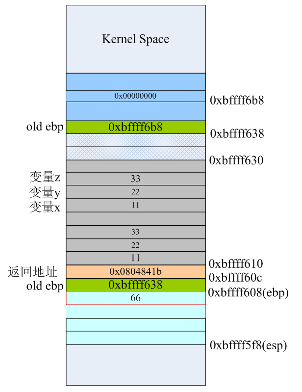

将ebp-4的地址处0xbffff604(其实就是foo1()里的第一个局部参数x的地址)的值设置为66, 然后再将该值复制到eax寄存器里, 等会儿在main函数里就可以通过eax寄存器来获取最终的计算结果. 当第15条指令leave执行完后, 栈空间的数据和布局如下: 

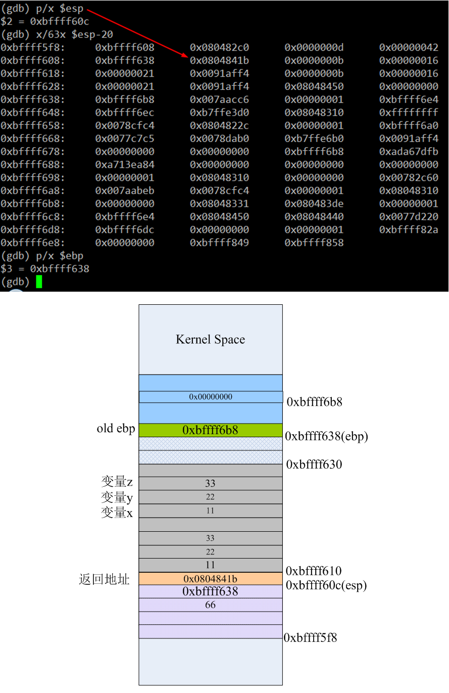

我们发现, 虽然栈顶从0xbffff5f8移动到0xbffff60c了, 但栈上的数据依然存在. 也就是说, 此时你通过esp-8依旧可以访问foo1函数里的局部变量x的值. 当然, 这也是说得通的, 因为函数此时还没有返回. 我们看栈布局可以知道当前的栈顶0xbffff60c处存放的是下一条即将执行的指令的地址, 对照反汇编结果可以看到这正是main函数里的第18条指令(在整个汇编源文件test.s里的行号是39)"movl  %eax, 28(%esp)". leave指令其实完成了两个任务: 
   
1、将栈上为函数预留的空间"收回"; 

2、恢复ebp; 

也就是说leave指令等价于下面两条指令, 你将leave替换成它们编译运行, 结果还是对的: 

```
movl %ebp,%esp
popl %ebp
```

前面我们也说过, ret指令会自动到栈上去pop数据, 相当于执行了"popl %eip", 会使esp增大4字节. 所以当执行完第16条指令ret后, esp从0xbffff60c增长到0xbffff610处, 栈空间结构如下: 

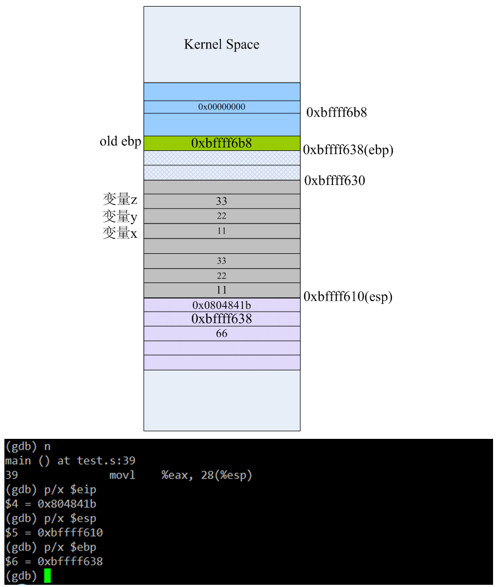

现在已经从foo1里返回了, 但是由于还没执行任何push操作, 栈顶"上部"的数据依旧还是可以访问到了, 即esp-12的值就是foo1里的局部变量x的值、esp-4的值就是函数的返回地址, 当执行第39条指令"movl %eax, 28(%esp)"后栈布局变成下面的样子: 


第39条指令就相当于给main里的result变量赋值66, 如上红线标注的地方. 接下来main函数里要执行printf("result=%d\n",result)语句了, 而printf又是C库的一个常用的输出函数, 这里就又会像前面调用foo1那样, 初始化栈, 然后用"call printf的地址"来调用C函数. 当40~43这4条指令执行完后, 栈里的数据如下: 

```
40 movl $.LC0, %eax
41 movl 28(%esp), %edx
42 movl %edx, 4(%esp)
43 movl %eax, (%esp)
```

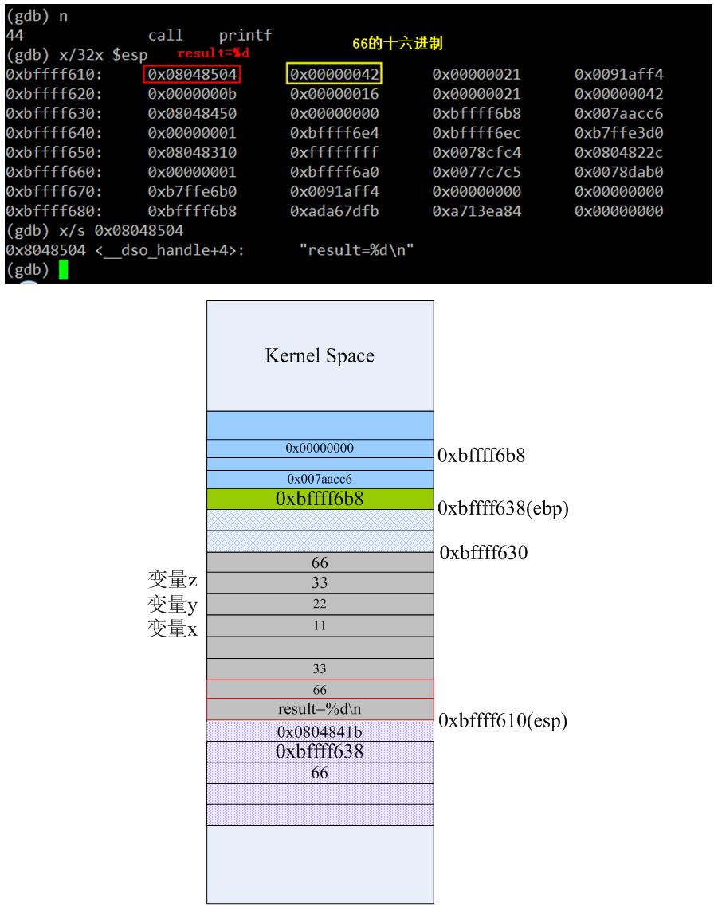

上图为了方便理解, 将栈顶的0x08048504替换了成字符串"result=%d\n", 但进程实际运行时此时栈顶esp的值是字符串所在的内存地址. 当第44条指令执行完后, 栈布局如下: 

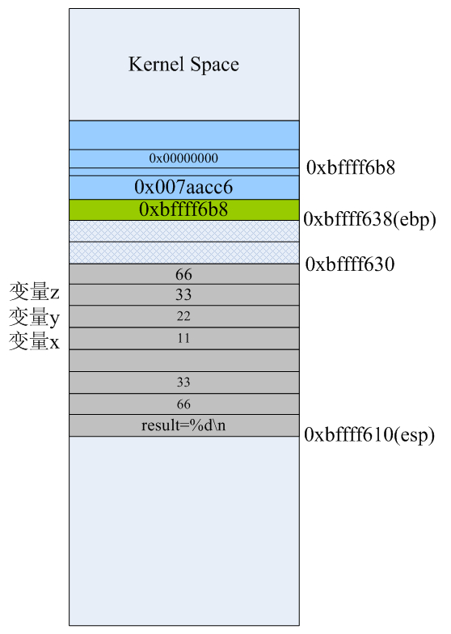

由于此时栈已经用来调用printf了, 所以栈顶0xbffff610"以上"部分的空间里就找不到foo1的任何影子了. 最后在main函数里, 当第46、47条指令执行完后栈的布局分别是: 

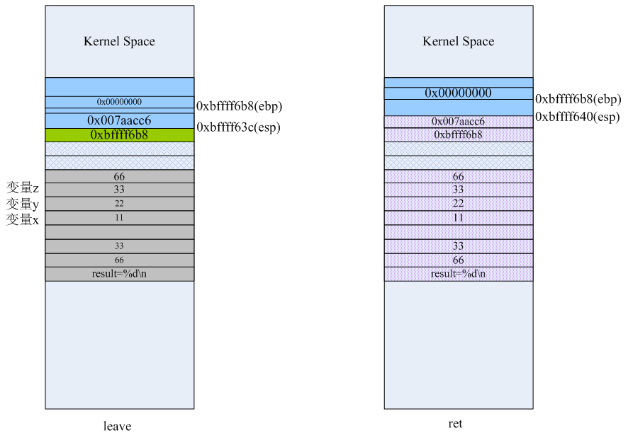

当main函数里的ret执行完, 其实是返回到了C库里继续执行剩下的清理工作. 
   
所以, 最后关于C的函数调用, 我们可以总结一下: 

1、函数输入参数的入栈顺序是函数原型中形参从右至左的原则; 

2、汇编语言里调用函数通常情况下都用call指令来完成; 

3、汇编语言里的函数大部分情况下都符合以下的函数模板: 

```
.globl fun_name
.type fun_name, @function
fun_name:
        pushl %ebp
        movl %esp, %ebp
        <函数主体代码> 
        leave
        ret
```

如果我们有个函数原型: int funtest(int x,int y int z char* ptr), 在汇编层面, 当调用它时栈的布局结构一般是下面这个样子: 

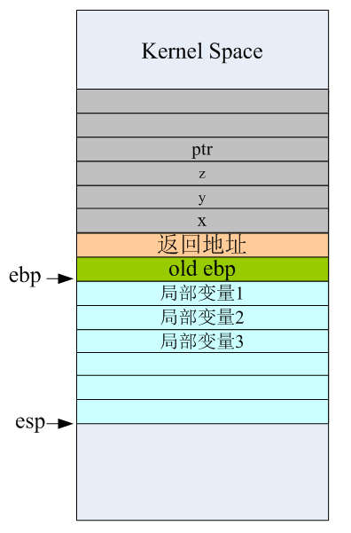

而有些资料上将ebp指向函数返回地址的地方, 这是不对的. 正常情况下应该是ebp指向old ebp才对, 这样函数末尾的leave和ret指令才可以正常工作. 