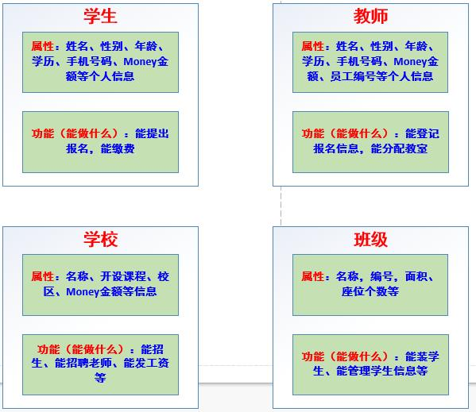

编程思想: 面向过程与面向对象
--------------
　　何谓面向对象?何谓面向过程?对于这编程界的两大思想, 一直贯穿在我们学习和工作当中. 我们知道面向过程和面向对象, 但要让我们讲出来个所以然, 又感觉是不知从何说起, 最后可能也只会说出一句就是那样啦, 你知道啦. 而这种茫然, 其实就是对这两大编程思想的迷糊之处. 本文通过学生到校报道注册的实例, 阐述了面向过程和面向对象两大思想. 希望能对你的学习和工作有所帮助. 

**一、面向过程**
----------
　　首先我们来认识下, 什么是面向过程?如果咬文嚼字的话可以这样来理解, 面向过程就是面向解决问题的过程进行编程. 仔细思考一下, 我们在学习和工作中, 当我们去实现某项功能或完成某项任务时, 是不是会不自觉的按部就班的罗列出我们要做的事情?(如果没有, 建议以后试着步骤化解决问题). 而当我们按着我们罗列的步骤去解决问题时, 实质上就是按照面向过程的思想去解决问题. 我们罗列的步骤就是过程, 按照步骤解决问题就是面向过程. 
　　传统的面向过程的编程思想总结起来就八个字——自顶向下, 逐步细化！实现步骤如下: 
     1. 将要实现的功能描述为一个从开始到结束按部就班的连续的步骤(过程); 
     2. 依次逐步完成这些步骤, 如果某一步的难度较大, 又可以将该步骤再次细化为若干个子步骤, 以此类推, 一直到结束得到想要的结果; 
     3. 程序的主体是函数, 一个函数就是一个封装起来的模块, 可以实现一定的功能, 各个子步骤往往就是通过各个函数来完成的, 从而实现代码的重用和模块化编程！

案例: 学生到校报道注册  
　　　　　　　　　　　　　　**面向过程流程**  

 面向过程, 就是按照我们分析好了的步骤, 按部就班的依次执行就行了！所以当我们用面向过程的思想去编程或解决问题时, 首先一定要把详细的实现过程弄清楚. 一旦过程设计清楚, 代码的实现简直轻而易举. 

**二、面向对象**
----------
　　讨论完了面向过程, 我们再来认识下面向对象. 所谓的面向对象, 就是在编程的时候尽可能的去模拟真实的现实世界, 按照现实世界中的逻辑去处理一个问题, 分析问题中参与其中的有哪些实体, 这些实体应该有什么属性和方法, 我们如何通过调用这些实体的属性和方法去解决问题. 

　　现实世界中, 任何一个操作或者是业务逻辑的实现都需要一个实体来完成, 也就是说, 实体就是动作的支配者, 没有实体, 就肯定没有动作发生！ 
　　现在让我们思考下, 上述注册报名的每一个步骤都有哪些动词?

> 提出 提供 缴 收 获得 分配 增加

　　有动词就一定有实现这个动作的实体！
　　所谓的模拟现实世界, 就是使计算机的编程语言在解决相关业务逻辑的方式, 与真实的业务逻辑的发生保持一致！需要使每一个动作的背后都一个完成这个动作的实体！
　　因为任何功能的实现都是依赖于一个具体的实体的"动作|操作|行动", 可以看作是一个又一个的实体在发挥其各自的"能力"并在内部进行协调有序的调用过程！
　　当采用面向对象的思想解决问题时, 可分为下面几步: 
　　　　1. 分析哪些动作是由哪些实体发出的; 
　　　　2. 定义这些实体, 为其增加相应的属性和功能; 
　　　　3. 让实体去执行相应的功能或动作. 
　　采用面向对象的思想, 解决上面的报名问题, 应该如下: 

**第一步: 分析那些动作是由哪些实体发出的**
 
 - 学生提出报名
 - 学生缴费
 - 机构收费
 - 教师分配教室
 - 班级增加学生信息  

于是, 在整个过程中, 一共有四个实体: 

> 学生、机构、教师、班级！

在现实中的一个具体的实体, 就是计算机编程中的一个对象！  

**第二步: 定义这些实体, 为其增加相应的属性和功能**  
属性就是实体在现实世界中的一些特征表现. 如:   

 - 人的属性: 姓名、性别、身高、三围、体重、电话号码、家庭住址、籍贯等
 - 手机的属性: 品牌、价格、颜色、尺寸、待机时间等  
 
功能就是能完成的动作, 在面向对象的术语中, 动作就叫作方法或者函数. 如:   

 - 人的动作(功能): 吃饭、睡觉、学习、打游戏、走路、跑步、缴费！
 - 手机的动作(功能): 打电话、发短信、拍照、打游戏、视频、看电影等  
 
下图显示了在上述实例中出现的实体以及相应的属性和功能:   
　　　　　　　　　　　　　　**面向对象流程**  

  **第三步: 让实体去执行相应的功能或动作**  
  
 - 学生提出报名
 - 学生缴费
 - 学校收费
 - 教师分配教室
 - 班级增加学生信息

所以说, 面向过程主要是针对功能, 而面向对象主要是针对能够实现该功能的背后的实体. 面向对象实质上就是面向实体, 所以当我们使用面向对象进行编程时, 一定要建立这样一个观念: 万物皆对象！

**三、面向对象和面向过程的比较**
------------------
在我们将面向过程和面向对象讨论完后, 会明显的感觉两者之间有很大的区别. 面向过程简单直接, 易于入门理解, 模块化程度很低. 而面向对象相对于面向过程较为复杂, 不易理解, 模块化程度较高. 可总结为下面三点: 
1. 都可以实现代码重用和模块化编程, 但是面向对象的模块化更深, 数据更加封闭, 也更安全！因为面向对象的封装性更强！
2. 面向对象的思维方式更加贴近于现实生活, 更容易解决大型的复杂的业务逻辑. 
3. 从前期开发角度上来看, 面对对象远比面向过程要复杂, 但是从维护和扩展功能的角度上来看, 面对对象远比面向过程要简单！
如何选择面向对象还是面向过程, 对于一个有着丰富开发经验的老手来说, 这是个得心应手的过程. 而对于一个新手而言, 其实从两者的对比就可以看出, 当我们的业务逻辑比较简单时, 使用面向过程能更快的实现. 但是当我们的业务逻辑比较复杂时, 为了将来的维护和扩展, 还是面向对象更为靠谱点！当然, 当我们被经理催着上交项目时, 不要再选择纠结了, 哪个能让你更快的完成项目就用哪个吧！

