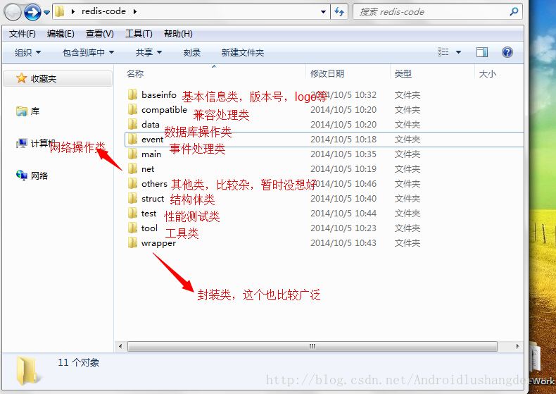

# Redis

>  
http://debugo.com/python-redis/  
Redis源码分析: http://blog.csdn.net/androidlushangderen/article/details/39803337  
github中文源码分析: https://github.com/linyiqun/Redis-Code  
gitbook教程以及命令参考: https://www.gitbook.com/book/wizardforcel/w3school-redis/details

# Redis源码结构解析

分析源码的第一步, 先别急着想着从哪开始看起, 先浏览一下源码结构, 可以模块式的渐入, 不过比较坑爹的是, Redis的源码全部放在在里面的src目录里, 一下90多个文件统统在里面. 所以先将其进行拆分, 按照功能拆分, 大概的拆分结果如下: 

11个包, 这样每个包中的文件就比较可接受了, 但是分出这个类别, 我也是花了一定时间, 思考了下, Redis下的主要的一些文件的特征, 最后定的, 应该算是比较全的了. 

我分析的此Redis源代码是目前最新的代码redis-2.8.17, 确保是最新的, 新加了crc64.c等这些在2.2左右的版本上根本没有,  里面的很多.h头文件被我省掉了, 因为很多同个文件名.h, .c文件都是其实指的是同个功能, 后续, 我将会分模块式分析Redis源代码, 工作的时候根本没时间进行代码级别的研究. 抓紧时间啦, fighting！

在我的github上会持续更新Redis代码的中文分析, 地址送出https://github.com/linyiqun/Redis-Code, 共同学习进步