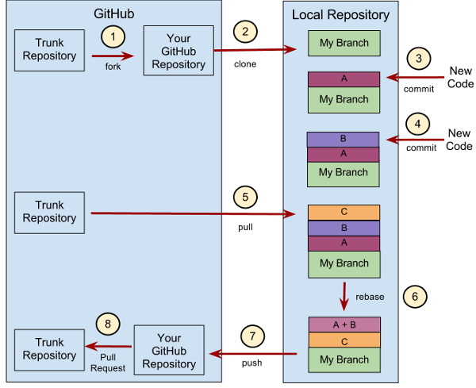

<!-- @import "[TOC]" {cmd="toc" depthFrom=1 depthTo=6 orderedList=false} -->

<!-- code_chunk_output -->

- [1. 背景](#1-背景)
- [2. 第一步: 新建分支](#2-第一步-新建分支)
- [3. 第二步: 提交分支 commit](#3-第二步-提交分支-commit)
- [4. 第三步: 撰写提交信息](#4-第三步-撰写提交信息)
- [5. 第四步: 与主干同步](#5-第四步-与主干同步)
- [6. 第五步: 合并 commit](#6-第五步-合并-commit)
- [7. 第六步: 推送到远程仓库](#7-第六步-推送到远程仓库)
- [8. 第七步: 发出 Pull Request](#8-第七步-发出-pull-request)
- [9. 常用术语](#9-常用术语)
- [10. 参考](#10-参考)

<!-- /code_chunk_output -->

# 1. 背景

下面是 ThoughtBot 的 Git 使用规范流程.

ThoughtBot: https://github.com/thoughtbot/guides/tree/main/git



# 2. 第一步: 新建分支

首先, 每次开发新功能, 都应该新建一个单独的分支

```
# 获取主干最新代码
$ git checkout master
$ git pull

# 新建一个开发分支 myfeature
$ git checkout -b myfeature
```

# 3. 第二步: 提交分支 commit

分支修改后, 就可以提交 commit 了.

```
$ git add --all
$ git status
$ git commit --verbose
```

git add 命令的 all 参数, 表示保存所有变化(包括新建、修改和删除). 从 Git 2.0 开始, all 是 git add 的默认参数, 所以也可以用 `git add .` 代替.

git status 命令, 用来查看发生变动的文件.

git commit 命令的 verbose 参数, 会列出 diff 的结果.

# 4. 第三步: 撰写提交信息

提交 commit 时, 必须给出完整扼要的提交信息, 下面是一个范本.

```
Present-tense summary under 50 characters

* More information about commit (under 72 characters).
* More information about commit (under 72 characters).

http://project.management-system.com/ticket/123
```

第一行是不超过 50 个字的提要, 然后空一行, 罗列出改动原因、主要变动、以及需要注意的问题. 最后, 提供对应的网址(比如 Bug ticket).

# 5. 第四步: 与主干同步

分支的开发过程中, 要经常与主干保持同步.

```
$ git fetch origin
$ git rebase origin/master
```

# 6. 第五步: 合并 commit

分支开发完成后, 很可能有一堆 commit, 但是合并到主干的时候, 往往希望只有一个(或最多两三个)commit, 这样不仅清晰, 也容易管理.

那么, 怎样才能将多个 commit 合并呢? 这就要用到 git rebase 命令.

```
$ git rebase -i origin/master
```

git rebase 命令的 i 参数表示互动(interactive), 这时 git 会打开一个互动界面, 进行下一步操作.

下面采用 Tute Costa 的例子, 来解释怎么合并 commit.

https://robots.thoughtbot.com/git-interactive-rebase-squash-amend-rewriting-history

```
pick 07c5abd Introduce OpenPGP and teach basic usage
pick de9b1eb Fix PostChecker::Post#urls
pick 3e7ee36 Hey kids, stop all the highlighting
pick fa20af3 git interactive rebase, squash, amend

# Rebase 8db7e8b..fa20af3 onto 8db7e8b
#
# Commands:
#  p, pick = use commit
#  r, reword = use commit, but edit the commit message
#  e, edit = use commit, but stop for amending
#  s, squash = use commit, but meld into previous commit
#  f, fixup = like "squash", but discard this commit's log message
#  x, exec = run command (the rest of the line) using shell
#
# These lines can be re-ordered; they are executed from top to bottom.
#
# If you remove a line here THAT COMMIT WILL BE LOST.
#
# However, if you remove everything, the rebase will be aborted.
#
# Note that empty commits are commented out
```

上面的互动界面, 先列出当前分支最新的 4 个 commit(越下面越新). 每个 commit 前面有一个操作命令, 默认是 pick, 表示该行 commit 被选中, 要进行 rebase 操作.

4 个 commit 的下面是一大堆注释, 列出可以使用的命令.

```
pick: 正常选中
reword: 选中, 并且修改提交信息;
edit: 选中, rebase 时会暂停, 允许你修改这个 commit(参考这里)
squash: 选中, 会将当前 commit 与上一个 commit 合并
fixup: 与 squash 相同, 但不会保存当前 commit 的提交信息
exec: 执行其他 shell 命令
```

上面这 6 个命令当中, squash 和 fixup 可以用来合并 commit. 先把需要合并的 commit 前面的动词, 改成 squash(或者 s).

```
pick 07c5abd Introduce OpenPGP and teach basic usage
s de9b1eb Fix PostChecker::Post#urls
s 3e7ee36 Hey kids, stop all the highlighting
pick fa20af3 git interactive rebase, squash, amend
```

这样一改, 执行后, 当前分支只会剩下两个 commit. 第二行和第三行的 commit, 都会合并到第一行的 commit. 提交信息会同时包含, 这三个 commit 的提交信息.

```
# This is a combination of 3 commits.
# The first commit's message is:
Introduce OpenPGP and teach basic usage

# This is the 2nd commit message:
Fix PostChecker::Post#urls

# This is the 3rd commit message:
Hey kids, stop all the highlighting
```

如果将第三行的 squash 命令改成 fixup 命令.

```
pick 07c5abd Introduce OpenPGP and teach basic usage
s de9b1eb Fix PostChecker::Post#urls
f 3e7ee36 Hey kids, stop all the highlighting
pick fa20af3 git interactive rebase, squash, amend
```

运行结果相同, 还是会生成两个 commit, 第二行和第三行的 commit, 都合并到第一行的 commit. 但是, 新的提交信息里面, 第三行 commit 的提交信息, 会被注释掉.

```
# This is a combination of 3 commits.
# The first commit's message is:
Introduce OpenPGP and teach basic usage

# This is the 2nd commit message:
Fix PostChecker::Post#urls

# This is the 3rd commit message:
# Hey kids, stop all the highlighting
```

Pony Foo 提出另外一种合并 commit 的简便方法, 就是先撤销过去 5 个 commit, 然后再建一个新的.

```
$ git reset HEAD~5
$ git add .
$ git commit -am "Here's the bug fix that closes #28"
$ git push --force
```

squash 和 fixup 命令, 还可以当作命令行参数使用, 自动合并 commit.

```
$ git commit --fixup
$ git rebase -i --autosquash
```

这个用法请参考这篇文章, 这里就不解释了.

# 7. 第六步: 推送到远程仓库

合并 commit 后, 就可以推送当前分支到远程仓库了.

```
$ git push --force origin myfeature
```

git push 命令要加上 force 参数, 因为 rebase 以后, 分支历史改变了, 跟远程分支不一定兼容, 有可能要强行推送(参见这里).

# 8. 第七步: 发出 Pull Request

提交到远程仓库以后, 就可以发出 Pull Request 到 master 分支, 然后请求别人进行代码 review, 确认可以合并到 master.

# 9. 常用术语

* WIP   Work in progress, do not merge yet. // 开发中
* LGTM Looks good to me. // Riview 完别人的 PR , 没有问题
* PTAL Please take a look. // 帮我看下, 一般都是请别人 review 自己的 PR
* CC Carbon copy // 一般代表抄送别人的意思
* RFC  —  request for comments. // 我觉得这个想法很好, 我们来一起讨论下
* IIRC  —  if I recall correctly. // 如果我没记错
* ACK  —  acknowledgement. // 我确认了或者我接受了,我承认了
* NACK/NAK — negative acknowledgement. // 我不同意

# 10. 参考

http://www.ruanyifeng.com/blog/2015/08/git-use-process.html
