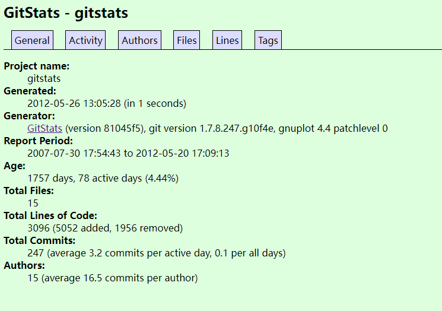

https://developer.aliyun.com/article/730300

https://blog.csdn.net/weixin_43642751/article/details/129141421

# 简介

官方文档: https://gitstats.sourceforge.net/

GitStats 是基于 Git 的数据统计生成器, 目前输出格式仅仅为 HTML.

# 特性

生成的内容包括: 

* 常规信息: 文件总数、行数、提交数、作者数

* 活跃度: 按小时、日期、月度、年度统计提交量

* 贡献度: 作者列表(姓名、提交次数、首次提交日期、最后提交日期)、月度作者、年度作者

* 文件量: 按日期、扩展名列出的文件计数

* 代码量: 按日期列出的代码行

# 示例

https://gitstats.sourceforge.net/examples/



# 运行环境

* Git

* Python

* Gnuplot

# 使用gitstats

克隆源码到本地: 

```
git clone git://github.com/hoxu/gitstats.git
```

进入 gitstats 目录,  拷贝 gitstats 为 gitstats.py: 

```
cp gitstats gitstats.py
```

统计目标文件夹"复制地址", 选择一个存放结果的文件夹"复制地址", 在 gitstats 目录执行命令: 

```
python gitstats.py 本地项目地址 结果存放地址
```

待运行完成后, 进入结果存放文件夹, 浏览器打开 index.html 文件即可查看统计结果

# 附: 通过GitLab API获取统计数据

官方文档: [REST API resources | GitLab](https://docs.gitlab.com/ee/api/api_resources.html)

进入 GitLab 账户"设置"生成访问令牌(private_token)
公共参数: `page`(页码, 默认1)、`per_page`(每页条数, 默认20, 上限100)

* 获取所有用户信息的接口: `[仓库地址]/api/v4/users?private_token=[访问令牌]`

* 根据用户id获取events数据的接口: `[仓库地址]/api/v4/users/[用户id]/events?private_token=[访问令牌]`

* 获取所有可见项目信息的接口: `[仓库地址]/api/v4/projects?private_token=[访问令牌]`