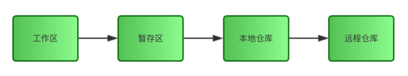
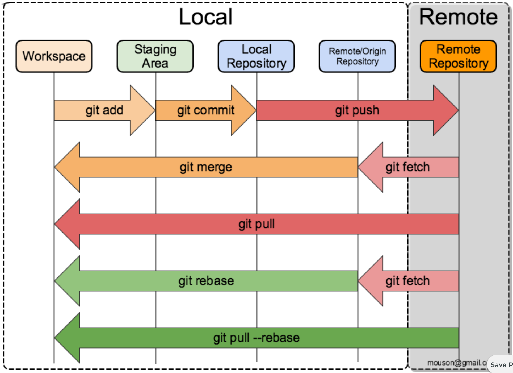

<!-- @import "[TOC]" {cmd="toc" depthFrom=1 depthTo=6 orderedList=false} -->

<!-- code_chunk_output -->

- [1. 基本概念](#1-基本概念)
  - [1.1. 3 个步骤](#11-3-个步骤)
  - [1.2. 4 个区](#12-4-个区)
- [2. 检查修改内容](#2-检查修改内容)
  - [2.1. 已修改, 未暂存](#21-已修改-未暂存)
  - [2.2. 已暂存, 未提交](#22-已暂存-未提交)
  - [2.3. 已提交, 未推送](#23-已提交-未推送)
- [3. 撤销修改](#3-撤销修改)
  - [3.1. 已修改, 未暂存](#31-已修改-未暂存)
  - [3.2. 已暂存, 未提交](#32-已暂存-未提交)
  - [3.3. 已提交, 未推送](#33-已提交-未推送)
  - [3.4. 已推送](#34-已推送)
- [4. 没有 traced 文件](#4-没有-traced-文件)
  - [4.1. 用法](#41-用法)
- [5. 总结](#5-总结)
- [6. 参考](#6-参考)

<!-- /code_chunk_output -->

# 1. 基本概念

## 1.1. 3 个步骤



正常情况下, 我们的工作流就是 3 个步骤, 对应上图中的 3 个箭头线:

```
git add .
git commit -m "comment"
git push
```

- `git add .`把所有文件放入暂存区;
- `git commit`把所有文件从暂存区提交进本地仓库;
- `git push`把所有文件从本地仓库推送进远程仓库.

## 1.2. 4 个区

- 工作区(Working Area)
- 暂存区(Stage)
- 本地仓库(Local Repository)
- 远程仓库(Remote Repository)

# 2. 检查修改内容

## 2.1. 已修改, 未暂存

```
git diff
```

## 2.2. 已暂存, 未提交

```
git diff --cached [filename]
```

git diff 这个命令只检查我们的工作区和暂存区之间的差异, 如果我们想看到暂存区和本地仓库之间的差异, 就需要加一个参数 git diff --cached.

## 2.3. 已提交, 未推送

```
git diff master origin/master [filename]
```

在这里, master 就是你的本地仓库, 而`origin/master`就是你的远程仓库, master 是主分支的意思, 因为我们都在主分支上工作, 所以这里两边都是 master, 而 origin 是远程.

# 3. 撤销修改

## 3.1. 已修改, 未暂存

```
git checkout .
```

或者

```
git reset --hard
```

一对反义词 git add .的反义词是 git checkout .. 做完修改之后, 如果你想向前走一步, 让修改进入暂存区, 就执行 git add ., 如果你想向后退一步, 撤销刚才的修改, 就执行 git checkout ..

## 3.2. 已暂存, 未提交

```
git reset
git checkout .
```

或者

```
git reset --hard
```

git reset 只是把修改退回到了 git add .之前的状态, 也就是说文件本身还处于**已修改未暂存**状态, 你如果想退回未修改状态, 还需要执行 git `checkout .`.

## 3.3. 已提交, 未推送

```
git reset --hard origin/master
```

## 3.4. 已推送

先恢复本地仓库, 再强制 push 到远程仓库.

```
git reset --hard HEAD^
git push -f
```

# 4. 没有 traced 文件

`git clean`经常和`git reset --hard`一起结合使用. 记住**reset 只影响被 track 过的文件**, 所以需要 clean 来删除没有 track 过的文件. 结合使用这两个命令能让你的工作目录完全回到一个指定的`<commit>`的状态

## 4.1. 用法

`git clean -n`

是一次 clean 的演习, 告诉你哪些文件会被删除. 记住他不会真正的删除文件, 只是一个提醒

`git clean -f`

删除当前目录下**所有没有 track 过的文件**. **不会**删除`.gitignore`文件里面指定的文件夹和文件, 不管这些文件有没有被 track 过

`git clean -f <path>`

删除指定路径下的没有被 track 过的文件

`git clean -df`

删除当前目录下没有被 track 过的**文件和文件夹**

`git clean -xf`

删除当前目录下所有没有 track 过的文件. 不管他是否是.gitignore 文件里面指定的文件夹和文件

`git clean`对于刚编译过的项目也非常有用. 如, 他能轻易删除掉编译后生成的.o 和.exe 等文件. 这个在打包要发布一个 release 的时候非常有用

# 5. 总结

以上 4 种状态的撤销我们都用到了同一个`命令 git reset --hard`, 前 2 种状态的用法甚至完全一样, 所以只要掌握了`git reset --hard`这个命令的用法, 从此你再也不用担心提交错误了.

要删除所有工作目录下面的修改, 包括新添加的文件, 结合使用

```
git reset --hard
git clean -df
```

这两个结合使用, 能让你的工作目录完全回退到最近一次 commit 的时候

# 6. 参考

来源: 张京

www.fengerzh.com/git-reset/


