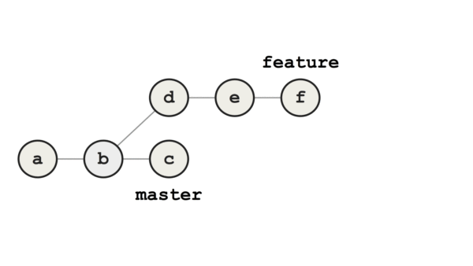
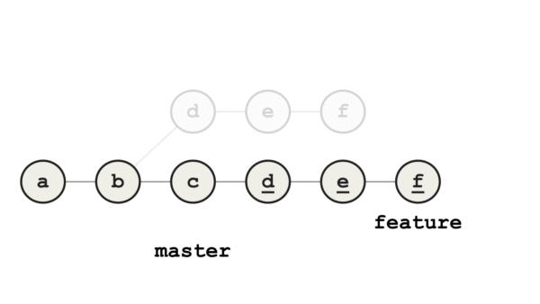
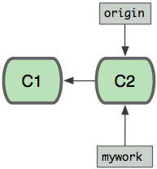
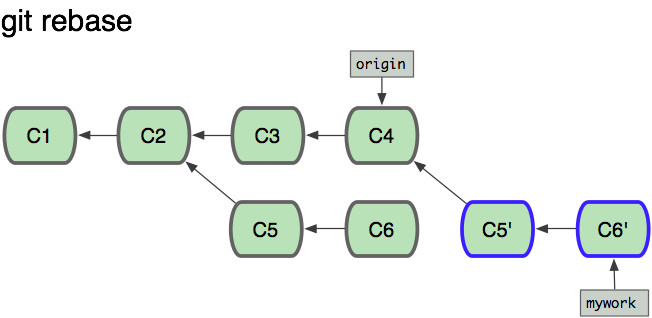
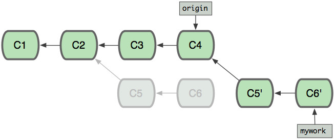
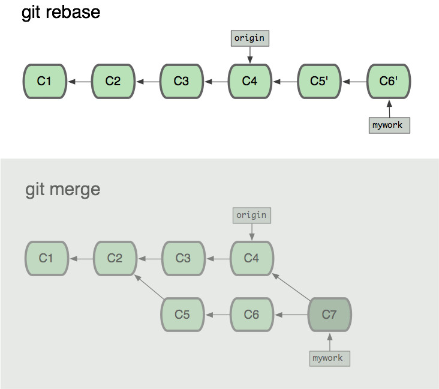
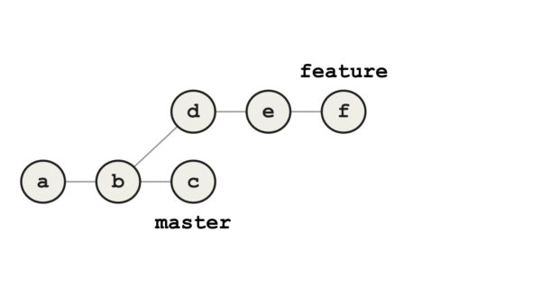
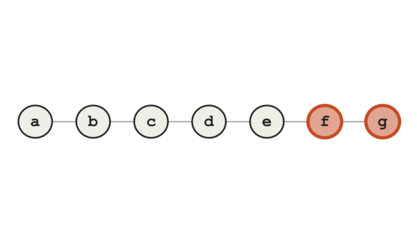
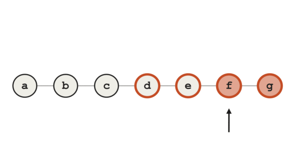

<!-- @import "[TOC]" {cmd="toc" depthFrom=1 depthTo=6 orderedList=false} -->

<!-- code_chunk_output -->

- [1. 作用](#1-作用)
- [2. 操作](#2-操作)
  - [2.1. merge](#21-merge)
  - [2.2. rebase](#22-rebase)
- [3. 原理](#3-原理)
  - [3.1. merge](#31-merge)
  - [3.2. rebase](#32-rebase)
    - [3.2.1. 解决冲突](#321-解决冲突)
- [4. git rebase 和 git merge 的区别](#4-git-rebase-和-git-merge-的区别)
- [5. 参考](#5-参考)

<!-- /code_chunk_output -->

# 1. 作用

将 feature 分支合并到 master 分支.

# 2. 操作

## 2.1. merge

git merge 是用来合并两个分支的.

```
# 将 feature 分支合并到当前分支
git merge feature
```



## 2.2. rebase

同样 `git rebase feature`, 也是把 feature 分支**合并到当前分支**. 提交会被移除, 并且 **feature 分支**被重置到 master 分支, feature 分支上的提交被重新应用到 master.

差别在于这些重新应用的提交通常是**原始的副本**, 它们的 `SHA-1` 值和原来的提交不一样.


我们现在将 feature 的基础提交从 b 变为了 c, 这就是 rebase 的意思. 将 feature 合并到 master 是一个快进合并, 因为在 feature 上的所有提交都是 master 的直接子代.

快进合并的案例:



# 3. 原理

他们的 原理 如下:

假设你现在基于远程分支 "origin", 创建一个叫 "mywork" 的分支.

```
$ git checkout -b mywork origin
```

假设远程分支 "origin" 已经有了 2 个提交, 如图



现在我们在这个分支做一些修改, 然后生成两个提交(commit).

```
$ vi file.txt
$ git commit
$ vi otherfile.txt
$ git commit
...
```

但是与此同时, 有些人也在 "origin" 分支上做了一些修改并且做了提交了. 这就意味着 "origin" 和 "mywork" 这两个分支各自"前进"了, 它们之间"分叉"了.


## 3.1. merge

在这里, 你可以用 "**pull**" 命令把 "**origin**" 分支上的**修改**拉下来并且和你的修改**合并**; 结果看起来就像一个**新**的"**合并的提交**"(merge commit):


## 3.2. rebase

但是, 如果你想让 "mywork" 分支历史看起来**像没有经过任何合并**一样, 你也许可以用 git rebase:

```
$ git checkout mywork
$ git rebase origin
```

这些命令会把你的 "**mywork**" 分支里的**每个提交**(commit)**取消**掉, 并且把它们**临时保存**为补丁(**patch**)(这些补丁放到 "`.git/rebase`" 目录中), 然后把 "**mywork**" 分支**更新**为最新的 "origin" 分支, 最后把**保存的这些补丁应用**到 "mywork" 分支上.



当'mywork'分支更新之后, 它会指向这些**新创建的提交**(commit),而那些**老的提交**会**被丢弃**.  如果运行垃圾收集命令(pruning garbage collection), 这些被丢弃的提交就会删除. (请查看 git gc)



rebase 会导致线性的历史没有分支

### 3.2.1. 解决冲突

在 rebase 的过程中, 也许会出现**冲突**(conflict).

在这种情况, Git 会**停止 rebase**并会让你去解决冲突;

在解决完冲突后, 用 "`git add`" 命令去**更新这些内容的索引**(index), 然后, 你**无需执行** `git commit`,只要执行:

```
$ git rebase --continue
```

这样 git 会继续应用(apply)余下的补丁.

在任何时候, 你可以用 `--abort` 参数来**终止 rebase 的行动**, 并且 "mywork" 分支会回到 **rebase 开始前的状态**.

```
$ git rebase --abort
```

# 4. git rebase 和 git merge 的区别

现在我们可以看一下用 merge和 rebase 所产生的历史的区别:



当我们使用 Git log 来参看 commit 时, 其 commit 的顺序也有所不同.

假设 C3 提交于 9:00AM, C5 提交于 10:00AM, C4 提交于 11:00AM, C6 提交于 12:00AM,

对于使用 git merge 来合并所看到的 commit 的顺序(从新到旧)是: C7 ,C6,C4,C5,C3,C2,C1

对于使用 git rebase 来合并所看到的 commit 的顺序(从新到旧)是: C7 ,C6',C5',C4,C3,C2,C1

因为 C6' 提交只是 C6 提交的克隆, C5' 提交只是 C5 提交的克隆, 从用户的角度看使用 git rebase 来合并后所看到的 commit 的顺序(从新到旧)是: C7 ,C6,C5,C4,C3,C2,C1


rebase 会导致线性的历史没有分支. 此外如果 rebase 过程中发生了冲突, 还可能会引入更多的问题. 作者推荐使用 git merge.

和 merge 的方法比较起来, rebase 导致分支的历史都是线性的. 我以前更喜欢在合并之前 rebase 分支的原因在于提高了可读性, 我认为其他的开发者应该也是这种情况.

但是, 这种方式带来了一些不是很明显的挑战.

考虑一下这种情况, **有一个依赖**在 master 上**被移除**了, 但在**feature**上还**在使用**. 当 feature 分支 rebase 到 master 上时, 第一个重新应用的提交会打破你的构建, 但只要没有合并冲突, rebase 就不会被中断. 从第一个提交出现的错误会保留在随后的所有提交中, 这导致了一个链式的错误提交.

这个错误只会在 rebase 完成后才会被发现, 并且通常会在顶部增加一个修复 bug 的提交 g.

rebase 失败的案例:



如果你在 rebase 过程中出现了冲突, Git 将会暂停在冲突的提交上, 允许你在开始之前解决冲突. 在一系列的提交中间解决冲突通常会让人困惑, 难以改正, 并且可能会导致额外的错误.

引入错误是在 rebase 过程中发生的. 这样, 当你重写历史的时候, 新的错误就会被引入, 它们可能会掩盖第一次写入历史时造成的真正的错误, 尤其是使得我们使用 Git bisect 时会变得更加困难. Git bisect 可以说是 Git 工具箱中最强大的调试工具了. 例如, 思考一下下面的 feature 分支, 我们假设在分支的末端引入了一个错误.

为了找到引入错误的提交, 你可能会搜索几十个甚至上百个提交. 这个过程可以通过编写测试错误存在的脚本来自动执行, 并通过 Git bisect 使用命令

```
git bisect run <yourtest.sh>
```

来运行.

Bisect 会通过二分查找整个历史, 识别出引入 bug 的提交. 在上面展示的案例中, 它成功地找到第一个错误的提交, 因为所有的有问题的提交包含着我们正在寻找的真正的错误.



另一方面, 如果我们在 rebase 过程中引入了额外的错误提交(下图的 d 和 e), bisect 将会遇到麻烦. 这个例子中, 我们希望 Git 识别出 f 提交, 但它会错误地识别出 d, 因为它包含了其他的错误打破了测试.



这个问题比看起来更大.

我们为什么要使用 Git ?因为它是我们追踪我们代码中错误来源最重要的工具. Git 是我们的安全网. 通过 rebase 虽然能够达成线型历史, 但我们会给予较少的优先权.

回顾一下, 我必须使用 bisect 追踪系统中上百个提交. 这个错误的提交在一条未编译的提交链中间, 因为一个错误的 rebase. 这个不必要的并且今天可以避免的错误导致我花了一天的时间来追踪提交.

所以, 我们怎样才能避免在 rebase 过程中出现错误的提交链呢?一个方法是在 rebase 结束后, 测试代码来发现错误, 然后回到我们引进错误的地方修复它. 另一个方法是, 在 rebase 过程中暂停每一个步骤, 在继续处理之前测试并修复它.

这是一个笨重的, 并且容易犯错的过程. 这么做的唯一结果是获得一个线型的历史. 还有更简单, 更好的方式吗?

答案是: `Git merge`. 它是一个简单的, 一步到位的过程, 所有的冲突都可以在一个单一的提交中解决. 合并的提交清晰地显示了我们的分支之间的交互点, 并且我们的历史叙述了实际上 发生的和 什么时候 发生的.

综上所述, 推荐使用 **merge** 而**不是 rebase**. 保持我们历史的真实性是不可低估的.

# 5. 参考

https://blog.csdn.net/wh_19910525/article/details/7554489

https://blog.csdn.net/u010312474/article/details/89566787 (none)

https://zhuanlan.zhihu.com/p/29682134

在开发过程中使用 git rebase 还是 git merge, 优缺点分别是什么? - 知乎: https://www.zhihu.com/question/36509119


多人协同工作应该用 merge, 一个人写代码可以用 rebase.

merge 会产生分支, 然而从版本管理的角度, 多人的工作本来就应该位于不同的分支. 单纯为了线条好看而扭曲了实际开发过程中的事实, 并不是可取的行为.

如果需要 merge, 本来就是因为在你提交之前有别人修改了代码, 那么别人的代码事实上确实就是与你并行修改. 从流程上讲, 别人的代码与你并行修改, 并且同时都基于某个早先的基线版本, 那么这样的两组修改就确实应该位于不同的分支. 分支归并正确的显示了多人协同开发过程中实际发生的客观事实.

因此显然应该选择 merge, 版本管理软件的职责就是准确的记录开发历史上发生过的所有事情, merge 能确保你基于修改的基点忠实的反应了情况, 这种情况下 merge 肯定是更准确的.

但如果是你自己一个人写的代码, 多余出来的分支确实是不必要的, 本来就应该把线整理成线性. 那么确实可以考虑使用 rebase. ——这种情况下一般发生于自己一个人使用了多台电脑, 多台电脑各有不同的未提交代码的情形, 建议考虑 rebase.

结论重复一下: 归并目标是他人代码, 用来解决两个不同开发者开发的代码冲突的时候, 用 merge, 归并目标是自己代码, 用来解决自己在两台不同电脑上修改代码的冲突的时候, 用 rebase.

