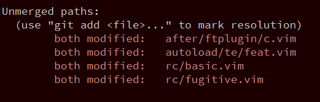

1. 基于当前分支(以master为例)创建一个新的分支并且切换过去, 用于后续操作

```
git checkout -b remote-master master
```

2. 拉取其他仓库的 master 分支, 合并到当前分支 (remote-master)

```
git pull https://github.com/tracyone/vinux.git master
```

此时会产生冲突, 会提示相关文件冲突, 如下:


同时, 通过 `git status` 也可以查看到冲突的文件



3. 查看上面提示的那几个文件并且修复


其中 `<<<<<<< HEAD` 到 `=======` 中间的内容是 local 提交的. 

`=======` 到 `>>>>>>> commit-id` 是远程仓库中的内容. 

4. 对刚才冲突的文件进行 git add 操作, 然后 git commit

```
git add after/ftplugin/c.vim autoload/te/feat.vim rc/basic.vim rc/fugitive.vim
```

```
git commit -s
```

5. 切换回 master 分支

```
git switch master
```

6. 把刚才的分支 merge 到当前分支

```
git merge remote-master
```

7. push 到远程

```
git push origin master
```