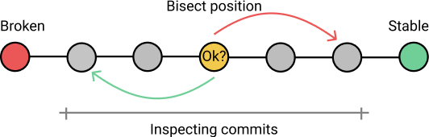

<!-- @import "[TOC]" {cmd="toc" depthFrom=1 depthTo=6 orderedList=false} -->

<!-- code_chunk_output -->

- [1. 作用](#1-作用)
- [2. 原理](#2-原理)
- [3. 操作](#3-操作)
- [4. 参考](#4-参考)

<!-- /code_chunk_output -->

# 1. 作用

git bisect是一个很有用的命令, 用来查找哪一次代码提交引入了错误. 

# 2. 原理



它的原理很简单, 就是将代码提交的历史, 按照两分法不断缩小定位. 所谓"两分法", 就是将代码历史一分为二, 确定问题出在前半部分, 还是后半部分, 不断执行这个过程, 直到范围缩小到某一次代码提交. 

# 3. 操作

首先, 检查一下代码提交历史. 

```
git log --pretty=oneline
```

可以看到, 这个库一共有101次提交. 最早的第一次提交的哈希是`4d83cf`. 

`git bisect start`命令启动查错, 它的格式如下. 

```
git bisect start [终点] [起点]
```

上面代码中, "**终点**"是**最近的提交**, "起点"是**更久以前的提交**. 它们之间的这段历史, 就是**差错的范围**. 

这个例子中, 我们选择全部的代码历史. 起点是第一次提交4d83cf, 终点是最近一次的HEAD. 当然, 指定其他范围也可以. 

```
git bisect start HEAD 4d83cf
```

执行上面的命令以后, 代码库就会切换到这段范围**正当中的那一次提交**, 本例是第51次提交. 

验证可用性, 发现可以正常递增. 使用git bisect good命令, 标识本次提交(第51次)没有问题. 

```
git bisect good
```

既然第51次提交没有问题, 就意味着错误是在代码历史的后半段引入的. 执行上面的命令, Git 就自动切换到后半段的中点(第76次提交). 

验证可用性, 发现可以不能正常递增. 使用git bisect bad命令, 标识本次提交(第76)有问题. 

```
git bisect bad
```

执行上面的命令以后, Git 就自动切换到第51次到第76次的中点(第63次提交). 

接下来, 不断重复这个过程, 直到成功找到出问题的那一次提交为止. 这时, Git 会给出如下的提示. 

```
b47892 is the first bad commit
```

既然找到那个有问题的提交, 就可以检查代码, 确定具体是什么错误. 

然后, 使用`git bisect reset`命令, **退出查错**, 回到最近一次的代码提交. 

```
git bisect reset
```

现在就可以开始修复错误了. 

# 4. 参考

http://www.ruanyifeng.com/blog/2018/12/git-bisect.html