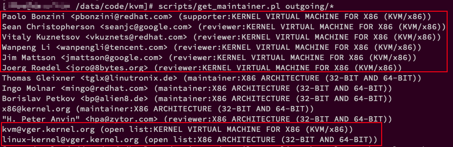

1. 修改代码


2. 提交时使用`-s`参数进行签名

```
git commit -s
```

3. 生成补丁

使用`git format-patch`命令生成

对于 **1 个 commit**, **不需要 cover letter**

```
git format-patch -M origin/queue -o outgoing/
```

`-M` 选项允许 Git 检查是否有**对文件重命名**的提交

对于**原型相关**的代码开发, 使用**RFC 前缀**

```
git format-patch --subject-prefix=RFC
```

对于**多个 commit**, **需要 cover letter**

```
git format-patch -M origin/master -o outgoing/ --numbered --cover-letter

git format-patch -2 --cover-letter -o outgoing/
```

`-n`或`--numbered`, Name output in [PATCH n/m] format, even with a single patch.

第二次发布的时候, 需要使用-v 2 参数

```
git format-patch -M origin/master -o outgoing/ --numbered --cover-letter -v 2
```

4. 检查补丁格式

```
scripts/get_maintainer.pl outgoing/*
```

5. 配置 send-mail, 强烈建议使用命令, 不要直接改 config, 因为可能涉及格式问题

```
git config --global user.name "Haiwei Li"
git config --global user.email lihaiwei.kernel@gmail.com
git config --global sendemail.smtpserver smtp.gmail.com
git config --global sendemail.smtpuser lihaiwei.kernel@gmail.com
git config --global sendemail.smtpserverport 587
git config --global sendemail.smtpencryption tls
```

```conf
# ~/.gitconfig
[sendemail]
	from = lihaiwei.kernel@gmail.com
	smtpserver = smtp.gmail.com
	smtpserverport = 587
	smtpencryption = tls
	smtpuser = lihaiwei.kernel@gmail.com
	smtppass = "XXX"
	suppresscc = self
	chainreplyto = false
```

6. 获取 maintainer

```
scripts/get_maintainer.pl outgoing/*
```

7. 发送布丁



这里面不用发送/抄送 x86 architecture 的相关人员, 只需要发送/抄送图中圈出来的即可

>
>sudo git send-email --to linux-kernel@vger.kernel.org,kvm@vger.kernel.org --cc pbonzini@redhat.com,seanjc@google.com,vkuznets@redhat.com,wanpengli@tencent.com,jmattson@google.com,joro@8bytes.org outgoing/*


# 参考


https://cloud.tencent.com/developer/section/1138666

https://freemandealer.github.io/2015/07/05/making&sending_kernel_patches/

`Virtualization/Learning/KVM 实战: 原理、进阶与性能调优/参与开源社区.md`

https://www.lagou.com/lgeduarticle/58569.html

http://www.aftermath.cn/2017/02/04/git_send_email_tips/

https://blog.51cto.com/lyrazhang/1583974


# 问题

1. 

报错:

```
STARTTLS failed! SSL connect attempt failed with unknown error error:14090086:SSL routines:ssl3_get_server_certificate:certificate verify failed at /usr/libexec/git-core/git-send-email line 1543.
```

解决:

If I set my git config:

smtpsslcertpath = /etc/ssl/certs

using ssl enabled smtp fails (tested on gmail). However, setting it to:

smtpsslcertpath = /etc/ssl/certs/ca-bundle.trust.crt

fixes the problem.