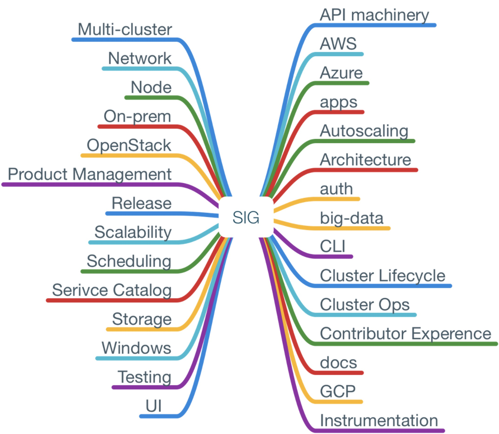

<!-- @import "[TOC]" {cmd="toc" depthFrom=1 depthTo=6 orderedList=false} -->

<!-- code_chunk_output -->

- [1. 主要SIG列表](#1-主要sig列表)
- [2. 工作组列表](#2-工作组列表)

<!-- /code_chunk_output -->

**Kubernetes的社区**是以**SIG(Special Interest Group, 特别兴趣小组**)和**工作组**的形式组织起来的, **每个工作组**都会**定期召开视频会议**. 

所有的SIG和工作组都使用slack和邮件列表沟通. 

# 1. 主要SIG列表

* api\-machinery: 所有API级别的功能, 包括了API server、API注册和发现、通用的API CRUD语义, 准入控制, 编码/解码, 转换, 默认值, 持久化层(etcd), OpenAPI, 第三方资源, 垃圾手机和客户端库的方方面面. 
* aws: 如何在AWS上支持和使用kubernetes. 
* apps: 在kubernetes上部署和运维应用程序. 关注开发者和DevOps在kubernetes上运行应用程序的体验. 
* architecture: 维持kubernetes在架构设计上的一致性和原则. 
* auth: kubernetes的认证授权、权限管理和安全性策略. 
* autoscaling: 集群的自动缩放, pod的水平和垂直自动缩放, pod的资源初始化, pod监控和指标收集等主题. 
* azure: 如何在Azure上支持和使用kubernetes. 
* big\-data: 在kubernetes上部署和运行大数据应用, 如Spark、Kafka、Hadoop、Flink、Storm等. 
* CLI: kubectl和相关工具. 
* cluster\-lifecycle: 部署和升级kubernetes集群. 
* cluster\-ops: 促进kubernetes集群本身的可操作性和集群间的互操作性, 使不同的运营商之间协调一致. 
* contributor-experience: 维持良好的开发者社区. 
* docs: 文档, 流程和出版物. 
* GCP: 在Google Cloud Platform上使用kubernetes. 
* instrumentation: 集群可观测性的最佳实践, 包括指标设置、日志收集、事件等. 
* multicluster: 多kubernetes集群的用例和工具. 
* network: kubernetes集群的网络. 
* node: node节点、kubelet. 
* onprem: 在非云供应商的环境下运行kubernetes, 例如on premise、裸机等环境. 
* openstack: 协调跨OpenStack和Kubernetes社区的努力. 
* product\-management: 侧重于产品管理方面. 
* release: 发布、PR和bug提交等. 
* scalability: 负责回答可伸缩性相关的问题. 
* scheduling: 资源调度. 
* service\-catalog: 为CNCF service broker和Kubernetes broker实现开发API. 
* storage: 存储和volume插件. 
* testing: 测试. 
* ui: 与UI相关的话题. 
* windows: 在kubernets上运行Windows Server Container. 

# 2. 工作组列表

* App Def: 改进API中的声明性原语、客户端库、工具的用户体验. 
* Cloud Provider: 云供应商工作组. 
* Cluster API: 定义一个代表Kubernetes集群的可移植API.  API将包含控制平面及其配置和底层基础设施(节点, 节点池等). 
* Container Identity: 确保容器能够获得安全的身份认证并与外部连通的解决方案. 
* Kubeadm Adoption: 提高kubeadm工具的采用率. 
* Resource ManagementJ: 资源隔离和提高资源利用率. 

详细参见 https://github.com/kubernetes/community/blob/master/sig-list.md