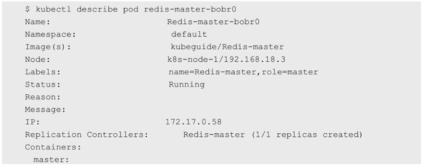
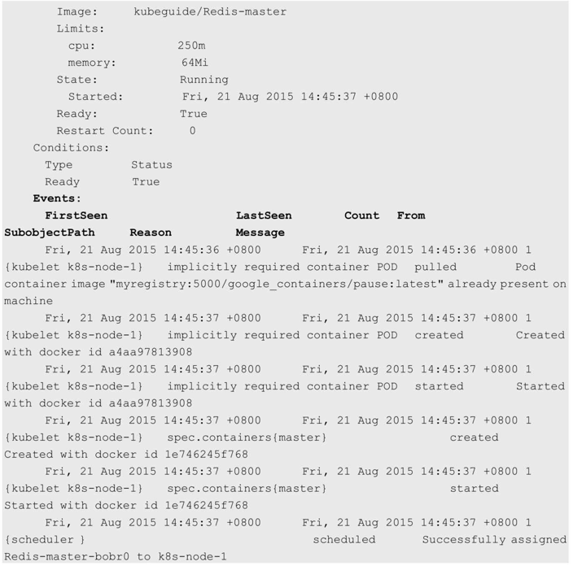
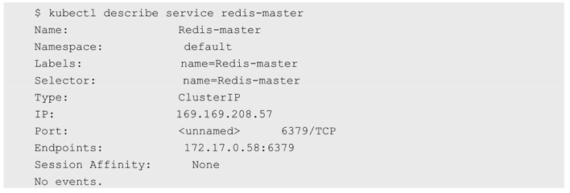

<!-- @import "[TOC]" {cmd="toc" depthFrom=1 depthTo=6 orderedList=false} -->

<!-- code_chunk_output -->


<!-- /code_chunk_output -->

在Kubernetes集群中创建Pod后, 我们可以通过**kubectl get pods**命令查看**Pod列表**, 但通过该命令显示的信息有限. 

Kubernetes提供了**kubectl describe pod**命令来查看一个Pod的**详细信息**, 例如: 





通过kubectl describe pod命令, 可以显示Pod创建时的**配置定义**、**状态**等信息, 还可以显示与该Pod相关的**最近的Event事件**, 事件信息对于查错非常有用. 如果某个Pod一直处于Pending状态, 我们就可以通过kubectl describe命令了解具体原因. 例如, 从Event事件中获知Pod失败的原因可能有以下几种. 

* 没有可用的Node以供调度. 
* 开启了**资源配额管理**, 但在当前调度的目标节点上资源不足. 
* 镜像下载失败. 

通过kubectl describe命令, 还可以查看**其他Kubernetes对象**, 包括Node、RC、Service、Namespace、Secrets等, 对每种对象都会显示相关的其他信息. 

例如, 查看一个服务的详细信息: 



如果要查看的对象属于某个**特定的Namespace**, 就需要加上\-\-namespace=\<namespace\>进行查询. 例如: 

```
# kubectl get service kube-dns --namespace=kube-system
```

