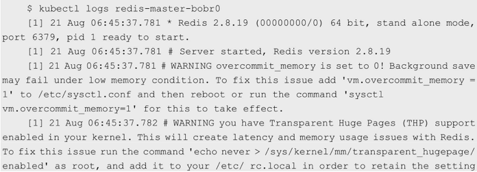
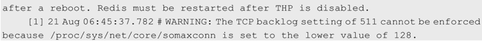

<!-- @import "[TOC]" {cmd="toc" depthFrom=1 depthTo=6 orderedList=false} -->

<!-- code_chunk_output -->


<!-- /code_chunk_output -->

在需要排查**容器内部应用程序**生成的日志时, 我们可以使用kubectl logs \<pod\_name\>命令: 





如果在某个Pod中包含多个容器, 就需要通过\-c参数指定**容器的名称**来查看, 例如: 

```
kubectl logs <pod_name> -c <container_name>
```

其效果与在**Pod的宿主机**上运行**docker logs** \<container\_id>一样. 

容器中应用程序生成的日志与容器的生命周期是一致的, 所以在容器被销毁之后, 容器内部的文件也会被丢弃, 包括日志等. 如果需要**保留容器内应用程序生成的日志**, 则可以使用**挂载的Volume**将容器内应用程序生成的日志保存到宿主机, 还可以通过一些工具如**Fluentd**、**Elasticsearch**等对日志进行采集. 

