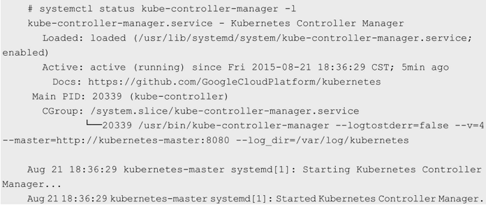
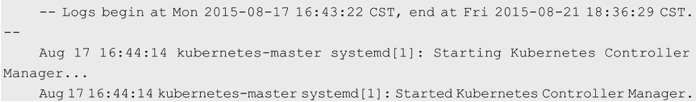

如果在Linux系统上安装Kubernetes, 并且使用**systemd**系统管理Kubernetes服务, 那么systemd的**journal系统**会**接管服务程序的输出日志**. 在这种环境中, 可以通过使用systemd status或journalctl工具来查看系统服务的日志. 

例如, 使用systemctl status命令查看kube\-controller\-manager服务的日志: 



使用journalctl命令查看: 

```
# journalctl -u kube-controller-manager
```



如果**不使用systemd系统**接管Kubernetes服务的标准输出, 则也可以通过**日志相关的启动参数**来指定日志的存放目录. 

* \-\-logtostderr=false: 不输出到stderr. 
* \-\-log\-dir=/var/log/kubernetes: 日志的存放目录. 
* \-\-alsologtostderr=false: 将其设置为true时, 表示将日志同时输出到文件和stderr. 
* \-\-v=0: glog的日志级别. 
* \-\-vmodule=gfs*=2,test*=4: glog基于模块的详细日志级别. 

在\-\-log\_dir设置的目录下可以查看各服务进程生成的日志文件, 日志文件的数量和大小依赖于日志级别的设置. 例如, kube\-controller\-manager可能生成的几个日志文件如下: 

* kube\-controller\-manager.ERROR; 
* kube\-controller\-manager.INFO; 
* kube\-controller\-manager.WARNING; 
* kube\-controller\-manager.kubernetes\-master.unknownuser.log.ERROR.20150930\-173939.9847; 
* kube\-controller\-manager.kubernetes\-master.unknownuser.log.INFO.20150930\-173939.9847; 
* kube\-controller\-manager.kubernetes\-master.unknownuser.log.WARNING.20150930\-173939.9847. 

在大多数情况下, 我们从WARNING和ERROR级别的日志中就能找到问题的成因, 但有时还需要排查INFO级别的日志甚至DEBUG级别的详细日志. 此外, etcd服务也属于Kubernetes集群的重要组成部分, 所以不能忽略它的日志. 

如果某个Kubernetes对象存在问题, 则可以用这个对象的名字作为关键字搜索Kubernetes的日志来发现和解决问题. 在大多数情况下, 我们遇到的主要是与Pod对象相关的问题, 比如无法创建Pod、Pod启动后就停止或者Pod副本无法增加, 等等. 此时, 可以先确定Pod在哪个节点上, 然后登录这个节点, 从kubelet的日志中查询该Pod的完整日志, 然后进行问题排查. 对于与Pod扩容相关或者与RC相关的问题, 则很可能在kube\-controller\-manager及kube\-scheduler的日志中找出问题的关键点. 

另外, kube\-proxy经常被我们忽视, 因为即使它意外停止, Pod的状态也是正常的, 但会导致某些服务访问异常. 这些错误通常与每个节点上的kube\-proxy服务有着密切的关系. 遇到这些问题时, 首先要排查kube\-proxy服务的日志, 同时排查防火墙服务, 要特别留意在防火墙中是否有人为添加的可疑规则. 
