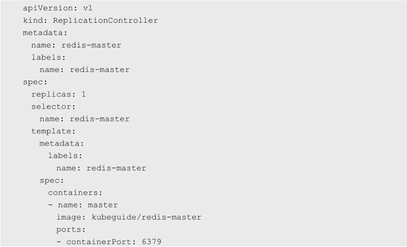
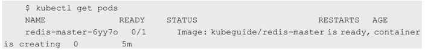
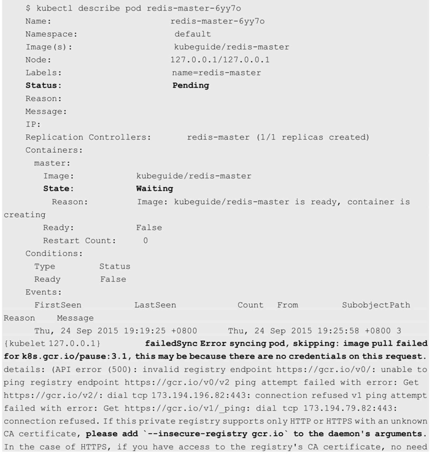
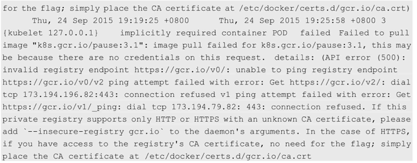
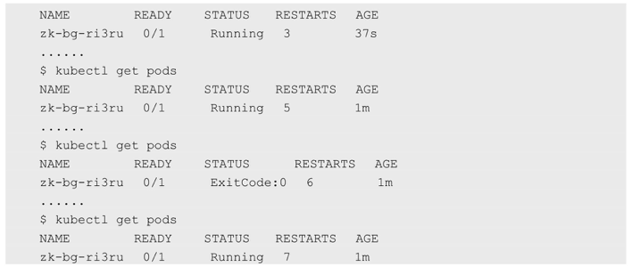

<!-- @import "[TOC]" {cmd="toc" depthFrom=1 depthTo=6 orderedList=false} -->

<!-- code_chunk_output -->

- [1. 由于无法下载pause镜像导致Pod一直处于Pending状态](#1-由于无法下载pause镜像导致pod一直处于pending状态)
- [2. Pod创建成功, 但RESTARTS数量持续增加](#2-pod创建成功但restarts数量持续增加)
- [3. 通过服务名无法访问服务](#3-通过服务名无法访问服务)
  - [3.1. 查看Service的后端Endpoint是否正常](#31-查看service的后端endpoint是否正常)
  - [3.2. 查看Service的名称能否被正确解析为ClusterIP地址](#32-查看service的名称能否被正确解析为clusterip地址)
  - [3.3. 查看kube\-proxy的转发规则是否正确](#33-查看kube-proxy的转发规则是否正确)

<!-- /code_chunk_output -->


# 1. 由于无法下载pause镜像导致Pod一直处于Pending状态

以redis\-master为例, 使用如下配置文件redis-master-controller.yaml创建RC和Pod: 



执行`kubectl create -f redis-master-controller.yaml`成功, 但在查看Pod时, 发现其总是**无法处于Running状态**. 

通过`kubectl get pods`命令可以看到: 



进一步使用`kubectl describe pod redis-master-6yy7o`命令查看该Pod的详细信息: 





可以看到, 该**Pod为Pending状态**. 从Message部分显示的信息可以看出, 其原因是image pull failed for k8s.gcr.io/pause:3.1, 说明系统在创建Pod时**无法从gcr.io下载pause镜像**, 所以导致创建Pod失败. 

解决方法如下. 

(1)如果服务器**可以访问Internet**, 并且**不希望使用HTTPS的安全机制**来访问gcr.io, 则可以在**Docker Daemon的启动参数**中加上\-\-**insecure\-registry gcr.io**, 来表示可以**匿名下载**. 

(2)如果Kubernetes集群在**内网环境**中**无法访问gcr.io网站**, 则可以先通过一台能够访问gcr.io的机器**下载pause镜像**, 将**pause镜像导出**后, 再**导入内网的Docker私有镜像库**, 并在kubelet的启动参数中加上\-\-pod\_infra\_container\_image, 配置为: 

```
--pod_infra_container_image=<docker_registry_ip>:<port>/pause:3.1
```

之后重新创建redis-master即可正确启动Pod. 

注意, 除了pause镜像, 其他Docker镜像也可能存在无法下载的情况, 与上述情况类似, 很可能也是网络配置使得镜像无法下载, 解决方法同上. 

# 2. Pod创建成功, 但RESTARTS数量持续增加

创建一个RC之后, 通过kubectl get pods命令查看Pod, 发现如下情况: 




可以看到Pod已经创建成功, 但**Pod一会儿是Running状态**, 一会儿是**ExitCode:0状态**, 在**READY列**中**始终无法变成1/1**, 而且RESTARTS(重启的数量)的数量不断增加. 

这通常是因为**容器的启动命令不能保持在前台运行**. 

本例中Docker镜像的启动命令为: 

```
zkServer.sh start-background
```

在Kubernetes中**根据RC定义创建Pod**, 之后启动容器. 在容器的启动命令执行完成时, 认为该容器的运行已经结束, 并且是成功结束(ExitCode=0)的. 根据Pod的默认重启策略定义(RestartPolicy=Always), RC将启动这个容器. 

新的容器在执行启动命令后仍然会成功结束, 之后RC会再次重启该容器, 如此往复. 其解决方法为将Docker镜像的启动命令设置为一个前台运行的命令, 例如: 

```
zkServer.sh start-foreground
```

# 3. 通过服务名无法访问服务

在Kubernetes集群中应**尽量使用服务名访问正在运行的微服务**, 但有时会访问失败. 由于服务涉及**服务名的DNS域名解析**、**kube\-proxy组件的负载分发**、**后端Pod列表的状态**等, 所以可通过以下几方面排查问题. 

## 3.1. 查看Service的后端Endpoint是否正常

可以通过kubectl get endpoints \<service\_name>命令查看某个服务的后端Endpoint列表, 如果列表为空, 则可能因为: 

* **Service的Label Selector**与**Pod的Label**不匹配; 
* **后端Pod**一直没有达到Ready状态(通过kubectl get pods进一步查看Pod的状态); 
* Service的targetPort端口号与Pod的containerPort不一致等. 

## 3.2. 查看Service的名称能否被正确解析为ClusterIP地址

可以通过在客户端容器中ping \<service\_name\>.\<namespace>.svc进行检查, 如果能够得到Service的ClusterIP地址, 则说明DNS服务能够正确解析Service的名称; 如果不能得到Service的ClusterIP地址, 则可能是因为Kubernetes集群的**DNS服务工作异常**. 

## 3.3. 查看kube\-proxy的转发规则是否正确

我们可以将kube\-proxy服务设置为**IPVS**或**iptables负载分发模式**. 

对于**IPVS负载分发模式**, 可以通过**ipvsadm工具**查看Node上的IPVS规则, 查看是否正确设置Service ClusterIP的相关规则. 

对于**iptables负载分发模式**, 可以通过查看Node上的**iptables规则**, 查看是否正确设置Service ClusterIP的相关规则. 
