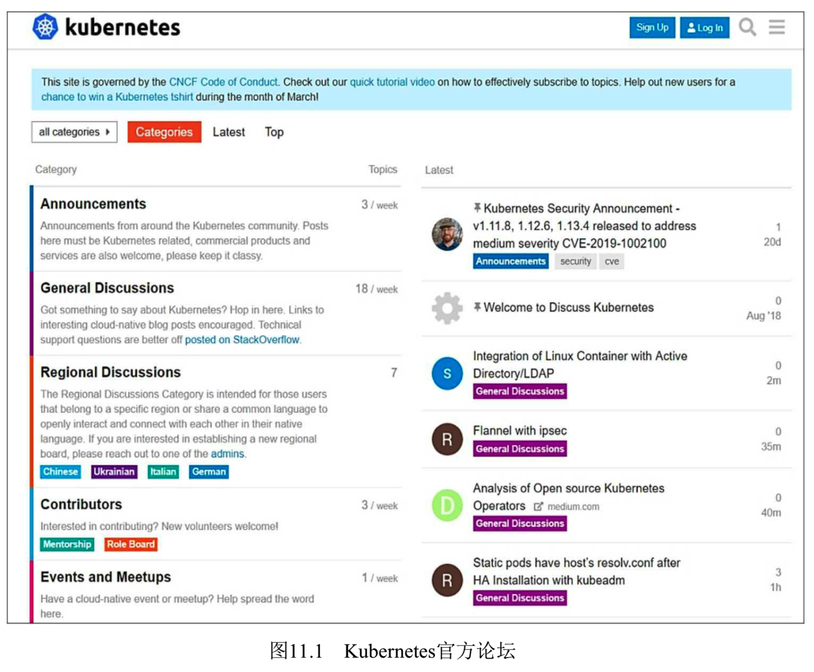
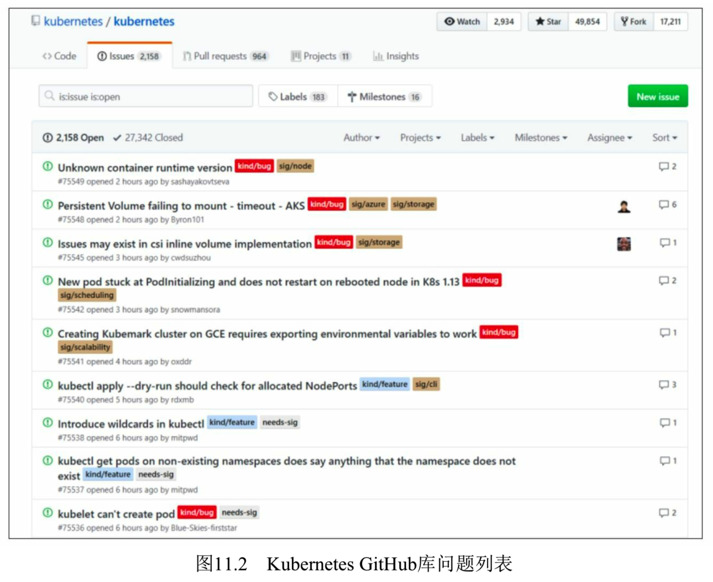
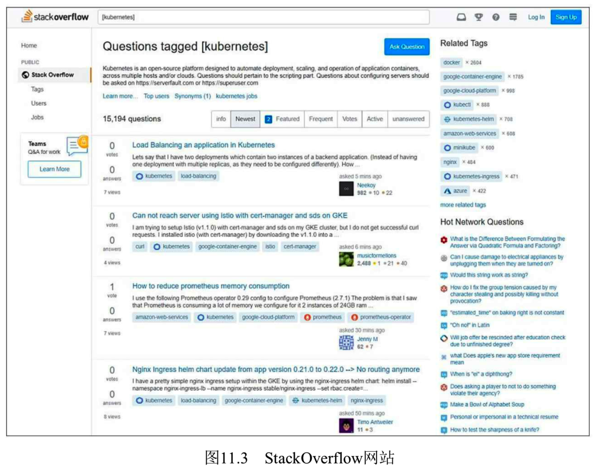
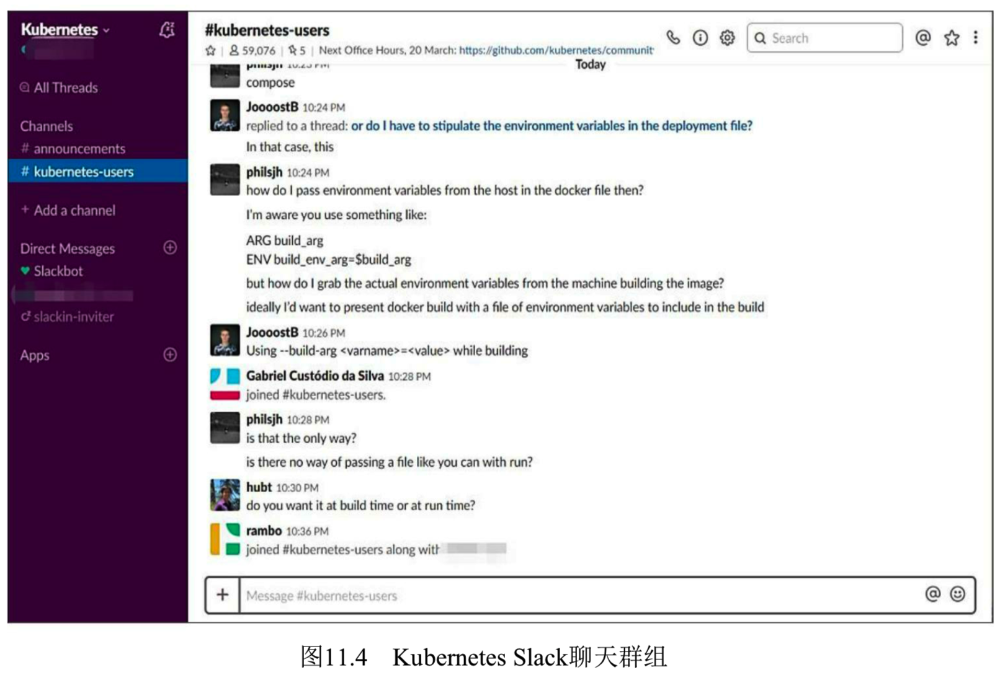

<!-- @import "[TOC]" {cmd="toc" depthFrom=1 depthTo=6 orderedList=false} -->

<!-- code_chunk_output -->

<!-- /code_chunk_output -->

如果通过系统日志和容器日志都无法找到问题的成因, 则可以追踪源码进行分析, 或者通过一些在线途径寻求帮助. 下面列出了可给予相应帮助的常用网站或社区. 

* Kubernetes常见问题: https://kubernetes.io/docs/tasks/debug-application-cluster/troubleshooting/ . 
* Kubernetes应用相关问题: https://kubernetes.io/docs/tasks/debug-applicationcluster/debug-application/ . 
* Kubernetes集群相关问题: https://kubernetes.io/docs/tasks/debug-application-cluster/debug-cluster/ . 
* Kubernetes官方论坛: https://discuss.kubernetes.io/ , 可以查看Kubernetes的最新动态并参与讨论, 如图11.1所示. 
* Kubernetes GitHub库问题列表: https://github.com/kubernetes/kubernetes/issues , 可以在这里搜索曾经出现过的问题, 也可以提问, 如图11.2所示. 
* StackOverflow网站上关于Kubernetes的问题讨论: http://stackoverflow.com/questions/tagged/kubernetes, 如图11.3所示. 
* Kubernetes Slack聊天群组: https://kubernetes.slack.com/ , 其中有许多频道, 包括\#kubernetes\-users、\#kubernetes\-novice、\#kubernetes\-dev等, 读者可以根据自己的兴趣加入不同的频道, 与聊天室中的网友进行在线交流, 如图11.4所示. 还有针对不同国家的地区频道, 例如中国区频道有\#cn\-users和\#cn\-events. 

