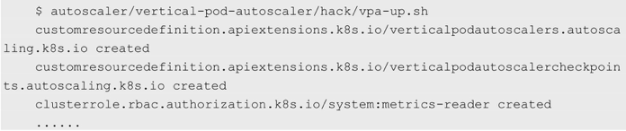

<!-- @import "[TOC]" {cmd="toc" depthFrom=1 depthTo=6 orderedList=false} -->

<!-- code_chunk_output -->

- [前提条件](#前提条件)
- [安装Vertical Pod Autoscaler](#安装vertical-pod-autoscaler)

<!-- /code_chunk_output -->

Kubernetes在1.9版本中加入了对**Pod**的**垂直扩缩容(简称为VPA**)支持, 这一功能使用**CRD**的方式为Pod定义垂直扩缩容的规则, 根据Pod的运行行为来判断Pod的资源需求, 从而更好地为Pod提供调度支持. 

该项目的地址为 https://github.com/kubernetes/autoscaler , 其中包含了三个不同的工具, 分别是: 

* 能够在AWS、Azure和GCP上提供**集群节点扩缩容**的**ClusterAutoScaler**, 已经进入**GA阶段**; 
* 提供Pod垂直扩缩容的**Vertical Pod Autoscaler**, 目前处于**Beta**阶段; 
* Addon Resizer, 是Vertical Pod Autoscaler的**简化版**, 能够**根据节点数量修改Deployment资源请求**, 目前处于Beta阶段. 

# 前提条件

垂直扩缩容目前的版本为0.4, 需要在Kubernetes 1.11以上版本中运行. 该组件所需的运行指标由Metrics Server提供, 因此在安装Autoscaler前要先启动Metrics Server. 

# 安装Vertical Pod Autoscaler

首先使用Git获取Autoscaler的源码: 

```
# git clone https://github.com/kubernetes/autoscaler.git
```

下载结束之后, 执行如下脚本, 启动VPA: 



可以看到, 在安装过程中生成了常见的Deployment、Secret、Service及RBAC内容, 还生成了两个CRD, 接下来会用新生成的CRD设置Pod的垂直扩缩容. 

