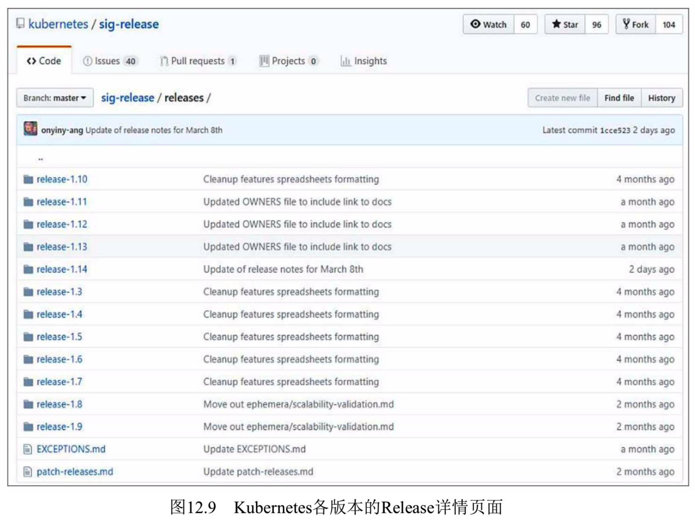
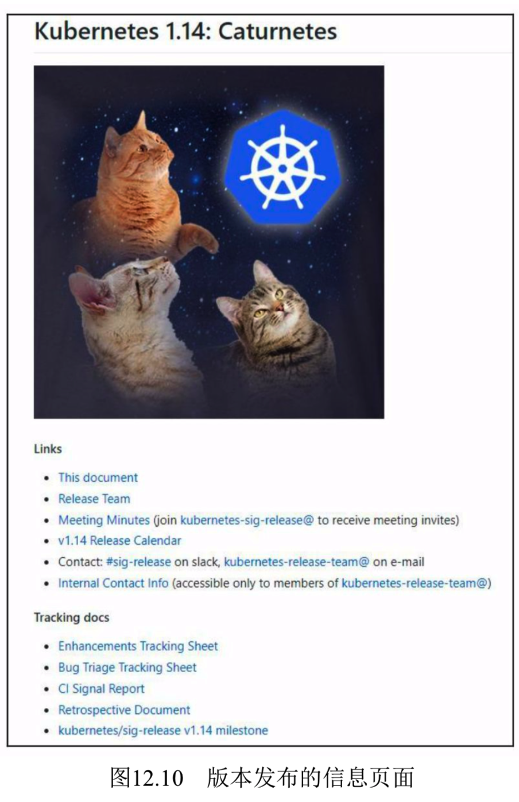
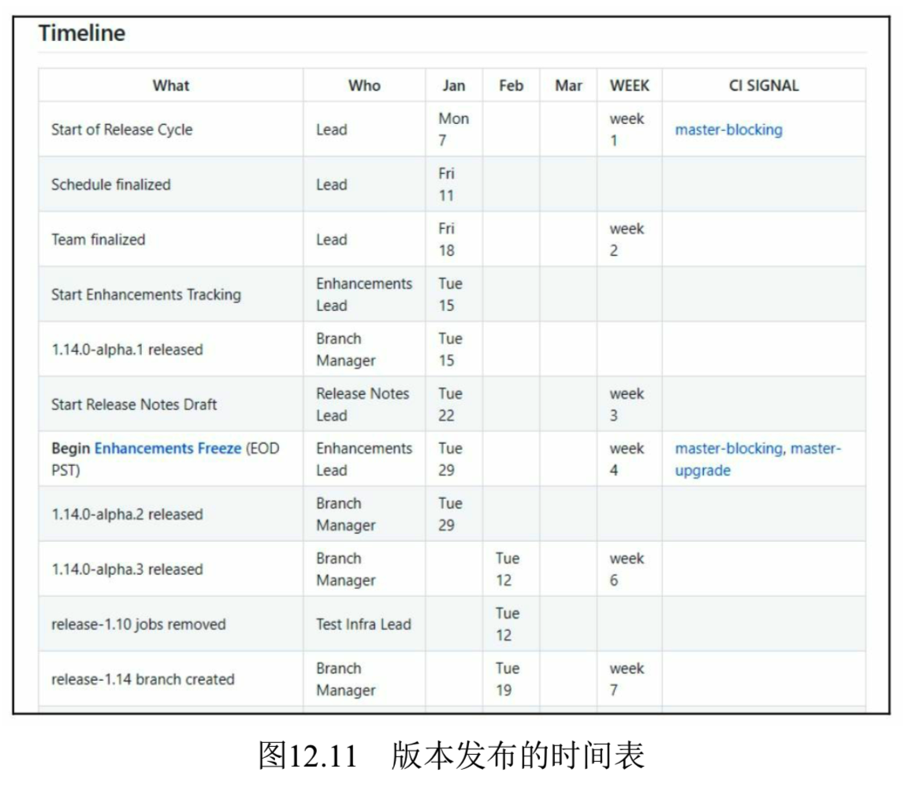
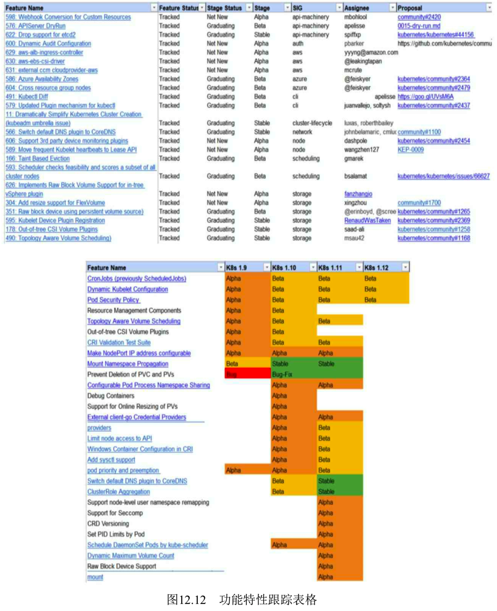
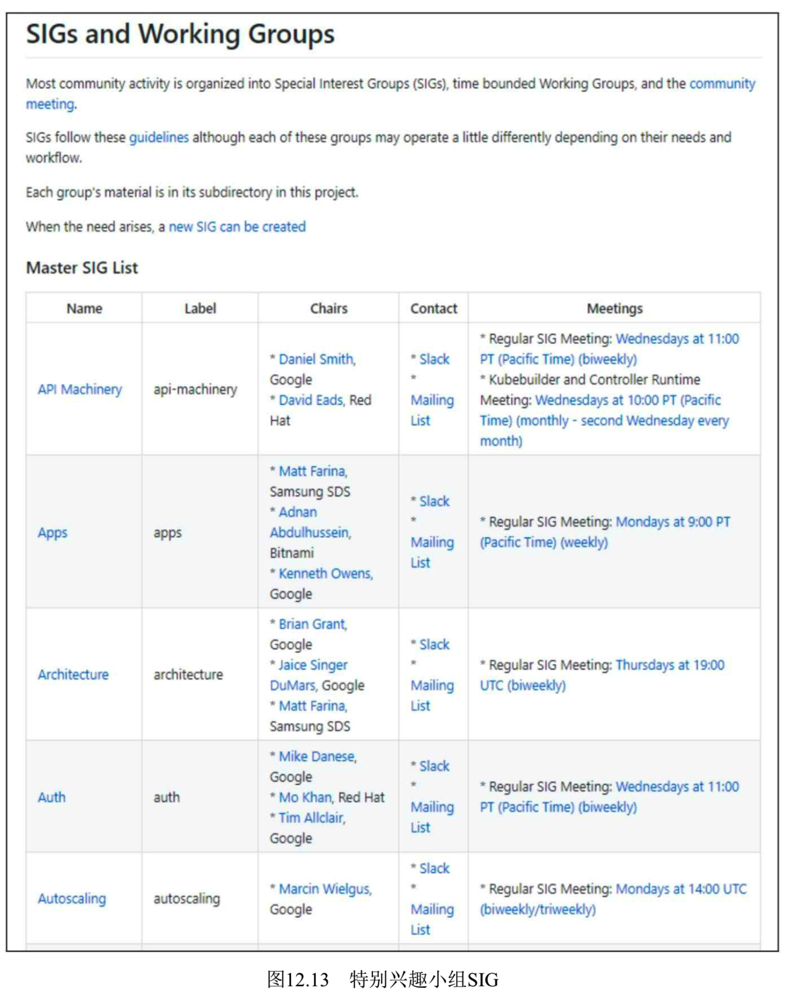

<!-- @import "[TOC]" {cmd="toc" depthFrom=1 depthTo=6 orderedList=false} -->

<!-- code_chunk_output -->

<!-- /code_chunk_output -->

Kubernetes将**每个版本的待开发功能**由**SIG\-Release小组**进行文档管理和发布, 网址为 https://github.com/kubernetes/sig-release , 可以跟踪每个大版本的功能列表, 如图12.9所示. 

以release\-1.14为例, 从release\-1.14.md文档中可以查看**这个版本的详细信息**, 如图12.10所示. 

版本发布的详细时间表如图12.11所示. 

单击页面链接"**Enhancements Tracking Sheet**", 可以查看**该版本**所包含的**全部功能列表！！！**, 按**开发阶段**分为**Alpha**、**Beta**和**Stable**三个类别, 可以直观地看到各功能模块的实现阶段. **每个功能**都有**HTTP链接**, 可以单击该链接跳转至GitHub中的**相关issue页面**, 进一步查看**该功能的详细信息**. 

在**WIP Features by Release表**中还可以看到**各功能特性**在Kubernetes各版本中的开发过程, 如图12.12所示. 

每个版本中的每个Feature都由一个特别兴趣小组(Special Interest Group, SIG)负责开发和维护, 各SIG小组的介绍可以在 https://github.com/kubernetes/community/blob/master/sig-list.md 找到, 如图12.13所示. 

目前已经成立的SIG小组有30个, 涵盖了安全、自动扩缩容、大数据、AWS云、文档、网络、存储、调度、UI、Windows容器等方方面面, 为完善Kubernetes的功能群策群力, 共同开发. 有兴趣、有能力的读者可以申请加入感兴趣的SIG小组, 并可以通过Slack聊天频道与来自世界各地的开发组成员开展技术探讨和解决问题. 同时, 可以参加SIG小组的周例会, 共同参与一个功能模块的开发工作. 

