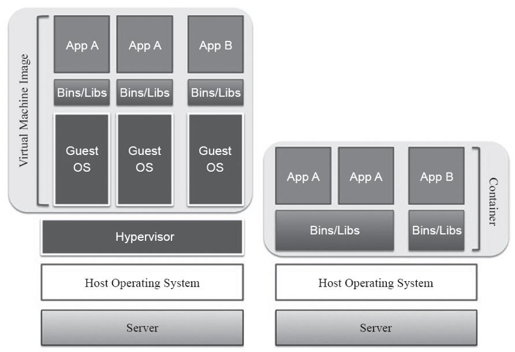
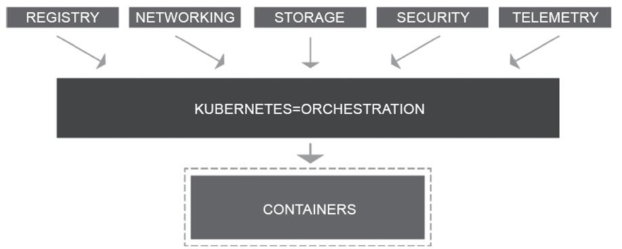

<!-- @import "[TOC]" {cmd="toc" depthFrom=1 depthTo=6 orderedList=false} -->

<!-- code_chunk_output -->

- [1. 背景](#1-背景)
  - [1.1. 基于镜像文件的交付载体: 降低部署复杂度](#11-基于镜像文件的交付载体-降低部署复杂度)
  - [1.2. 容器之间的协同: 容器编排系统诞生](#12-容器之间的协同-容器编排系统诞生)
- [2. 容器技术概述](#2-容器技术概述)
- [3. 容器技术的功用](#3-容器技术的功用)
  - [3.1. 开发和运维: 不同运行环境和不同配置环境](#31-开发和运维-不同运行环境和不同配置环境)
  - [3.2. 开发: 一次构建, 到处运行](#32-开发-一次构建-到处运行)
  - [3.3. 运维: 一次配置, 运行所有](#33-运维-一次配置-运行所有)
- [4. 容器简史](#4-容器简史)
  - [4.1. 2000年FreeBSD jail](#41-2000年freebsd-jail)
  - [4.2. LXC项目](#42-lxc项目)
  - [4.3. runC和containerd](#43-runc和containerd)
- [5. Docker的功能限制](#5-docker的功能限制)
  - [5.1. 管理单个容器](#51-管理单个容器)

<!-- /code_chunk_output -->

# 1. 背景

出于业务的需要, IT应用模型也在不断地变革, 例如, 开发模式从瀑布式(Waterfall)到敏捷(Agile)再到精益(Lean), 甚至是与QA和Operations融合的DevOps, 应用程序架构从单体(monolithic)模型到分层模型再到微服务, 部署及打包方式从面向物理机到虚拟机再到容器, 应用程序的基础架构从自建机房到托管再到云计算, 等等, 这些变革使得IT技术应用的效率大大提升, 同时却以更低的成本交付更高质量的产品. 

## 1.1. 基于镜像文件的交付载体: 降低部署复杂度

尤其是**以Docker为代表**的**容器技术**的出现, 终结了**DevOps**中**交付和部署环节**因**环境**、**配置**及**程序本身的不同**而造成的动辄**几种甚至十几种部署配置的困境**, 将它们**统一在容器镜像(image)之上**. 如今, 越来越多的企业或组织开始选择**以镜像文件作为交付载体**. 容器镜像之内直接包含了**应用程序**及其**依赖的系统环境、库、基础程序**等, 从而能够**在容器引擎上直接运行**. 于是, IT运维工程师(operator)无须关注开发应用程序的编程语言、环境配置等, 甚至连**业务逻辑本身也不必过多关注**, 而只需要掌握容器管理的单一工具链即可. 

## 1.2. 容器之间的协同: 容器编排系统诞生

**部署的复杂度**虽然**降低**了, 但**以容器格式运行**的**应用程序间的协同**却成了一个新的亟待解决的问题, 这种需求在微服务架构中表现得尤为明显. 结果, **以Kubernetes为代表的容器编排系统**应需而生. 

# 2. 容器技术概述

容器是一种轻量级、可移植、自包含的软件打包技术, 它使得应用程序可以在几乎任何地方以相同的方式运行. 软件开发工程师在自己笔记本上创建并测试完成的容器, 无须任何修改就能够在生产系统的虚拟机、物理机或云主机上运行. 

容器由**应用程序本身**和它的**环境依赖**(**库和其他应用程序**)两部分组成, 并在**宿主机(Host)操作系统的用户空间**中运行, 但与操作系统的**其他进程互相隔离**, 它们的实现机制有别于诸如VMWare、KVM和Xen等实现方案的传统虚拟化技术. 容器与虚拟机的对比关系如图1-1所示. 

图1-1　容器和虚拟机对比( http://www.nuagenetworks.net/blog/containers/ ):

由于**同一个宿主机**上的**所有容器**都**共享其底层操作系统(内核空间**), 这就使得容器在体积上要比传统的虚拟机小得多. 另外, 启动容器无须启动整个操作系统, 所以容器部署和启动的速度更快, 开销更小, 也更容易迁移. 事实上, 容器赋予了应用程序超强的可移植能力. 

# 3. 容器技术的功用

IT系统在架构上的环境复杂程度日趋加重. 现如今, 应用程序开发人员通常需要同时使用多种服务构建, 并要架构IT信息系统, 涉及MQ、Cache和DB等, 且很可能要部署到不同的环境中, 如物理服务器、虚拟服务器、私有云或公有云之上. 这些不同的主机或许还有着不同的系统环境, 如RHEL、Debian或SUSE等Linux发行版, 甚至是UNIX、Windows等. 

## 3.1. 开发和运维: 不同运行环境和不同配置环境

结果, 一方面**应用程序**包含了**多种服务**, **每种服务**均可能存在**依赖的库和软件包**; 另一方面存在**多种部署环境**, 而服务在运行时又可能需要**动态迁移到不同的环境**中. 

于是, 各种服务和环境通过排列组合产生了一个大部署矩阵. **应用程序开发工程师**在编写代码时需要**考虑不同的运行环境**, 而**运维工程师**则需要为**不同的服务和平台配置环境**. 对他们双方来说, 这都必将是一项困难而艰巨的任务. 

幸运的是, 货运系统的集装箱机制为解决这个难题提供了有效的借鉴方案. Docker正是将集装箱思想运用到软件打包上, 为代码提供了一个基于容器的标准化运输系统. Docker可以将几乎任何应用程序及其依赖的运行环境都打包成一个轻量级、可移植、自包含的容器, 并能够运行于支持Docker容器引擎的所有操作系统之上. 

简言之, 容器的优势主要表现在以下两个方面. 

## 3.2. 开发: 一次构建, 到处运行

应用程序开发工程师: "**一次构建, 到处运行**"(Build Once, Run Anywhere). 

容器意味着环境隔离和可重复性, 开发人员**只需为应用创建一个运行环境**, 并将其**打包成容器**便可在各种部署环境上运行, 并与它所在的宿主机环境隔离. 

## 3.3. 运维: 一次配置, 运行所有

运维工程师: "**一次配置, 运行所有**"(Configure Once, Run Anything). 

一旦配置好标准的**容器运行时环境**, 服务器就可以运行任何容器, 这使得运维人员的工作变得更高效、一致和可重复. 容器消除了开发、测试、生产环境的不一致性. 

# 4. 容器简史

## 4.1. 2000年FreeBSD jail

容器技术的概念最初出现在**2000年**, 当时称为**FreeBSD jail**, 这种技术可将FreeBSD系统分区为多个子系统(也称为Jail). **2001**年, 通过Jacques Gélinas的**VServer项目**, 隔离环境的实施理念进入了Linux领域. 

**Jail**的目的是让**进程**在**经过修改的chroot环境**中**创建**, 而不会脱离和影响整个系统—chroot环境对文件系统、网络和用户的访问都实现了虚拟化. 然而, Jail在实施方面存在着不少的局限性, 当它与**Namespaces**和**CGroups**等技术结合在一起之后, 才让这种隔离方法从构想变为了现实. 后来, **Linux容器项目(LXC**)又为其添加了一些用户常用的工具、模板、库和语言绑定, 从而较好地改善了用户使用容器技术时的体验. 

## 4.2. LXC项目

Docker在**LXC项目的基础**上, 从文件系统、网络互联到进程隔离等方面对容器技术进行了进一步的封装, 极大地简化了容器的创建和维护过程, 从而促进了容器技术的大流行. Docker最初是由dotCloud公司创始人Solomon Hykes在法国期间发起的一个公司内部项目, 并于2013年3月以Apache 2.0授权协议开源, 其项目代码托管于GitHub之上. 

## 4.3. runC和containerd

虽然其**最初的实现**是**基于LXC项目**的, 但Docker在后来的**0.7版本**转为使用自行开发的**libcontainer容器引擎**, 而**1.11版本**又将其换作了**runC**和**containerd**. 

注: 在2017年4月举行的DockerCon上, Docker公司将GitHub上原本隶属于**Docker组织**的Docker项目直接转移到了一个新的名为**Moby的组织**下, 并将其重命名为**Moby项目**. 

# 5. Docker的功能限制

## 5.1. 管理单个容器

Docker本身非常适合用于**管理单个容器**, 不过, 一旦开始使用越来越多的容器封装和运行应用程序, 必将会导致其管理和编排变得越来越困难. 最终, 用户不得不**对容器实施分组**, 以便**跨所有容器**提供**网络**、**安全**、**监控**等服务. 于是, 以**Kubernetes**为代表的**容器编排系统**应运而生. 

真正的生产型应用会涉及**多个容器！！！**, 这些容器必须**跨多个服务器主机！！！进行部署**. Kubernetes可以提供**所需的编排和管理功能**, 以便用户针对这些工作负载轻松完成**大规模容器部署**. 而且, 借助于Kubernetes的编排功能, 用户可以构建出**跨多个容器！！！的应用服务**, 并且可以实现**跨集群调度！！！**、**扩展容器！！！**, 以及**长期持续管理这些容器的健康状况！！！** 等. 

使用中, Kubernetes还需要与**网络**、**存储**、**安全性**、**监控**及**其他服务**进行整合, 以提供**全面的容器基础架构**, 如图1-2所示. 

图1-2　容器与容器编排(来源: RedHat Inc.)

Kubernetes利用**容器的扩缩容机制**解决了许多常见的问题, 它将**容器归类到一起**, 形成"**容器集"(Pod**), **为分组的容器增加了一个抽象层**, 用于帮助用户**调度工作负载(workload**), 并为这些容器提供所需的**联网和存储等服务**. 

Kubernetes的其他部分可帮助用户在**这些Pod之间达成负载均衡**, 同时确保运行**正确数量的容器**, 以充分支持实际的工作负载. 

