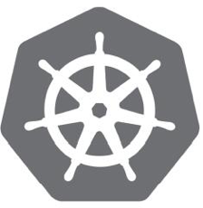

<!-- @import "[TOC]" {cmd="toc" depthFrom=1 depthTo=6 orderedList=false} -->

<!-- code_chunk_output -->

- [1. Kubernetes简史](#1-kubernetes简史)
- [2. Kubernetes是什么?](#2-kubernetes是什么)
  - [2.1. 基于容器的分布式架构](#21-基于容器的分布式架构)
  - [2.2. 业务与功能模块剥离](#22-业务与功能模块剥离)
  - [2.3. 开放且无语言限制](#23-开放且无语言限制)
  - [2.4. 完备的平台能力](#24-完备的平台能力)
- [3. Kubernetes特性](#3-kubernetes特性)
  - [3.1. 自动装箱](#31-自动装箱)
  - [3.2. 自我修复(自愈)](#32-自我修复自愈)
  - [3.3. 水平扩展](#33-水平扩展)
  - [3.4. 服务发现和负载均衡](#34-服务发现和负载均衡)
  - [3.5. 自动发布和回滚](#35-自动发布和回滚)
  - [3.6. 密钥和配置管理](#36-密钥和配置管理)
  - [3.7. 存储编排](#37-存储编排)
  - [3.8. 批量处理执行](#38-批量处理执行)
- [4. Service对象](#4-service对象)
  - [4.1. 关键特征](#41-关键特征)
  - [4.2. Cluster IP + Service Port](#42-cluster-ip-service-port)
  - [4.3. Service的IP地址不变](#43-service的ip地址不变)
- [5. Pod对象](#5-pod对象)
- [6. service和pod](#6-service和pod)
  - [6.1. Pod的概念](#61-pod的概念)
  - [6.2. 集群管理master和node](#62-集群管理master和node)
  - [6.3. 服务的扩容和升级](#63-服务的扩容和升级)

<!-- /code_chunk_output -->

Kubernetes都将作为一个为任何应用、任何环境提供的**容器管理框架**而无处不在. 

# 1. Kubernetes简史

Kubernetes(来自希腊语, 意为"舵手"或"飞行员")由Joe Beda、Brendan Burns和Craig McLuckie创立, 而后Google的其他几位工程师, 包括Brian Grant和Tim Hockin等加盟共同研发, 并由Google在2014年首次对外宣布. Kubernetes的开发和设计都深受Google内部系统Borg的影响, 事实上, 它的许多顶级贡献者之前也是Borg系统的开发者. 

谷歌Borg的一个开源版本, Borg是谷歌的一个久负盛名的内部使用的**大规模集群管理系统**, 它基于**容器技术**, 目的是实现**资源管理的自动化**, 以及**跨多个数据中心**的**资源利用率**的**最大化**. 2015年4月, Borg论文《Large-scale cluster management at Google with Borg》伴随Kubernetes的高调宣传被Google首次公开, 人们终于有缘得窥其全貌. 

事实上, 正是由于诞生于容器世家Google, 并站在Borg这个巨人的肩膀之上, 充分受益于Borg过去十数年间积累的经验和教训, Kubernetes甫一面世就立即广受关注和青睐, 并迅速称霸了**容器编排技术领域**. 很多人将Kubernetes视为Borg系统的一个开源实现版本, 在Google内部, Kubernetes的原始代号曾经是Serven of Nine, 即星际迷航中友好的"Borg"角色, 它标识中的舵轮有七个轮辐就是对该项目代号的致意, 如图所示. 

# 2. Kubernetes是什么?

## 2.1. 基于容器的分布式架构

首先, 它是一个全新的**基于容器技术**的**分布式架构领先方案**. 

## 2.2. 业务与功能模块剥离

其次, 如果我们的**系统设计**遵循了**Kubernetes的设计思想**, 那么**传统系统架构**中那些**和业务没有多大关系**的**底层代码**或**功能模块**, 都可以立刻**从我们的视线中消失**, 我们**不必**再费心于**负载均衡器的选型**和**部署实施问题**, **不必**再考虑引入或自己开发一个复杂的**服务治理框架**, **不必**再头疼于**服务监控**和**故障处理模块的开发**. 

总之, 使用Kubernetes提供的解决方案, 我们不仅**节省了不少于30%的开发成本**, 还可以将精力更加**集中于业务本身**, 而且由于Kubernetes提供了强大的**自动化机制**, 所以系统后期的**运维难度**和**运维成本**大幅度降低. 

## 2.3. 开放且无语言限制

然后, Kubernetes是一个**开放的开发平台**. 与J2EE不同, 它**不局限**于任何一种**语言**, **没有限定任何编程接口**, 所以不论是用Java、Go、C++还是用Python编写的服务, 都可以**被映射为Kubernetes的Service(服务**), 并通过**标准的TCP通信协议**进行交互. 

此外, Kubernetes平台对**现有的编程语言**、**编程框架**、**中间件**没有任何侵入性, 因此现有的系统也很容易改造升级并迁移到Kubernetes平台上. 

## 2.4. 完备的平台能力

最后, Kubernetes是一个**完备的分布式系统支撑平台**. 

Kubernetes具有**完备的集群管理能力**, 包括**多层次的安全防护**和**准入机制**、**多租户应用支撑能力**、**透明的服务注册**和**服务发现机制**、内建的**智能负载均衡器**、强大的**故障发现**和**自我修复**能力、服务**滚动升级**和**在线扩容**能力、可扩展的**资源自动调度机制**, 以及**多粒度的资源配额管理**能力. 

同时, Kubernetes提供了**完善的管理工具**, 这些工具涵盖了包括**开发**、部署测试、运维监控在内的各个环节. 

因此, Kubernetes是一个全新的基于容器技术的分布式架构解决方案, 并且是一个一站式的完备的分布式系统开发和支撑平台. 

# 3. Kubernetes特性

Kubernetes是一种用于在一组主机上运行和协同容器化应用程序的系统, 旨在提供**可预测性**、**可扩展性**与**高可用性**的方法来**完全管理容器化应用程序**和**服务的生命周期**的平台. 用户可以定义应用程序的运行方式, 以及与其他应用程序或外部世界交互的途径, 并能实现**服务的扩容和缩容**, 执行**平滑滚动更新**, 以及在**不同版本**的应用程序之间调度流量以测试功能或回滚有问题的部署. 

Kubernetes提供了接口和可组合的平台原语, 使得用户能够以高度的灵活性和可靠性定义及管理应用程序. 简单总结起来, 它具有以下几个重要特性. 

## 3.1. 自动装箱

(1)自动装箱

建构于**容器之上**, 基于资源依赖及其他约束**自动完成容器部署**且不影响其可用性, 并通过**调度机制**混合**关键型应用**和**非关键型应用**的**工作负载**于**同一节点**以**提升资源利用率**. 

## 3.2. 自我修复(自愈)

(2)自我修复(自愈)

支持**容器故障**后**自动重启**、**节点故障**后**重新调度容器**, 以及**其他可用节点**、**健康状态检查失败**后**关闭容器**并**重新创建**等**自我修复机制**. 

## 3.3. 水平扩展

(3)水平扩展

支持通过简单命令或UI手动水平扩展, 以及基于CPU等资源负载率的自动水平扩展机制. 

## 3.4. 服务发现和负载均衡

(4)服务发现和负载均衡

Kubernetes通过其**附加组件**之一的**KubeDNS**(或**CoreDNS**)为系统内置了**服务发现功能**, 它会为**每个Service配置DNS名称**, 并允许**集群内的客户端**直接使用**此名称发出访问请求**, 而Service则通过**iptables**或**ipvs**内建了**负载均衡机制**. 

## 3.5. 自动发布和回滚

(5)自动发布和回滚

Kubernetes支持"**灰度**"更新**应用程序**或**其配置信息**, 它会监控更新过程中**应用程序的健康状态**, 以确保它**不会在同一时刻杀掉所有实例**, 而此过程中一旦有**故障**发生, 就会立即**自动执行回滚**操作. 

## 3.6. 密钥和配置管理

(6)密钥和配置管理

Kubernetes的**ConfigMap**实现了**配置数据**与**Docker镜像解耦**, 需要时, **仅对配置做出变更**而**无须重新构建Docker镜像**, 这为应用开发部署带来了很大的灵活性. 

此外, 对于应用所依赖的**一些敏感数据**, 如用户名和密码、令牌、密钥等信息, Kubernetes专门提供了**Secret对象为其解耦**, 既便利了应用的快速开发和交付, 又提供了一定程度上的安全保障. 

## 3.7. 存储编排

(7)存储编排

Kubernetes支持**Pod对象**按需自动挂载**不同类型的存储系统**, 这包括**节点本地存储**、**公有云服务商的云存储**(如**AWS**和**GCP**等), 以及**网络存储系统**(例如, NFS、iSCSI、GlusterFS、Ceph、Cinder和Flocker等). 

## 3.8. 批量处理执行

(8)批量处理执行

除了**服务型应用**, Kubernetes还支持**批处理作业**及**CI(持续集成**), 如果需要, 一样可以实现容器故障后恢复. 

# 4. Service对象

在正式开始本章的Hello World之旅之前, 我们首先要学习Kubernetes的一些基本知识, 这样才能理解Kubernetes提供的解决方案. 

在Kubernetes中, **Service**是**分布式集群架构**的**核心**, 

## 4.1. 关键特征

一个Service对象拥有**如下关键特征**. 

- 拥有**唯一指定的名称**(比如mysql\-server). 
- 拥有一个**虚拟IP**(**Cluster IP**、**Service IP**或VIP)和**端口号**. 
- 能够提供某种**远程服务能力**. 
- **被映射**到**提供这种服务能力**的**一组容器应用**上. 

## 4.2. Cluster IP + Service Port

Service的**服务进程**目前都**基于Socket通信方式**对外**提供服务**, 比如Redis、Memcache、MySQL、Web Server, 或者是实现了某个具体业务的**特定TCP Server进程**. 

虽然**一个Service！！！** 通常由**多个相关的服务进程！！！** 提供服务, **每个服务进程！！！** 都有一个**独立的Endpoint(IP\+Port)访问点！！！**, 但Kubernetes能够让我们**通过Service**(虚拟Cluster IP \+ Service Port)连接到**指定的Service**. 

## 4.3. Service的IP地址不变

有了Kubernetes**内建**的**透明负载均衡**和**故障恢复机制**, 不管后端有多少服务进程, 也不管某个服务进程是否由于发生故障而**被重新部署到其他机器**, 都不会影响对服务的正常调用. 更重要的是, 这个**Service**本身一旦**创建就不再变化**, 这意味着我们再也不用为**Kubernetes集群**中服务的**IP地址变来变去**的问题而头疼了. 

# 5. Pod对象

容器提供了强大的**隔离功能**, 所以有必要把**为Service提供服务的这组进程**放入**容器**中进行隔离. 

为此, Kubernetes设计了**Pod对象**, 将**每个服务进程！！！** 都包装到**相应的Pod！！！** 中, 使其成为在**Pod中**运行的**一个容器(Container**). 

# 6. service和pod

为了建立Service和Pod间的**关联关系**, Kubernetes

- 首先给**每个Pod**都贴上**一个标签(Label**), 给运行MySQL的Pod贴上name=mysql标签, 给运行PHP的Pod贴上name=php标签, 
- 然后给**相应的Service**定义**标签选择器(Label Selector**), 比如MySQL Service的标签选择器的**选择条件为name=mysql**. 

这样一来, 就巧妙解决了Service与Pod的关联问题. 

## 6.1. Pod的概念

这里先简单介绍Pod的概念. 

首先, **Pod**运行在一个被称为**节点(Node**)的环境中, 这个节点既可以是**物理机**, 也可以是私有云或者公有云中的一个**虚拟机**, 通常在**一个节点**上运行**几百个Pod**; 

其次, 在**每个Pod**中都运行着**一个**特殊的被称为**Pause的容器**, 其他容器则为**业务容器**, 这些业务容器**共享**Pause容器的**网络栈和Volume挂载卷**, 因此它们之间的**通信和数据交换更为高效**, 在设计时我们可以充分利用这一特性将一组**密切相关的服务进程**放入**同一个Pod**中; 

最后, 需要注意的是, 并**不是每个Pod**和它**里面运行的容器**都能被**映射到一个Service**上, 只有**提供服务**(无论是对内还是对外)的那组Pod才会被映射为一个服务. 

## 6.2. 集群管理master和node

在**集群管理**方面, Kubernetes将集群中的**机器**划分为**一个Master**和**一些Node**. 

在**Master**上运行着集群管理相关的一组进程kube\-apiserver、kube\-controller\-manager和kubescheduler, 这些进程实现了整个集群的**资源管理**、**Pod调度**、**弹性伸缩**、安全控制、系统监控和纠错等管理功能, 并且都是**自动完成**的. 

**Node**作为集群中的**工作节点**, 运行**真正的应用程序**, 在Node上**Kubernetes管理**的**最小运行单元**是**Pod**. 

在Node上运行着Kubernetes的kubelet、kube\-proxy服务进程, 这些服务进程负责Pod的创建、启动、监控、重启、销毁, 以及实现软件模式的负载均衡器. 

## 6.3. 服务的扩容和升级

最后, 看看传统的IT系统中**服务扩容**和**服务升级**这两个难题, 以及Kubernetes所提供的全新解决思路. 

服务的**扩容**涉及**资源分配(选择哪个节点进行扩容**)、**实例部署**和**启动**等环节, 在一个复杂的业务系统中, 这两个难题基本上靠人工一步步操作才得以解决, 费时费力又难以保证实施质量. 

在Kubernetes集群中, 只需为**需要扩容的Service关联的Pod**创建一个**RC(Replication Controller**), 服务扩容以至服务升级等令人头疼的问题都迎刃而解. 

在**一个RC**定义文件中包括以下3个关键信息. 

- **目标Pod的定义**. template
- 目标Pod需要运行的**副本数量(Replicas**). spec.replicas
- 要监控的**目标Pod的标签**. spec.selector

在**创建好RC**(系统将**自动创建好Pod**)后, Kubernetes会通过在**RC中定义的Label**筛选出**对应的Pod实例**并**实时监控其状态和数量**, 如果**实例数量少于定义的副本数量**, 则会根据在**RC中定义的Pod模板**创建一个**新的Pod**, 然后将此Pod**调度**到**合适的Node**上启动运行, 直到Pod实例的数量达到预定目标. 这个过程完全是自动化的, 无须人工干预. 

有了RC, 

- **服务扩容**就变成一个纯粹的简单数字游戏了, 只需修改RC中的**副本数量**即可. 
- **服务升级**也将通过**修改RC**来自动完成. 

