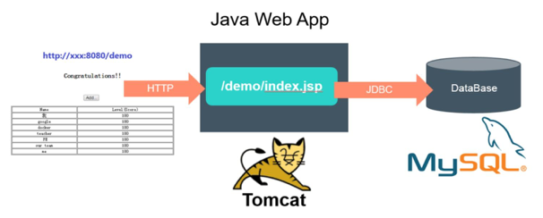
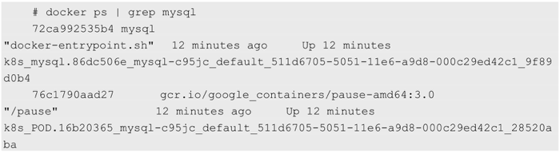

<!-- @import "[TOC]" {cmd="toc" depthFrom=1 depthTo=6 orderedList=false} -->

<!-- code_chunk_output -->

- [1. Java Web应用例子](#1-java-web应用例子)
  - [1.1. Java Web结构](#11-java-web结构)
  - [1.2. Docker时代配置](#12-docker时代配置)
- [2. 环境准备](#2-环境准备)
- [3. 启动MySQL服务](#3-启动mysql服务)
  - [3.1. 创建rc生成Pod](#31-创建rc生成pod)
  - [3.2. 创建Service](#32-创建service)
- [4. 启动Tomcat应用](#4-启动tomcat应用)
  - [4.1. 创建RC生成Pod](#41-创建rc生成pod)
  - [4.2. 创建Service](#42-创建service)
- [5. 通过浏览器访问网页](#5-通过浏览器访问网页)

<!-- /code_chunk_output -->

# 1. Java Web应用例子

运行在**Tomcat里的Web App**, 如图1.1所示, JSP页面通过JDBC直接**访问MySQL数据库**并展示数据. 

出于演示和简化的目的, 只要程序正确连接到了数据库, 就会自动完成对应的Table的创建与初始化数据的准备工作. 所以, 当我们通过浏览器访问此应用时, 就会显示一个表格的页面, 数据则来自数据库. 

## 1.1. Java Web结构

图1.1　Java Web应用的结构:



此应用需要启动两个容器: **Web App容器**和**MySQL容器**, 并且Web App容器需要访问MySQL容器. 

## 1.2. Docker时代配置

在**Docker时代**, 假设我们在**一个宿主机**上**启动了这两个容器**, 就需要把**MySQL容器的IP地址**通过**环境变量注入Web App容器**里; 

同时, 需要将**Web App容器**的**8080端口**映射到**宿主机的8080端口**, 以便在**外部访问**. 

介绍在Kubernetes时代是如何达到这个目标的. 

# 2. 环境准备

可以再虚拟机里面

# 3. 启动MySQL服务

## 3.1. 创建rc生成Pod

首先, 为MySQL服务创建一个**RC定义文件**mysql\-rc.yaml

```yaml
apiVersion: v1
kind: ReplicationController             # 副本控制器RC
metadata:
  name: mysql                           # RC的名称, 全局唯一
spec:
  replicas: 1                           # Pod副本的期待数量
  selector:
    app: mysql                          # 符合目标的Pod拥有此标签
  template:                             # 根据此模板创建Pod的副本(实例)
    metadata:
      labels:
        app: mysql                      # Pod副本拥有的标签, 对应RC的selector
    spec:
      containers:                       # Pod内容器的定义部分
      - name: mysql                     # 容器的名称
        image: mysql                    # 容器对应的Docker Image
        ports:
        - containerPort: 3306           # 容器应用监听的端口号 
        env:                            # 注入容器内的环境变量
        - name: MYSQL_ROOT_PASSWORD
          value: "123456"
```

**kind属性**用来表明**此资源对象的类型**, 比如这里的值为ReplicationController, 表示这是一个RC

在**spec一节**中是**RC的相关属性定义**, 比如**spec.selector**是**RC的Pod标签选择器**, 即监控和管理拥有这些标签的Pod实例, 确保在当前集群中始终有且仅有replicas个Pod实例在运行, 这里设置replicas=1, 表示只能运行一个MySQL Pod实例. 

当在集群中运行的**Pod数量少于replicas**时, **RC**会根据在**spec.template**一节中定义的**Pod模板**来生成一个**新的Pod实例**, **spec.template.metadata.labels**指定了**该Pod的标签**, 需要特别注意的是: 这里的labels必须匹配之前的spec.selector, 否则此RC每创建一个无法匹配Label的Pod, 就会不停地尝试创建新的Pod, 陷入恶性循环中. 

在创建好mysql\-rc.yaml文件后, 将它发布到Kubernetes集群中, **在Master上执行命令**: 

```
# kubectl create -f mysql-rc.yaml
replicationcontroller "mysql" created
```

查看刚刚创建的RC

```
# kubectl get rc
NAME    DESIRED     CURRENT     AGE
mysql   1           1           1m
```

查看Pod

```
# kubectl get pods
NAME            READY   STATUS      RESTARTS    AGE
mysql-c95jc     1/1     Running     0           2m
```

一个名为mysql\-xxxxx的Pod实例, 这是Kubernetes根据mysql这个RC的定义自动创建的Pod. 由于Pod的调度和创建需要花费一定的时间, 比如需要一定的时间来确定调度到哪个节点上, 以及下载Pod里的容器镜像需要一段时间, 所以我们一开始看到Pod的状态显示为Pending. 在Pod成功创建完成以后, 状态最终会被更新为Running. 

通过docker ps指令查看正在运行的容器, 发现提供MySQL服务的Pod容器已经创建并正常运行了, 此外会发现MySQL Pod对应的容器还多创建了一个来自谷歌的pause容器, 这就是Pod的"根容器". 



## 3.2. 创建Service

最后, 创建一个与之关联的Kubernetes Service\-MySQL的定义文件(文件名为mysql\-svc.yaml): 

```yaml
apiVersion: v1
kind: Service       # 表明是Kubernetes Service
metadata:
  name: mysql       # Service的全局唯一名称
spec:
  ports:
    - port: 3306    # Service提供服务的端口号
  selector:         # Service对应的Pod拥有这里定义的标签
    app: mysql
```

其中, 

- metadata.name是**Service的服务名**(ServiceName); 
- port属性则定义了**Service的虚端口**; 
- spec.selector确定了**哪些Pod副本(实例)对应本服务**. 

通过kubectl create 命令创建Service对象. 

```
# kubectl create -f mysql-svc.yaml
```

查看刚创建的Service

```
# kubectl get svc
NAME    CLUSTER-IP      EXTERNAL-IP     PORT(S)     AGE
mysql   169.169.253.143 <none>          3306/TCP    48s
```

可以发现, **MySQL服务**被分配了一个值为169.169.253.143的**Cluster IP地址**. 随后, Kubernetes集群中**其他新创建的Pod**就可以通过**Service的Cluster IP\+端口号3306**来**连接和访问**它了. 

通常, **Cluster IP**是在**Service创建**后由Kubernetes系统**自动分配**的, **其他Pod无法**预先知道**某个Service的Cluster IP地址**, 因此需要一个**服务发现机制！！！** 来找到这个服务. 

为此, 最初时, Kubernetes巧妙地使用了**Linux环境变量**(Environment Variable)来解决这个问题, 后面会详细说明其机制. 

现在只需知道, **根据Service的唯一名称**, 容器可以**从环境变量中**获取Service**对应的Cluster IP地址和端口**, 从而**发起TCP/IP连接**请求. 

# 4. 启动Tomcat应用

## 4.1. 创建RC生成Pod

首先, 创建对应的RC文件myweb\-rc.yaml

```yaml
apiVersion: v1
kind: ReplicationController
metadata:
  name: myweb
spec:
  replicas: 5
  selector:
    app: myweb
  template:
    metadata:
      labels:
        app: myweb
    spec:
      containers:
      - name: myweb
        image: kubeguide/tomcat-app:v1
        ports:
        - containerPort: 8080
        env:
        - name: MYSQL_SERVICE_HOST
          value: 'mysql'
        - name: MYSQL_SERVICE_PORT
          value: '3306'
```

注意: 在**Tomcat容器**内, 应用将使用**环境变量MYSQL\_SERVICE\_HOST**的值连接MySQL服务. 更安全可靠的用法是**使用服务的名称mysql**

完成RC的创建和验证工作

```
# kubectl create -f myweb-rc.yaml
replicationcontroller "myweb" created

# kubectl get pods
NAME            READY   STATUS      RESTARTS    AGE
mysql-c95jc     1/1     Running     0           2h
myweb-g9pmm     1/1     Running     0           3s
```

## 4.2. 创建Service

创建对应的Service. myweb\-svc.yaml

```yaml
apiVersion: v1
kind: Service
metadata:
  name: myweb
spec:
  type: NodePort
  ports:
    - port: 8080
      nodePort: 30001
  selector:
    app: myweb
```

type=NodePort和nodePort=30001的两个属性表明**此Service**开启了**NodePort方式**的**外网访问模式**. 在**Kubernetes集群之外**, 比如在本机的浏览器里, 可以通过30001这个端口访问myweb(对应到8080的虚端口上). 

创建

```
# kubectl create -f myweb-svc.yaml
```

根据输出提示, 需要将30001端口在防火墙打开, 以便外部访问能穿过防火墙

查看service

```
# kubectl get services
NAME        CLUSTER-IP      EXTERNAL-IP     PORT(S)     AGE
mysql       169.169.253.143 <none>          3306/TCP    2m
mysql       169.169.149.215 <nodes>         8080/TCP    1m
kubernetes  169.169.0.1     <none>          443/TCP     10m
```

# 5. 通过浏览器访问网页

输入 http://虚拟机IP:30001/demo/ 