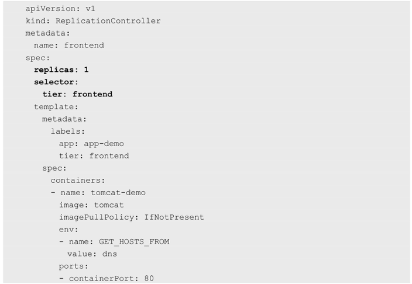

<!-- @import "[TOC]" {cmd="toc" depthFrom=1 depthTo=6 orderedList=false} -->

<!-- code_chunk_output -->

- [1. 概述](#1-概述)
  - [1.1. apiVersion属性和核心](#11-apiversion属性和核心)
  - [1.2. 资源对象新属性的支持方法](#12-资源对象新属性的支持方法)
- [2. 整体架构](#2-整体架构)
  - [2.1. Master](#21-master)
  - [2.2. Node](#22-node)
- [3. Pod](#3-pod)
  - [3.1. Pod组成](#31-pod组成)
  - [3.2. 为什么要有Pod](#32-为什么要有pod)
  - [3.3. Pod IP](#33-pod-ip)
  - [3.4. 两种类型的Pod](#34-两种类型的pod)
  - [3.5. Pod容器与Node](#35-pod容器与node)
  - [3.6. Pod对象的定义](#36-pod对象的定义)
  - [3.7. Pod Volume](#37-pod-volume)
  - [3.8. Event](#38-event)
  - [3.9. 资源限额](#39-资源限额)
    - [3.9.1. CPU配额](#391-cpu配额)
    - [3.9.2. Memory配额](#392-memory配额)
    - [3.9.3. 配额限定的参数](#393-配额限定的参数)
  - [3.10. Pod以及周边对象关系](#310-pod以及周边对象关系)
- [4. Label标签](#4-label标签)
- [5. Label Selector标签选择器](#5-label-selector标签选择器)
  - [5.1. 两种selector表达式](#51-两种selector表达式)
  - [5.2. 主要使用场景](#52-主要使用场景)
- [6. Pod控制器](#6-pod控制器)
  - [6.1. Replication Controller](#61-replication-controller)
  - [Replica Set](#replica-set)
  - [6.2. Deployment](#62-deployment)
  - [6.3. StatefulSet](#63-statefulset)
  - [6.4. Job: 批处理任务](#64-job-批处理任务)
- [7. Horizontal Pod Autoscaler](#7-horizontal-pod-autoscaler)
  - [7.1. Pod负载的度量指标](#71-pod负载的度量指标)
  - [7.2. 基础数据采集监控框架](#72-基础数据采集监控框架)
  - [7.3. HPA的例子](#73-hpa的例子)
- [8. Service](#8-service)
  - [8.1. 概述](#81-概述)
    - [8.1.1. Pod、RC与Service的关系](#811-pod-rc与service的关系)
    - [8.1.2. Kubernetes提供的微服务网络架构](#812-kubernetes提供的微服务网络架构)
    - [8.1.3. 多Pod副本访问](#813-多pod副本访问)
    - [8.1.4. Kubernetes的负载均衡器: kube\-proxy(Node上), 转发对Service的请求到某个Pod](#814-kubernetes的负载均衡器-kube-proxynode上-转发对service的请求到某个pod)
    - [8.1.5. Cluster IP](#815-cluster-ip)
    - [8.1.6. 定义举例](#816-定义举例)
    - [8.1.7. Service的多端口问题](#817-service的多端口问题)
  - [8.2. Kubernetes的服务发现机制](#82-kubernetes的服务发现机制)
    - [8.2.1. Linux环境变量](#821-linux环境变量)
    - [8.2.2. DNS系统](#822-dns系统)
  - [8.3. 外部系统访问Service的问题](#83-外部系统访问service的问题)
    - [8.3.1. 3种IP地址](#831-3种ip地址)
      - [8.3.1.1. Node IP](#8311-node-ip)
      - [8.3.1.2. Pod IP](#8312-pod-ip)
      - [8.3.1.3. Cluster IP](#8313-cluster-ip)
    - [8.3.2. 外部应用访问Service](#832-外部应用访问service)
      - [8.3.2.1. NodePort: 外部访问NodeIP \+ NodePort](#8321-nodeport-外部访问nodeip--nodeport)
      - [8.3.2.2. 负载均衡问题: 外部访问负载均衡器的IP(由负载均衡器转发到Node)](#8322-负载均衡问题-外部访问负载均衡器的ip由负载均衡器转发到node)
- [9. Volume: Pod中多个容器共享](#9-volume-pod中多个容器共享)
  - [9.1. Volume类型](#91-volume类型)
    - [9.1.1. emptyDir: 临时空间](#911-emptydir-临时空间)
    - [9.1.2. hostPath: 宿主机文件或目录](#912-hostpath-宿主机文件或目录)
    - [9.1.3. gcePersistentDisk: Google公有云PD](#913-gcepersistentdisk-google公有云pd)
    - [9.1.4. awsElasticBlockStore: AWS的EBS Volume](#914-awselasticblockstore-aws的ebs-volume)
    - [9.1.5. NFS: NFS网络文件系统](#915-nfs-nfs网络文件系统)
    - [9.1.6. 其他类型的Volume](#916-其他类型的volume)
- [10. Persistent Volume(PV): 独立于Pod之外](#10-persistent-volumepv-独立于pod之外)
- [11. Name和Namespace: 多租户隔离](#11-name和namespace-多租户隔离)
- [12. Annotation](#12-annotation)
- [13. ConfigMap](#13-configmap)
- [14. Ingress: 外部用户访问Pod对象](#14-ingress-外部用户访问pod对象)
- [15. 小结](#15-小结)

<!-- /code_chunk_output -->

# 1. 概述

大部分概念如**Node**、**Pod**、**Replication Controller**、**Service**等都可以被看作一种**资源对象**, 几乎所有资源对象都可以通过Kubernetes提供的**kubectl工具**(或者**API编程调用**)执行增、删、改、查等操作并将其保存在**etcd**中持久化存储. 

## 1.1. apiVersion属性和核心

声明一个**Kubernetes资源对象**, 注意一个**关键属性**: **apiVersion**. 以下面的Pod声明为例, 可以看到Pod这种资源对象归属于v1这个核心API. 


Kubernetes采用了"**核心**\+**外围扩展**"的设计思路, **核心稳定**\+**持续演进升级**. 

大部分常见的核心资源对象都归属于v1这个核心API, 比如Node、Pod、Service、Endpoints、Namespace、RC、PersistentVolume等. 

可以采用**YAML**或**JSON格式**声明(定义或创建)一个**Kubernetes资源对象**, 每个资源对象都有自己的特定语法格式(可以理解为数据库中一个特定的表). 

## 1.2. 资源对象新属性的支持方法

一些资源对象会**不断引入新的属性**. 为不影响当前功能情况下引入对新特性的支持, 两种典型方法.

⓵ 设计数据库表的时候, 在每个表中都增加一个很长的备注字段, 之后扩展的数据以某种格式(如XML、JSON、简单字符串拼接等)放入备注字段. 

⓶ 直接修改数据库表, 增加一个或多个新的列, 此时程序的改动范围较大, 风险更大

更加优雅的做法是:

先采用方法1实现这个新特性, 经过几个版本的迭代, 等新特性变得稳定成熟了以后, 可以在后续版本中采用方法2升级到正式版. 

为此, Kubernetes为**每个资源对象**都增加了类似数据库表里**备注字段**的通用属性**Annotations**, 以实现方法1的升级. 

比如Kubernetes 1.3版本引入的Pod的Init Container新特性


在1.8版本后, 其定义被放入Pod的spec.initContainers


下面介绍Kubernetes中的资源对象.

# 2. 整体架构

Kubernetes使用**共享网络**将**多个物理机**或**虚拟机**汇集到**一个集群**中, 在各服务器之间进行通信, 该集群是配置Kubernetes的**所有组件、功能和工作负载**的物理平台. 

集群中一台服务器(或高可用部署中的一组服务器)用作Master, 负责管理整个集群, 余下的其他机器用作Worker Node(早期版本中也称为Minion), 它们是使用本地和外部资源接收和运行工作负载的服务器, 如图所示. 

集群中的这些主机可以是**物理服务器**, 也可以是**虚拟机**(包括IaaS云端的VPS). 


## 2.1. Master

集群控制节点, 在每个Kubernetes集群里都需要有一个Master来负责**整个集群的管理和控制**, 基本上Kubernetes的所有控制命令都发给它, 它负责具体的执行过程, 我们后面执行的**所有命令基本都是在Master上运行**的. 

Master是集群的网关和中枢, 负责诸如为用户和客户端**暴露API**、**跟踪其他服务器的健康状态**、以**最优方式调度工作负载**, 以及**编排其他组件之间的通信**等任务, 它是用户或客户端与集群之间的核心联络点, 并负责Kubernetes系统的大多数集中式管控逻辑. 

Master通常会占据一个**独立的服务器**(高可用部署建议用**3台服务器**), 如果它宕机或者不可用, 那么对集群内容器应用的管理都将失效.

在Master上运行以下关键进程.

* Kubernetes API Server(**kube\-apiserver**): 提供了**HTTP Rest接口**的关键服务进程, 是Kubernetes里所有**资源的增、删、改、查等操作**的**唯一入口**, 也是**集群控制的入口进程**. 

* Kubernetes Controller Manager(**kube\-controller\-manager**): Kubernetes里所有**资源对象**的**自动化控制中心**, 可以将其理解为资源对象的"大总管".

* Kubernetes Scheduler(**kube\-scheduler**): 负责资源调度(**Pod调度**)的进程, 相当于公交公司的"调度室". 

* 另外, 在Master上通常还需要部署**etcd服务**, 因为Kubernetes里的**所有资源对象的数据**都被保存在**etcd**中. 

## 2.2. Node

Node是**工作负载点**, 负责**接收来自Master的工作指令**并根据指令相应地**创建或销毁Pod对象**, 以及**调整网络规则**以合理地**路由和转发流量**等. 

**Master**会使用**调度算法**将应用自动指派至**某个特定的Node**运行. 在Node**加入集群**或**从集群中移除**时, Master也会按需**重新编排影响到的Pod**(容器). 于是, 用户无须关心其应用究竟运行于何处. 

**每个Node**上都运行着以下关键进程

- **kubelet**: 负责**Pod对应的容器**的创建、启停等任务, 同时**与Master密切协作**, 实现**集群管理**的基本功能

- **kube\-proxy**: 实现Kubernetes **Service**的**通信**与**负载均衡机制**的重要组件

- Docker Engine(**docker**): Docker引擎, 负责本机的**容器创建和管理**工作

Node可以在**运行期间动态增加到Kubernetes集群**中, 前提是在**这个节点**上已经**正确安装**、**配置和启动**了上述**关键进程**, 在**默认**情况下**kubelet**会**向Master注册自己**, 这也是Kubernetes推荐的Node管理方式. 

一旦Node被纳入集群管理范围, **kubelet进程**就会**定时**向**Master**汇报自身的情报, 例如操作系统、Docker版本、机器的CPU和内存情况, 以及当前有哪些Pod在运行等, 这样Master就可以获知每个Node的资源使用情况, 并实现高效均衡的资源调度策略. 而**某个Node**在超过指定时间不上报信息时, 会被Master判定为"失联", Node的状态被标记为不可用(Not Ready), 随后**Master**会触发"**工作负载大转移**"的自动流程

通过命令查看集群中有多少Node, 再通过kubectl describe node \<node\_name\>查看某个Node的详细信息:

```
# kubectl get nodes
# kubectl describe node XXX
```

结果解释

从抽象的视角来讲, Kubernetes还有着**众多的组件**来支撑其**内部的业务逻辑**, 包括运行应用、应用编排、服务暴露、应用恢复等, 它们在Kubernetes中被抽象为Pod、Service、Controller等资源类型, 下面列出了几个较为常用的资源抽象. 

# 3. Pod

Kubernetes并**不直接运行容器**, 而是使用一个**抽象的资源对象**来封装**一个或者多个容器**, 这个抽象即为Pod, 它也是Kubernetes的**最小调度单元**. 

## 3.1. Pod组成

**Pod这个抽象概念**的表现就是**PodSandbox\<共有环境>、应用容器**和一些**资源约束**.

如图是Pod的组成示意图, 可看到**每个Pod**都有一个特殊的称为"根容器"的**Pause容器**. 

**Pause容器对应的镜像**属于**Kubernetes平台的一部分**, 除了Pause容器, 每个Pod还包含了一个或多个紧密相关的用户业务容器.


尽管Pod中可以包含多个容器, 但是作为**最小调度单元**, 它应该尽可能地保持"小", 即**通常**只应该包含**一个主容器**, 以及**必要的辅助型容器(sidecar**)

## 3.2. 为什么要有Pod

原因一: 在一组容器作为一个单元的情况下, 无法简单地对"整体"进行判断及有效行动. 以业务无关并且不易死亡的Pause容器作为Pod的根容器, 以它的状态代表整个容器组的状态.

原因二: Pod里的**多个业务容器**共享**Pause容器的IP**, 共享**Pause容器挂接的Volume**, 既简化了容器之间的通信问题, 又解决了文件共享问题.

**同一Pod**中的**容器**共享**网络名称空间**和**存储资源**, 这些容器可经由**本地回环节口lo直接通信**, 但彼此之间又在**Mount**、**User**及**PID**等名称空间上保持了隔离. 

## 3.3. Pod IP

Kubernetes为**每个Pod**都分配了**唯一的IP地址**, 称之为Pod IP, **一个Pod**里的**多个容器共享Pod IP地址**. Kubernetes要求**底层网络**支持集群内**任意两个Pod**之间的**TCP\/IP直接通信**, 这通常采用**虚拟二层网络技术**来实现, 例如Flannel、Open vSwitch等, 因此我们需要牢记一点: 在Kubernetes里, **一个Pod里的容器**与**另外主机上的Pod容器**能够**直接通信**. 

## 3.4. 两种类型的Pod

Pod其实有两种类型: **普通的Pod**及**静态Pod**(Static Pod). 

- 普通的Pod一旦被创建, 就会被放入**etcd中存储**, , 随后会被Kubernetes **Master调度**到**某个具体的Node**上并进行绑定(Binding), 随后该Pod被**对应的Node**上的**kubelet进程实例化**成**一组相关的Docker容器**并启动. 
- 静态Pod并没被存放在Kubernetes的etcd存储里, 而是被存放在**某个具体的Node**上的**一个具体文件**中, 并且**只在此Node**上启动、运行. 

## 3.5. Pod容器与Node

在默认情况下, 当Pod里的某个容器停止时, Kubernetes会自动检测到这个问题并且**重新启动这个Pod**(重启**Pod里的所有容器！！！**), 如果**Pod**所在的**Node宕机**, 就会将这个Node上的**所有Pod重新调度**到其他节点上. 

Pod、容器与Node的关系如图1.5所示. 


## 3.6. Pod对象的定义

所有资源对象都可以采用YAML或者JSON格式的文件来定义或描述


**kind**为Pod表明这是一个**Pod的定义**, **metadata**里的**name属性**为**Pod的名称**, 在metadata里还能**定义资源对象的标签**, 这里声明myweb拥有一个name=myweb的标签. 

在Pod里所包含的**容器组的定义**则在**spec一节**中声明, 这里定义了一个名为myweb、对应镜像为kubeguide/tomcat\-app:v1的容器, 该容器注入了名为MYSQL\_SERVICE_HOST='mysql'和MYSQL\_SERVICE\_PORT='3306'的环境变量(env关键字), 并且**在8080端口**(**containerPort**)**启动容器进程**. 

**Pod的IP！！！** 加上这里的**容器端口(containerPort**), 组成了一个**新的概念—Endpoint**, 它**代表此Pod**里的**一个服务进程**的**对外通信地址**. 

一个Pod也存在具有**多个Endpoint**的情况, 比如当我们把Tomcat定义为一个Pod时, 可以对外暴露**管理端口**与**服务端口**这**两个Endpoint**. 

## 3.7. Pod Volume

**Docker Volume**在Kubernetes里也有对应的概念—Pod Volume, 后者有一些扩展, 比如可以用分布式文件系统GlusterFS实现**后端存储功能**; 

**Pod Volume**是被**定义在Pod上**, 然后被**各个容器**挂载到自己的**文件系统**中的. 

## 3.8. Event

Event是**一个事件的记录**, 记录了事件的最早产生时间、最后重现时间、重复次数、发起者、类型, 以及导致此事件的原因等众多信息. 

Event通常会被关联到**某个具体的资源对象**上. Node的描述信息有Event记录, 而**Pod同样有Event记录**, 可用`kubectl describe pod xxxx`查看pod的描述信息, 以定位问题成因.

## 3.9. 资源限额

**每个Pod**都可以对其能使用的服务器上的**计算资源设置限额**, 当前可以设置限额的计算资源有**CPU**与**Memory**两种, 其中CPU的资源单位为CPU(Core)的数量, 是一个绝对值而非相对值. 

### 3.9.1. CPU配额

对于绝大多数容器来说, 一个CPU的资源配额相当大, 所以在Kubernetes里通常以**千分之一的CPU配额！！！** 为**最小单位**, 用m来表示. 

通常一个容器的CPU配额被定义为**100~300m**, 即占用**0.1~0.3个CPU**. 由于CPU配额是一个**绝对值**, 所以无论在拥有一个Core的机器上, 还是在拥有48个Core的机器上, **100m这个配额**所代表的CPU的使用量都是一样的. 

### 3.9.2. Memory配额

Memory配额也是一个绝对值, 它的单位是内存字节数. 

### 3.9.3. 配额限定的参数

在Kubernetes里, 一个**计算资源进行配额限定**时需要设定以下两个参数. 

- Requests: 该资源的最小申请量, 系统必须满足要求. 
- Limits: 资源最大允许使用的量, 不能被突破, 当**容器**试图使用**超过这个量的资源**时, **可能**会被Kubernetes"杀掉"并重启. 

## 3.10. Pod以及周边对象关系

Pod及Pod周边对象的示意图作为总结, 如图1.6所示


# 4. Label标签

标签(Label)是将资源进行分类的标识符, **一个Label**是一个**key=value的键值对**, 其中key与value由用户自己指定. 

Label可以**被附加到各种资源对象！！！** 上, 例如Node、Pod、Service、RC等, 用来**指定对象辨识性的属性**, **一个资源对象**可以定义**任意数量的Label**, 同一个Label也可以被添加到任意数量的资源对象上. 


Label通常在**资源对象定义时确定**, 也可以在对象创建后**动态！！！添加或者删除**. 

# 5. Label Selector标签选择器

给某个资源对象定义一个Label, 就相当于给它打了一个标签, 随后可以通过**Label Selector(标签选择器**)查询和筛选**拥有某些Label的资源对象**, Kubernetes通过这种方式实现了类似SQL的简单又通用的对象查询机制. 


## 5.1. 两种selector表达式

当前有两种Label Selector表达式: 基于等式的(**Equality\-based**)和基于集合的(**Set\-based**)

Equality\-based

- name=redis\-slave
- env!=production
- name in(redis\-master, redis\-slave)
- name not in(php-frontend)

多个表达式之间用", "进行分隔即可, 几个条件之间是"AND"的关系

`name=redis-slave,env!=production`

以myweb **Pod**为例, Label被定义在其metadata中: 


**管理对象RC和Service**是通过Selector字段设置需要关联Pod的Label:


**其他管理对象**如Deployment、ReplicaSet、DaemonSet和Job则可以在**Selector**中使用**基于集合**的筛选条件定义, 例如: 


- matchLabels用于定义一组Label, 与直接写在Selector中的作用相同; 
- matchExpressions用于定义一组**基于集合的筛选条件**, 可用的条件运算符包括In、NotIn、Exists和DoesNotExist. 

如果同时设置, 则两组条件为AND关系

## 5.2. 主要使用场景

Label Selector在Kubernetes中的重要使用场景如下. 

* **kube\-controller进程**通过在**资源对象RC**上定义的**Label Selector**来筛选要监控的**Pod副本数量**, 使Pod副本数量始终符合预期设定的全自动控制流程. 

* **kube\-proxy进程**通过**Service**的Label Selector来**选择对应的Pod**, 自动建立**每个Service到对应Pod**的**请求转发路由表**, 从而实现Service的**智能负载均衡机制**. 

* 通过对**某些Node**定义**特定的Label**, 并且在**Pod定义**文件中使用**NodeSelector**这种标签调度策略, kube\-scheduler进程可以实现**Pod定向调度**的特性. 

一个更复杂的例子: 假设为Pod定义了3个Label: release、env和role, 不同的Pod定义了不同的Label值, 如图1.7所示, 如果设置"role=frontend"的Label Selector, 则会选取到Node 1和Node 2上的Pod. 

如果设置"release=beta"的Label Selector, 则会选取到Node 2和Node 3上的Pod, 如图1.8所示. 

图1.7　Label Selector的作用范围1:


图1.8　Label Selector的作用范围2:


# 6. Pod控制器

尽管Pod是Kubernetes的最小调度单元, 但用户通常并**不会直接部署及管理Pod对象**, 而是要**借助于另一类抽象—控制器(Controller**)对其进行管理. 

用于**工作负载的控制器**是**一种管理Pod生命周期的资源抽象**, 它们是Kubernetes上的**一类对象**, 而**非单个资源对象**, 包括**ReplicationController**、**ReplicaSet**、**Deployment**、**StatefulSet**、**Job**等. 

以图1-9中所示的Deployment控制器为例, 它负责确保指定的Pod对象的副本数量精确符合定义, 否则"**多退少补**". **使用控制器**之后就**不再需要手动管理Pod对象**了, 用户只需要声明应用的期望状态, **控制器**就会**自动对其进行进程管理**. 

图1-9 Deployment控制器示意图:


## 6.1. Replication Controller

简单来说, 它其实**定义了一个期望的场景**, 即声明**某种Pod！！！** 的**副本数量**在任意时刻都**符合某个预期值**, 所以RC的定义包括如下几个部分. 

- Pod期待的**副本数量**
- 用于**筛选目标Pod**的**Label Selector**. 
- 当Pod的副本数量小于预期数量时, 用于创建新Pod的**Pod模板**(template). 

下面是一个完整的RC定义的例子, 即确保拥有**tier=frontend标签的**这个**Pod**(运行Tomcat容器)在整个Kubernetes集群中**始终只有一个副本**: 



我们定义了一个RC并将其提交到Kubernetes集群中后, **Master**上的**Controller Manager！！！** 组件就得到通知, 定期**巡检系统中当前存活的目标Pod**, 并确保目标Pod实例的数量刚好等于此RC的期望值, 如果有过多的Pod副本在运行, 系统就会停掉一些Pod, 否则系统会再自动创建一些Pod. 

可以说, **通过RC**, Kubernetes实现了用户**应用集群的高可用性**, 并且大大减少了系统管理员在传统IT环境中需要完成的许多手工运维工作(如主机监控脚本、应用监控脚本、故障恢复脚本等). 

在运行时, 我们可以通过修改RC的副本数量, 来实现**Pod的动态缩放(Scaling**), 这可以通过执行kubectl scale命令来一键完成: 

```
# kubectl scale rc redis-slave --replicas=3
scaled
```

注意, **删除RC**并**不会影响**通过该RC**已创建好的Pod**. 为了**删除所有Pod**, 可以设置**replicas的值为0**, 然后**更新该RC**. 另外, kubectl提供了**stop**和**delete命令**来**一次性删除RC和RC控制的全部Pod**. 

我们希望系统平滑升级, 比如在当前系统中有10个对应的旧版本的Pod, 则**最佳的系统升级方式**是**旧版本的Pod每停止一个**, 就同时**创建一个新版本的Pod**, 在整个升级过程中此消彼长, 而运行中的Pod数量始终是10个, 几分钟以后, 当所有的Pod都已经是新版本时, 系统升级完成. 通过RC机制, Kubernetes很容易就实现了这种高级实用的特性, 被称为"**滚动升级**"(Rolling Update), 具体的操作方法详见3.11节的说明. 

## Replica Set

Replication Controller由于与**Kubernetes代码**中的**模块Replication Controller**同名, 同时"Replication Controller"无法准确表达它的本意, 所以在**Kubernetes 1.2**中, 升级为另外一个新概念—**Replica Set**, 官方解释其为"下一代的RC". 

Replica Set与RC当前的**唯一区别**是, **Replica Sets**支持**基于集合的Label selector(Set\-based selector**), 而RC只支持**基于等式的Label Selector**(equality\-based selector), 这使得Replica Set的功能更强. 下面是等价于之前RC例子的Replica Set的定义(省去了Pod模板部分的内容): 


kubectl命令行工具适用于RC的绝大部分命令同样适用于Replica Set. 当前**很少单独使用Replica Set**, 它主要被**Deployment**这个更高层的资源对象所使用.

**Replica Set**与**Deployment**这两个重要的资源对象逐步**替代了之前RC的作用**, 是**Kubernetes 1.3**里**Pod自动扩容(伸缩**)这个告警功能实现的**基础**.

最后总结一下RC(Replica Set)的一些特性与作用. 

- 在**大多数情况**下, 我们通过**定义一个RC**实现**Pod的创建及副本数量的自动控制**. 
- 在RC里包括**完整的Pod定义模板**. 
- RC通过**Label Selector机制**实现对Pod副本的自动控制. 
- 通过改变RC里的**Pod副本数量**, 可以实现Pod的**扩容或缩容**. 
- 通过改变RC里**Pod模板**中的**镜像版本**, 可以实现Pod的滚**动升级**. 

## 6.2. Deployment

1.2版本中引入的新概念, 用于更好解决**Pod的编排问题**. 

为此, Deployment**内部**使用了**Replica Set**来实现目的, 而Deployment可以看作是**RC的一次升级**.

Deployment相对于RC的一个最大升级是我们可以随时知道**当前Pod"部署"的进度**. 

**一个Pod**的**创建**、**调度**、**绑定节点**及**在目标Node上启动对应的容器**这个完整过程需要一定的时间. 

典型使用场景有以下几个

- **创建一个Deployment对象**来**生成**对应的**Replica Set**并完成**Pod副本的创建**. 
- **检查Deployment的状态**来看部署动作是否完成(**Pod副本数量是否达到预期的值**). 
- 更新Deployment以创建新的Pod(比如镜像升级). 
- 如果当前Deployment不稳定, 则回滚到一个早先的Deployment版本. 
- 暂停Deployment以便于一次性修改多个PodTemplateSpec的配置项, 之后再恢复Deployment, 进行新的发布. 
- 扩展Deployment以应对高负载. 
- 查看Deployment的状态, 以此作为发布是否成功的指标. 
- 清理不再需要的旧版本ReplicaSets. 

除了API声明与Kind类型等有所区别, Deployment的定义与Replica Set的定义很类似: 


创建一个名为tomcat\-deployment.yaml的Deployment描述文件, 内容如下: 

```yaml
apiVersion: extensions/v1beta1
kind: Deployment
metadata:
  name: frontend
spec:
  replicas: 1
  selector:
    matchLabels:
      tier: frontend
    matchExpressions:
      - {key: tier, operator: In, values: [frontend]}
  template:
    metadata:
      labels:
        app: app-demo
        tier: frontend
    spec:
      containers:
      - name: tomcat-demo
        image: tomcat
        imagePullPolicy: IfNotPresent
        ports:
        - containerPort: 8080
```

创建Deployment: 

```
# kubectl create -f tomcat-deployment.yaml
```

查看Deployment的信息:

```
# kubectl get deployments
NAME                DESIRED     CURRENT     UP-TO-DATE      AVAILABLE   AGE
tomcat-deploy       1           1           1               1           4m
```

其中:

- DESIRED: **Pod副本数量**的**期望值**, 即在Deployment里定义的Replica. 
- CURRENT: **当前Replica的值**, 实际上是Deployment创建的Replica Set里的Replica值, 这个值不断增加, 直到达到DESIRED为止, 表明整个部署过程完成. 
- UP\-TO\-DATE: **最新版本的Pod的副本数量**, 用于指示在**滚动升级**的过程中, 有多少个Pod副本已经成功升级. 
- AVAILABLE: 当前集群中可用的Pod副本数量, 即集群中**当前存活的Pod数量**. 

查看对应的Replica Set, 可以看到命令与Deployment的名称有关

```
# kubectl get rs
NAME                        DESIRED     CURRENT     AGE
tomcat-deploy-1640611518    1           1           1m
```

查看创建的Pod, Pod的命名以Deployment对应的Replica Set的名称为前缀, 这种命名很清晰地表明了**一个Replica Set创建了哪些Pod**, 对于Pod滚动升级这种复杂的过程来说, 很容易排查错误: 


运行kubectl describe deployments, 可以清楚地看到Deployment控制的Pod的水平扩展过程.

Pod的管理对象, 除了RC和Deployment, 还包括ReplicaSet、DaemonSet、StatefulSet、Job等, 分别用于不同的应用场景中

## 6.3. StatefulSet

Pod的管理对象RC、Deployment、DaemonSet和Job都面向**无状态的服务**. 

但现实中有**很多服务是有状态的**, 特别是一些复杂的**中间件集群**, 例如**MySQL集群**、**MongoDB集群**、**Akka集群**、**ZooKeeper集群**等, 这些**应用集群**有4个共同点. 

(1)**每个节点**都有**固定的身份ID**, 通过这个ID, 集群中的成员可以相互发现并通信. 

(2)集群的**规模是比较固定**的, 集群规模不能随意变动. 

(3)集群中的**每个节点都是有状态**的, 通常会**持久化数据到永久存储**中. 

(4)如果**磁盘损坏**, 则集群里的**某个节点无法正常运行**, 集群功能受损. 

如果通过**RC**或**Deployment**控制**Pod副本数量**来实现上述有状态的集群, 就会发现**第1点是无法满足**的, 因为**Pod的名称**是**随机产生**的, Pod的**IP地址**也是在**运行期**才确定且可能有变动的, 我们事先**无法为每个Pod**都确定**唯一不变的ID**. 

另外, 为了能够在**其他节点**上**恢复某个失败的节点**, 这种集群中的**Pod需要挂接某种共享存储**, 为了解决这个问题, Kubernetes从1.4版本开始引入了**PetSet**这个新的资源对象, 并且在1.5版本时更名为**StatefulSet**.

StatefulSet从本质上来说, 可以看作**Deployment/RC**的一个**特殊变种**, 它有如下特性. 

- StatefulSet里的**每个Pod**都有**稳定、唯一的网络标识**, 可以用来发现集群内的其他成员. 假设StatefulSet的名称为**kafka**, 那么**第1个Pod**叫**kafka\-0**, 第2个叫kafka\-1, 以此类推. 

- StatefulSet控制的**Pod副本的启停顺序是受控**的, 操作第n个Pod时, 前n\-1个Pod已经是运行且准备好的状态. 

- StatefulSet里的Pod采用稳定的**持久化存储卷**, 通过**PV**或**PVC**来实现, **删除Pod**时**默认不会删除**与StatefulSet相关的**存储卷**(为了保证数据的安全). 

StatefulSet除了要**与PV卷捆绑使用**以**存储Pod的状态数据**, 还要与**Headless Service**配合使用, 即在每个StatefulSet定义中都要声明它**属于哪个Headless Service**. 

Headless Service与普通Service的关键区别在于, 它**没有Cluster IP**, 如果解析Headless Service的**DNS域名**, 则返回的是该Service对应的**全部Pod的Endpoint列表**. 

StatefulSet在Headless Service的基础上又为StatefulSet控制的**每个Pod实例**都创建了一个**DNS域名**, 这个域名的格式为: 

```
$(podname).$(headless service name)
```

比如一个3节点的Kafka的**StatefulSet集群**对应的**Headless Service**的名称为kafka, StatefulSet的名称为kafka, 则StatefulSet里的3个Pod的DNS名称分别为kafka\-0.kafka、kafka\-1.kafka、kafka\-2.kafka, 这些DNS名称可以直接在集群的配置文件中固定下来. 

## 6.4. Job: 批处理任务

**批处理任务**通常**并行(或者串行**)启动**多个计算进程**去处理**一批工作项**(work item), 在**处理完成**后, **整个批处理任务结束**. 

从1.2版本开始, Kubernetes支持批处理类型的应用, 通过Kubernetes **Job**这种新的**资源对象**定义并启动一个**批处理任务Job**. 与RC、Deployment、ReplicaSet、DaemonSet类似, Job也**控制一组Pod容器**. 从这个角度来看, Job也是一种**特殊的Pod副本自动控制器**, 同时Job控制Pod副本与RC等控制器的工作机制有以下重要差别. 

(1)Job所控制的**Pod副本**是**短暂运行**的, 可以将其视为**一组Docker容器**, 其中的**每个Docker容器**都**仅仅运行一次**. 当Job控制的**所有Pod副本都运行结束**时, 对应的**Job也就结束**了. Job在实现方式上与RC等副本控制器不同, Job生成的Pod副本是不能自动重启的, 对应Pod副本的**RestartPoliy**都被设置为**Never**. 因此, 当对应的Pod副本都执行完成时, 相应的Job也就完成了控制使命, 即Job生成的Pod在Kubernetes中是短暂存在的. Kubernetes在1.5版本之后又提供了类似crontab的定时任务——**CronJob**, 解决了**某些批处理任务**需要**定时反复执行**的问题. 

(2)Job所控制的**Pod副本**的工作模式能够**多实例并行计算**, 以TensorFlow框架为例, 可以将一个机器学习的计算任务分布到10台机器上, 在每台机器上都运行一个worker执行计算任务, 这很适合通过**Job**生成**10个Pod副本同时启动运算**. 

# 7. Horizontal Pod Autoscaler

执行kubectl **scale命令**, 我们可以实现**Pod扩容或缩容**. 显然不符合谷歌对Kubernetes的定位目标—自动化、智能化. 

在谷歌看来, **分布式系统**要能够根据**当前负载的变化自动！！！触发水平扩容或缩容**.

Kubernetes 1.1中首次发布重量级新特性—Horizontal Pod Autoscaling(Pod横向自动扩容, HPA). 

1.2中HPA被升级为稳定版本(apiVersion: autoscaling/v1), 但仍然保留了旧版本(apiVersion: extensions/v1beta1). 

1.6版本开始, 增强了根据应用自定义的指标进行自动扩容和缩容的功能, API版本为**autoscaling/v2alpha1**

HPA与之前的**RC**、**Deployment**一样, 也属于一种**Kubernetes资源对象**. 

通过追踪分析**指定RC控制**的**所有目标Pod**的**负载变化情况**, 来确定是否需要有**针对性地调整目标Pod的副本数量**, 这是HPA的实现原理. 

## 7.1. Pod负载的度量指标

当前, HPA有以下两种方式作为**Pod负载的度量指标**. 

- CPUUtilizationPercentage
- 应用程序自定义的度量指标, 比如服务在**每秒内的相应请求数**(TPS或QPS)

CPUUtilizationPercentage是一个**算术平均值**, 即**目标Pod所有副本自身的CPU利用率**的**平均值**. 一个Pod自身的CPU利用率是**该Pod当前CPU的使用量**除以它的**Pod Request的值**, 比如定义一个Pod的Pod Request为0.4, 而当前Pod的CPU使用量为0.2, 则它的CPU使用率为50%, 这样就可以算出一个RC控制的所有Pod副本的CPU利用率的算术平均值了. 如果某一时刻CPUUtilizationPercentage的值超过80%, 则意味着当前Pod副本数量很可能不足以支撑接下来更多的请求, 需要进行**动态扩容**, 而在请求高峰时段过去后, Pod的CPU利用率又会降下来, 此时对应的**Pod副本数应该自动减少**到一个合理的水平. 如果目标Pod**没有定义Pod Request**的值, 则**无法**使用CPUUtilizationPercentage实现Pod横向自动扩容. 

Kubernetes从1.2版本开始也在尝试支持**应用程序自定义的度量指标**. 

## 7.2. 基础数据采集监控框架

CPUUtilizationPercentage计算过程中使用到的Pod的CPU使用量通常是1min内的平均值, 通常通过查询**Heapster监控子系统**来得到这个值, 所以需要安装部署**Heapster**, 这样便增加了系统的复杂度和实施HPA特性的复杂度. 

因此, 从1.7版本开始, Kubernetes自身孵化了一个**基础性能数据采集监控框架**——**Kubernetes Monitoring Architecture**, 从而更好地**支持HPA**和**其他需要用到基础性能数据的功能模块**. 

在Kubernetes Monitoring Architecture中, Kubernetes定义了一套**标准化的API接口Resource Metrics API**, 以方便**客户端应用程序(如HPA**)从**Metrics Server**中获取**目标资源对象的性能数据**, 例如**容器的CPU**和**内存**使用数据. 

到了Kubernetes 1.8版本, Resource Metrics API被升级为metrics.k8s.io/v1beta1, 已经接近生产环境中的可用目标了. 

## 7.3. HPA的例子

一个HPA的具体例子:


根据上面的定义, 我们可以知道这个HPA控制的目标对象为一个名为php\-apache的Deployment里的Pod副本, 当这些Pod副本的CPUUtilizationPercentage的值超过90%时会触发自动动态扩容行为, 在扩容或缩容时必须满足的一个约束条件是Pod的副本数为1~10. 

# 8. Service

## 8.1. 概述

**每个Service！！！** 其实就是我们经常提起的**微服务架构！！！** 中的一个**微服务！！！**.

Service是建立在**一组Pod对象**之上的**资源抽象**, 它通过**标签选择器**选定**一组Pod对象**, 并为**这组Pod对象**定义一个**统一的固定访问入口(通常是一个IP地址**), 若Kubernetes集群存在**DNS附件**, 它就会在Service创建时为其**自动配置一个DNS名称**以便客户端进行**服务发现**. 

到达Service IP的请求将被**负载均衡**至其后的端点—**各个Pod对象之上**, 因此Service从本质上来讲是一个**四层代理服务！！！**. 

另外, Service还可以将**集群外部流量**引入到集群中来. 

### 8.1.1. Pod、RC与Service的关系

图1.12显示了Pod、RC与Service的逻辑关系. 


**Service**定义了一个**服务的访问入口地址**, 前端的应用(Pod)通过这个入口地址访问其背后的一组由**Pod副本**组成的**集群实例**, **Service**与其**后端Pod副本集群**之间则是通过**Label Selector**来实现无缝对接的. **RC**的作用实际上是保证Service的服务能力和服务质量始终符合预期标准. 

### 8.1.2. Kubernetes提供的微服务网络架构

通过**分析、识别**并建模系统中的**所有服务为微服务**—Kubernetes Service, 我们的**系统！！！** 最终由**多个**提供**不同业务能力！！！** 而又**彼此独立！！！** 的**微服务单元！！！** 组成的, **服务之间！！！** 通过**TCP/IP！！！** 进行通信, 从而形成了强大而又灵活的弹性网格, 拥有强大的分布式能力、弹性扩展能力、容错能力, 程序架构也变得简单和直观许多, 如图1.13所示. 

Kubernetes提供的微服务网格架构:


### 8.1.3. 多Pod副本访问

既然**每个Pod！！！** 都会被分配一个**单独的IP！！！** 地址, 而且**每个Pod**都提供了一个**独立的Endpoint(Pod IP\+ContainerPort**)以被客户端访问, 现在**多个Pod副本！！！** 组成了一个**集群！！！** 来提供服务, 那么**客户端如何来访问**它们呢?

一般的做法是部署一个**负载均衡器(软件或硬件！！！**), 为**这组Pod**开启一个**对外的服务端口**如8000端口, 并且将**这些Pod的Endpoint列表**加入**8000端口的转发列表**, **客户端**就可以通过**负载均衡器！！！** 的**对外IP地址！！！\+服务端口！！！** 来访问此服务. **客户端的请求**最后会被转发到**哪个Pod**, 由**负载均衡器的算法**所决定. 

### 8.1.4. Kubernetes的负载均衡器: kube\-proxy(Node上), 转发对Service的请求到某个Pod

Cluster IP是Kubernetes集群的内部IP, 所以只能用于集群内部访问.

Kubernetes也遵循上述常规做法, 运行在**每个Node！！！** 上的**kube\-proxy进程！！！** 其实就是一个智能的**软件负载均衡器！！！**, 负责把**对Service的请求！！！转发到后端的某个Pod实例！！！** 上, 并在**内部(kube\-proxy内部！！！**) 实现服务的**负载均衡**与**会话保持**机制. 

### 8.1.5. Cluster IP

但Kubernetes发明了一种很巧妙又影响深远的设计: **Service没有共用！！！一个负载均衡器的IP地址**, **每个Service！！！** 都被分配了一个**全局唯一的虚拟IP地址**, 这个虚拟IP被称为**Cluster IP**. 这样一来, **每个服务！！！** 就变成了**具备唯一IP地址！！！** 的**通信节点！！！**, **服务调用**就变成了**最基础的TCP网络通信问题**. 

**Pod的Endpoint地址**会随着**Pod的销毁和重新创建**而发生**改变**, 因为**新Pod的IP地址与之前旧Pod的不同**. 而**Service一旦被创建**, Kubernetes就会自动为它分配一个**可用的Cluster IP**, 而且在**Service的整个生命周期**内, 它的**Cluster IP不会发生改变**. 

于是, **服务发现**这个棘手的问题在Kubernetes的架构里也得以轻松解决: 只要用**Service**的**Name**与Service的**Cluster IP**地址做一个**DNS域名映射**即可完美解决问题. 现在想想, 这真是一个很棒的设计. 

### 8.1.6. 定义举例

一个名为tomcat\-service.yaml的定义文件, 如下:

```yaml
apiVersion: v1
kind: Service
metadata:
  name: tomcat-service
spec:
  ports:
  - port: 8080
  selector:
    tier: frontend
```

定义了一个名为tomcat\-service的Service, 它的服务端口为8080, 拥有"**tier=frontend**"这个Label的**所有Pod实例**都属于它

创建

```
# kubectl create -f tomcat-service.yaml
```

之前在**tomcat\-deployment.yaml**里定义的Tomcat的**Pod**刚好拥有**这个标签**, 所以刚才创建的tomcat\-service**已经对应一个Pod实例**, 命令查看tomcatservice的**Endpoint列表**, 其中172.17.1.3是**Pod的IP地址**, 端口8080是Container暴露的端口: 

```
# kubectl get endpoints
NAME            ENDPOINTS             AGE
kubernetes      192.168.18.131:6443   15d
tomcat-service  172.17.1.3:8080       1m
```

"说好的**Service的Cluster IP**呢?怎么没有看到?"

运行下面的命令即可看到**tomcat\-service**被分配的**Cluster IP**及更多的信息: 

```yaml
# kubectl get svc tomcat-service -o yaml
apiVersion: v1
kind: Service
metadata:
  creationTimestamp: 2016-07-21T17:05:52Z
  name: tomcat-service
  namespace: default
  resourceVersion: "23964"
  selfLink: /api/v1/namespaces/default/services/tomcat-service
  uid: 54F2F50C-58DC-4996-A9F8-05B42F6F7CD3
spec:
  clusterIP: 169.169.65.227
  ports:
  - port: 8080
    protocol: TCP
    targetPort: 8080
  selector:
    tier: frontend
  sessionAffinity: None
  type: ClusterIP
status:
  loadBalancer: ()
```

在**spec.ports**的定义中, **targetPort属性**用来确定**提供该服务的容器**所**暴露(EXPOSE)的端口号**, 即**具体业务进程**在**容器内！！！** 的**targetPort！！！** 上**提供TCP/IP接入**; 

**port属性**则定义了**Service！！！的虚端口**. 前面定义Tomcat服务时没有指定targetPort, 则默认targetPort与port相同. 

### 8.1.7. Service的多端口问题

看看Service的多端口问题

**很多服务**都存在**多个端口**的问题, 通常**一个端口**提供**业务服务**, 另外**一个端口**提供**管理服务**, 比如Mycat、Codis等常见中间件. 

Kubernetes **Service**支持**多个Endpoint**, 在存在多个Endpoint的情况下, 要求**每个Endpoint！！！** 都**定义一个名称！！！来区分**. 下面是Tomcat多端口的Service定义样例: 

```yaml
apiVersion: v1
kind: Service
metadata:
  name: tomcat-service
spec:
  ports:
  - port: 8080
   name: service-port
  - port: 8005
   name: shutdown-port
  selector:
    tier: frontend
```

多端口为什么需要给**每个端口都命名！！！** 呢?这就涉及Kubernetes的**服务发现机制**了, 接下来进行讲解. 

## 8.2. Kubernetes的服务发现机制

任何分布式系统都会涉及"服务发现"这个基础问题, **大部分分布式系统**都通过提供**特定的API接口**来实现服务发现功能, 但这样做会导致平台的**侵入性比较强**, 也增加了开发、测试的难度. Kubernetes则采用了直观朴素的思路去解决这个棘手的问题. 

首先, **每个**Kubernetes中的**Service！！！** 都有**唯一的Cluster IP！！！** 及**唯一的名称！！！**, 而名称是由开发者**自己定义！！！** 的, 部署时也没必要改变, 所以完全可以被**固定在配置**中. (也就是说**名称是已知的！！！**)

接下来的问题就是如何**通过Service的名称！！！** 找到**对应的Cluster IP！！！**. 

### 8.2.1. Linux环境变量

最早Kubernetes采用了**Linux环境变量**解决这个问题, 即每个Service都生成了一些对应的Linux环境变量(ENV), 并在**每个Pod容器启动**时自动注入这些**环境变量**

以下是tomcat\-service产生的环境变量条目: 


上述环境变量中, 比较重要的是前3个环境变量. 可以看到, **每个Service的IP地址及端口**都有**标准的命名规范**, 遵循这个命名规范, 就可以通过代码访问系统环境变量来得到所需的信息, 实现服务调用. 

### 8.2.2. DNS系统

后来**Kubernetes**通过**Add\-On增值包**引入了**DNS系统**, 把**服务名作为DNS域名**, 这样程序就可以**直接使用服务名来建立通信连接**了. 

目前, Kubernetes上的**大部分应用**都已经采用了**DNS这种新兴的服务发现机制**, 后面会讲解如何部署DNS系统. 

## 8.3. 外部系统访问Service的问题

### 8.3.1. 3种IP地址

Kubernetes里的3种IP, 这3种IP分别如下. 

- Node IP: Node的IP地址. 
- Pod IP: Pod的IP地址. 
- Cluster IP: Service的IP地址. 

#### 8.3.1.1. Node IP

Node IP是Kubernetes集群中每个节点的物理网卡的IP地址, 是一个真实存在的物理网络. 在Kubernetes集群之外的节点访问Kubernetes集群之内的某个节点或者TCP/IP服务时, 都必须通过Node IP通信. 

#### 8.3.1.2. Pod IP

Pod IP是**每个Pod的IP地址**, 它是**Docker Engine！！！** 根据**docker0网桥！！！** 的**IP地址段**进行分配的, 通常是一个**虚拟的二层网络**. 

前面说过, Kubernetes要求位于**不同Node**上的**Pod**都能够**彼此直接通信！！！**, 所以Kubernetes里**一个Pod里的容器**访问**另外一个Pod里的容器**时, 就是通过**Pod IP**所在的**虚拟二层网络**进行通信的, 而真实的**TCP/IP流量**是通过**Node IP所在的物理网卡流出**的. 

#### 8.3.1.3. Cluster IP

Service的Cluster IP, 它也是一种**虚拟的IP**, 但更像一个"伪造"的IP网络, 原因有以下几点. 

- Cluster IP**仅仅作用！！！** 于Kubernetes **Service这个对象！！！**, 并由Kubernetes管理和分配IP地址(来源于**Cluster IP地址池**). 
- Cluster IP**无法被Ping！！！**, 因为**没有一个"实体网络对象！！！** "来响应. 
- Cluster IP**只能**结合**Service Port**组成一个**具体的通信端口**, 单独的Cluster IP不具备TCP/IP通信的基础, 并且它们**属于Kubernetes集群这样一个封闭的空间**, 集群外的节点如果要访问这个通信端口, 则需要做一些额外的工作. 
- 在Kubernetes集群内, **Node IP网**、**Pod IP网**与**Cluster IP网**之间的通信, 采用的是**Kubernetes自己设计**的一种编程方式的**特殊路由规则！！！**, 与我们熟知的**IP路由**有很大的不同. 

### 8.3.2. 外部应用访问Service

基本明白: Service的**Cluster IP**属于Kubernetes**集群内部的地址！！！**, 无法在集群外部直接使用这个地址. 

那么矛盾来了: 实际上在我们开发的业务系统中肯定多少有一部分**服务**是要提供给Kubernetes集群**外部的应用或者用户**来使用的, 典型的例子就是Web端的服务模块, 比如上面的tomcat\-service, 那么用户怎么访问它?

#### 8.3.2.1. NodePort: 外部访问NodeIP \+ NodePort

采用**NodePort**是解决上述问题的最直接、有效的常见做法. 

以tomcat\-service为例, 在Service的定义里做如下扩展即可: 

```yaml
apiVersion: v1
kind: Service
metadata:
  name: tomcat-service
spec:
 type: NodePort     # 1
 ports:
  - port: 8080
    nodePort: 31002 # 2
 selector:
    tier: frontend
```

其中, **nodePort:31002**这个属性表明手动**指定tomcat\-service的NodePort为31002**, 否则Kubernetes会**自动分配一个可用的端口**. 然后通过`http://<nodePortIP>:31002/`可看到Tomcat欢迎页面

**NodePort**的**实现方式**是在**Kubernetes集群**里的**每个Node！！！** 上都为需要外部访问的**Service开启一个对应的TCP监听端口**, 外部系统只要用**任意一个Node的IP地址！！！** \+ **具体的NodePort端口号！！！** 即可访问此**服务(service**), 在**任意Node**上运行netstat命令, 就可以看到有NodePort端口被监听: 

```
# netstat -tlp | grep 31002
tcp6  0   0   [::]:31002    [::]:*    LISTEN    1125/kube-proxy
```

#### 8.3.2.2. 负载均衡问题: 外部访问负载均衡器的IP(由负载均衡器转发到Node)

外部通过**NodeIP \+ NodePort**访问**Service**(特殊路由关系, Cluster IP \+ Port), 但NodePort还没有完全解决**外部访问Service的所有问题**, 比如**负载均衡问题**. 

假如在我们的集群中有**10个Node**, 则此时最好有一个**负载均衡器**, **外部的请求**只需访问此**负载均衡器的IP地址！！！**, 由**负载均衡器负责转发流量**到后面**某个Node！！！的NodePort**上, 如图1.15所示. 

注: 这**不是将请求转到Service中的某个Pod**, 而是**某个Node！！！** 那S**ervice可以跨node???**

NodePort和Load balancer:


图中Load balancer组件**独立于Kubernetes集群之外**, 通常是一个硬件的负载均衡器, 或者是以软件方式实现的, 例如**HAProxy**或者**Nginx**. 

对于**每个Service！！！**, 我们通常需要配置**一个对应的Load balancer实例**来**转发流量到后端的Node**上, 这的确增加了工作量及出错的概率. 

Kubernetes提供了自动化的解决方案, 如果我们的集群运行在**谷歌的公有云GCE**上, 那么只要把**Service！！！** 的**type=NodePort**改为**type=LoadBalancer**, Kubernetes就会**自动创建一个对应的Load balancer实例**并**返回它的IP地址(balancer的IP地址！！！)供外部客户端使用**. 

其他**公有云提供商**只要实现了支持**此特性的驱动**, 则也可以达到上述目的. 

此外, 裸机上的**类似机制**(**Bare Metal Service Load Balancers**)也在被开发. 

# 9. Volume: Pod中多个容器共享

存储卷(Volume)是**独立**于**容器文件系统！！！之外**的存储空间, 常用于**扩展容器的存储空间**并为它提供**持久存储能力**. 

Kubernetes集群上的存储卷大体可分为**临时卷**、**本地卷**和**网络卷**. 

* **临时卷和本地卷**都位于Node本地, 一旦Pod被调度至其他Node, 此种类型的存储卷将无法访问到, 因此临时卷和本地卷通常用于数据缓存

* 持久化的数据则需要放置于**持久卷(persistent volume**)之上. 

Volume(存储卷)是**Pod中！！！** 能够被**多个容器！！！** 访问的**共享目录**. 

Kubernetes的Volume概念、用途和目的与**Docker的Volume比较类似**, 但两者**不能等价**. 

首先, Kubernetes中的**Volume**被定义在**Pod**上, 然后被**一个Pod**里的**多个容器**挂载到**具体的文件目录**下; 

其次, Kubernetes中的Volume**与Pod！！！的生命周期相同**, 但**与容器的生命周期不相关**, 当**容器终止或者重启**时, **Volume中的数据也不会丢失**. 

最后, Kubernetes支持**多种类型的Volume**, 例如**GlusterFS**、**Ceph**等先进的**分布式文件系统**. 

大多数情况下, 我们先在**Pod上**声明一个**Volume**, 然后在**容器**里**引用该Volume**并**挂载(Mount)到容器**里的某个目录上. 

举例来说, 我们要给之前的**Tomcat Pod**增加一个名为**datavol**的**Volume**, 并且**挂载**到**容器的/mydata\-data目录**上, 则只要对Pod的定义文件做如下修正即可(注意代码中的粗体部分): 

```yaml
template:
  metadata:
    labels:
      app: app-demo
      tier: frontend
  spec:
    volume:
      - name: datavol
        emptyDir: {}
    containers:
      - name: tomcat-demo
        image: tomcat
        volumeMounts:
          - mountPath: /mydata-data
            name: datavol
        imagePullPolicy: IfNotPresent
```

除了可以让**一个Pod**里的**多个容器共享文件**、让**容器的数据**写到**宿主机的磁盘！！！** 上或者**写文件到网络存储！！！** 中, Kubernetes的Volume还扩展出了一种非常有实用价值的功能, 即**容器配置文件集中化定义与管理！！！**, 这是通过**ConfigMap**这种新的资源对象来实现的, 后面会详细说明. 

## 9.1. Volume类型

Kubernetes提供了非常丰富的Volume类型

### 9.1.1. emptyDir: 临时空间

一个**emptyDir Volume**是在**Pod分配到Node时**创建的. 

从它的名称就可以看出, 它的初始内容为空, 并且**无须指定！！！宿主机上对应的目录文件**, 因为这是Kubernetes**自动分配的一个目录**, 当**Pod从Node上移除**时, emptyDir中的数据也会被**永久删除！！！**. 

emptyDir的一些用途如下. 

- **临时空间**, 例如用于某些应用程序运行时所需的临时目录, 且无须永久保留. 
- 长时间任务的**中间过程CheckPoint**的临时保存目录. 
- 一个容器需要从另一个容器中获取数据的目录(**多容器共享目录**). 

目前, 用户**无法控制emptyDir**使用的**介质种类**. 

如果kubelet的配置是使用硬盘, 那么所有emptyDir都将被创建在该硬盘上. 

Pod在将来可以设置emptyDir是位于硬盘、固态硬盘上还是**基于内存的tmpfs**上, 上面的例子便采用了emptyDir类的Volume. 

### 9.1.2. hostPath: 宿主机文件或目录

hostPath为**在Pod上挂载宿主机！！！上的文件或目录**, 它通常可以用于以下几方面. 

- **容器应用**程序生成的**日志文件！！！** 需要**永久保存！！！** 时, 可以使用**宿主机**的**高速文件系统**进行存储. 
- 需要访问**宿主机上Docker引擎内部数据结构的容器应用**时, 可以通过定义hostPath为**宿主机/var/lib/docker目录**, 使容器内部应用可以**直接访问Docker的文件系统**. 

需要注意

- 在**不同的Node**上具有**相同配置的Pod**, 可能会因为**宿主机**上的**目录和文件不同**而导致对Volume上目录和文件的**访问结果不一致**. 
- 如果使用了**资源配额管理**, 则Kubernetes**无法**将hostPath在**宿主机上使用的资源纳入管理**. 

```yaml
volumes:
  - name: "persisent-storage"
    hostPath:
      path: "/data"
```

### 9.1.3. gcePersistentDisk: Google公有云PD

表示使用**谷歌公有云**提供的**永久磁盘(Persistent Disk, PD**)存放Volume的数据, 它与emptyDir不同, PD上的内容会被永久保存, 当Pod被删除时, PD只是被卸载(Unmount), 但不会被删除. 

需要先创建一个PD, 才能使用gcePersistentDisk. 

限制条件:

- Node(运行kubelet的节点)需要是GCE虚拟机
- 这些虚拟机需要与PD存在于相同的GCE项目和Zone中.

创建一个PD:

```
# gcloud compute disks create --size=500GB --zone=us-centrall-a my-data-disk
```

```yaml
volume:
  - name: test-volume
    # This GCE PD must already exist.
    gcePersisentDisk:
      pdName: my-data-disk
      fsType: ext4
```

### 9.1.4. awsElasticBlockStore: AWS的EBS Volume

使用亚马逊EBS Volume存储数据, 需要先创建一个EBS Volume才能使用awsElasticBlockStore.

限制条件:

- Node(运行kubelet的节点)需要是AWS EC2实例
- 这些AWS EC2实例需要与EBS Volume存在于相同的region和availability-zone中. 
- EBS只支持单个EC2实例挂载一个Volume. 

创建一个EBS Volume

```
aws ec2 create-volume --availability-zone eu-west-1a --size 10 --volume-type gp2
```

```yaml
volumes:
  - name: test-volume
  # This AWS EBS volume must already exist.
  awsElasticBlockStore:
    volumeID: aws://<availability-zone>/<volume-id>
    fsType: ext4
```

### 9.1.5. NFS: NFS网络文件系统

使用**NFS网络文件系统**提供的**共享目录存储数据**, 先部署一个NFS Server.

```yaml
volumes:
  - name: nfs
  nfs:
    # 改为NFS服务器地址
    server: nfs-server.localhost
    path: "/"
```

### 9.1.6. 其他类型的Volume

- iscsi: 使用iSCSI存储设备上的目录挂载到Pod中
- flocker: 使用Flocker管理存储卷
- glusterfs: 使用**GlusterFS网络文件系统**的目录挂载到Pod中
- rbd: 使用Ceph块设备共享存储(Rados Block Device)挂载到Pod中
- gitRepo: 通过挂载一个空目录, 并从Git库clone一个git repository
- secret: 一个Secret Volume用于为Pod提供加密的信息, 你可以将定义在Kubernetes中的Secret直接挂载为文件让Pod访问. Secret Volume是通过TMFS(内存文件系统)实现的, 这种类型的Volume总是不会被持久化的. 

# 10. Persistent Volume(PV): 独立于Pod之外

之前提到的**Volume**是被**定义在Pod**上的, 属于**计算资源**的一部分, 而实际上, **网络存储**是相对**独立于计算资源**而存在的一种实体资源. 

比如虚拟机的网络磁盘, Persistent Volume(PV)和与之相关联的Persistent Volume Claim(PVC)也起到了类似的作用. 

**PV**可以被理解成Kubernetes集群中的**某个网络存储对应的一块存储**, 它与Volume类似, 但有以下区别. 

- **PV只能是网络存储**, 不属于任何Node, 但可以在每个Node上访问. 
- PV并**不是被定义在Pod上**的, 而是独立于Pod之外定义的. 
- PV目前支持的类型包括: **gcePersistentDisk**、**AWSElasticBlockStore**、AzureFile、AzureDisk、**FC(Fibre Channel**)、Flocker、**NFS**、iSCSI、RBD(Rados Block Device)、**CephFS**、**Cinder**、GlusterFS、VsphereVolume、Quobyte Volumes、VMware Photon、Portworx Volumes、ScaleIO Volumes和HostPath(仅供单机测试). 

**NFS类型**的PV的YAML定义文件, 声明了需要5Gi的空间

```yaml
---
apiVersion: v1
kind: PersistentVolume
metadata:
  name: pv0003
spec:
  capacity:
    storage: 5Gi
  accessModes:
    - ReadWriteOnce
  nfs:
    path: /somepath
    server: 172.17.0.2
```

比较重要的是PV的accessModes属性, 目前有以下类型

- ReadWriteOnce: **读写权限**, 并且只能被**单个Node挂载**
- ReadOnlyMany: **只读权限**, 允许被**多个Node**挂载
- ReadWriteMany: **读写权限**, 允许被多个Node挂载

如果**某个Pod**想**申请！！！某种类型的PV**, 则**首先需要定义一个PersistentVolumeClaim对象**: 

```yaml
---
kind: PersistentVolumeClaim
apiVersion: v1
metadata:
  name: myclaim
spec:
  accessModes:
    - ReadWriteOnce
  resources:
    requests:
      storage: 8Gi
```

然后, 在**Pod的Volume**定义中**引用上面的PVC**

```yaml
volumes:
  - name: mypd
  persistentVolumeClaim:
    claimName: myclaim
```

PV是**有状态的对象**, 它的状态有以下几种

- **Available**: **空闲状态**
- **Bound**: **已经绑定到某个PVC**上
- Released: 对应的PVC已经被删除, 但资源还没有被集群收回
- Failed: PV自动回收失败

# 11. Name和Namespace: 多租户隔离

**名称(Name**)是Kubernetes集群中**资源对象的标识符**, 它们的**作用域**通常是**名称空间(Namespace**), 因此名称空间是名称的额外的限定机制. 在**同一个名称空间**中, **同一类型资源对象**的**名称必须具有唯一性**. **名称空间**通常用于实现**租户或项目的资源隔离**, 从而形成逻辑分组, 如图1-10所示. 创建的Pod和Service等资源对象都属于名称空间级别, 未指定时, 它们都属于**默认的名称空间"default**". 


Namespace在很多情况下用于实现**多租户的资源隔离**. 

Namespace通过将**集群内部的资源对象**"分配"到**不同的Namespace**中, 形成逻辑上分组的不同项目、小组或用户组, 便于不同的分组在共享使用整个集群的资源的同时还能被分别管理. 

Kubernetes集群在启动后会**创建**一个名为**default**的Namespace, 通过kubectl可以查看: 

```
# kubectl get namespaces
NAME      LABELS      STATUS
default   <none>      Active
```

如果不特别指明Namespace, 则用户创建的Pod、RC、Service都将被系统创建到这个默认的名为default的Namespace中.

定义一个名为development的namespace.

```yaml
---
apiVersion: v1
kind: Namespace
metadata:
  name: development
```

一旦创建了Namespace, 我们在创建资源对象时就可以指定这个资源对象属于哪个Namespace. 

比如在下面的例子中定义了一个**名为busybox的Pod**, 并将其放入development这个Namespace里:

```yaml
---
apiVersion: v1
kind: Pod
metadata:
  name: busybox
  namespace: development
spec:
  containers:
  - image: busybox
    command:
      - sleep
      - "3600"
    name: busybox
```

此时使用kubectl get命令查看, 将无法显示: 

```
# kubectl get pods
NAME    READY   STATUS    RESTARTS    AGE
```

因为如果不加参数, 则kubectl get命令将**仅显示属于default命名空间**的资源对象. 

```
# kubectl get pods  --namespace=development
NAME    READY   STATUS    RESTARTS    AGE
busybox 1/1     Running   0           1m
```

当给每个租户创建一个Namespace来实现多租户的资源隔离时, 还能结合Kubernetes的**资源配额管理**, **限定不同租户能占用的资源**, 例如CPU使用量、内存使用量等. 

# 12. Annotation

Annotation(注解)与Label类似, 也使用**key/value键值对**的形式进行定义. 

Label具有严格的命名规则, 它定义的是Kubernetes**对象的元数据**(Metadata), 并且**用于Label Selector**. 

Annotation则是用户**任意定义的附加信息**, 以便于外部工具查找. Kubernetes的模块自身会通过Annotation标记资源对象的一些特殊信息. 

通常来说, 用Annotation来记录的信息如下. 

- build信息、release信息、Docker镜像信息等, 例如时间戳、release id号、PR号、镜像Hash值、Docker Registry地址等. 
- 日志库、监控库、分析库等资源库的地址信息. 
- 程序调试工具信息, 例如工具名称、版本号等. 
- 团队的联系信息, 例如电话号码、负责人名称、网址等. 

# 13. ConfigMap

从Docker说起. 

Docker通过将**程序**、**依赖库**、**数据及配置文件**"打包固化"到一个不变的镜像文件中的做法, 解决了应用的部署的难题, 但这同时带来了棘手的问题, 即**配置文件中的参数**在**运行期如何修改**的问题. 

我们**不可能**在启动Docker容器后再**修改容器里的配置文件**, 然后用新的配置文件**重启**容器里的**用户主进程**. 

为了解决这个问题, Docker提供了两种方式: 

- 在**运行时**通过**容器的环境变量！！！** 来**传递参数**; 

- 通过**Docker Volume！！！** 将容器外的**配置文件！！！映射到容器内**.

在大多数情况下, 后一种方式更合适我们的系统, 因为大多数应用通常从一个或多个配置文件中读取参数. 但这种方式也有明显的缺陷: 我们必须在**目标主机**上先创建好**对应的配置文件**, 然后才能映射到容器里. 

上述缺陷在**分布式**情况下变得更为严重, 因为无论采用哪种方式, **写入(修改)多台服务器上的某个指定文件**, 并确保这些**文件保持一致**, 都是一个很难完成的目标. 此外, 在大多数情况下, 我们都希望能**集中管理系统的配置参数**, 而**不是管理一堆配置文件**. 

针对上述问题, Kubernetes给出了一个很巧妙的设计实现, 如下所述. 

首先, 把所有的配置项都当作key\-value字符串, 当然value可以来自某个文本文件, 比如配置项password=123456、user=root、host=192.168.8.4用于表示连接FTP服务器的配置参数. **这些配置项**可以作为**Map表中的一个项**, **整个Map的数据**可以被**持久化存储**在Kubernetes的**Etcd数据库**中, 然后提供API以方便Kubernetes相关组件或客户应用CRUD操作这些数据, 上述专门用来**保存配置参数的Map**就是Kubernetes **ConfigMap资源对象**. 

接下来, Kubernetes提供了一种**内建机制**, 将**存储在etcd**中的**ConfigMap**通过**Volume映射！！！的方式**变成**目标Pod内的配置文件**, 不管目标Pod被调度到哪台服务器上, 都会完成**自动映射**. 进一步地, 如果**ConfigMap**中的**key\-value数据被修改**, 则映射到Pod中的"**配置文件**"也会随之**自动更新**. 

于是, Kubernetes **ConfigMap**就成了分布式系统中最为简单(使用方法简单, 但背后实现比较复杂)且**对应用无侵入的配置中心**. 

ConfigMap配置集中化的一种简单方案如图1.16所示. 

ConfigMap配置集中化的一种简单方案:


# 14. Ingress: 外部用户访问Pod对象

Kubernetes将**Pod对象**和**外部网络环境**进行了**隔离**, **Pod**和**Service**等对象间的**通信**都使用其**内部专用地址**进行, 如若需要**开放某些Pod对象**提供给**外部用户访问**, 则需要为其请求流量打开一个**通往Kubernetes集群内部**的通道, 除了Service之外, **Ingress**也是这类通道的实现方式之一. 

# 15. 小结

