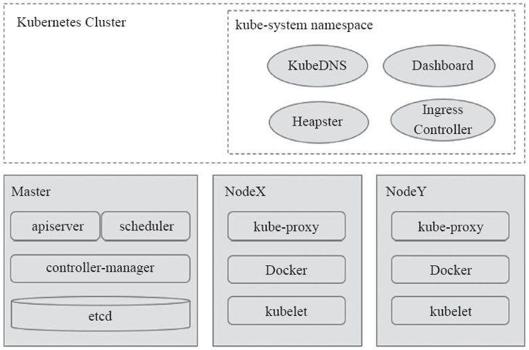
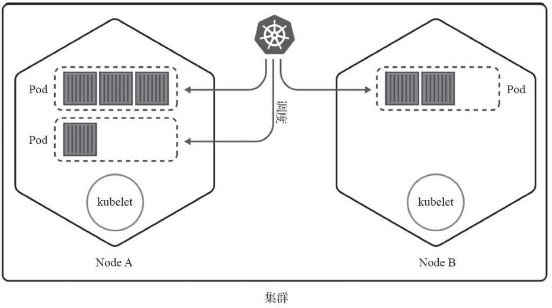

<!-- @import "[TOC]" {cmd="toc" depthFrom=1 depthTo=6 orderedList=false} -->

<!-- code_chunk_output -->

- [1. Kubernetes集群组成](#1-kubernetes集群组成)
- [2. Master组件](#2-master组件)
  - [2.1. API Server](#21-api-server)
  - [2.2. 集群状态存储(Cluster State Store)](#22-集群状态存储cluster-state-store)
  - [2.3. 控制器管理器(Controller Manager)](#23-控制器管理器controller-manager)
  - [2.4. 调度器(Scheduler)](#24-调度器scheduler)
- [3. Node组件](#3-node组件)
  - [3.1. Node的核心代理程序kubelet](#31-node的核心代理程序kubelet)
  - [3.2. 容器运行时环境](#32-容器运行时环境)
  - [3.3. kube-proxy](#33-kube-proxy)
- [4. 核心附件](#4-核心附件)
  - [4.1. KubeDNS](#41-kubedns)
  - [4.2. Kubernetes Dashboard](#42-kubernetes-dashboard)
  - [4.3. Heapster](#43-heapster)
  - [4.4. Ingress Controller](#44-ingress-controller)

<!-- /code_chunk_output -->

# 1. Kubernetes集群组成

一个典型的Kubernetes集群由**多个工作节点(worker node**)和**一个集群控制平面(control plane, 即Master**), 以及**一个集群状态存储系统！！！(etcd**)组成. 

其中**Master节点**负责**整个集群的管理工作**, 为集群**提供管理接口**, 并**监控和编排集群中的各个工作节点**. 

**各节点**负责**以Pod的形式运行容器**, 因此, 各节点需要事先配置好**容器运行依赖到的所有服务和资源**, 如**容器运行时环境！！！** 等. Kubernetes的系统架构如图1-11所示. 

图1-11　Kubernetes系统组件:

**Master节点**主要由**apiserver**、**controller\-manager**和**scheduler**三个组件, 以及一个用于**集群状态存储的etcd存储服务**组成, 而**每个Node节点**则主要包含**kubelet**、**kube\-proxy**及**容器引擎**(Docker是最为常用的实现)等组件. 

此外, **完整的集群服务**还依赖于一些**附加组件**, 如**KubeDNS**等. 

# 2. Master组件

Kubernetes的**集群控制平面**由**多个组件组成**, 这些组件可统一运行于**单一Master节点**, 也可以以**多副本的方式**同时运行于**多个节点**, 以为Master提供高可用功能, 甚至还可以运行于Kubernetes集群自身之上. 

Master主要包含以下几个组件. 

## 2.1. API Server

API Server负责输出**RESTful风格**的Kubernetes API, 它是发往集群的**所有REST操作命令**的**接入点**, 并负责**接收**、**校验**并**响应所有的REST请求**, **结果状态被持久存储于etcd**中. 

因此, API Server是**整个集群的网关**. 

## 2.2. 集群状态存储(Cluster State Store)

Kubernetes集群的**所有状态信息都需要！！！持久存储于存储系统etcd**中, 不过, **etcd**是由CoreOS基于Raft协议开发的**分布式键值存储**, 可用于**服务发现**、**共享配置**以及**一致性保障**(如数据库主节点选择、分布式锁等). 因此, etcd是**独立的服务组件**, 并**不隶属于Kubernetes集群自身**. 生产环境中应该以**etcd集群的方式**运行以确保其服务**可用性**. 

**etcd**不仅能够提供**键值数据存储**, 而且还为其提供了**监听(watch)机制！！！**, 用于**监听！！！** 和**推送！！！变更**. 

Kubernetes集群系统中, etcd中的**键值发生变化**时会**通知到API Server！！！**, 并由其**通过watch API！！！向客户端输出**. 基于**watch机制**, Kubernetes集群的**各组件实现了高效协同**. 

## 2.3. 控制器管理器(Controller Manager)

Kubernetes中, **集群级别**的**大多数功能**都是由几个被称为**控制器！！！的进程执行实现**的, **这几个进程！！！被集成于kube\-controller\-manager守护进程！！！** 中. 

由**控制器完成的功能**主要包括**生命周期功能**和**API业务逻辑**, 具体如下. 

* **生命周期功能**: 包括**Namespace创建**和**生命周期**、**Event垃圾回收**、**Pod终止相关的垃圾回收**、**级联垃圾回收**及**Node垃圾回收**等. 
* **API业务逻辑**: 例如, 由**ReplicaSet！！！** 执行的**Pod扩展**等. 

## 2.4. 调度器(Scheduler)

Kubernetes是用于**部署和管理大规模容器**应用的平台, 根据**集群规模的不同**, 其托管运行的容器很可能会数以千计甚至更多. 

**API Server**确认Pod对象的**创建请求**之后, 便需要**由Scheduler**根据集群内**各节点的可用资源状态**, 以及要运行的容器的**资源需求**做出调度决策, 其工作逻辑如图1-12所示. 

另外, Kubernetes还支持用户**自定义调度器**. 

图1-12　Kubernetes调度器:

# 3. Node组件

Node负责提供运行容器的各种依赖环境, 并接受Master的管理. 每个Node主要由以下几个组件构成. 

## 3.1. Node的核心代理程序kubelet

(1)Node的核心代理程序kubelet

kubelet是运行于工作节点之上的**守护进程**, 它**从API Server接收关于Pod对象的配置信息**并**确保它们处于期望的状态**(desired state, 后文不加区别地称之为"目标状态"). 

kubelet会在**API Server**上**注册当前工作节点**, **定期向Master汇报节点资源使用情况**, 并通过**cAdvisor！！！监控容器和节点的资源占用状况**. 

## 3.2. 容器运行时环境

(2)容器运行时环境

**每个Node**都要提供一个**容器运行时(Container Runtime)环境**, 它负责**下载镜像**并**运行容器**. 

kubelet并未固定链接至某容器运行时环境, 而是以**插件的方式载入配置的容器环境**. 这种方式清晰地定义了各组件的边界. 目前, Kubernetes支持的容器运行环境至少包括**Docker**、**RKT**、**cri\-o**和**Fraki**等. 

## 3.3. kube-proxy

(3)kube-proxy

每个工作节点都需要运行一个**kube-proxy守护进程**, 它能够按需**为Service资源对象！！！生成iptables或ipvs规则**, 从而捕获访问当前Service的ClusterIP的流量并将其转发至正确的后端Pod对象. 

# 4. 核心附件

Kubernetes集群还依赖于一组称为"**附件"(add\-ons**)的组件以提供完整的功能, 它们通常是由第三方提供的特定应用程序, 且托管运行于Kubernetes集群之上, 如图1-11所示. 

下面列出的几个附件各自为集群从不同角度引用了所需的核心功能. 

## 4.1. KubeDNS

* KubeDNS: 在Kubernetes集群中调度运行提供DNS服务的Pod, 同一集群中的其他Pod可使用此DNS服务**解决主机名**. 

Kubernetes自**1.11版本**开始默认使用**CoreDNS项目**为集群提供**服务注册**和**服务发现**的**动态名称解析服务**, 之前的版本中用到的是kube\-dns项目, 而SkyDNS则是更早一代的项目. 

## 4.2. Kubernetes Dashboard

* Kubernetes Dashboard: Kubernetes集群的全部功能都要基于Web的UI, 来管理集群中的应用甚至是集群自身. 

## 4.3. Heapster

* Heapster: **容器**和**节点**的**性能监控**与**分析系统**, 它**收集并解析多种指标数据**, 如**资源利用率**、**生命周期事件**等. 

新版本的Kubernetes中, 其功能会逐渐由**Prometheus结合其他组件所取代**. 

## 4.4. Ingress Controller

* Ingress Controller: **Service**是一种工作于**传统层的负载均衡器**, 而**Ingress**是在**应用层实现的HTTP(s)负载均衡机制**. 

不过, Ingress资源自身并不能进行"流量穿透", 它仅是**一组路由规则的集合**, 这些规则需要通过**Ingress控制器**(Ingress Controller)发挥作用. 目前, 此类的可用项目有Nginx、Traefik、Envoy及HAProxy等. 

