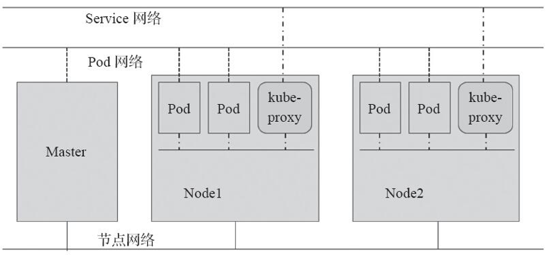
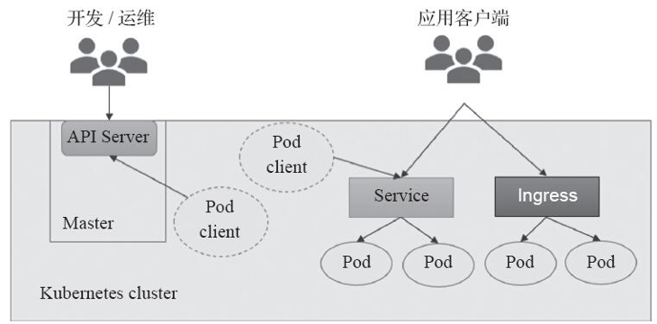

<!-- @import "[TOC]" {cmd="toc" depthFrom=1 depthTo=6 orderedList=false} -->

<!-- code_chunk_output -->

- [1. 网络模型概述](#1-网络模型概述)
  - [1.1. 四种网络通信类型](#11-四种网络通信类型)
  - [1.2. Kubernetes网络模型实现要求](#12-kubernetes网络模型实现要求)
  - [1.3. Pod IP和Service IP](#13-pod-ip和service-ip)
  - [1.4. 三种网络](#14-三种网络)
    - [1.4.1. 主机网络](#141-主机网络)
    - [1.4.2. Pod网络](#142-pod网络)
    - [1.4.3. Service网络](#143-service网络)
- [2. 集群上的网络通信](#2-集群上的网络通信)
  - [2.1. API Server客户端](#21-api-server客户端)
  - [2.2. 应用程序客户端](#22-应用程序客户端)

<!-- /code_chunk_output -->

**云计算的核心**是**虚拟化技术**, **网络虚拟化技术**又是其**最重要的组成部分**, 用于在**物理网络**上**虚拟多个相互隔离的虚拟网络**, 实现**网络资源切片**, 提高**网络资源利用率**, 实现弹性化网络. 

Kubernetes作为容器云技术栈中的容器编排组件, 必然需要在**多租户(名称空间)的基础上**实现**弹性网络管理**, 这也是"基础设施即代码"的要求之一. 

# 1. 网络模型概述

## 1.1. 四种网络通信类型

Kubernetes的网络中主要存在**四种类型的通信**: 

* 同一Pod内的容器间通信、
* 各Pod彼此之间的通信、
* Pod与Service间的通信, 
* 以及集群外部的流量同Service之间的通信. 

Kubernetes为**Pod**和**Service资源对象**分别使用了**各自的专用网络**, **Pod网络**由Kubernetes的**网络插件配置**实现, 而**Service的网络**则由**Kubernetes集群予以指定**. 

## 1.2. Kubernetes网络模型实现要求

为了提供更灵活的解决方式, Kubernetes的网络模型需要借助于外部插件实现, 它要求任何实现机制都必须满足以下需求. 

* 所有Pod间均可不经NAT机制而直接通信. 
* 所有节点均可不经NAT机制而直接与所有容器通信. 
* 容器自己使用的IP也是其他容器或节点直接看到的地址. 换句话讲, 所有Pod对象都位于同一平面网络中, 而且可以使用Pod自身的地址直接通信. 

## 1.3. Pod IP和Service IP

Kubernetes使用的网络插件必须能为Pod提供满足以上要求的网络, 它需要为**每个Pod**配置**至少一个特定的地址**, 即**Pod IP**. **Pod IP**地址实际存在于**某个网卡(可以是虚拟设备)上**, 而**Service的地址**却是一个**虚拟IP地址**, 没有任何网络接口配置此地址, 它由**kube-proxy**借助**iptables规则**或**ipvs规则**重新定向到**本地端口**, 再**将其调度至后端Pod对象**. Service的IP地址是**集群提供服务的接口**, 也称为**Cluster IP**. 

* **Pod网络及其IP**由Kubernetes的**网络插件**负责配置和管理, 具体使用的**网络地址**可在**管理配置网络插件时指定**, 如10.244.0.0/16网络. 

* 而**Cluster网络和IP**则是由**Kubernetes集群**负责配置和管理, 如10.96.0.0/12网络. 

## 1.4. 三种网络

总结起来, Kubernetes集群至少应该包含三个网络, 如图1-13中的网络环境所示. 

图1-13 Kubernetes网络环境

### 1.4.1. 主机网络

一个是**各主机(Master、Node和etcd等)自身所属的网络**, 其地址**配置于主机的网络接口**, 用于**各主机之间的通信**, 例如, Master与各Node之间的通信. 

此地址配置于Kubernetes集群构建之前, 它并**不能由Kubernetes管理**, 管理员需要于集群构建之前自行确定其地址配置及管理方式. 

### 1.4.2. Pod网络

第二个是Kubernetes集群上**专用于Pod资源对象的网络**, 它是**一个虚拟网络**, 用于**为各Pod对象设定IP地址**等网络参数, 其地址**配置于Pod中容器的网络接口！！！** 之上. 

Pod网络需要借助**kubenet插件**或**CNI插件**实现, 该插件可**独立部署于Kubernetes集群之外**, 亦可**托管于Kubernetes之上**, 它需要在**构建Kubernetes集群时**由管理员**进行定义**, 而后在**创建Pod对象时**由其自动完成各网络参数的动态配置. 

### 1.4.3. Service网络

第三个是**专用于Service资源对象的网络**, 它也是**一个虚拟网络**, 用于为Kubernetes集群之中的Service配置IP地址, 但此地址并**不配置于任何主机或容器的网络接口之上**, 而是通过Node之上的**kube-proxy**配置为**iptables**或**ipvs规则**, 从而将**发往此地址的所有流量**调度至其**后端的各Pod对象之上**. 

Service网络在Kubernetes集群创建时予以指定, 而各Service的地址则在用户创建Service时予以动态配置. 

注: CNI是指容器网络接口(Container Network Interface), 是由CNCF(Cloud Native Computing Foundation)维护的项目, 其由一系列的用于编写配置容器网络插件的规范和库接口(libcni)组成, 支持众多插件项目. 后文对此有详细说明. 

# 2. 集群上的网络通信

Kubernetes集群的**客户端**大体可以分为**两类**: 

* **API Server客户端**
* **应用程序(运行为Pod中的容器)客户端**

如图1-14所示. 

图1-14　Kubernetes客户端及其类型:

## 2.1. API Server客户端

第一类客户端通常包含**人类用户**和**Pod对象**两种, 它们**通过API Server访问Kubernetes集群**完成管理任务, 例如, 管理集群上的各种资源对象. 

## 2.2. 应用程序客户端

第二类客户端一般也包含**人类用户**和**Pod对象**两种, 它们的访问目标是**Pod上运行于容器中的应用程序**提供的**各种具体的服务**, 如redis或nginx等, 不过, 这些**访问请求**通常要经由**Service或Ingress资源对象**进行. 

另外, 第二类客户端的访问目标对象的操作要经由第一类客户端创建和配置完成后才能进行. 

访问API Server时, 人类用户一般借助于**命令行工具kubectl**或**图形UI(例如Kubernetes Dashboard**)进行, 也可通过**编程接口**进行访问, 包括REST API. 访问Pod中的应用时, 其访问方式要取决于Pod中的应用程序, 例如, 对于运行Nginx容器的Pod来说, 其最常用工具自然是浏览器. 

管理员(开发人员或运维人员)使用Kubernetes集群的常见操作包括通过控制器创建Pod, 在Pod的基础上创建Service供第二类客户端访问, 更新Pod中的应用版本(更新和回滚)以及对应用规模进行扩容或缩容等, 另外还有集群附件管理、存储卷管理、网络及网络策略管理、资源管理和安全管理等, 这些内容将在后面的章节中展开. 不过, 这一切的前提是要先构建出一个可用的Kubernetes集群, 这一内容将在第2章中着重讲述. 
