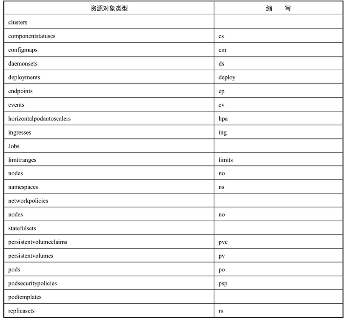
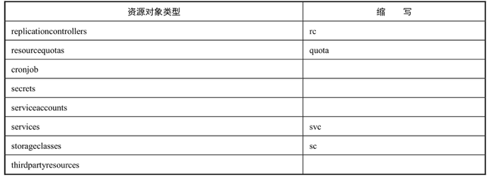
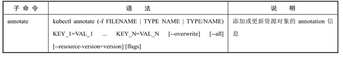
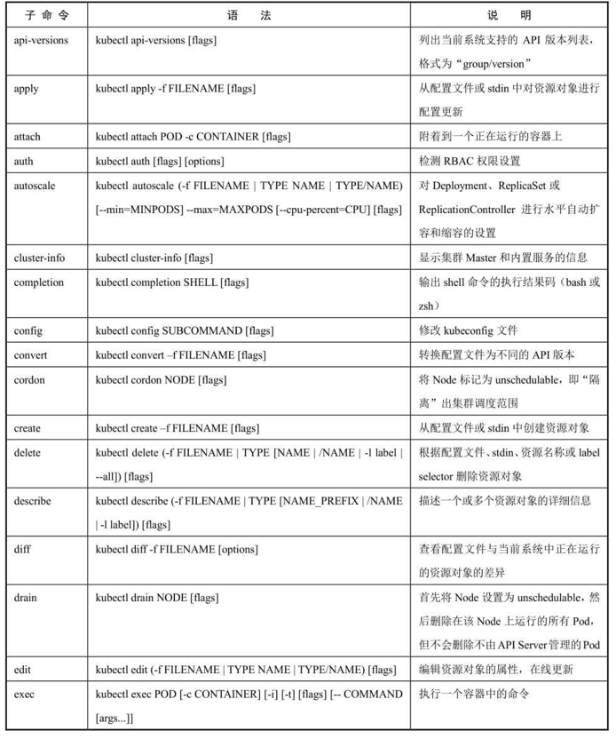
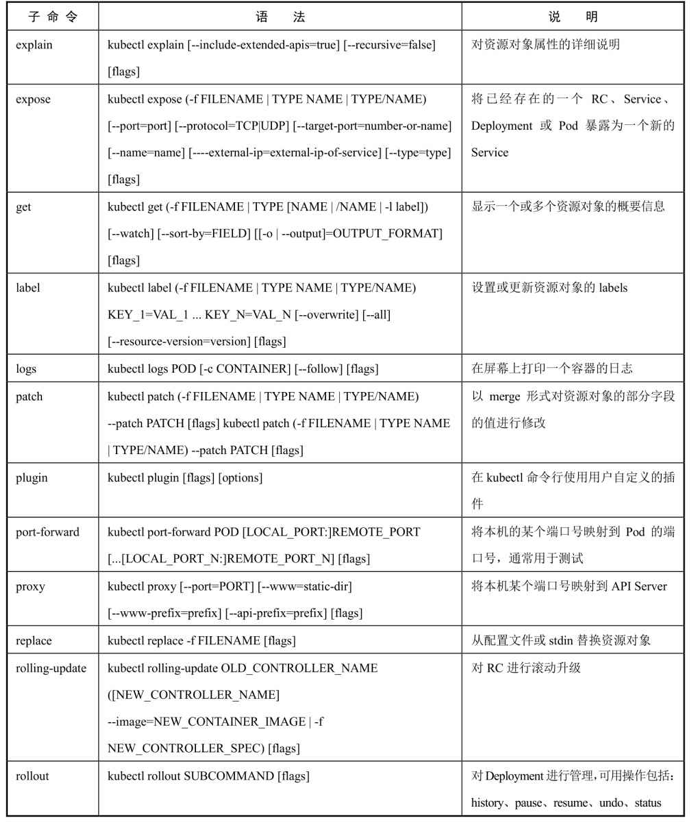
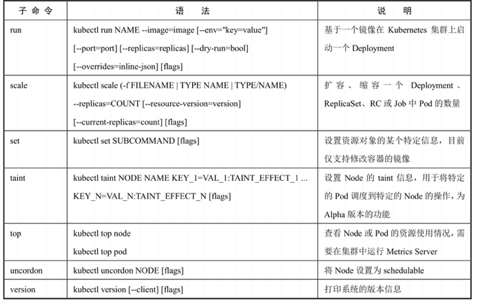
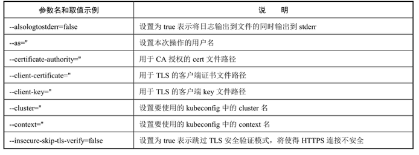
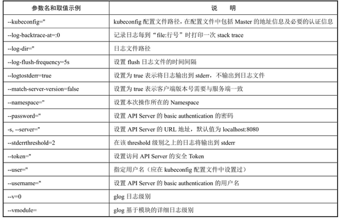
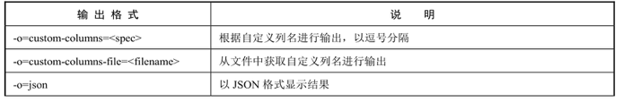
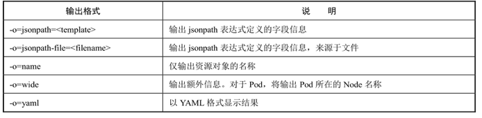

<!-- @import "[TOC]" {cmd="toc" depthFrom=1 depthTo=6 orderedList=false} -->

<!-- code_chunk_output -->

- [1 kubectl用法概述](#1-kubectl用法概述)
- [2 kubectl子命令详解](#2-kubectl子命令详解)
- [3 kubectl参数列表](#3-kubectl参数列表)
- [4 kubectl输出格式](#4-kubectl输出格式)
  - [4.1 显示pod的更多信息](#41-显示pod的更多信息)
  - [4.2 以YAML格式显示Pod详细信息](#42-以yaml格式显示pod详细信息)
  - [4.3 以自定义列名显示Pod的信息](#43-以自定义列名显示pod的信息)
  - [4.4 基于文件的自定义列名输出](#44-基于文件的自定义列名输出)
- [5 kubectl操作示例](#5-kubectl操作示例)
  - [5.1 创建资源对象](#51-创建资源对象)
  - [5.2 查看资源对象](#52-查看资源对象)
  - [5.3 描述资源对象](#53-描述资源对象)
  - [5.4 删除资源对象](#54-删除资源对象)
  - [5.5 执行容器的命令](#55-执行容器的命令)
  - [5.6 查看容器的日志](#56-查看容器的日志)
  - [5.7 创建或更新资源对象](#57-创建或更新资源对象)
  - [5.8 在线编辑运行中的资源对象](#58-在线编辑运行中的资源对象)
  - [5.9 将Pod的开放端口映射到本地](#59-将pod的开放端口映射到本地)
  - [5.10 在Pod和本地之间复制文件](#510-在pod和本地之间复制文件)
  - [5. 11 资源对象的标签设置](#5-11-资源对象的标签设置)
  - [5.12 检查可用的API资源类型列表](#512-检查可用的api资源类型列表)
  - [5.13 使用命令行插件](#513-使用命令行插件)

<!-- /code_chunk_output -->

kubectl作为客户端CLI工具, 可以让用户通过命令行对Kubernetes集群进行操作

# 1 kubectl用法概述

```
# kubectl [command] [TYPE] [NAME] [flags]
```

- command: **子命令**, 用于**操作Kubernetes集群资源对象的命令**, 例如**create**、**delete**、**describe**、**get**、**apply**等. 

- TYPE: **资源对象的类型**, 区分**大小写**, 能以单数、复数或者**简写**形式表示. 例如以下3种TYPE是等价的. 

```
# kubectl get pod pod1
# kubectl get pods pod1
# kubectl get po pod1
```

- NAME: **资源对象的名称**, 区分**大小写**. 如果不指定名称, 系统则将返回属于TYPE的**全部对象的列表**. 

- flags: kubectl子命令的**可选参数**, 例如使用"\-**s**"指定**API Server的URL地址**而不用默认值. 

kubectl可操作的资源对象类型及其缩写如表:





在一个命令行中也可以同时对多个资源对象进行操作, 以多个TYPE和NAME的组合表示

- 获取多个Pod信息:

```
# kubectl get pods pod1 pod2
```

- 获取多种对象的信息:

```
# kubectl get pod/pod1 rc/rc1
```

- 同时应用多个YAML文件, 以多个\-f file参数表示:

```
# kubectl get pod -f pod1.yaml -f pod2.yaml
# kubectl create -f pod1.yaml -f rc1.yaml -f service1.yaml
```

# 2 kubectl子命令详解

kubectl的子命令非常丰富, 涵盖了对Kubernetes集群的主要操作, 包括资源对象的创建、删除、查看、修改、配置、运行等. 

kubectl子命令详解:









# 3 kubectl参数列表

kubectl命令行的公共启动参数如表:





每个子命令(如create、delete、get等)还有特定的flags参数, 可以通过

```
$ kubectl [command] --help
```

命令进行查看. 

# 4 kubectl输出格式

通过\-o参数指定

```
# kubectl [command] [TYPE] [NAME] -o=<output_format>
```

根据不同子命令的输出结果, 可选的输出格式如表





常用的输出格式如下:

## 4.1 显示pod的更多信息

```
# kubectl get pod <pod-name> -o wide
```

## 4.2 以YAML格式显示Pod详细信息

```
# kubectl get pod <pod-name> -o yaml
```

## 4.3 以自定义列名显示Pod的信息

```
# kubectl get pod <pod-name> -o=custom-columns=NAME:.metadata.name,RSRC:.metadata.resourceVersion
```

## 4.4 基于文件的自定义列名输出

```
# kubectl get pod <pod-name> -o=custom-columns-file=template.txt
```

template.txt文件内容是:

```
NAME            RSRC
metadata.name   metadata.resourceVersion
```

输出结果为:

```
NAME            RSRC
pod-name        52305
```

另外, 可以将输出结果按某个字段排序, 通过\-\-sort\-by参数以jsonpath表达式进行指定: 

```
# kubectl [command] [TYPE] [NAME] --sort-by=<jsonpath>
```

比如, 按照名称进行排序:

```
# kubectl get pods --sort-by=.metadata.name
```

# 5 kubectl操作示例

## 5.1 创建资源对象

根据YAML配置文件一次性创建Service和RC:

```
# kubectl create -f my-service.yaml -f my-rc.yaml
```

根据\<directory>目录下所有.yaml、.yml、.json文件的定义进行创建: 

```
# kubectl create -f <directory>
```

## 5.2 查看资源对象

查看所有Pod列表: 

```
# kubectl get pods
```

查看RC和Service列表: 

```
# kubectl get rc,services
```

## 5.3 描述资源对象

显示Node的详细信息: 

```
# kubectl describe nodes <node-name>
```

显示Pod的详细信息: 

```
# kubectl describe pods/<pod-name>
```

显示由RC管理的Pod的信息: 

```
# kubectl describe pods <rc-name>
```

## 5.4 删除资源对象

基于pod.yaml定义的名称删除Pod: 

```
# kubectl delete -f pod.yaml
```

删除所有包含某个Label的Pod和Service: 

```
# kubectl delete pods,services -l name=<label-name>
```

删除所有Pod: 

```
# kubectl delete pods --all
```

## 5.5 执行容器的命令

执行Pod的date命令, 默认使用Pod中的第1个容器执行: 

```
# kubectl exec <pod-name> date
```

指定Pod中的某个容器执行date命令: 

```
# kubectl exec <pod-name> -c <container-name> date
```

通过bash获得Pod中某个容器的TTY, 相当于登录容器: 

```
# kubectl exec -ti <pod-name> -c <container-name> /bin/bash
```

## 5.6 查看容器的日志

查看容器输出到stdout的日志: 

```
# kubectl logs <pod-name>
```

跟踪查看容器的日志, 相当于tail \-f命令的结果: 

```
# kubectl logs -f <pod-name> -c <container-name>
```

## 5.7 创建或更新资源对象

用法和kubectl create类似, 逻辑稍有差异: 如果目标资源对象不存在, 则进行创建; 否则进行更新, 例如: 

```
# kubectl apply -f app.yaml
```

## 5.8 在线编辑运行中的资源对象

可以使用kubectl edit命令编辑运行中的资源对象, 例如使用下面的命令编辑运行中的一个Deployment: 

```
# kubectl edit deploy nginx
```

在命令执行之后, 会通过YAML格式展示该对象的定义和状态, 用户可以对代码进行编辑和保存, 从而完成对在线资源的直接修改. 

## 5.9 将Pod的开放端口映射到本地

将集群上Pod的80端口映射到本地的8888端口, 在浏览器 http://127.0.0.1:8888 中就能够访问到容器提供的服务了: 

```
# kubectl port-forward --address 0.0.0.0 pod/nginx-6ddbbc47fb-sfdcv 8888:80
```

## 5.10 在Pod和本地之间复制文件

把**Pod上的/etc/fstab**复制到本地的/tmp目录: 

```
# kubectl cp nginx-6ddbbc47fb-sfdcv:/etc/fstab /tmp/
```

## 5. 11 资源对象的标签设置

为default namespace设置testing=true标签: 

```
# kubectl label namespaces default testing=true
```

## 5.12 检查可用的API资源类型列表

该命令经常用于检查特定类型的资源是否已经定义, 列出所有资源对象类型: 

```
# kubectl api-resources
```

## 5.13 使用命令行插件

为了扩展kubectl的功能, Kubernetes从1.8版本开始引入插件机制, 在1.14版本时达到稳定版. 

用户**自定义插件**的**可执行文件名**需要以"**kubectl**\-"开头, 复制到\$**PATH**中的某个目录(如/usr/local/bin), 然后就可以通过kubectl \<plugin\-name>运行自定义插件了. 

例如, 实现一个名为hello的插件, 其功能为在屏幕上输出字符串"hello world": 

新建名为kubectl\-hello的可执行脚本文件, 其内容为

```
echo "hello world"
```

复制kubectl\-hello文件到 /usr/local/bin/ 目录下, 就完成了安装插件的工作. 

然后在kubectl命令后带上插件名称就能使用这个插件了: 

```
# kubectl hello
hello world
```

使用kubectl plugin list命令可以查看当前系统中已安装的插件列表: 

```
# kubectl plugin list
The following kubectl-compatible plugins are available:

/usr/local/bin/kubectl-hello
/usr/local/bin/kubectl-foo
/usr/local/bin/kubectl-bar
```

更完整的插件开发示例可以从 https://github.com/kubernetes/sample-cli-plugin 找到. 